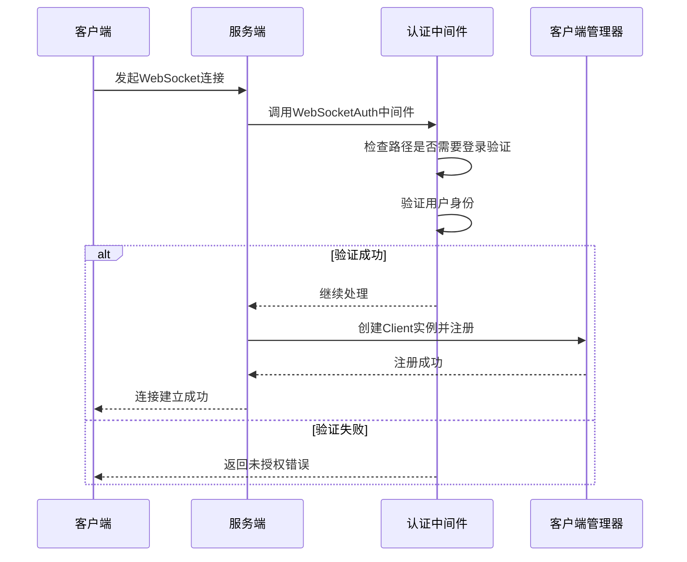
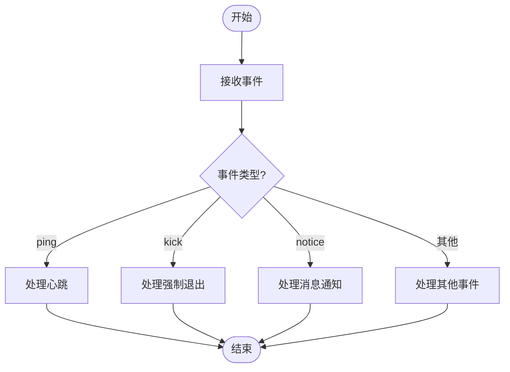
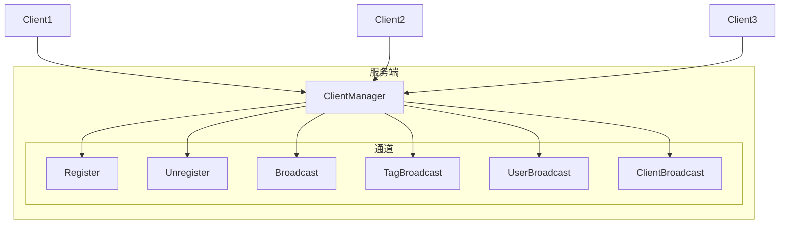
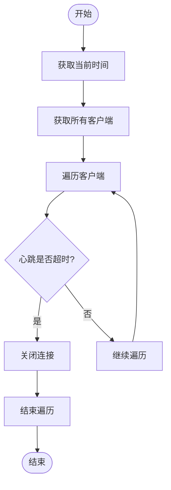

# WebSocket API

<cite>
**本文档引用的文件**
- [weboscket_auth.go](file://server/internal/logic/middleware/weboscket_auth.go)
- [client.go](file://server/internal/websocket/client.go)
- [model.go](file://server/internal/websocket/model.go)
- [client_manager.go](file://server/internal/websocket/client_manager.go)
- [router.go](file://server/internal/websocket/router.go)
- [websocket/index.ts](file://web/src/utils/websocket/index.ts)
- [sys-websocket-server.md](file://docs/guide-zh-CN/sys-websocket-server.md)
- [sys-websocket-client.md](file://docs/guide-zh-CN/sys-websocket-client.md)
</cite>

## 目录
1. [简介](#简介)
2. [连接建立与认证](#连接建立与认证)
3. [消息格式与数据帧结构](#消息格式与数据帧结构)
4. [事件类型](#事件类型)
5. [服务端处理机制](#服务端处理机制)
6. [客户端连接示例](#客户端连接示例)
7. [心跳机制与重连策略](#心跳机制与重连策略)
8. [实时消息类型与载荷结构](#实时消息类型与载荷结构)

## 简介
本文档详细说明了HotGo框架中WebSocket API的实现机制。系统提供了一个集成JWT身份认证、路由消息处理器、多种消息广播模式（一对一、群组、广播）、在线用户管理及心跳保持等功能的WebSocket服务器，极大简化了实时通信功能的开发流程。

**文档来源**
- [sys-websocket-server.md](file://docs/guide-zh-CN/sys-websocket-server.md)
- [sys-websocket-client.md](file://docs/guide-zh-CN/sys-websocket-client.md)

## 连接建立与认证
WebSocket连接的建立需要通过特定的路由，并经过身份验证中间件的检查。用户必须登录成功后才能建立连接。

服务端通过`WebSocketAuth`中间件进行鉴权，该中间件会检查请求路径是否需要登录验证，并将用户信息传递到上下文中。如果验证失败，则返回未授权错误。

连接地址遵循以下格式：
```
// IP+端口或域名/socket/插件名称/API路径
例如：127.0.0.1:8000/socket/hgexample/index/test
```

**连接建立流程：**
1. 客户端发起WebSocket连接请求
2. 服务端通过`WebSocketAuth`中间件进行身份验证
3. 验证通过后，创建客户端连接实例`Client`
4. 将客户端注册到`ClientManager`进行统一管理



**图示来源**
- [weboscket_auth.go](file://server/internal/logic/middleware/weboscket_auth.go)
- [client.go](file://server/internal/websocket/client.go)
- [client_manager.go](file://server/internal/websocket/client_manager.go)

**本节来源**
- [weboscket_auth.go](file://server/internal/logic/middleware/weboscket_auth.go#L17-L36)
- [client.go](file://server/internal/websocket/client.go#L40-L54)
- [client_manager.go](file://server/internal/websocket/client_manager.go#L28-L28)

## 消息格式与数据帧结构
WebSocket通信采用JSON格式的消息体，包含事件名称、数据载荷、状态码、错误消息和时间戳等字段。

### 请求消息结构 (WRequest)
```go
type WRequest struct {
    Event string `json:"event"` // 事件名称
    Data  g.Map  `json:"data"`  // 数据
}
```

### 响应消息结构 (WResponse)
```go
type WResponse struct {
    Event     string      `json:"event"`              // 事件名称
    Data      interface{} `json:"data,omitempty"`     // 数据
    Code      int         `json:"code"`               // 状态码
    ErrorMsg  string      `json:"errorMsg,omitempty"` // 错误消息
    Timestamp int64       `json:"timestamp"`          // 服务器时间
}
```

前端定义的统一消息接口：
```ts
export interface WebSocketMessage {
  event: string;
  data: any;
  code: number;
  timestamp: number;
}
```

所有消息都必须包含`event`字段来标识消息类型，`data`字段为可选的数据载荷，`code`表示处理状态，`timestamp`为服务器时间戳。

```mermaid
classDiagram
class WRequest {
+string event
+g.Map data
}
class WResponse {
+string event
+interface{} data
+int code
+string errorMsg
+int64 timestamp
}
WRequest <|-- Client
WResponse <|-- Server
```

**图示来源**
- [model.go](file://server/internal/websocket/model.go#L8-L44)
- [index.ts](file://web/src/utils/websocket/index.ts#L6-L11)

**本节来源**
- [model.go](file://server/internal/websocket/model.go#L8-L44)
- [index.ts](file://web/src/utils/websocket/index.ts#L6-L11)

## 事件类型
系统支持多种事件类型，包括认证、消息传递、心跳检测等。

### 核心事件类型
| 事件类型 | 说明 | 方向 |
|---------|------|------|
| `auth` | 用户认证 | 客户端 → 服务端 |
| `message` | 消息传递 | 双向 |
| `ping/pong` | 心跳检测 | 双向 |
| `connected` | 连接建立 | 服务端 → 客户端 |
| `disconnected` | 连接断开 | 服务端 → 客户端 |
| `kick` | 强制退出 | 服务端 → 客户端 |

### 特殊事件枚举
根据前端代码，系统定义了以下特殊事件：
- `SocketEnum.EventPing`: 心跳事件
- `SocketEnum.EventKick`: 强制退出事件
- `SocketEnum.EventNotice`: 消息通知事件

客户端可以通过`addOnMessage`方法注册对特定事件的监听，当收到对应事件时会触发回调函数。



**图示来源**
- [sys-websocket-client.md](file://docs/guide-zh-CN/sys-websocket-client.md)
- [model.go](file://server/internal/websocket/model.go)

**本节来源**
- [sys-websocket-client.md](file://docs/guide-zh-CN/sys-websocket-client.md)
- [model.go](file://server/internal/websocket/model.go)

## 服务端处理机制
服务端通过`ClientManager`对所有WebSocket连接进行统一管理，并提供消息分发、广播等功能。

### 客户端管理器 (ClientManager)
`ClientManager`负责管理所有客户端连接，包括：
- `Clients`: 存储所有连接
- `Users`: 存储登录用户及其连接
- `Register`: 连接注册通道
- `Unregister`: 连接注销通道
- `Broadcast`: 广播通道

### 消息处理流程
1. 客户端发送消息
2. 服务端读取消息并解析为`WRequest`
3. 根据`event`字段查找对应的事件处理器
4. 执行处理器函数
5. 将响应通过`Send`通道发送回客户端

### 消息分发方法
服务端提供了多种消息分发方式：
- `SendToAll()`: 向所有客户端广播
- `SendToClientID()`: 向指定客户端发送
- `SendToUser()`: 向指定用户的所有设备发送
- `SendToTag()`: 向具有指定标签的客户端发送



**图示来源**
- [client_manager.go](file://server/internal/websocket/client_manager.go#L8-L335)
- [router.go](file://server/internal/websocket/router.go#L8-L64)

**本节来源**
- [client_manager.go](file://server/internal/websocket/client_manager.go#L8-L335)
- [router.go](file://server/internal/websocket/router.go#L8-L64)

## 客户端连接示例
以下是客户端连接WebSocket服务器的示例代码。

### 全局消息监听
```ts
// web/src/utils/websocket/registerMessage.ts
export function registerGlobalMessage() {
  // 心跳事件监听
  addOnMessage(SocketEnum.EventPing, function (_message: WebSocketMessage) {
    // 处理心跳
  });

  // 强制退出事件监听
  addOnMessage(SocketEnum.EventKick, function (_message: WebSocketMessage) {
    // 处理强制退出
    useUserStore.logout().then(() => {
      location.reload();
    });
  });

  // 消息通知事件监听
  addOnMessage(SocketEnum.EventNotice, function (message: WebSocketMessage) {
    notificationStore.triggerNewMessages(message.data);
  });
}
```

### 单页面消息监听
```ts
// 单页面内注册消息监听
onMounted(() => {
  addOnMessage(testMessageEvent, onMessage);
});

onBeforeUnmount(() => {
  // 移除消息监听
  removeOnMessage(testMessageEvent);
});
```

### 发送消息
```ts
import { sendMsg } from '@/utils/websocket';

// 基本使用
sendMsg(event, data);

// 无消息内容
sendMsg(event);

// 发送失败不重试
sendMsg(event, data, false);
```

**本节来源**
- [sys-websocket-client.md](file://docs/guide-zh-CN/sys-websocket-client.md)

## 心跳机制与重连策略
系统实现了完善的心跳机制和异常断线重连策略，确保连接的稳定性和可靠性。

### 心跳机制
- 客户端定期发送`ping`事件
- 服务端更新客户端的心跳时间`HeartbeatTime`
- 服务端定时检查所有连接的心跳超时情况
- 默认心跳超时时间为5分钟（300秒）

### 心跳检查流程


### 重连策略
当连接异常断开时，客户端应实现以下重连策略：
1. 检测连接状态
2. 等待一定时间后尝试重新连接
3. 采用指数退避算法避免频繁重试
4. 达到最大重试次数后提示用户

服务端通过`clearTimeoutConnections`方法定时清理超时连接，确保资源的有效利用。

```go
// 心跳是否超时
func (c *Client) IsHeartbeatTimeout(currentTime uint64) (timeout bool) {
    if c.HeartbeatTime+heartbeatExpirationTime <= currentTime {
        timeout = true
    }
    return
}
```

**本节来源**
- [client.go](file://server/internal/websocket/client.go#L150-L158)
- [client_manager.go](file://server/internal/websocket/client_manager.go#L250-L270)

## 实时消息类型与载荷结构
系统支持多种实时消息类型，每种类型都有特定的载荷结构。

### 支持的消息类型
| 消息类型 | 载荷结构 | 说明 |
|---------|----------|------|
| `admin/addons/hgexample/testMessage` | `{message: string}` | 测试消息 |
| `ping` | 无 | 心跳检测 |
| `kick` | 无 | 强制退出 |
| `notice` | `{title: string, content: string}` | 消息通知 |

### 消息注册示例
```go
// server/addons/hgexample/router/websocket.go
ws.RegisterMsg(ws.EventHandlers{
    "admin/addons/hgexample/testMessage": handler.Index.TestMessage, // 测试消息
})
```

### 消息处理器示例
```go
// server/addons/hgexample/controller/websocket/handler/index.go
func (c *cIndex) TestMessage(client *websocket.Client, req *websocket.WRequest) {
    g.Log().Infof(client.Context(), "收到客户端测试消息:%v", gjson.New(req).String())
    // 将收到的消息原样发送给客户端
    websocket.SendSuccess(client, req.Event, req.Data) 
}
```

### 消息发送方法
- `SendSuccess(client, event, data)`: 发送成功消息
- `SendError(client, event, err)`: 发送错误消息

所有消息都遵循统一的响应格式，包含事件名称、数据、状态码和时间戳。

**本节来源**
- [sys-websocket-server.md](file://docs/guide-zh-CN/sys-websocket-server.md)
- [client_manager.go](file://server/internal/websocket/client_manager.go#L305-L334)
- [model.go](file://server/internal/websocket/model.go)