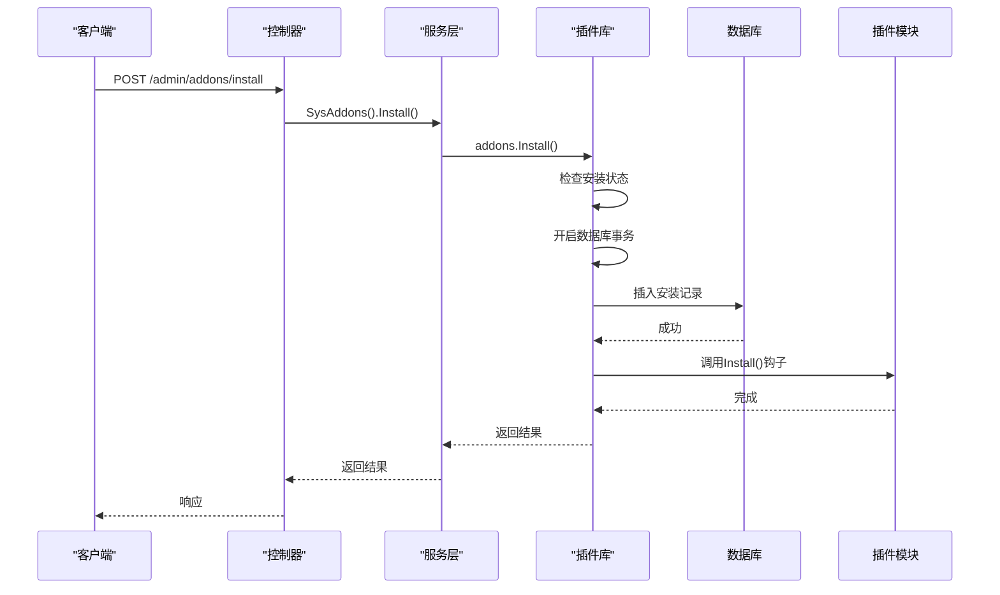
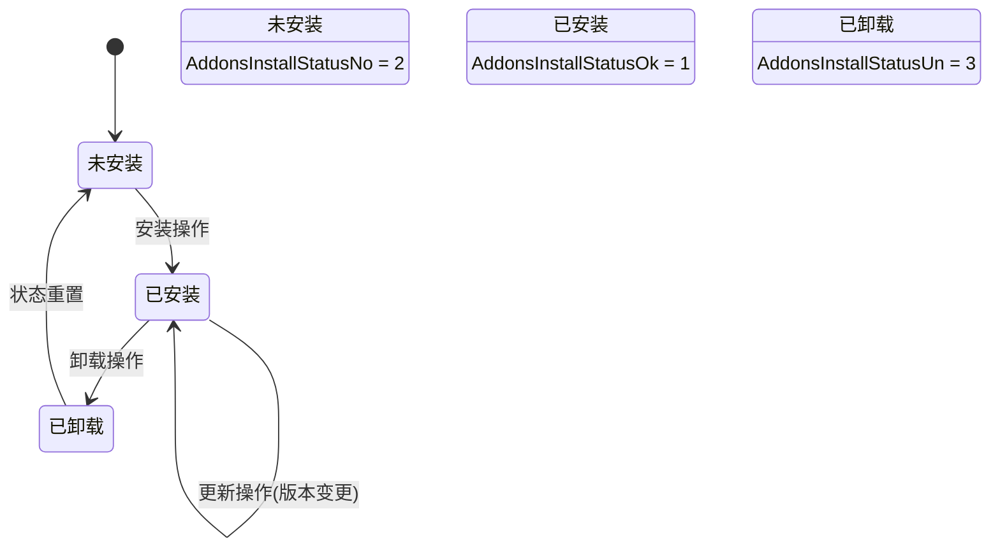
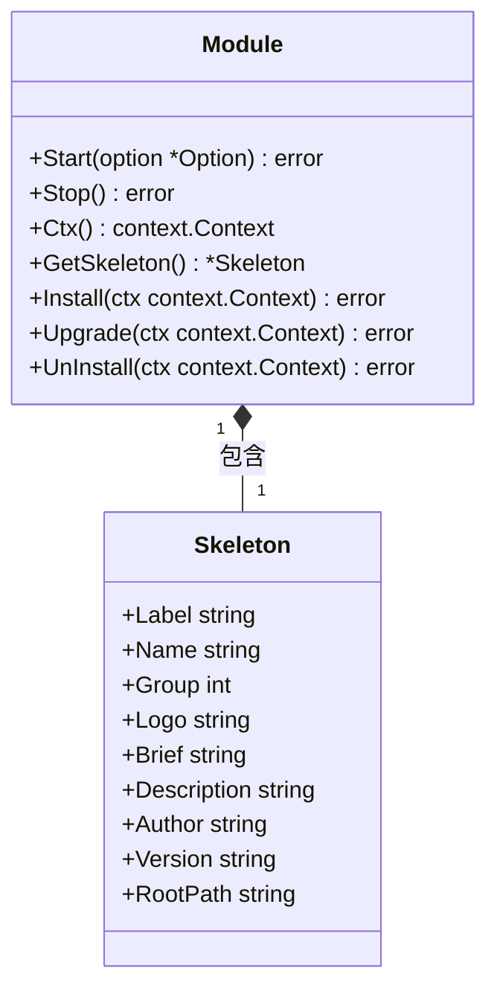
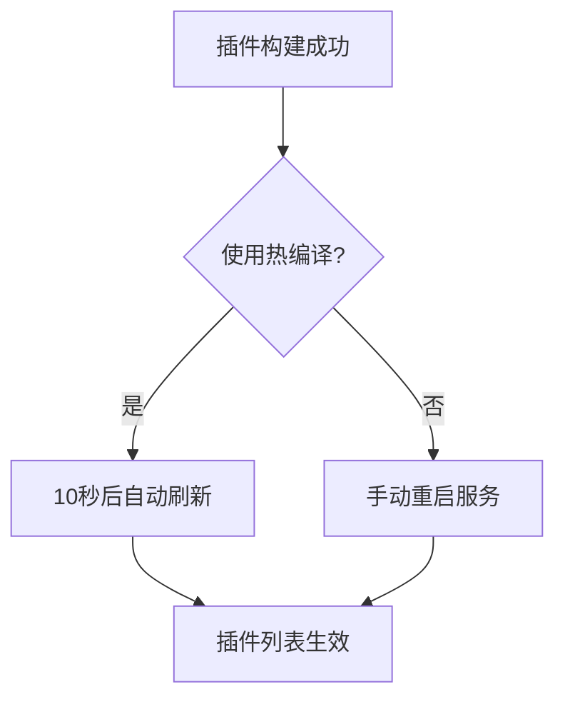

# 插件管理接口

<cite>
**Referenced Files in This Document**   
- [addons.go](file://server/api/admin/addons/addons.go)
- [addons.go](file://server/internal/logic/sys/addons.go)
- [install.go](file://server/internal/library/addons/install.go)
- [module.go](file://server/internal/library/addons/module.go)
- [addons.go](file://server/internal/consts/addons.go)
- [addons.go](file://server/internal/model/input/sysin/addons.go)
- [sys_addons_install.go](file://server/internal/dao/sys_addons_install.go)
</cite>

## 目录
1. [简介](#简介)
2. [核心API接口](#核心api接口)
3. [插件状态机](#插件状态机)
4. [插件安装流程与钩子函数](#插件安装流程与钩子函数)
5. [热更新实现机制](#热更新实现机制)
6. [响应码与故障排查](#响应码与故障排查)

## 简介
本文档详细说明了HotGo框架中插件管理系统的API接口和核心机制。系统通过RESTful API提供对插件的全生命周期管理，包括安装、卸载、启用、禁用和更新操作。核心逻辑位于`internal/logic/sys/addons.go`，通过`POST /admin/addons/install`和`POST /admin/addons/uninstall`等接口实现对插件状态的控制。

## 核心API接口

### 安装插件接口
- **路径**: `POST /admin/addons/install`
- **功能**: 安装指定插件模块
- **请求参数**: 通过`sysin.AddonsInstallInp`结构体传递，继承自`addons.Skeleton`，包含插件名称、版本号等元数据
- **实现逻辑**: 调用`service.SysAddons().Install()`方法，最终执行`addons.Install()`函数

### 卸载插件接口
- **路径**: `POST /admin/addons/uninstall`
- **功能**: 卸载已安装的插件模块
- **请求参数**: 通过`sysin.AddonsUnInstallInp`结构体传递，同样继承自`addons.Skeleton`
- **实现逻辑**: 调用`service.SysAddons().UnInstall()`方法，最终执行`addons.UnInstall()`函数

**Diagram sources**
- [addons.go](file://server/api/admin/addons/addons.go#L30-L35)
- [addons.go](file://server/internal/logic/sys/addons.go#L65-L75)
- [install.go](file://server/internal/library/addons/install.go#L50-L74)

**Section sources**
- [addons.go](file://server/api/admin/addons/addons.go#L30-L35)
- [addons.go](file://server/internal/logic/sys/addons.go#L65-L75)

## 插件状态机

插件系统定义了三种核心状态，通过`consts.AddonsInstallStatus`常量定义，形成一个状态转换机。

**Diagram sources**
- [addons.go](file://server/internal/consts/addons.go#L60-L79)

**Section sources**
- [addons.go](file://server/internal/consts/addons.go#L60-L79)
- [install.go](file://server/internal/library/addons/install.go#L50-L74)

### 状态转换规则
- **未安装 → 已安装**: 通过`Install`接口触发，系统检查插件是否已存在，若不存在则创建安装记录并调用`Module.Install()`钩子。
- **已安装 → 已卸载**: 通过`UnInstall`接口触发，系统验证插件当前为"已安装"状态，更新数据库记录为"已卸载"，并调用`Module.UnInstall()`钩子。
- **已安装 → 已安装**: 通过`Upgrade`接口触发，允许在不改变"已安装"状态的前提下更新插件版本。

## 插件安装流程与钩子函数

插件安装是一个原子性操作，通过数据库事务保证数据一致性，并在关键节点调用用户定义的钩子函数。

### 安装流程
1. **状态检查**: 调用`ScanInstall()`查询数据库，检查插件是否已安装。
2. **事务开启**: 使用`g.DB().Transaction()`开启数据库事务。
3. **记录操作**: 在`sys_addons_install`表中插入或更新安装记录。
4. **钩子调用**: 执行`m.Install(ctx)`，触发插件自身的安装逻辑。
5. **事务提交**: 所有步骤成功后，事务自动提交。

### 核心钩子函数
插件模块通过实现`Module`接口来定义其生命周期钩子：

**Diagram sources**
- [module.go](file://server/internal/library/addons/module.go#L49-L51)
- [install.go](file://server/internal/library/addons/install.go#L50-L74)

**Section sources**
- [module.go](file://server/internal/library/addons/module.go#L49-L51)
- [install.go](file://server/internal/library/addons/install.go#L50-L74)

- **Install(ctx)**: 在插件安装时调用，通常用于执行数据库迁移、创建必要文件或初始化配置。
- **UnInstall(ctx)**: 在插件卸载时调用，用于清理数据库表、删除文件或撤销配置。
- **Upgrade(ctx)**: 在插件更新时调用，用于处理版本间的数据库结构变更。

## 热更新实现机制

系统的热更新能力主要体现在插件的动态加载和静态资源映射上。

### 动态模块加载
系统在启动时通过`RegisterModule()`函数注册所有插件模块。当插件被安装后，`StartModules()`函数会遍历所有已安装的模块并调用其`Start()`方法，实现动态加载。

### 静态资源热映射
通过`AddStaticPath()`函数，系统为每个已安装的插件动态添加静态资源路径映射。例如，插件`hgexample`的静态资源可通过`/addons/hgexample`路径访问。

### 前端热更新提示
前端在构建插件成功后，会显示一个倒计时通知，提示开发者如果使用热编译，页面将在10秒后自动刷新。这表明系统设计上支持无需重启服务的快速迭代。

**Diagram sources**
- [build_layout.go](file://server/internal/library/addons/build_layout.go)
- [index.vue](file://web/src/views/develop/addons/index.vue#L293-L325)

**Section sources**
- [build_layout.go](file://server/internal/library/addons/build_layout.go)
- [index.vue](file://web/src/views/develop/addons/index.vue#L293-L325)

## 响应码与故障排查

### 成功响应
- **HTTP 200**: 操作成功。例如，安装新插件或成功卸载已安装插件。

### 失败响应与常见错误
- **错误码**: 系统使用自定义错误码，通过`gerror.New()`创建。
- **插件已安装**: 尝试安装已处于"已安装"状态的插件时，返回错误信息"插件已安装，无需重复操作！"。
- **插件未安装**: 尝试卸载或更新一个未安装的插件时，返回错误信息"插件未安装，请安装后操作！"。
- **数据库事务失败**: 任何在事务中的操作失败（如数据库插入、更新失败）都会导致整个事务回滚，并返回相应的数据库错误。

**Section sources**
- [install.go](file://server/internal/library/addons/install.go#L50-L74)
- [install.go](file://server/internal/library/addons/install.go#L98-L119)