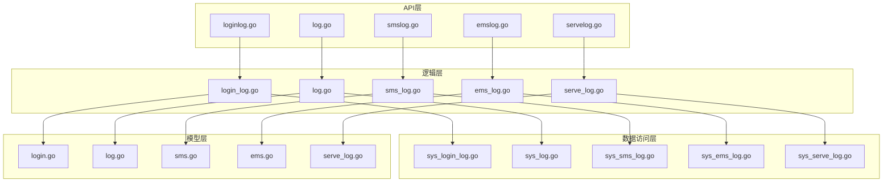
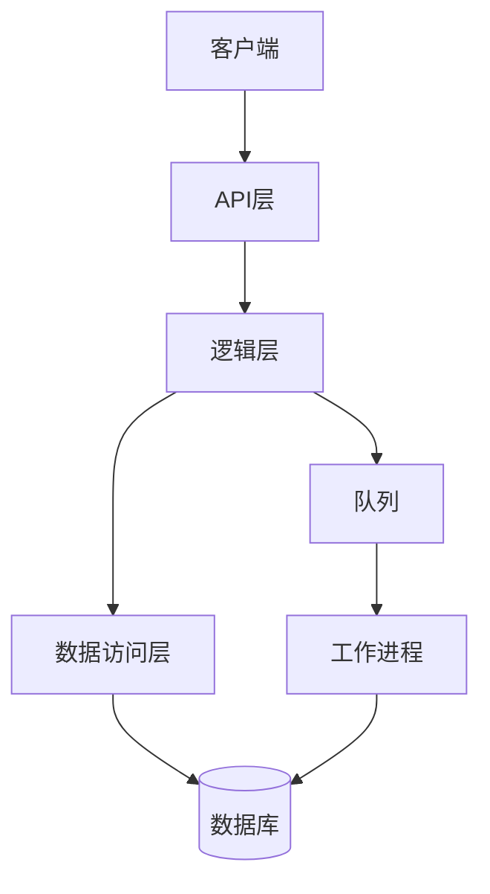
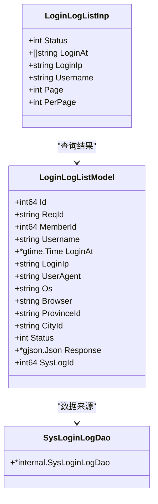
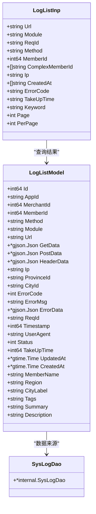
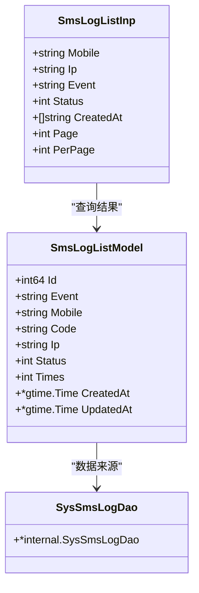
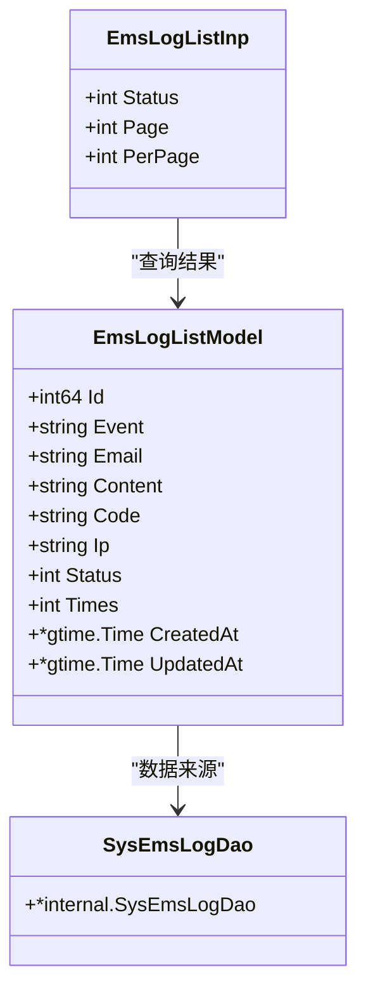
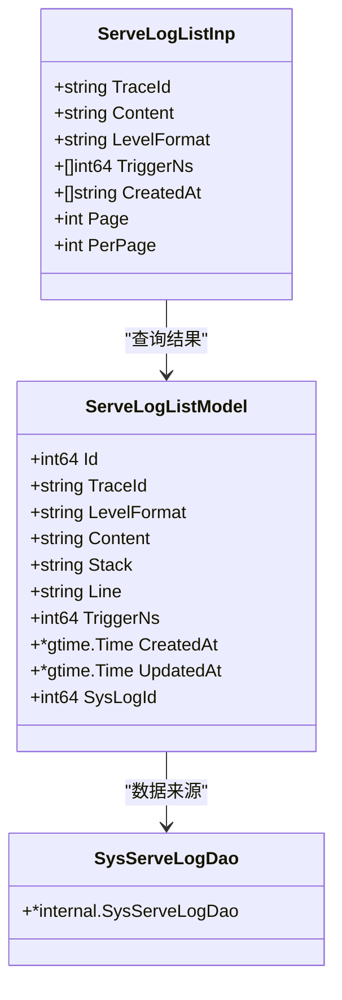
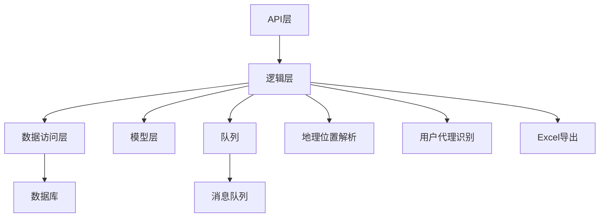

# 日志管理接口

<cite>
**本文档引用的文件**  
- [loginlog.go](file://server/api/admin/loginlog/loginlog.go)
- [log.go](file://server/api/admin/log/log.go)
- [smslog.go](file://server/api/admin/smslog/smslog.go)
- [emslog.go](file://server/api/admin/emslog/emslog.go)
- [servelog.go](file://server/api/admin/servelog/servelog.go)
- [sys_login_log.go](file://server/internal/dao/sys_login_log.go)
- [sys_log.go](file://server/internal/dao/sys_log.go)
- [sys_sms_log.go](file://server/internal/dao/sys_sms_log.go)
- [sys_ems_log.go](file://server/internal/dao/sys_ems_log.go)
- [sys_serve_log.go](file://server/internal/dao/sys_serve_log.go)
- [login_log.go](file://server/internal/logic/sys/login_log.go)
- [log.go](file://server/internal/logic/sys/log.go)
- [sms_log.go](file://server/internal/logic/sys/sms_log.go)
- [ems_log.go](file://server/internal/logic/sys/ems_log.go)
- [serve_log.go](file://server/internal/logic/sys/serve_log.go)
- [login.go](file://server/internal/model/input/sysin/login.go)
- [log.go](file://server/internal/model/input/sysin/log.go)
- [sms.go](file://server/internal/model/input/sysin/sms.go)
- [ems.go](file://server/internal/model/input/sysin/ems.go)
- [serve_log.go](file://server/internal/model/input/sysin/serve_log.go)
</cite>

## 目录
1. [简介](#简介)
2. [项目结构](#项目结构)
3. [核心组件](#核心组件)
4. [架构概述](#架构概述)
5. [详细组件分析](#详细组件分析)
6. [依赖分析](#依赖分析)
7. [性能考虑](#性能考虑)
8. [故障排除指南](#故障排除指南)
9. [结论](#结论)

## 简介
本文档详细描述了日志管理接口的设计与实现，涵盖登录日志、操作日志、短信日志、邮件日志和服务日志五大类型。文档重点说明了各日志类型的查询接口、过滤条件、存储策略、性能优化及导出功能的实现方式。通过引用`internal/dao`中的数据访问逻辑，展示了高并发场景下的调用建议，并列出了日志状态码和级别定义。

## 项目结构
项目采用分层架构，主要分为API层、逻辑层、数据访问层和模型层。日志相关功能分布在`server/api/admin`目录下的各个模块中，对应的业务逻辑实现在`server/internal/logic/sys`目录下，数据访问对象（DAO）位于`server/internal/dao`目录，输入输出模型定义在`server/internal/model/input/sysin`目录。

**图源**
- [loginlog.go](file://server/api/admin/loginlog/loginlog.go)
- [log.go](file://server/api/admin/log/log.go)
- [smslog.go](file://server/api/admin/smslog/smslog.go)
- [emslog.go](file://server/api/admin/emslog/emslog.go)
- [servelog.go](file://server/api/admin/servelog/servelog.go)
- [login_log.go](file://server/internal/logic/sys/login_log.go)
- [log.go](file://server/internal/logic/sys/log.go)
- [sms_log.go](file://server/internal/logic/sys/sms_log.go)
- [ems_log.go](file://server/internal/logic/sys/ems_log.go)
- [serve_log.go](file://server/internal/logic/sys/serve_log.go)
- [sys_login_log.go](file://server/internal/dao/sys_login_log.go)
- [sys_log.go](file://server/internal/dao/sys_log.go)
- [sys_sms_log.go](file://server/internal/dao/sys_sms_log.go)
- [sys_ems_log.go](file://server/internal/dao/sys_ems_log.go)
- [sys_serve_log.go](file://server/internal/dao/sys_serve_log.go)
- [login.go](file://server/internal/model/input/sysin/login.go)
- [log.go](file://server/internal/model/input/sysin/log.go)
- [sms.go](file://server/internal/model/input/sysin/sms.go)
- [ems.go](file://server/internal/model/input/sysin/ems.go)
- [serve_log.go](file://server/internal/model/input/sysin/serve_log.go)

**章节源**
- [loginlog.go](file://server/api/admin/loginlog/loginlog.go)
- [log.go](file://server/api/admin/log/log.go)
- [smslog.go](file://server/api/admin/smslog/smslog.go)
- [emslog.go](file://server/api/admin/emslog/emslog.go)
- [servelog.go](file://server/api/admin/servelog/servelog.go)

## 核心组件
核心组件包括五种日志类型的管理接口：登录日志、操作日志、短信日志、邮件日志和服务日志。每种日志类型都有独立的API接口、业务逻辑处理和数据访问对象。系统通过队列异步处理日志写入，确保高并发场景下的性能稳定。日志数据按月分表存储，支持高效的分页查询和关键词搜索。

**章节源**
- [login_log.go](file://server/internal/logic/sys/login_log.go)
- [log.go](file://server/internal/logic/sys/log.go)
- [sms_log.go](file://server/internal/logic/sys/sms_log.go)
- [ems_log.go](file://server/internal/logic/sys/ems_log.go)
- [serve_log.go](file://server/internal/logic/sys/serve_log.go)

## 架构概述
系统采用典型的分层架构，从上至下分为API层、逻辑层、数据访问层和模型层。API层负责接收HTTP请求并返回响应；逻辑层处理具体的业务逻辑；数据访问层封装数据库操作；模型层定义数据结构。日志数据通过队列异步写入数据库，避免阻塞主业务流程。查询时支持分页、时间范围、关键词等多种过滤条件。

**图源**
- [loginlog.go](file://server/api/admin/loginlog/loginlog.go)
- [log.go](file://server/api/admin/log/log.go)
- [smslog.go](file://server/api/admin/smslog/smslog.go)
- [emslog.go](file://server/api/admin/emslog/emslog.go)
- [servelog.go](file://server/api/admin/servelog/servelog.go)
- [login_log.go](file://server/internal/logic/sys/login_log.go)
- [log.go](file://server/internal/logic/sys/log.go)
- [sms_log.go](file://server/internal/logic/sys/sms_log.go)
- [ems_log.go](file://server/internal/logic/sys/ems_log.go)
- [serve_log.go](file://server/internal/logic/sys/serve_log.go)

## 详细组件分析

### 登录日志分析
登录日志记录用户登录行为，包括登录时间、IP地址、用户代理等信息。系统通过`/admin/loginlog/list`接口提供查询功能，支持按状态、登录时间、IP地址和用户名过滤。日志数据存储在`hg_sys_login_log`表中，按月分表。

**图源**
- [loginlog.go](file://server/api/admin/loginlog/loginlog.go)
- [login_log.go](file://server/internal/logic/sys/login_log.go)
- [sys_login_log.go](file://server/internal/dao/sys_login_log.go)
- [login.go](file://server/internal/model/input/sysin/login.go)

**章节源**
- [loginlog.go](file://server/api/admin/loginlog/loginlog.go)
- [login_log.go](file://server/internal/logic/sys/login_log.go)
- [sys_login_log.go](file://server/internal/dao/sys_login_log.go)
- [login.go](file://server/internal/model/input/sysin/login.go)

### 操作日志分析
操作日志记录系统操作行为，包括请求方法、URL、参数、响应等信息。系统通过`/admin/log/list`接口提供查询功能，支持按模块、请求方式、用户、IP地址、日期范围、状态码和请求耗时过滤。日志数据存储在`hg_sys_log`表中，按月分表。

**图源**
- [log.go](file://server/api/admin/log/log.go)
- [log.go](file://server/internal/logic/sys/log.go)
- [sys_log.go](file://server/internal/dao/sys_log.go)
- [log.go](file://server/internal/model/input/sysin/log.go)

**章节源**
- [log.go](file://server/api/admin/log/log.go)
- [log.go](file://server/internal/logic/sys/log.go)
- [sys_log.go](file://server/internal/dao/sys_log.go)
- [log.go](file://server/internal/model/input/sysin/log.go)

### 短信日志分析
短信日志记录短信发送行为，包括手机号、事件类型、发送状态等信息。系统通过`/admin/smslog/list`接口提供查询功能，支持按手机号、IP地址、事件类型、状态和创建时间过滤。日志数据存储在`hg_sys_sms_log`表中。

**图源**
- [smslog.go](file://server/api/admin/smslog/smslog.go)
- [sms_log.go](file://server/internal/logic/sys/sms_log.go)
- [sys_sms_log.go](file://server/internal/dao/sys_sms_log.go)
- [sms.go](file://server/internal/model/input/sysin/sms.go)

**章节源**
- [smslog.go](file://server/api/admin/smslog/smslog.go)
- [sms_log.go](file://server/internal/logic/sys/sms_log.go)
- [sys_sms_log.go](file://server/internal/dao/sys_sms_log.go)
- [sms.go](file://server/internal/model/input/sysin/sms.go)

### 邮件日志分析
邮件日志记录邮件发送行为，包括邮箱地址、事件类型、发送状态等信息。系统通过`/admin/emslog/list`接口提供查询功能，支持按状态和创建时间过滤。日志数据存储在`hg_sys_ems_log`表中。

**图源**
- [emslog.go](file://server/api/admin/emslog/emslog.go)
- [ems_log.go](file://server/internal/logic/sys/ems_log.go)
- [sys_ems_log.go](file://server/internal/dao/sys_ems_log.go)
- [ems.go](file://server/internal/model/input/sysin/ems.go)

**章节源**
- [emslog.go](file://server/api/admin/emslog/emslog.go)
- [ems_log.go](file://server/internal/logic/sys/ems_log.go)
- [sys_ems_log.go](file://server/internal/dao/sys_ems_log.go)
- [ems.go](file://server/internal/model/input/sysin/ems.go)

### 服务日志分析
服务日志记录系统内部服务调用行为，包括链路ID、日志级别、内容等信息。系统通过`/admin/servelog/list`接口提供查询功能，支持按链路ID、内容、日志级别、触发时间和创建时间过滤。日志数据存储在`hg_sys_serve_log`表中，并与操作日志关联。

**图源**
- [servelog.go](file://server/api/admin/servelog/servelog.go)
- [serve_log.go](file://server/internal/logic/sys/serve_log.go)
- [sys_serve_log.go](file://server/internal/dao/sys_serve_log.go)
- [serve_log.go](file://server/internal/model/input/sysin/serve_log.go)

**章节源**
- [servelog.go](file://server/api/admin/servelog/servelog.go)
- [serve_log.go](file://server/internal/logic/sys/serve_log.go)
- [sys_serve_log.go](file://server/internal/dao/sys_serve_log.go)
- [serve_log.go](file://server/internal/model/input/sysin/serve_log.go)

## 依赖分析
系统各组件之间存在明确的依赖关系。API层依赖逻辑层提供的服务接口，逻辑层依赖数据访问层进行数据库操作，同时依赖模型层定义的数据结构。日志写入操作通过队列异步处理，降低了对主业务流程的影响。地理位置解析、用户代理识别等辅助功能通过独立的库提供支持。

**图源**
- [go.mod](file://go.mod)
- [main.go](file://server/main.go)

**章节源**
- [go.mod](file://go.mod)
- [main.go](file://server/main.go)

## 性能考虑
为应对高并发场景，系统采用多项性能优化措施。日志写入通过队列异步处理，避免阻塞主业务流程。查询接口支持分页和多种过滤条件，减少数据传输量。非生产环境允许关键词查询，但生产环境禁用以避免慢查询。日志数据按月分表，提高查询效率。导出功能异步生成下载链接，避免长时间等待。

**章节源**
- [log.go](file://server/internal/logic/sys/log.go)
- [login_log.go](file://server/internal/logic/sys/login_log.go)
- [sms_log.go](file://server/internal/logic/sys/sms_log.go)
- [ems_log.go](file://server/internal/logic/sys/ems_log.go)
- [serve_log.go](file://server/internal/logic/sys/serve_log.go)

## 故障排除指南
常见问题包括日志查询缓慢、导出失败、队列积压等。对于查询缓慢，建议检查过滤条件是否合理，避免全表扫描。导出失败可能由于内存不足或文件系统权限问题，需检查服务器资源和权限设置。队列积压表明消费者处理速度跟不上生产速度，需增加消费者数量或优化处理逻辑。日志级别和状态码定义见consts包。

**章节源**
- [error.go](file://server/internal/consts/error.go)
- [status.go](file://server/internal/consts/status.go)
- [log.go](file://server/internal/logic/sys/log.go)

## 结论
本文档全面介绍了日志管理接口的设计与实现，涵盖了五种日志类型的查询、存储、性能优化和导出功能。通过分层架构和异步处理，系统在保证功能完整性的同时，具备良好的性能和可扩展性。建议在生产环境中谨慎使用关键词查询，定期清理过期日志，监控队列状态，确保系统稳定运行。