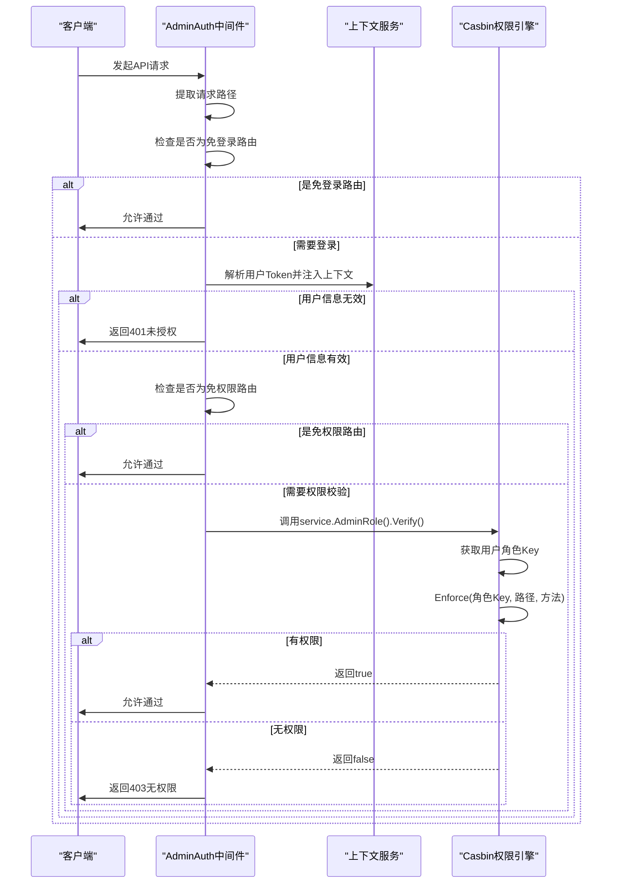

# 权限管理接口

<cite>
**本文档引用的文件**  
- [dept.go](file://server/api/admin/dept/dept.go)
- [role.go](file://server/api/admin/role/role.go)
- [menu.go](file://server/api/admin/menu/menu.go)
- [admin_auth.go](file://server/internal/logic/middleware/admin_auth.go)
- [dept.go](file://server/internal/logic/admin/dept.go)
- [role.go](file://server/internal/logic/admin/role.go)
- [menu.go](file://server/internal/logic/admin/menu.go)
- [dept.go](file://server/internal/model/input/adminin/dept.go)
- [role.go](file://server/internal/model/input/adminin/role.go)
- [menu.go](file://server/internal/model/input/adminin/menu.go)
- [enforcer.go](file://server/internal/library/casbin/enforcer.go)
</cite>

## 目录
1. [简介](#简介)
2. [部门模块接口](#部门模块接口)
3. [岗位模块接口](#岗位模块接口)
4. [角色模块接口](#角色模块接口)
5. [菜单模块接口](#菜单模块接口)
6. [权限校验流程](#权限校验流程)
7. [菜单树形结构与动态路由](#菜单树形结构与动态路由)
8. [高级功能说明](#高级功能说明)

## 简介
本接口文档详细描述了基于GoFrame框架的权限管理系统，涵盖部门、岗位、角色、菜单四大核心模块。系统采用Casbin实现基于角色的访问控制（RBAC），通过`admin_auth.go`中间件进行权限校验。所有接口均遵循RESTful设计规范，使用`input`包中的结构体定义请求体Schema，确保前后端数据交互的一致性。

## 部门模块接口

### 获取部门列表
- **接口**: `/admin/dept/list`
- **方法**: GET
- **描述**: 查询部门列表，支持按名称、编码、负责人等条件筛选。
- **请求体Schema**: `adminin.DeptListInp`
- **响应体**: `adminin.DeptListModel`

### 获取指定部门信息
- **接口**: `/admin/dept/view`
- **方法**: GET
- **描述**: 根据ID获取指定部门的详细信息。
- **请求体Schema**: `adminin.DeptViewInp`
- **响应体**: `adminin.DeptViewModel`

### 修改/新增部门
- **接口**: `/admin/dept/edit`
- **方法**: POST
- **描述**: 创建新部门或修改现有部门信息，支持树形结构管理。
- **请求体Schema**: `adminin.DeptEditInp`
- **响应体**: `EditRes`

### 删除部门
- **接口**: `/admin/dept/delete`
- **方法**: POST
- **描述**: 删除指定部门，删除前会校验是否存在子部门。
- **请求体Schema**: `adminin.DeptDeleteInp`
- **响应体**: `DeleteRes`

### 获取部门最大排序
- **接口**: `/admin/dept/maxSort`
- **方法**: GET
- **描述**: 获取当前部门的最大排序值，用于新部门的默认排序。
- **请求体Schema**: `adminin.DeptMaxSortInp`
- **响应体**: `adminin.DeptMaxSortModel`

### 获取部门选项
- **接口**: `/admin/dept/option`
- **方法**: GET
- **描述**: 获取当前登录用户可选的部门选项，用于下拉选择。
- **请求体Schema**: `adminin.DeptOptionInp`
- **响应体**: `adminin.DeptOptionModel`

### 获取部门关系树
- **接口**: `/admin/dept/treeOption`
- **方法**: GET
- **描述**: 获取部门关系树选项，用于树形选择器。
- **请求体Schema**: 无
- **响应体**: `[]tree.Node`

**Section sources**
- [dept.go](file://server/api/admin/dept/dept.go)
- [dept.go](file://server/internal/logic/admin/dept.go)
- [dept.go](file://server/internal/model/input/adminin/dept.go)

## 岗位模块接口
项目结构中未找到明确的岗位（post）模块API接口文件，相关功能可能集成在其他模块中。

## 角色模块接口

### 获取角色列表
- **接口**: `/admin/role/list`
- **方法**: GET
- **描述**: 查询角色列表，支持分页。
- **请求体Schema**: `adminin.RoleListInp`
- **响应体**: `adminin.RoleListModel`

### 获取动态路由
- **接口**: `/admin/role/dynamic`
- **方法**: GET
- **描述**: 获取当前登录用户的角色动态路由，用于前端菜单渲染。
- **请求体Schema**: 无
- **响应体**: `DynamicRes`

### 编辑角色菜单权限
- **接口**: `/admin/role/updatePermissions`
- **方法**: POST
- **描述**: 绑定角色与菜单的权限关系，通过Casbin实现。
- **请求体Schema**: `adminin.UpdatePermissionsInp`
- **响应体**: `UpdatePermissionsRes`

### 获取指定角色权限
- **接口**: `/admin/role/getPermissions`
- **方法**: GET
- **描述**: 获取指定角色已绑定的菜单权限。
- **请求体Schema**: `adminin.GetPermissionsInp`
- **响应体**: `adminin.GetPermissionsModel`

### 修改/新增角色
- **接口**: `/admin/role/edit`
- **方法**: POST
- **描述**: 创建新角色或修改现有角色信息。
- **请求体Schema**: `adminin.RoleEditInp`
- **响应体**: `EditRes`

### 删除角色
- **接口**: `/admin/role/delete`
- **方法**: POST
- **描述**: 删除指定角色，删除前会校验是否存在子角色。
- **请求体Schema**: `adminin.RoleDeleteInp`
- **响应体**: `DeleteRes`

### 获取数据权限选项
- **接口**: `/admin/role/dataScope/select`
- **方法**: GET
- **描述**: 获取角色数据权限的选项列表。
- **请求体Schema**: 无
- **响应体**: `DataScopeSelectRes`

### 修改数据权限
- **接口**: `/admin/role/dataScope/edit`
- **方法**: POST
- **描述**: 修改指定角色的数据权限范围。
- **请求体Schema**: `adminin.DataScopeEditInp`
- **响应体**: `DataScopeEditRes`

**Section sources**
- [role.go](file://server/api/admin/role/role.go)
- [role.go](file://server/internal/logic/admin/role.go)
- [role.go](file://server/internal/model/input/adminin/role.go)

## 菜单模块接口

### 修改/新增菜单
- **接口**: `/admin/menu/edit`
- **方法**: POST
- **描述**: 创建新菜单或修改现有菜单，支持多级树形结构。
- **请求体Schema**: `adminin.MenuEditInp`
- **响应体**: `EditRes`

### 删除菜单
- **接口**: `/admin/menu/delete`
- **方法**: POST
- **描述**: 删除指定菜单，删除前会校验是否存在子菜单。
- **请求体Schema**: `adminin.MenuDeleteInp`
- **响应体**: `DeleteRes`

### 获取菜单列表
- **接口**: `/admin/menu/list`
- **方法**: GET
- **描述**: 获取菜单列表，用于后台管理界面展示。
- **请求体Schema**: `adminin.MenuListInp`
- **响应体**: `adminin.MenuListModel`

**Section sources**
- [menu.go](file://server/api/admin/menu/menu.go)
- [menu.go](file://server/internal/logic/admin/menu.go)
- [menu.go](file://server/internal/model/input/adminin/menu.go)

## 权限校验流程



**Diagram sources**
- [admin_auth.go](file://server/internal/logic/middleware/admin_auth.go)
- [role.go](file://server/internal/logic/admin/role.go)
- [enforcer.go](file://server/internal/library/casbin/enforcer.go)

**Section sources**
- [admin_auth.go](file://server/internal/logic/middleware/admin_auth.go)
- [role.go](file://server/internal/logic/admin/role.go)
- [enforcer.go](file://server/internal/library/casbin/enforcer.go)

## 菜单树形结构与动态路由

### 菜单树形结构示例
```json
{
  "list": [
    {
      "id": 1,
      "pid": 0,
      "title": "系统管理",
      "children": [
        {
          "id": 2,
          "pid": 1,
          "title": "用户管理",
          "children": []
        }
      ]
    }
  ]
}
```

### 动态路由响应示例
```json
{
  "list": [
    {
      "name": "system",
      "path": "/system",
      "meta": {
        "title": "系统管理",
        "icon": "setting",
        "keepAlive": true
      },
      "children": [
        {
          "name": "user",
          "path": "/system/user",
          "meta": {
            "title": "用户管理",
            "icon": "user"
          }
        }
      ]
    }
  ]
}
```

前端通过调用`/admin/role/dynamic`接口获取动态路由，然后使用`vue-router`的`addRoute`方法动态添加路由，实现菜单的按需加载和权限控制。

**Section sources**
- [menu.go](file://server/internal/logic/admin/menu.go)
- [role.go](file://server/api/admin/role/role.go)

## 高级功能说明

### 权限分配
角色与菜单的权限绑定通过`/admin/role/updatePermissions`接口实现。系统会先删除该角色原有的所有权限，然后根据传入的`menuIds`列表重新绑定。权限变更后，会调用`casbin.Refresh()`方法刷新Casbin的权限策略，确保变更立即生效。

### 数据权限范围设置
角色的数据权限通过`dataScope`字段控制，具体包括：
- **全部数据权限**: 可查看所有数据。
- **自定义数据权限**: 可查看指定部门的数据，需配置`customDept`字段。
- **本部门及以下数据权限**: 可查看本部门及其子部门的数据。
- **仅本人数据权限**: 仅可查看自己的数据。

通过`/admin/role/dataScope/edit`接口修改角色的数据权限，后端会校验超管角色不能修改权限，并确保自定义权限时必须配置部门。

**Section sources**
- [role.go](file://server/internal/logic/admin/role.go)
- [enforcer.go](file://server/internal/library/casbin/enforcer.go)