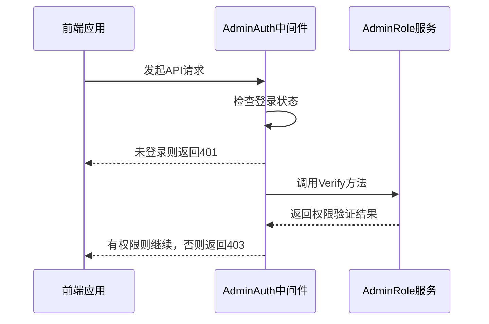
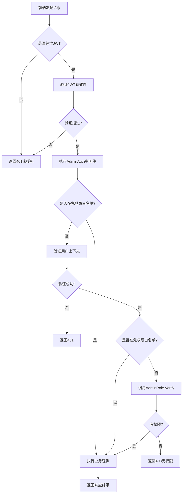

# 用户管理接口

<cite>
**Referenced Files in This Document**  
- [member.go](file://server/api/admin/member/member.go)
- [member.go](file://server/internal/model/input/adminin/member.go)
- [admin_auth.go](file://server/internal/logic/middleware/admin_auth.go)
- [admin.go](file://server/internal/service/admin.go)
- [member.go](file://server/internal/controller/admin/admin/member.go)
</cite>

## Table of Contents
1. [接口概览](#接口概览)
2. [权限校验机制](#权限校验机制)
3. [核心接口详细说明](#核心接口详细说明)
4. [分页查询参数](#分页查询参数)
5. [前端调用示例](#前端调用示例)
6. [错误码说明](#错误码说明)
7. [接口调用流程图](#接口调用流程图)

## 接口概览

用户管理接口提供了一套完整的用户生命周期管理功能，包括用户的创建、更新、删除、状态变更和密码重置等操作。所有接口均位于 `/admin/member` 路径下，通过不同的HTTP方法和子路径来区分具体操作。

**Section sources**
- [member.go](file://server/api/admin/member/member.go#L83-L138)

## 权限校验机制

所有用户管理接口均需要进行权限校验。系统通过 `admin_auth.go` 中的 `AdminAuth` 中间件实现权限控制。该中间件首先验证用户登录状态，然后检查当前用户是否具有访问特定路由的权限。

权限校验基于角色的访问控制（RBAC）模型，通过 `AdminRole.Verify` 方法检查当前用户的角色是否被授权访问请求的路径和HTTP方法。只有拥有 `member:manage` 权限的角色才能访问用户管理接口。



**Diagram sources**
- [admin_auth.go](file://server/internal/logic/middleware/admin_auth.go#L20-L52)
- [admin.go](file://server/internal/service/admin.go#L224-L224)

**Section sources**
- [admin_auth.go](file://server/internal/logic/middleware/admin_auth.go#L20-L52)

## 核心接口详细说明

### 创建用户接口

**HTTP方法**: POST  
**URL路径**: `/admin/member/edit`  
**请求头**: Authorization JWT  
**功能**: 创建新用户或更新现有用户信息

请求体结构基于 `input.MemberEditInp`，包含用户的基本信息如用户名、密码、真实姓名、部门、角色等。创建新用户时，系统会自动生成邀请码并建立用户关系树。

**Section sources**
- [member.go](file://server/api/admin/member/member.go#L83-L86)
- [member.go](file://server/internal/model/input/adminin/member.go#L159-L179)
- [member.go](file://server/internal/controller/admin/admin/member.go#L87-L90)

### 更新用户接口

**HTTP方法**: PUT  
**URL路径**: `/admin/member/edit`  
**请求头**: Authorization JWT  
**功能**: 更新现有用户信息

更新用户接口与创建用户共用同一路径，通过请求体中的 `id` 字段来区分是创建还是更新操作。当 `id` 大于0时视为更新操作。接口会验证用户唯一性属性（如用户名、邮箱、手机号等）是否冲突。

**Section sources**
- [member.go](file://server/internal/model/input/adminin/member.go#L159-L179)
- [member.go](file://server/internal/controller/admin/admin/member.go#L87-L90)

### 删除用户接口

**HTTP方法**: DELETE  
**URL路径**: `/admin/member/delete`  
**请求头**: Authorization JWT  
**功能**: 删除指定用户

请求体需要包含要删除的用户ID。系统会执行软删除操作，将用户状态标记为已删除，而非物理删除数据库记录。

**Section sources**
- [member.go](file://server/api/admin/member/member.go#L91-L94)
- [member.go](file://server/internal/model/input/adminin/member.go#L180-L184)
- [member.go](file://server/internal/controller/admin/admin/member.go#L81-L84)

### 状态变更接口

**HTTP方法**: POST  
**URL路径**: `/admin/member/status`  
**请求头**: Authorization JWT  
**功能**: 更新用户状态（启用/禁用）

通过修改用户的状态字段来控制用户的访问权限。状态值通常为1（启用）或2（禁用）。

**Section sources**
- [member.go](file://server/api/admin/member/member.go#L104-L107)
- [member.go](file://server/internal/model/input/adminin/member.go#L240-L250)
- [member.go](file://server/internal/controller/admin/admin/member.go#L137-L140)

## 分页查询参数

用户列表查询接口支持分页功能，通过以下参数控制分页行为：

- `page`: 当前页码，从1开始
- `size`: 每页显示数量
- `status`: 用户状态筛选
- `username`: 用户名模糊搜索
- `realName`: 真实姓名模糊搜索

分页查询结果包含数据列表和分页信息，便于前端实现分页控件。

**Section sources**
- [member.go](file://server/internal/model/input/adminin/member.go#L200-L239)

## 前端调用示例

```javascript
// 创建/更新用户
axios.post('/admin/member/edit', {
  id: 0, // 0表示创建，大于0表示更新
  username: 'newuser',
  password: 'password123',
  realName: '新用户',
  roleId: 1,
  deptId: 1
}, {
  headers: {
    'Authorization': 'Bearer ' + token
  }
})

// 删除用户
axios.post('/admin/member/delete', {
  id: 123
}, {
  headers: {
    'Authorization': 'Bearer ' + token
  }
})

// 查询用户列表
axios.get('/admin/member/list', {
  params: {
    page: 1,
    size: 10,
    username: 'search'
  },
  headers: {
    'Authorization': 'Bearer ' + token
  }
})
```

## 错误码说明

| 错误码 | 含义 | 解决方案 |
|-------|------|---------|
| 401 | 未授权访问 | 检查JWT令牌是否有效 |
| 403 | 无访问权限 | 确认用户角色具有`member:manage`权限 |
| 422 | 参数验证失败 | 检查请求体参数是否符合要求 |
| 500 | 服务器内部错误 | 查看服务端日志定位问题 |

常见参数验证错误包括：用户名已存在、邮箱格式不正确、手机号已绑定其他账户、密码长度不符合要求等。

**Section sources**
- [member.go](file://server/internal/model/input/adminin/member.go#L148-L158)

## 接口调用流程图



**Diagram sources**
- [admin_auth.go](file://server/internal/logic/middleware/admin_auth.go#L20-L52)
- [admin.go](file://server/internal/service/admin.go#L224-L224)
- [member.go](file://server/internal/controller/admin/admin/member.go)