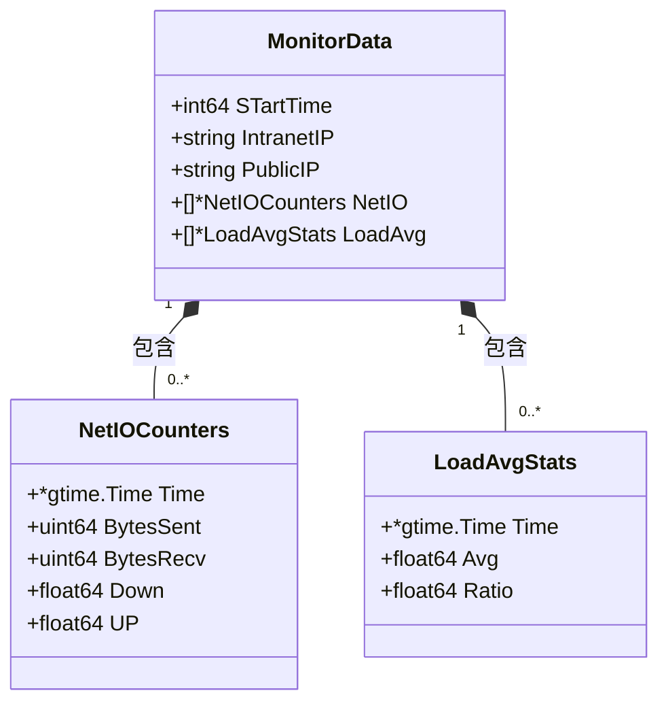
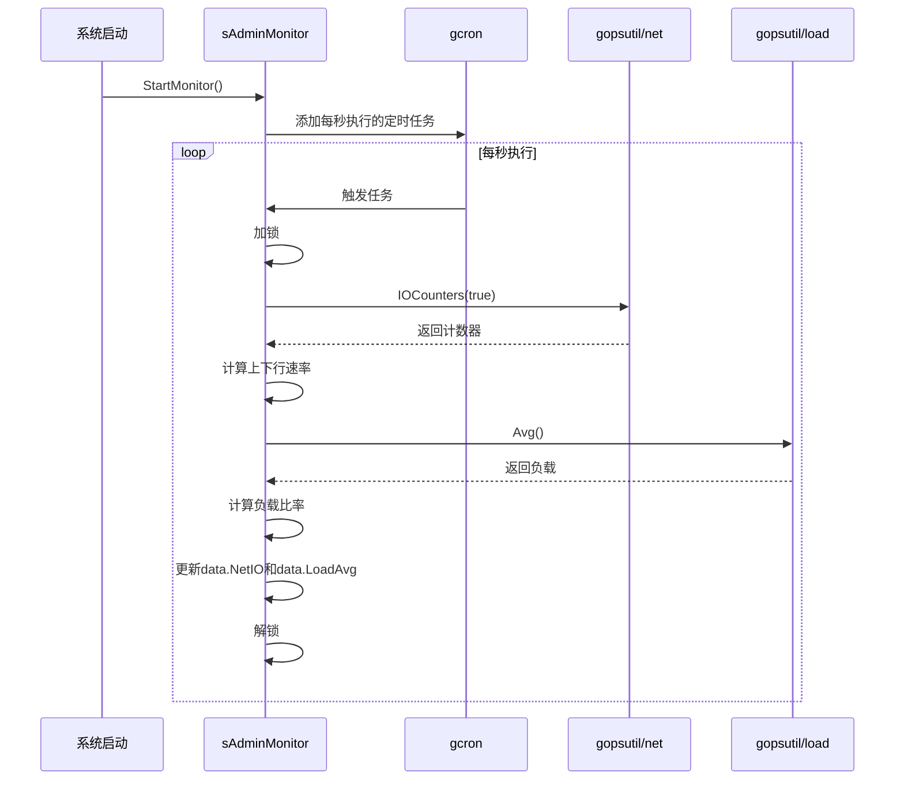

# 监控管理接口

<cite>
**本文档引用的文件**  
- [monitor.go](file://server/internal/logic/admin/monitor.go)
- [monitor.go](file://server/api/admin/monitor/monitor.go)
- [monitor.go](file://server/internal/model/monitor.go)
- [admin.go](file://server/internal/service/admin.go)
- [monitor.go](file://server/internal/controller/websocket/handler/admin/monitor.go)
- [monitor.ts](file://web/src/api/monitor/monitor.ts)
</cite>

## 目录
1. [接口概述](#接口概述)
2. [响应数据结构](#响应数据结构)
3. [数据采集实现机制](#数据采集实现机制)
4. [前端可视化展示建议](#前端可视化展示建议)
5. [安全访问策略](#安全访问策略)
6. [错误处理方案](#错误处理方案)
7. [附加监控指标](#附加监控指标)

## 接口概述

`GET /admin/monitor/system` 接口用于获取服务器的实时资源使用情况，包括CPU、内存、磁盘和网络等关键性能指标。该接口通过WebSocket事件`Trends`触发，由`cMonitor.Trends`方法处理，返回包含系统负载、网络流量和资源使用率的综合监控数据。此接口是系统管理员监控服务器健康状况的核心工具。

**Section sources**
- [monitor.go](file://server/internal/controller/websocket/handler/admin/monitor.go#L140-L197)

## 响应数据结构

接口返回的`SysInfo`对象包含以下核心指标：

- **head**: 资源使用概览，包含CPU、内存、磁盘和负载的实时数据。
- **load**: 系统负载历史数据，包含时间戳、平均负载和负载比率。
- **net**: 网络流量历史数据，包含时间戳、发送/接收字节数以及上下行速率。

各指标的单位如下：
- CPU使用率：百分比（%）
- 内存使用率：百分比（%），总内存和已用内存以字节为单位
- 磁盘使用：已用空间以字节为单位，使用率以百分比（%）表示
- 网络流量：发送/接收字节数以字节为单位，上下行速率以KB/s为单位
- 负载比率：百分比（%）

数据采样频率为每秒一次，系统通过定时任务持续更新`MonitorData`中的`LoadAvg`和`NetIO`数组，保留最近10个采样点。

**Diagram sources**
- [monitor.go](file://server/internal/model/monitor.go#L11-L22)

**Section sources**
- [monitor.go](file://server/internal/model/monitor.go#L11-L22)
- [monitor.go](file://server/internal/controller/websocket/handler/admin/monitor.go#L140-L197)

## 数据采集实现机制

系统监控数据的采集由`internal/logic/admin/monitor.go`中的`sAdminMonitor`结构体实现。在服务启动时，通过`StartMonitor`方法注册一个每秒执行的定时任务（`@every 1s`），该任务调用`netIO`和`loadAvg`方法更新网络和负载数据。

- **网络流量采集**：`netIO`方法调用`gopsutil/v3/net.IOCounters(true)`获取所有网络接口的I/O计数器，累加所有接口的发送和接收字节数，并根据时间差计算上下行速率（单位：字节/秒）。
- **系统负载采集**：`loadAvg`方法调用`gopsutil/v3/load.Avg()`获取系统1分钟平均负载，并将其转换为相对于CPU核心数的使用比率（单位：%）。

采集到的数据被存储在`sAdminMonitor`的`data`字段（`*model.MonitorData`类型）中，通过`GetMeta`方法供外部访问。数据结构采用环形缓冲区设计，仅保留最近10个采样点以节省内存。

**Diagram sources**
- [monitor.go](file://server/internal/logic/admin/monitor.go#L39-L55)
- [monitor.go](file://server/internal/logic/admin/monitor.go#L76-L96)

**Section sources**
- [monitor.go](file://server/internal/logic/admin/monitor.go#L39-L96)

## 前端可视化展示建议

前端可通过WebSocket订阅`Trends`事件来获取实时监控数据，并使用ECharts进行可视化展示。

- **CPU、内存、磁盘使用率**：使用仪表盘（gauge）图表展示，数据来源于`head`数组中的`Data`字段。
- **系统负载趋势**：使用折线图（line chart）展示，X轴为`load`数组中的`Time`，Y轴为`Ratio`。
- **网络流量趋势**：使用双Y轴折线图展示，主Y轴为`Down`（下行速率，单位KB/s），次Y轴为`UP`（上行速率，单位KB/s），X轴为`net`数组中的`Time`。

前端API位于`web/src/api/monitor/monitor.ts`，提供了对在线用户和服务的管理功能，可与系统监控数据结合展示。

**Section sources**
- [monitor.ts](file://web/src/api/monitor/monitor.ts#L0-L39)
- [monitor.go](file://server/internal/controller/websocket/handler/admin/monitor.go#L140-L197)

## 安全访问策略

该监控接口仅限超级管理员访问。系统通过`admin_auth`中间件进行权限验证，确保只有具备超级管理员角色的用户才能调用此接口。在`cMonitor.Trends`方法处理请求前，会检查用户的身份和权限，未通过验证的请求将被拒绝。

**Section sources**
- [monitor.go](file://server/internal/controller/websocket/handler/admin/monitor.go#L140-L197)

## 错误处理方案

当获取主机信息失败时，系统会记录警告日志并返回默认值，确保接口的健壮性：
- **CPU信息获取失败**：记录日志并使用空的`cpu.InfoStat`作为默认值。
- **内存信息获取失败**：记录日志并使用空的`mem.VirtualMemoryStat`作为默认值。
- **磁盘信息获取失败**：记录日志并使用空的`disk.UsageStat`作为默认值。
- **进程信息获取失败**：记录日志并继续执行。

这些错误处理机制保证了即使部分系统信息无法获取，接口仍能返回可用的监控数据。

**Section sources**
- [monitor.go](file://server/internal/controller/websocket/handler/admin/monitor.go#L99-L143)

## 附加监控指标

除了核心资源指标外，系统还提供以下附加监控信息：
- **在线用户数**：通过`/monitor/userOnlineList`接口获取，显示当前在线的用户会话。
- **服务运行时长**：通过`runTime`字段提供，单位为秒，计算方式为当前时间戳减去`STartTime`。
- **服务器信息**：包括主机名、操作系统、架构、内网IP和公网IP。
- **运行环境**：包括Go版本、HG版本、GOROOT路径、当前工作目录、Goroutine数量、Go内存使用量和项目大小。

这些信息通过`RunInfo` WebSocket事件提供，为系统管理员提供了全面的服务器状态视图。

**Section sources**
- [monitor.go](file://server/internal/controller/websocket/handler/admin/monitor.go#L57-L97)
- [monitor.go](file://server/internal/logic/admin/monitor.go#L39-L55)