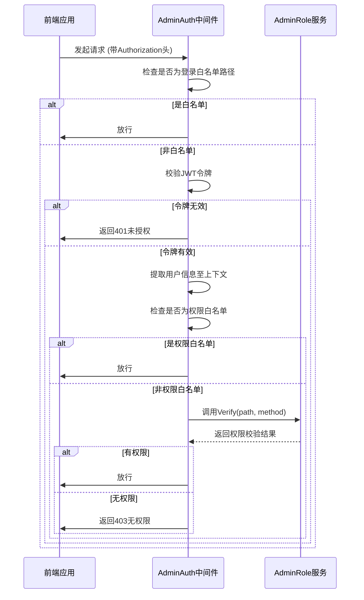

# 管理端API

<cite>
**本文档中引用的文件**  
- [admin_auth.go](file://server/internal/logic/middleware/admin_auth.go)
- [error.go](file://server/internal/consts/error.go)
- [member.go](file://server/api/admin/member/member.go)
- [role.go](file://server/api/admin/role/role.go)
- [config.go](file://server/api/admin/config/config.go)
- [log.go](file://server/api/admin/log/log.go)
- [member.go](file://server/internal/model/input/adminin/member.go)
- [role.go](file://server/internal/model/input/adminin/role.go)
- [config.go](file://server/internal/model/input/sysin/config.go)
- [log.go](file://server/internal/model/input/sysin/log.go)
</cite>

## 目录
1. [简介](#简介)
2. [认证与权限机制](#认证与权限机制)
3. [用户管理接口](#用户管理接口)
4. [角色与权限接口](#角色与权限接口)
5. [系统配置接口](#系统配置接口)
6. [日志管理接口](#日志管理接口)
7. [错误码体系](#错误码体系)
8. [前端调用示例](#前端调用示例)

## 简介
本文档为`hotgo-2.0`项目的管理端API提供详尽说明，涵盖用户管理、权限控制、系统配置、日志查询等核心功能模块。所有接口均需通过JWT认证，并基于角色进行细粒度权限校验。接口设计遵循RESTful规范，使用JSON格式进行数据交互。

## 认证与权限机制

管理端采用JWT（JSON Web Token）进行身份认证，所有需要权限的接口必须在请求头中携带有效的`Authorization`令牌。

### JWT认证流程
1. 管理员登录成功后，服务端生成JWT令牌并返回
2. 前端在后续请求中将令牌放入`Authorization`请求头，格式为：`Bearer <token>`
3. 服务端中间件`AdminAuth`自动校验令牌有效性

### 权限校验逻辑
权限校验由`internal/logic/middleware/admin_auth.go`中的`AdminAuth`中间件实现：

- **登录验证**：除白名单路径外，所有请求必须携带有效令牌
- **权限验证**：通过`service.AdminRole().Verify()`方法，基于当前用户角色和请求路径进行权限匹配
- **白名单机制**：登录、验证码等接口无需登录即可访问
- **动态路由**：根据角色权限动态生成前端可访问的菜单路由



**Diagram sources**
- [admin_auth.go](file://server/internal/logic/middleware/admin_auth.go#L1-L54)

**Section sources**
- [admin_auth.go](file://server/internal/logic/middleware/admin_auth.go#L1-L54)

## 用户管理接口

提供对后台用户的增删改查、状态管理、余额积分操作等功能。

### 获取用户列表
- **HTTP方法**: GET
- **URL路径**: `/admin/member/list`
- **请求头**: `Authorization: Bearer <token>`
- **请求参数**:
  - `page`: 页码
  - `limit`: 每页数量
  - `status`: 状态筛选
  - `username`: 用户名模糊查询
  - `realName`: 真实姓名模糊查询
- **响应体**:
```json
{
  "list": [
    {
      "id": 1,
      "username": "admin",
      "realName": "超级管理员",
      "deptName": "总部",
      "roleName": "超级管理员",
      "status": 1,
      "createdAt": "2023-01-01 00:00:00"
    }
  ],
  "total": 1
}
```

### 新增/修改用户
- **HTTP方法**: POST
- **URL路径**: `/admin/member/edit`
- **请求头**: `Authorization: Bearer <token>`
- **请求体 (JSON Schema)**:
```json
{
  "id": 0,
  "roleId": 1,
  "deptId": 1,
  "username": "newuser",
  "password": "123456",
  "realName": "新用户",
  "mobile": "13800138000",
  "status": 1
}
```
- **字段说明**:
  - `id`: 用户ID，0表示新增
  - `roleId`: 角色ID，必填
  - `deptId`: 部门ID，必填
  - `username`: 用户名，必填，长度不限
  - `password`: 密码，新增时必填，修改时可为空
  - `status`: 状态，1=正常，2=禁用

### 删除用户
- **HTTP方法**: POST
- **URL路径**: `/admin/member/delete`
- **请求头**: `Authorization: Bearer <token>`
- **请求体**:
```json
{
  "id": 1
}
```

### 更新用户状态
- **HTTP方法**: POST
- **URL路径**: `/admin/member/status`
- **请求头**: `Authorization: Bearer <token>`
- **请求体**:
```json
{
  "id": 1,
  "status": 2
}
```

### 获取用户详情
- **HTTP方法**: GET
- **URL路径**: `/admin/member/view`
- **请求头**: `Authorization: Bearer <token>`
- **请求参数**: `id=1`
- **响应体**:
```json
{
  "id": 1,
  "username": "admin",
  "realName": "超级管理员",
  "avatar": "/upload/avatar.jpg",
  "mobile": "13800138000",
  "email": "admin@example.com",
  "deptName": "总部",
  "roleName": "超级管理员"
}
```

### 获取登录用户信息
- **HTTP方法**: GET
- **URL路径**: `/admin/member/info`
- **请求头**: `Authorization: Bearer <token>`
- **响应体**:
```json
{
  "id": 1,
  "username": "admin",
  "realName": "超级管理员",
  "avatar": "/upload/avatar.jpg",
  "deptName": "总部",
  "roleName": "超级管理员",
  "permissions": ["user:list", "user:edit"]
}
```

### 增加用户余额
- **HTTP方法**: POST
- **URL路径**: `/admin/member/addBalance`
- **请求头**: `Authorization: Bearer <token>`
- **请求体**:
```json
{
  "id": 1,
  "operateMode": 1,
  "num": 100
}
```
- `operateMode`: 1=增加，2=扣除

**Section sources**
- [member.go](file://server/api/admin/member/member.go#L1-L139)
- [member.go](file://server/internal/model/input/adminin/member.go#L1-L339)

## 角色与权限接口

提供角色管理、权限分配、数据范围控制等功能。

### 获取角色列表
- **HTTP方法**: GET
- **URL路径**: `/admin/role/list`
- **请求头**: `Authorization: Bearer <token>`
- **响应体**:
```json
{
  "list": [
    {
      "id": 1,
      "name": "超级管理员",
      "key": "super_admin",
      "status": 1
    }
  ],
  "total": 1
}
```

### 新增/修改角色
- **HTTP方法**: POST
- **URL路径**: `/admin/role/edit`
- **请求头**: `Authorization: Bearer <token>`
- **请求体**:
```json
{
  "id": 0,
  "name": "新角色",
  "key": "new_role",
  "dataScope": 1,
  "status": 1
}
```
- `dataScope`: 数据范围，1=全部，2=自定义，3=本部门，4=本部门及子部门

### 删除角色
- **HTTP方法**: POST
- **URL路径**: `/admin/role/delete`
- **请求头**: `Authorization: Bearer <token>`
- **请求体**:
```json
{
  "id": 1
}
```

### 编辑角色菜单权限
- **HTTP方法**: POST
- **URL路径**: `/admin/role/updatePermissions`
- **请求头**: `Authorization: Bearer <token>`
- **请求体**:
```json
{
  "id": 1,
  "menuIds": [1, 2, 3, 4]
}
```

### 获取指定角色权限
- **HTTP方法**: GET
- **URL路径**: `/admin/role/getPermissions`
- **请求头**: `Authorization: Bearer <token>`
- **请求参数**: `id=1`
- **响应体**:
```json
{
  "menuIds": [1, 2, 3, 4]
}
```

### 获取动态路由
- **HTTP方法**: GET
- **URL路径**: `/admin/role/dynamic`
- **请求头**: `Authorization: Bearer <token>`
- **响应体**:
```json
{
  "list": [
    {
      "id": 1,
      "parentId": 0,
      "name": "Dashboard",
      "path": "/dashboard",
      "component": "Layout",
      "meta": {
        "title": "首页",
        "icon": "dashboard"
      }
    }
  ]
}
```

### 修改角色数据权限
- **HTTP方法**: POST
- **URL路径**: `/admin/role/dataScope/edit`
- **请求头**: `Authorization: Bearer <token>`
- **请求体**:
```json
{
  "id": 1,
  "dataScope": 2,
  "customDept": [1, 2]
}
```

**Section sources**
- [role.go](file://server/api/admin/role/role.go#L1-L83)
- [role.go](file://server/internal/model/input/adminin/role.go#L1-L155)

## 系统配置接口

提供系统配置的读取与更新功能。

### 获取配置
- **HTTP方法**: GET
- **URL路径**: `/admin/config/get`
- **请求头**: `Authorization: Bearer <token>`
- **请求参数**: `group=site`
- **响应体**:
```json
{
  "list": {
    "site_name": "HotGo系统",
    "site_desc": "基于GoFrame的快速开发平台"
  }
}
```

### 更新配置
- **HTTP方法**: POST
- **URL路径**: `/admin/config/update`
- **请求头**: `Authorization: Bearer <token>`
- **请求体**:
```json
{
  "group": "site",
  "list": {
    "site_name": "新系统名称",
    "site_desc": "新的系统描述"
  }
}
```

### 获取数据类型选项
- **HTTP方法**: GET
- **URL路径**: `/admin/config/typeSelect`
- **请求头**: `Authorization: Bearer <token>`
- **响应体**:
```json
[
  {
    "value": "string",
    "label": "字符串"
  },
  {
    "value": "number",
    "label": "数字"
  }
]
```

### 获取提现配置
- **HTTP方法**: GET
- **URL路径**: `/admin/config/getCash`
- **请求头**: `Authorization: Bearer <token>`
- **响应体**:
```json
{
  "list": {
    "cash_min": "10",
    "cash_max": "10000",
    "cash_fee": "1"
  }
}
```

**Section sources**
- [config.go](file://server/api/admin/config/config.go#L1-L48)
- [config.go](file://server/internal/model/input/sysin/config.go#L1-L26)

## 日志管理接口

提供访问日志的查询、导出、删除等功能。

### 获取日志列表
- **HTTP方法**: GET
- **URL路径**: `/admin/log/list`
- **请求头**: `Authorization: Bearer <token>`
- **请求参数**:
  - `page`: 页码
  - `limit`: 每页数量
  - `url`: 请求路径筛选
  - `ip`: IP地址筛选
  - `createdAt`: 创建时间范围
- **响应体**:
```json
{
  "list": [
    {
      "id": 1,
      "reqId": "req_123",
      "module": "admin",
      "memberName": "admin",
      "url": "/admin/member/list",
      "method": "GET",
      "ip": "127.0.0.1",
      "takeUpTime": "15ms",
      "errorCode": "200",
      "createdAt": "2023-01-01 00:00:00"
    }
  ],
  "total": 1
}
```

### 获取日志详情
- **HTTP方法**: GET
- **URL路径**: `/admin/log/view`
- **请求头**: `Authorization: Bearer <token>`
- **请求参数**: `id=1`
- **响应体**:
```json
{
  "id": 1,
  "reqId": "req_123",
  "module": "admin",
  "memberName": "admin",
  "url": "/admin/member/list",
  "method": "GET",
  "ip": "127.0.0.1",
  "takeUpTime": "15ms",
  "errorCode": "200",
  "request": "{}",
  "response": "{}",
  "createdAt": "2023-01-01 00:00:00"
}
```

### 删除日志
- **HTTP方法**: POST
- **URL路径**: `/admin/log/delete`
- **请求头**: `Authorization: Bearer <token>`
- **请求体**:
```json
{
  "id": 1
}
```

### 清空日志
- **HTTP方法**: POST
- **URL路径**: `/admin/log/clear`
- **请求头**: `Authorization: Bearer <token>`
- **请求体**: 无

### 导出日志
- **HTTP方法**: GET
- **URL路径**: `/admin/log/export`
- **请求头**: `Authorization: Bearer <token>`
- **请求参数**: 同列表查询参数
- **响应**: CSV格式文件下载

**Section sources**
- [log.go](file://server/api/admin/log/log.go#L1-L57)
- [log.go](file://server/internal/model/input/sysin/log.go#L1-L59)

## 错误码体系

错误码定义在`internal/consts/error.go`文件中，系统采用统一的错误处理机制。

### 通用错误码
| 错误码 | 说明 |
|--------|------|
| 200 | 成功 |
| 400 | 请求参数错误 |
| 401 | 未授权，请重新登录 |
| 403 | 无访问权限 |
| 500 | 服务器内部错误 |

### 业务错误码
| 错误码 | 说明 |
|--------|------|
| 10001 | 数据不存在 |
| 10002 | 操作失败，请稍后重试 |
| 10003 | 用户名已存在 |
| 10004 | 角色编码已存在 |
| 10005 | 部门名称已存在 |

### 错误信息隐藏机制
为安全考虑，部分敏感错误信息会被统一替换为"操作失败，请稍后重试！~"，包括：
- SQL执行异常
- 指针转换异常

**Section sources**
- [error.go](file://server/internal/consts/error.go#L1-L36)

## 前端调用示例

以下为使用axios调用管理端API的示例：

```javascript
import axios from 'axios'

// 创建axios实例
const adminApi = axios.create({
  baseURL: '/api/admin',
  timeout: 10000,
  headers: {
    'Content-Type': 'application/json'
  }
})

// 请求拦截器
adminApi.interceptors.request.use(
  config => {
    const token = localStorage.getItem('admin_token')
    if (token) {
      config.headers.Authorization = `Bearer ${token}`
    }
    return config
  },
  error => {
    return Promise.reject(error)
  }
)

// 响应拦截器
adminApi.interceptors.response.use(
  response => {
    const { code, message, data } = response.data
    if (code === 200) {
      return data
    } else {
      ElMessage.error(message || '请求失败')
      return Promise.reject(new Error(message || '请求失败'))
    }
  },
  error => {
    const { status } = error.response
    if (status === 401) {
      // 未登录或令牌过期
      localStorage.removeItem('admin_token')
      window.location.href = '/login'
    } else if (status === 403) {
      ElMessage.error('您没有权限访问该功能')
    } else {
      ElMessage.error('请求异常，请稍后重试')
    }
    return Promise.reject(error)
  }
)

// 使用示例：获取用户列表
async function getMemberList(params) {
  try {
    const data = await adminApi.get('/member/list', { params })
    console.log('用户列表:', data)
    return data
  } catch (error) {
    console.error('获取用户列表失败:', error)
  }
}

// 使用示例：新增用户
async function createMember(memberData) {
  try {
    const data = await adminApi.post('/member/edit', memberData)
    ElMessage.success('用户创建成功')
    return data
  } catch (error) {
    console.error('创建用户失败:', error)
  }
}
```

**Section sources**
- [admin_auth.go](file://server/internal/logic/middleware/admin_auth.go#L1-L54)
- [error.go](file://server/internal/consts/error.go#L1-L36)