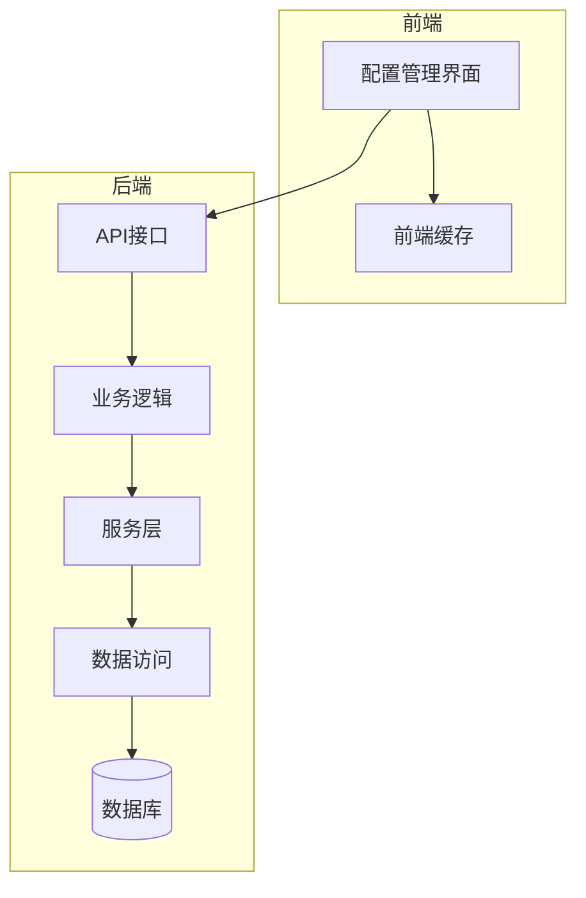
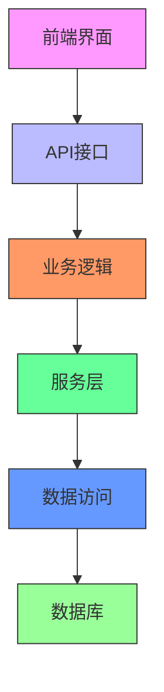
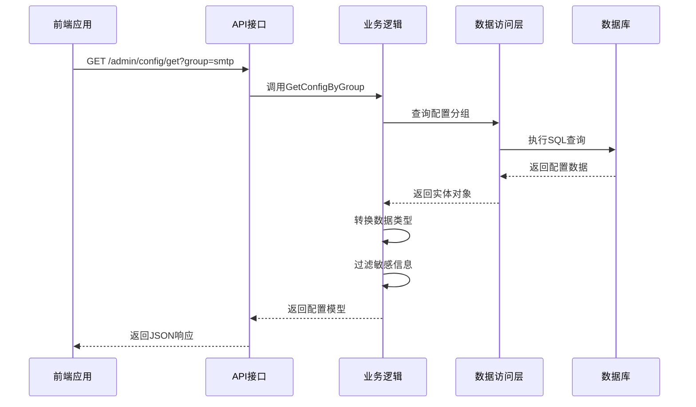
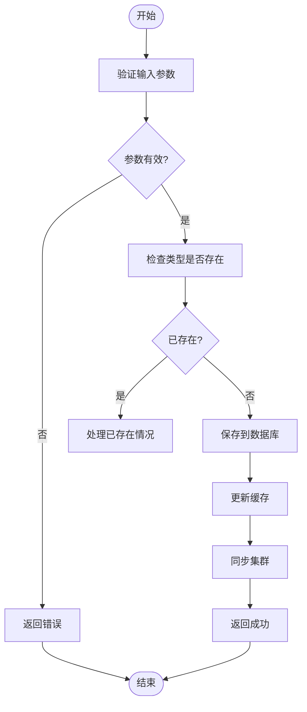
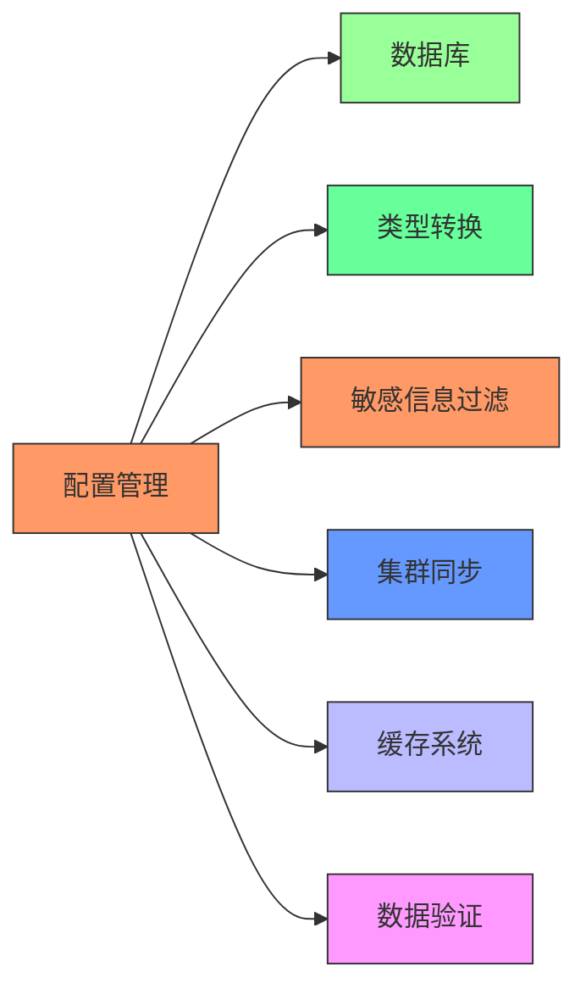

# 系统配置接口

<cite>
**本文档引用的文件**
- [config.go](file://server/api/admin/config/config.go)
- [dict_type.go](file://server/api/admin/dict/dict_type.go)
- [config.go](file://server/internal/logic/sys/config.go)
- [config.go](file://server/internal/consts/config.go)
- [EmailSetting.vue](file://web/src/views/system/config/EmailSetting.vue)
- [getConfigFileName.ts](file://web/build/getConfigFileName.ts)
- [env.ts](file://web/src/utils/env.ts)
</cite>

## 目录
1. [简介](#简介)
2. [项目结构](#项目结构)
3. [核心组件](#核心组件)
4. [架构概述](#架构概述)
5. [详细组件分析](#详细组件分析)
6. [依赖分析](#依赖分析)
7. [性能考虑](#性能考虑)
8. [故障排除指南](#故障排除指南)
9. [结论](#结论)
10. [附录](#附录)（如有必要）

## 简介
本文档全面介绍了系统配置接口的功能，重点说明了配置项管理（`/admin/config`）和字典管理（`/admin/dict`）的API。文档详细描述了如何通过`GET /admin/config/list`获取系统参数，以及如何通过`POST /admin/dict/type/create`新增字典类型。同时，文档还解释了配置项的分类机制、前端缓存策略、字典数据项的树形结构处理方式，以及敏感配置的安全传输策略。

## 项目结构
系统配置功能主要分布在后端API层、业务逻辑层和前端展示层。后端配置管理位于`server/api/admin/config`和`server/internal/logic/sys`目录下，字典管理位于`server/api/admin/dict`目录。前端配置界面位于`web/src/views/system/config`目录，通过API与后端进行数据交互。

**图示来源**
- [config.go](file://server/api/admin/config/config.go)
- [EmailSetting.vue](file://web/src/views/system/config/EmailSetting.vue)

**章节来源**
- [config.go](file://server/api/admin/config/config.go)
- [dict_type.go](file://server/api/admin/dict/dict_type.go)

## 核心组件
系统配置接口的核心组件包括配置项管理API、字典管理API、配置逻辑处理和前端缓存机制。配置项管理支持按分组获取和更新系统参数，字典管理提供字典类型和数据项的增删改查功能。敏感配置项在演示环境中会自动隐藏，确保系统安全。

**章节来源**
- [config.go](file://server/internal/logic/sys/config.go)
- [config.go](file://server/internal/consts/config.go)

## 架构概述
系统配置接口采用分层架构设计，从前端界面到数据库访问共分为五层：展示层、API层、业务逻辑层、服务层和数据访问层。这种设计实现了关注点分离，提高了代码的可维护性和可扩展性。

**图示来源**
- [config.go](file://server/api/admin/config/config.go)
- [config.go](file://server/internal/logic/sys/config.go)

## 详细组件分析

### 配置项管理分析
配置项管理提供了按分组获取系统参数的功能。通过`GET /admin/config/get`接口，客户端可以获取指定分组的配置信息。系统支持多种配置分组，如system、email、pay等，每个分组包含相关的配置项。

#### 配置项获取流程

**图示来源**
- [config.go](file://server/internal/logic/sys/config.go)
- [config.go](file://server/api/admin/config/config.go)

**章节来源**
- [config.go](file://server/internal/logic/sys/config.go)
- [EmailSetting.vue](file://web/src/views/system/config/EmailSetting.vue)

### 字典管理分析
字典管理提供了字典类型和字典数据项的完整CRUD操作。通过`POST /admin/dict/type/create`接口，可以新增字典类型。字典数据采用树形结构组织，支持父子层级关系。

#### 字典类型创建流程

**图示来源**
- [dict_type.go](file://server/api/admin/dict/dict_type.go)
- [config.go](file://server/internal/logic/sys/config.go)

**章节来源**
- [dict_type.go](file://server/api/admin/dict/dict_type.go)
- [config.go](file://server/internal/logic/sys/config.go)

### 前端缓存机制
前端采用环境变量文件缓存系统配置，避免频繁的API调用。构建时生成的配置文件包含全局变量，通过特定命名规则在运行时注入。

#### 前端缓存处理流程

**图示来源**
- [getConfigFileName.ts](file://web/build/getConfigFileName.ts)
- [env.ts](file://web/src/utils/env.ts)

**章节来源**
- [getConfigFileName.ts](file://web/build/getConfigFileName.ts)
- [env.ts](file://web/src/utils/env.ts)

## 依赖分析
系统配置功能依赖于多个核心组件和服务。主要依赖包括数据库访问层、类型转换工具、敏感信息过滤机制和集群同步功能。这些依赖确保了配置管理的可靠性、安全性和一致性。

**图示来源**
- [config.go](file://server/internal/logic/sys/config.go)
- [config.go](file://server/internal/consts/config.go)

**章节来源**
- [config.go](file://server/internal/logic/sys/config.go)
- [config.go](file://server/internal/consts/config.go)

## 性能考虑
系统配置接口在设计时充分考虑了性能因素。通过分组查询减少数据库访问次数，使用缓存避免重复计算，以及批量更新减少事务开销。敏感信息过滤在业务逻辑层完成，避免了不必要的数据传输。

## 故障排除指南
当配置接口出现问题时，应首先检查数据库连接状态和配置表数据完整性。对于前端缓存问题，可尝试清除浏览器缓存或重新构建前端应用。敏感信息显示异常时，需确认是否处于演示模式以及过滤规则是否正确配置。

**章节来源**
- [config.go](file://server/internal/logic/sys/config.go)
- [EmailSetting.vue](file://web/src/views/system/config/EmailSetting.vue)

## 结论
系统配置接口提供了完整的配置项和字典管理功能，支持灵活的分组管理和安全的敏感信息处理。通过前后端协同的缓存机制，既保证了配置的实时性，又提高了系统性能。接口设计遵循RESTful规范，易于集成和扩展。

## 附录
### 配置分组列表
- **system**: 系统基础配置
- **email**: 邮件服务配置
- **pay**: 支付服务配置
- **sms**: 短信服务配置
- **wechat**: 微信服务配置
- **geo**: 地理位置配置
- **upload**: 文件上传配置

### 敏感配置项
以下配置项在演示环境中会被自动隐藏：
- 邮件配置：smtpUser, smtpPass
- 云存储密钥：各类云服务的访问密钥
- 支付配置：支付商户ID和密钥
- 短信服务：短信平台访问密钥
- 微信配置：微信应用密钥