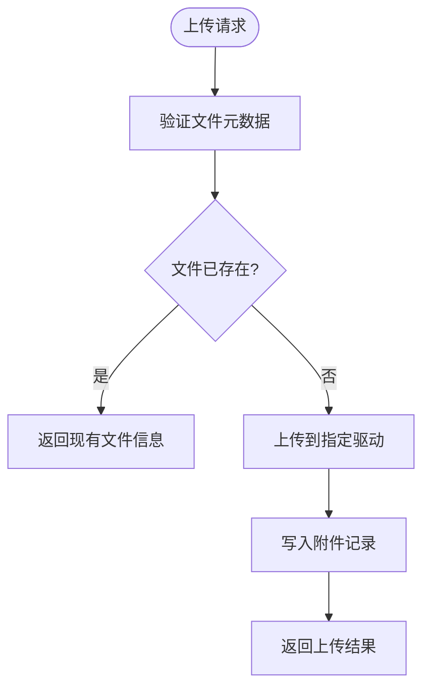
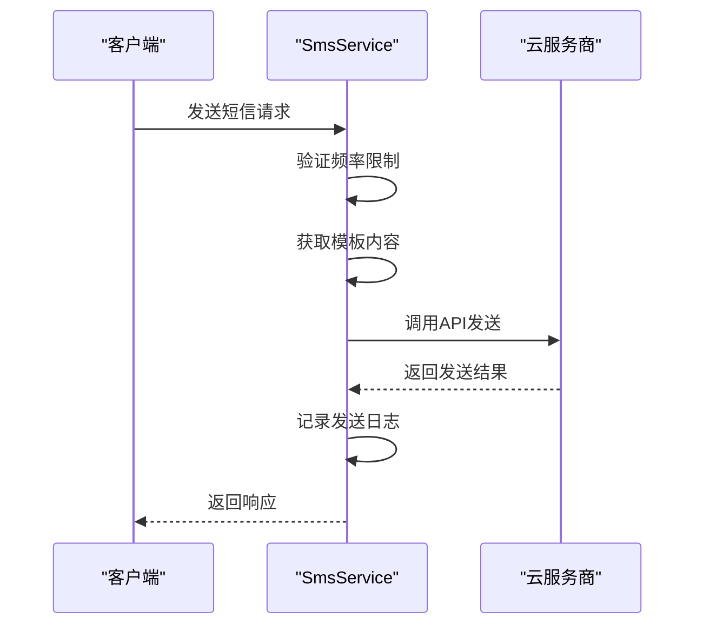
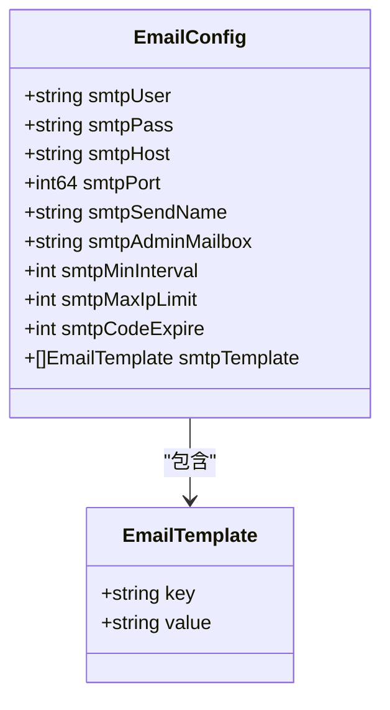

# 通用功能接口

<cite>
**本文档引用的文件**   
- [upload.go](file://server/internal/library/storager/upload.go)
- [config.go](file://server/internal/model/config.go)
- [sms.go](file://server/internal/library/sms/sms.go)
- [ems.go](file://server/internal/library/ems/ems.go)
- [upload_local.go](file://server/internal/library/storager/upload_local.go)
- [upload_oss.go](file://server/internal/library/storager/upload_oss.go)
- [upload_minio.go](file://server/internal/library/storager/upload_minio.go)
- [upload_cos.go](file://server/internal/library/storager/upload_cos.go)
- [upload_qiniu.go](file://server/internal/library/storager/upload_qiniu.go)
- [upload_ucloud.go](file://server/internal/library/storager/upload_ucloud.go)
- [sms_aliyun.go](file://server/internal/library/sms/sms_aliyun.go)
- [sms_tencent.go](file://server/internal/library/sms/sms_tencent.go)
- [EmailSetting.vue](file://web/src/views/system/config/EmailSetting.vue)
- [SmsSetting.vue](file://web/src/views/system/config/SmsSetting.vue)
</cite>

## 目录
1. [简介](#简介)
2. [文件上传接口](#文件上传接口)
3. [短信发送接口](#短信发送接口)
4. [邮件发送接口](#邮件发送接口)
5. [错误码与处理建议](#错误码与处理建议)

## 简介
本文档详细说明了通用公共服务接口的实现，涵盖文件上传、短信发送和邮件发送三大核心功能。文档基于`internal/library`中的服务实现，重点描述了`POST /admin/common/upload`、`POST /admin/common/sendSms`等接口的流程、配置和使用方法。

## 文件上传接口

### 接口说明
`POST /admin/common/upload`接口用于处理文件上传请求，支持多种文件类型和存储策略。

### 支持的文件类型与大小限制
- **图片类型**：支持通过`uploadImageType`配置的文件类型，大小限制由`uploadImageSize`（MB）控制
- **通用文件**：支持通过`uploadFileType`配置的文件类型，大小限制由`uploadFileSize`（MB）控制
- 验证逻辑在`server/internal/library/storager/upload.go`的`ValidateFileMeta`方法中实现

### 存储策略
系统支持多种存储驱动，通过`uploadDrive`配置项选择：
- **本地存储**：`LocalDrive`将文件保存在服务器本地，路径由`uploadLocalPath`指定
- **阿里云OSS**：`OssDrive`使用阿里云对象存储服务，配置包括`uploadOssEndpoint`、`uploadOssBucket`等
- **MinIO**：`MinioDrive`支持MinIO对象存储，配置包括`uploadMinioEndpoint`、`uploadMinioBucket`等
- **腾讯云COS**：`CosDrive`使用腾讯云对象存储，配置包括`uploadCosSecretId`、`uploadCosBucketURL`等
- **七牛云**：`QiNiuDrive`支持七牛云存储，配置包括`uploadQiNiuAccessKey`、`uploadQiNiuBucket`等
- **UCloud**：`UCloudDrive`使用UCloud对象存储，配置包括`uploadUCloudPublicKey`、`uploadUCloudBucketName`等

### 返回格式
上传成功后返回附件模型，包含文件ID、路径、大小、MD5等信息。具体结构在`sysin.AttachmentListModel`中定义。



**图示来源**
- [upload.go](file://server/internal/library/storager/upload.go#L100-L150)
- [config.go](file://server/internal/model/config.go#L50-L80)

**本节来源**
- [upload.go](file://server/internal/library/storager/upload.go)
- [config.go](file://server/internal/model/config.go)

## 短信发送接口

### 接口说明
`POST /admin/common/sendSms`接口用于发送短信，支持阿里云和腾讯云两大服务商。

### 发送机制
1. **模板ID与变量替换**：通过`SmsTemplate`结构体管理模板，支持`login`、`register`、`resetPwd`等事件类型
2. **频率限制**：通过`smsMinInterval`（最小发送间隔，秒）和`smsMaxIpLimit`（IP最大发送次数）控制发送频率
3. **状态回执**：发送状态记录在`sys_sms_log`表中，包含发送时间、状态、错误信息等

### 云服务商配置
#### 阿里云配置
- `smsAliYunAccessKeyID`：AccessKey ID
- `smsAliYunAccessKeySecret`：AccessKey Secret
- `smsAliYunSign`：短信签名
- `smsAliYunTemplate`：模板配置，JSON格式

#### 腾讯云配置
- `smsTencentSecretId`：SecretId
- `smsTencentSecretKey`：SecretKey
- `smsTencentAppId`：应用AppId
- `smsTencentSign`：短信签名
- `smsTencentTemplate`：模板配置，JSON格式



**图示来源**
- [sms.go](file://server/internal/library/sms/sms.go#L50-L100)
- [sms_aliyun.go](file://server/internal/library/sms/sms_aliyun.go)
- [sms_tencent.go](file://server/internal/library/sms/sms_tencent.go)

**本节来源**
- [sms.go](file://server/internal/library/sms/sms.go)
- [config.go](file://server/internal/model/config.go#L85-L130)

## 邮件发送接口

### 安全配置
邮件发送使用SMTP协议，安全配置包括：
- **SMTP凭证**：`smtpUser`（用户名）和`smtpPass`（密码）
- **服务器配置**：`smtpHost`（服务器地址）、`smtpPort`（端口）、`smtpAddr`（完整地址）
- **发送设置**：`smtpSendName`（发件人名称）、`smtpAdminMailbox`（管理员邮箱）

### 配置示例
```json
{
  "smtpHost": "smtpdm.aliyun.com",
  "smtpPort": 25,
  "smtpUser": "your_username",
  "smtpPass": "your_password",
  "smtpSendName": "HotGo",
  "smtpMinInterval": 60,
  "smtpMaxIpLimit": 10,
  "smtpCodeExpire": 600
}
```

### 模板管理
支持多种内置模板，通过`smtpTemplate`配置：
- `text`：通用文本
- `code`：验证码
- `login`：登录
- `register`：注册
- `resetPwd`：重置密码
- `bind`：绑定邮箱
- `cash`：申请提现



**图示来源**
- [ems.go](file://server/internal/library/ems/ems.go)
- [config.go](file://server/internal/model/config.go#L20-L45)
- [EmailSetting.vue](file://web/src/views/system/config/EmailSetting.vue)

**本节来源**
- [ems.go](file://server/internal/library/ems/ems.go)
- [config.go](file://server/internal/model/config.go)

## 错误码与处理建议

### 常见错误码
| 错误码 | 描述 | 处理建议 |
|--------|------|----------|
| BALANCE_INSUFFICIENT | 余额不足 | 检查云服务商账户余额，及时充值 |
| TEMPLATE_INVALID | 模板不合法 | 检查模板ID是否正确，确保模板已通过审核 |
| SEND_FREQUENT | 发送频繁 | 等待`smsMinInterval`秒后重试 |
| IP_LIMIT_EXCEEDED | IP发送次数超限 | 当天无法继续发送，次日重试 |
| CONFIG_MISSING | 配置缺失 | 检查相关配置项是否完整填写 |

### 处理建议
1. **余额不足**：定期监控云服务商账户余额，设置余额告警
2. **模板不合法**：确保模板内容符合云服务商审核要求，避免敏感词汇
3. **频率限制**：合理设置`smsMinInterval`和`smtpMinInterval`，避免影响用户体验
4. **配置问题**：通过管理界面验证配置有效性，如邮件发送测试功能

**本节来源**
- [sms.go](file://server/internal/library/sms/sms.go)
- [ems.go](file://server/internal/library/ems/ems.go)
- [SmsSetting.vue](file://web/src/views/system/config/SmsSetting.vue)
- [EmailSetting.vue](file://web/src/views/system/config/EmailSetting.vue)