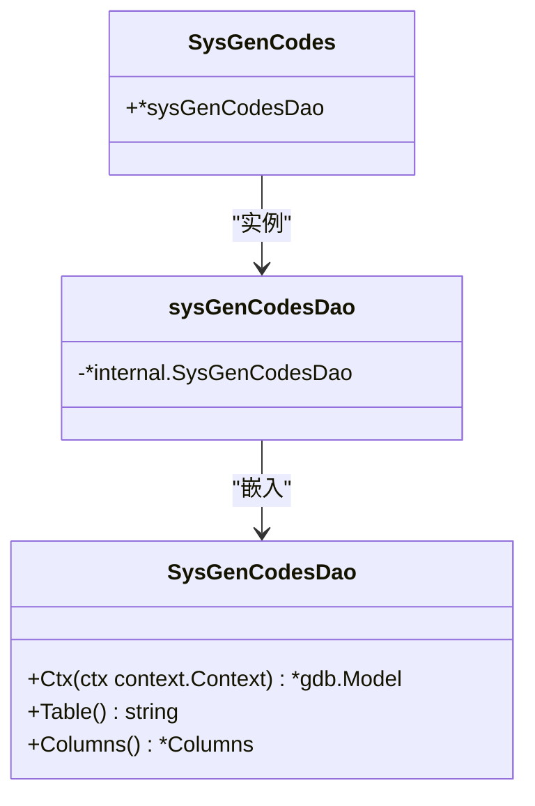
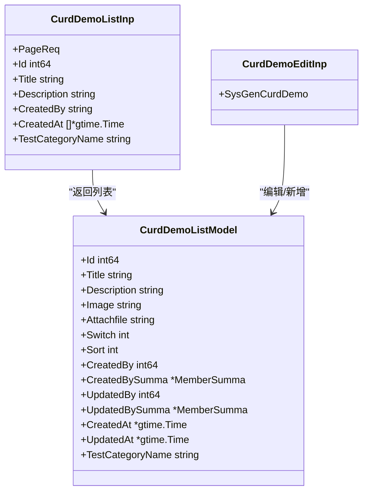
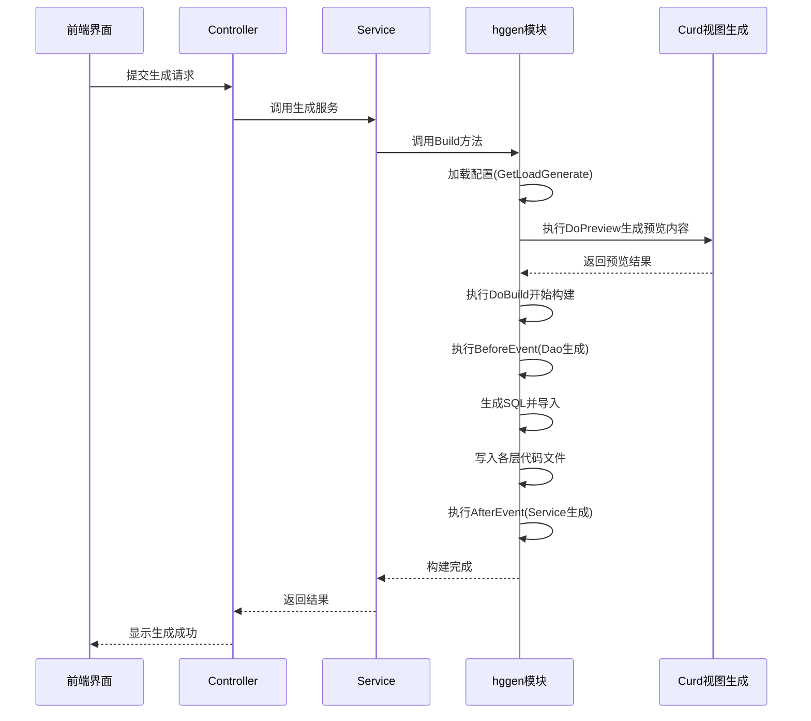
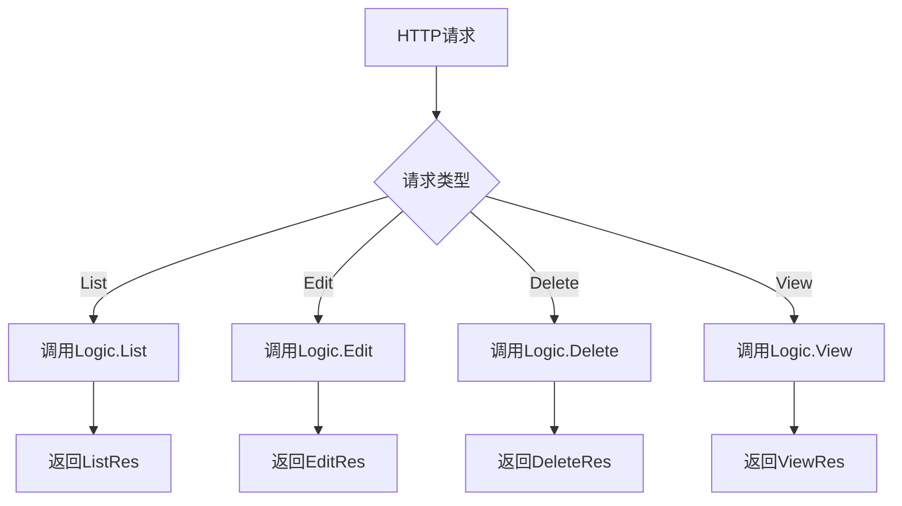
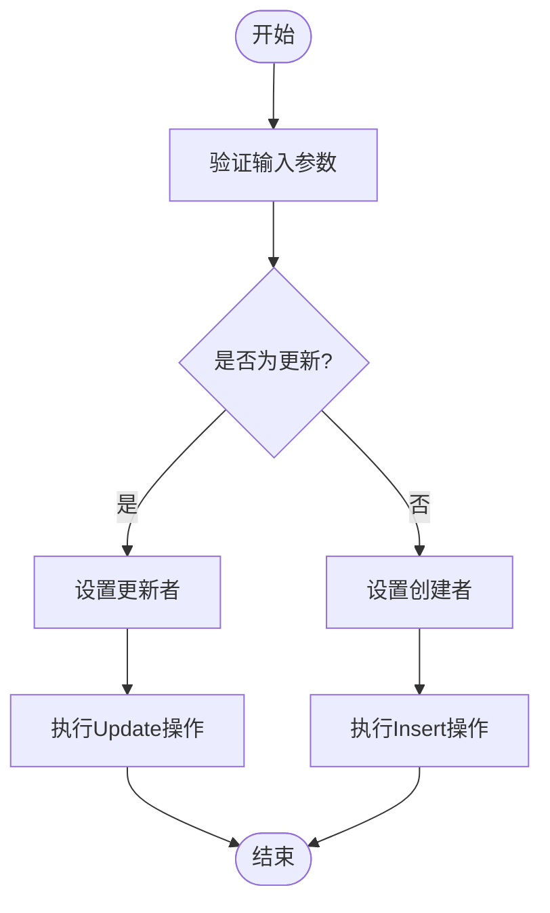
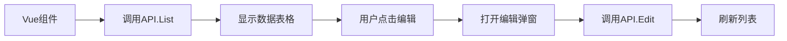

# CURD生成

<cite>
**本文档引用文件**  
- [hggen.go](file://server/internal/library/hggen/hggen.go)
- [sys_gen_codes.go](file://server/internal/dao/sys_gen_codes.go)
- [sys_gen_codes.go](file://server/internal/model/do/sys_gen_codes.go)
- [sys_gen_codes.go](file://server/internal/model/entity/sys_gen_codes.go)
- [curd_demo.go](file://server/internal/controller/admin/sys/curd_demo.go)
- [curd_demo.go](file://server/internal/logic/sys/curd_demo.go)
- [curd_demo.go](file://server/internal/model/input/sysin/curd_demo.go)
- [curd_demo.go](file://server/internal/router/genrouter/curd_demo.go)
</cite>

## 目录
1. [简介](#简介)
2. [CURD生成流程](#curd生成流程)
3. [核心组件分析](#核心组件分析)
4. [代码生成机制](#代码生成机制)
5. [生成代码结构示例](#生成代码结构示例)
6. [路由与菜单注册](#路由与菜单注册)
7. [二次开发与定制](#二次开发与定制)
8. [常见问题与解决方案](#常见问题与解决方案)
9. [总结](#总结)

## 简介
`hggen` 是 HotGo 框架中的代码生成器，支持通过管理后台的“开发”->“代码”页面选择数据库表并配置参数，自动生成完整的后端（Controller、Logic、DAO、Model）和前端（Vue 组件、API 调用）代码。该工具极大提升了开发效率，减少了重复性编码工作。

## CURD生成流程
开发者可通过以下步骤触发 CURD 代码生成：

1. 进入管理后台 → 开发 → 代码页面
2. 选择目标数据库表
3. 配置生成参数：
   - 模块名
   - 表前缀
   - 是否覆盖已有文件
4. 点击“生成”按钮触发代码生成流程

系统将解析表结构，并根据配置模板生成对应代码。

**Section sources**
- [hggen.go](file://server/internal/library/hggen/hggen.go#L253-L289)

## 核心组件分析

### 数据访问对象（DAO）
DAO 层由 `gf gen dao` 工具自动生成，封装了对数据库表的基本操作。以 `sys_gen_codes` 表为例，其 DAO 结构如下：



**Diagram sources**
- [sys_gen_codes.go](file://server/internal/dao/sys_gen_codes.go#L12-L18)

### 实体模型（Entity）
实体模型定义了数据库表字段与 Go 结构体的映射关系。

```mermaid
classDiagram
class SysGenCodes {
+Id int64
+GenType uint
+GenTemplate int
+VarName string
+Options *gjson.Json
+DbName string
+TableName string
+TableComment string
+DaoName string
+MasterColumns *gjson.Json
+AddonName string
+Status int
+CreatedAt *gtime.Time
+UpdatedAt *gtime.Time
}
SysGenCodes : "orm : \"table : hg_sys_gen_codes\""
```

**Diagram sources**
- [sys_gen_codes.go](file://server/internal/model/entity/sys_gen_codes.go#L12-L27)

### 输入模型（Input）
输入模型用于接收和校验前端请求参数，包含多种操作类型的数据结构。



**Diagram sources**
- [curd_demo.go](file://server/internal/model/input/sysin/curd_demo.go#L48-L134)

## 代码生成机制

### 生成预览与构建流程
`hggen` 提供了预览和构建两个核心功能，分别对应 `Preview` 和 `Build` 方法。



**Diagram sources**
- [hggen.go](file://server/internal/library/hggen/hggen.go#L230-L289)
- [curd.go](file://server/internal/library/hggen/views/curd.go#L412-L553)

### 生成器核心函数
`Build` 函数是代码生成的核心入口，负责协调 DAO、Service 等各层的生成流程。

```go
func Build(ctx context.Context, in *sysin.GenCodesBuildInp) (err error)
```

该函数根据生成类型调用 `views.Curd.DoBuild`，并在前后置事件中执行 DAO 和 Service 的生成。

**Section sources**
- [hggen.go](file://server/internal/library/hggen/hggen.go#L253-L289)

## 生成代码结构示例

### Controller 层
Controller 层负责接收 HTTP 请求并调用 Logic 层处理业务逻辑。



**Section sources**
- [curd_demo.go](file://server/internal/controller/admin/sys/curd_demo.go#L22-L78)

### Logic 层
Logic 层实现核心业务逻辑，包含数据校验、事务处理等。



**Section sources**
- [curd_demo.go](file://server/internal/logic/sys/curd_demo.go#L136-L159)

### View 层（前端）
前端 Vue 组件通过 API 调用与后端交互，实现 CURD 功能。



## 路由与菜单注册

### 路由注册机制
生成的 Controller 会自动注册到路由系统中，通过 `init` 函数实现。

```go
func init() {
	LoginRequiredRouter = append(LoginRequiredRouter, sys.CurdDemo) // CURD列表
}
```

此机制确保新生成的模块能立即被系统识别并提供服务。

**Section sources**
- [curd_demo.go](file://server/internal/router/genrouter/curd_demo.go#L10-L13)

### 菜单自动生成
系统在代码生成时会同步生成 SQL 脚本，用于创建对应的菜单项。这些 SQL 文件位于：

```
server/storage/data/generate/
```

包含如 `curd_demo_menu.sql` 等文件，确保生成后即可在管理后台看到新模块菜单。

## 二次开发与定制

### 自定义字段处理
可在生成后的 Logic 层中添加自定义逻辑：

```go
func (s *sSysCurdDemo) Edit(ctx context.Context, in *sysin.CurdDemoEditInp) (err error) {
	// 自定义前置逻辑
	if in.Title == "" {
		return gerror.New("标题不能为空")
	}
	
	// 调用原有逻辑
	return s.sSysCurdDemo.Edit(ctx, in)
}
```

### 扩展关联查询
可修改 `List` 方法以支持更多关联查询：

```go
mod = mod.LeftJoinOnFields(...)
```

## 常见问题与解决方案

### 字段类型映射错误
**问题**：数据库字段类型与 Go 类型不匹配  
**解决方案**：检查 `entity` 模型中的类型定义，必要时手动调整

### 外键关联处理
**问题**：关联表字段无法正确显示  
**解决方案**：确保在 Logic 层的 `List` 方法中正确使用 `LeftJoinOnFields`

### 生成路径错误
**问题**：代码未生成到预期目录  
**解决方案**：检查 `hggen` 配置中的 `SrcFolder` 和 `DstFolder` 设置

### 权限问题
**问题**：新模块无访问权限  
**解决方案**：检查角色权限配置，确保已分配相应菜单权限

## 总结
`hggen` 代码生成器通过自动化方式极大提升了开发效率。它不仅生成基础 CURD 代码，还自动完成路由注册和菜单创建。开发者可在生成代码基础上进行二次开发，满足复杂业务需求。合理使用该工具可显著缩短项目开发周期。