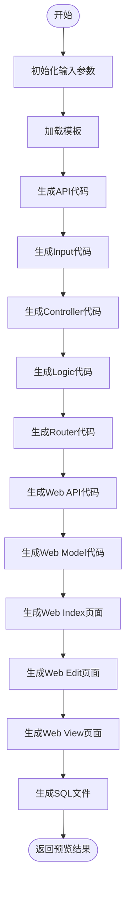

# 代码生成器使用

<cite>
**本文档引用文件**  
- [hggen.go](file://server/internal/library/hggen/hggen.go)
- [init.go](file://server/internal/library/hggen/init.go)
- [curd.go](file://server/internal/library/hggen/views/curd.go)
- [utils.go](file://server/internal/library/hggen/views/utils.go)
- [gencodes.go](file://server/api/admin/gencodes/gencodes.go)
- [gen_codes.go](file://server/internal/model/input/sysin/gen_codes.go)
- [gencodes.go](file://server/internal/consts/gencodes.go)
- [config.yaml](file://server/manifest/config/config.yaml)
</cite>

## 目录
1. [简介](#简介)
2. [核心功能](#核心功能)
3. [使用流程](#使用流程)
4. [生成类型与模板](#生成类型与模板)
5. [生成流程详解](#生成流程详解)
6. [配置说明](#配置说明)
7. [集成与部署](#集成与部署)
8. [最佳实践](#最佳实践)

## 简介

`hggen` 是 HotGo 框架提供的代码生成器工具，旨在通过数据库表结构自动生成完整的 CURD（增删改查）代码体系。该工具支持生成后端 Controller、Logic、DAO 层代码，以及前端 Vue 组件、API 调用和路由配置，极大提升开发效率。用户可通过管理后台的“开发”->“代码”页面选择数据表、配置生成选项（如模块名、前缀）并执行生成操作。生成的代码可无缝集成到现有项目中，支持多种模板类型，包括普通列表、树形表格等，适用于不同业务场景。

## 核心功能

`hggen` 工具的核心功能是根据数据库表结构自动生成全栈代码，涵盖后端与前端多个层次。后端生成包括 Controller（处理 HTTP 请求）、Logic（业务逻辑）、DAO（数据访问对象）以及 API 接口定义；前端生成包括 Vue 组件（index.vue、edit.vue、view.vue）、TypeScript 模型定义（model.ts）和 API 调用文件（index.ts）。此外，工具还支持生成数据库初始化 SQL 脚本和路由配置文件，实现从数据库到前端界面的端到端自动化。生成过程通过预览和提交两步完成，确保生成内容的准确性与可控性。

**Section sources**
- [hggen.go](file://server/internal/library/hggen/hggen.go#L36-L69)
- [curd.go](file://server/internal/library/hggen/views/curd.go#L495-L553)
- [gencodes.go](file://server/api/admin/gencodes/gencodes.go#L0-L118)

## 使用流程

### 1. 进入代码生成页面
登录管理后台，导航至“开发”菜单下的“代码”页面。此页面提供了代码生成的入口界面。

### 2. 选择生成类型
在生成类型下拉框中选择所需类型，如“增删改查列表”或“关系树列表”。系统会根据选择加载对应的模板配置。

### 3. 配置数据库与表
选择目标数据库（如 `default`），然后从下拉列表中选择要生成代码的数据表。系统会自动读取表结构信息，包括字段、注释、索引等。

### 4. 设置生成选项
- **实体命名**：输入生成代码的实体名称（如 `curdDemo`）。
- **模块名**：若生成插件代码，需指定插件名称。
- **前缀配置**：设置 API 前缀、组件前缀等。
- **功能开关**：选择是否生成添加、编辑、删除、查看、状态切换等功能。
- **菜单配置**：设置生成菜单的图标、父级 ID 和排序。

### 5. 预览与生成
点击“预览”按钮，系统将根据配置生成代码预览。确认无误后，点击“提交生成”按钮，系统将执行代码生成并自动写入项目文件。

**Section sources**
- [gencodes.go](file://server/api/admin/gencodes/gencodes.go#L0-L118)
- [gen_codes.go](file://server/internal/model/input/sysin/gen_codes.go#L178-L180)
- [gen_codes.go](file://server/internal/model/input/sysin/gen_codes.go#L200-L202)

## 生成类型与模板

`hggen` 支持多种生成类型，主要分为以下几类：

| 生成类型 | 常量值 | 描述 |
|---------|--------|------|
| 增删改查列表 | `GenCodesTypeCurd` | 生成标准的列表增删改查功能 |
| 关系树列表 | `GenCodesTypeTree` | 生成树形结构的列表，支持父子关系 |
| 队列消费者 | `GenCodesTypeQueue` | 开发中，用于生成消息队列消费者代码 |
| 定时任务 | `GenCodesTypeCron` | 开发中，用于生成定时任务代码 |

模板配置定义了生成代码的路径、文件结构和命名规则。主模板分为“主包模板”和“插件包模板”，分别用于生成核心模块和插件模块代码。模板路径、API 路径、控制器路径、逻辑层路径、输入模型路径、路由路径、SQL 路径、Web API 路径和 Web 视图路径均可自定义，支持通过 `{$name}` 占位符动态替换插件名称。

**Section sources**
- [gencodes.go](file://server/internal/consts/gencodes.go#L14-L15)
- [config.yaml](file://server/manifest/config/config.yaml#L260-L266)

## 生成流程详解

### 预览流程
调用 `Preview` 函数，传入生成参数（`GenCodesPreviewInp`），系统执行以下步骤：
1. 初始化输入参数，解析生成选项。
2. 加载模板文件，绑定上下文变量（如实体名、表注释、字段列表等）。
3. 依次生成各层代码内容，包括 API、Input、Controller、Logic、Router、Web API、Web Model、Web Index、Web Edit、Web View 和 SQL 文件。
4. 返回包含所有生成文件内容的预览模型。

**Diagram sources**
- [curd.go](file://server/internal/library/hggen/views/curd.go#L495-L553)
- [curd.go](file://server/internal/library/hggen/views/curd.go#L412-L493)

### 提交流程
调用 `Build` 函数，传入生成参数（`GenCodesBuildInp`），系统执行以下步骤：
1. 执行预览流程获取所有生成文件。
2. 连接目标数据库，验证连接有效性。
3. 优先处理 SQL 文件，将其导入数据库。
4. 将其他代码文件写入指定路径。
5. 执行后置事件，如生成服务接口（`Service`）。
6. 记录生成日志，完成流程。

**Section sources**
- [hggen.go](file://server/internal/library/hggen/hggen.go#L253-L289)
- [curd.go](file://server/internal/library/hggen/views/curd.go#L412-L493)

## 配置说明

### 全局配置
`hggen` 的配置主要位于 `server/manifest/config/config.yaml` 文件中，关键配置项如下：

- `hggen.allowedIPs`：代码生成功能的 IP 白名单，`*` 表示允许所有 IP。
- `hggen.selectDbs`：可选生成表的数据库配置名称，支持多库。
- `hggen.disableTables`：禁用的表，不会出现在选择列表中。
- `hggen.application.crud.templates`：CURD 模板配置，定义了主包和插件包的生成路径。

### 模板路径配置
| 配置项 | 默认值 | 说明 |
|-------|-------|------|
| `templatePath` | `./resource/generate/default/curd` | 模板文件存放路径 |
| `apiPath` | `./api/admin` | 后端 API 生成路径 |
| `controllerPath` | `./internal/controller/admin/sys` | 控制器生成路径 |
| `logicPath` | `./internal/logic/sys` | 业务逻辑生成路径 |
| `inputPath` | `./internal/model/input/sysin` | 输入模型生成路径 |
| `routerPath` | `./internal/router/genrouter` | 路由文件生成路径 |
| `webApiPath` | `../web/src/api` | 前端 API 生成路径 |
| `webViewsPath` | `../web/src/views` | 前端视图生成路径 |

**Section sources**
- [config.yaml](file://server/manifest/config/config.yaml#L260-L266)
- [init.go](file://server/internal/library/hggen/init.go#L61-L79)

## 集成与部署

生成的代码可直接集成到现有项目中，无需额外配置。后端代码遵循 GoFrame 框架的 MVC 架构，前端代码基于 Vue3 + TypeScript + Vite 构建，符合现代前端工程化标准。生成的路由文件会自动注册到系统路由表中，前端组件通过动态导入方式加载。SQL 文件包含菜单插入语句，生成时会自动导入数据库，确保菜单权限同步。建议在开发环境中使用代码生成器，生产环境关闭“开发工具”菜单以保障安全。

## 最佳实践

1. **命名规范**：实体命名应使用小写字母和下划线，避免以数字开头或以 `test` 结尾。
2. **模板定制**：可根据团队规范自定义模板，修改 `resource/generate/default/curd` 目录下的模板文件。
3. **增量生成**：支持“已存在跳过”、“强制覆盖”和“创建文件”三种生成方式，推荐使用“已存在跳过”避免覆盖自定义代码。
4. **树表生成**：生成树形表格时，需确保表中包含 `pid`、`level`、`path` 等必要字段。
5. **插件开发**：利用插件模板可快速创建独立功能模块，实现代码解耦。