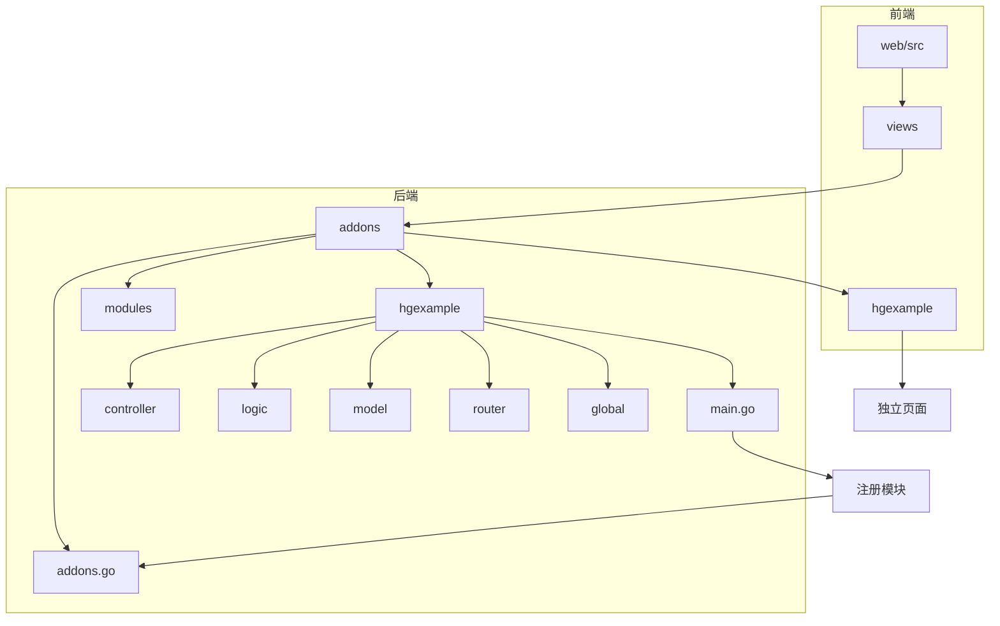
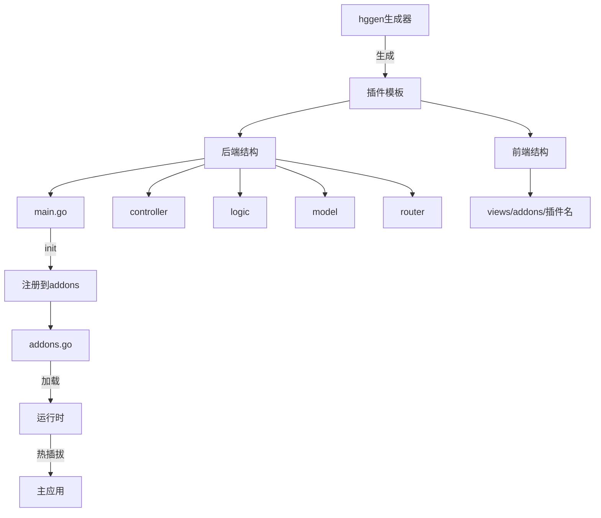
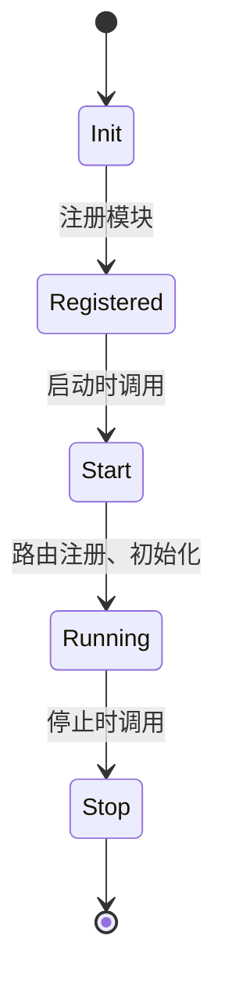
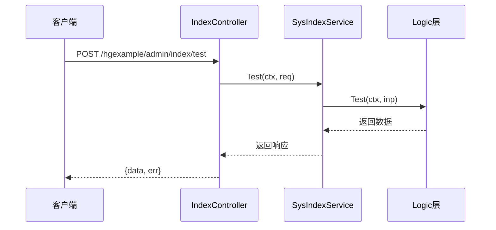
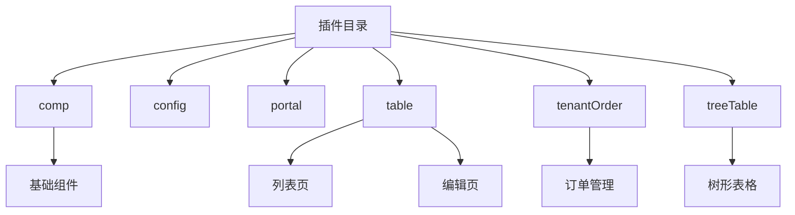
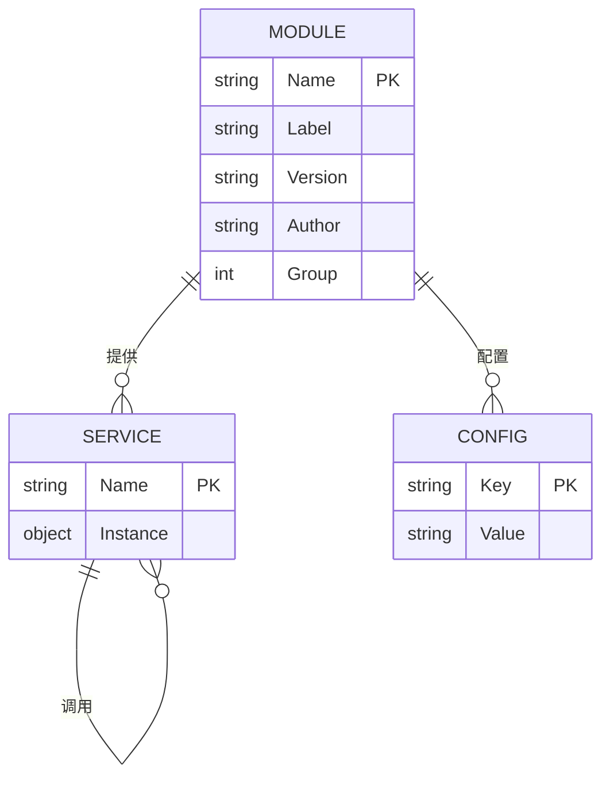

# 插件模板生成

<cite>
**本文档引用文件**  
- [main.go](file://server/addons/hgexample/main.go)
- [hgexample.go](file://server/addons/modules/hgexample.go)
- [addons.go](file://server/addons/addons.go)
- [hggen.go](file://server/internal/library/hggen/hggen.go)
- [index.go](file://server/addons/hgexample/controller/admin/sys/index.go)
- [web/src/views/addons/hgexample](file://web/src/views/addons/hgexample)
</cite>

## 目录
1. [简介](#简介)
2. [项目结构](#项目结构)
3. [核心组件](#核心组件)
4. [架构概述](#架构概述)
5. [详细组件分析](#详细组件分析)
6. [依赖分析](#依赖分析)
7. [性能考虑](#性能考虑)
8. [故障排除指南](#故障排除指南)
9. [结论](#结论)

## 简介
本文档详细介绍了`hggen`代码生成器的插件模板生成功能。通过该功能，开发者可以快速创建全新的插件模块，涵盖后端`addons`目录结构、`main.go`入口、API路由、数据库迁移脚本，以及前端独立页面和菜单项。文档以`hgexample`示例插件为基础，分析其`controller`、`logic`、`model`及前端`views/addons/hgexample`的结构，并指导开发者如何在生成的模板上开发自定义业务逻辑，通过`addons.go`注册插件，实现与主应用的热插拔和独立部署。同时说明插件间通信与数据共享机制。

## 项目结构
`hggen`插件系统采用模块化设计，插件统一存放在`server/addons`目录下，每个插件拥有独立的后端逻辑与前端视图。主应用通过注册机制动态加载插件，实现热插拔能力。

**Diagram sources**
- [main.go](file://server/addons/hgexample/main.go#L1-L98)
- [addons.go](file://server/addons/addons.go#L1-L7)
- [web/src/views/addons/hgexample](file://web/src/views/addons/hgexample)

**Section sources**
- [main.go](file://server/addons/hgexample/main.go#L1-L98)
- [addons.go](file://server/addons/addons.go#L1-L7)
- [web/src/views/addons/hgexample](file://web/src/views/addons/hgexample)

## 核心组件
`hggen`插件模板的核心组件包括插件主入口`main.go`、模块注册文件`modules/hgexample.go`、插件注册中心`addons.go`，以及生成器核心`hggen.go`。这些组件共同实现插件的创建、注册与加载。

**Section sources**
- [main.go](file://server/addons/hgexample/main.go#L1-L98)
- [hgexample.go](file://server/addons/modules/hgexample.go#L1-L9)
- [addons.go](file://server/addons/addons.go#L1-L7)
- [hggen.go](file://server/internal/library/hggen/hggen.go#L1-L291)

## 架构概述
插件架构采用前后端分离、模块化注册的设计。后端插件通过实现`addons.Module`接口，提供`Start`、`Stop`、`Install`等生命周期方法。前端插件通过独立的Vue组件路径实现页面隔离。`hggen`生成器根据配置生成完整插件结构，并通过`Build`流程自动注册。

**Diagram sources**
- [hggen.go](file://server/internal/library/hggen/hggen.go#L1-L291)
- [main.go](file://server/addons/hgexample/main.go#L1-L98)
- [addons.go](file://server/addons/addons.go#L1-L7)

## 详细组件分析

### 插件主模块分析
`hgexample/main.go`是插件的核心入口，定义了插件的元信息（名称、版本、作者等）和生命周期方法。通过`init()`函数调用`newModule()`将插件注册到全局模块列表中。

#### 生命周期方法

**Diagram sources**
- [main.go](file://server/addons/hgexample/main.go#L1-L98)

### 控制器与API分析
插件的API通过`controller`层暴露，遵循`controller -> logic -> model`的调用链。以`hgexample`的`Test`接口为例，`controller`接收请求，调用`service`层处理业务逻辑。

#### API调用流程

**Diagram sources**
- [index.go](file://server/addons/hgexample/controller/admin/sys/index.go#L1-L31)

### 前端页面结构分析
前端插件页面位于`web/src/views/addons/<插件名>`，每个功能模块对应独立的Vue组件。路由由后端动态生成并注入前端，实现菜单自动注册。

**Diagram sources**
- [web/src/views/addons/hgexample](file://web/src/views/addons/hgexample)

**Section sources**
- [web/src/views/addons/hgexample](file://web/src/views/addons/hgexample)

## 依赖分析
插件系统依赖`internal/library/addons`包提供的模块注册与管理功能，以及`hggen`生成器的代码生成能力。插件间通过全局服务或事件总线进行通信。

**Diagram sources**
- [hggen.go](file://server/internal/library/hggen/hggen.go#L1-L291)
- [main.go](file://server/addons/hgexample/main.go#L1-L98)

**Section sources**
- [hggen.go](file://server/internal/library/hggen/hggen.go#L1-L291)
- [main.go](file://server/addons/hgexample/main.go#L1-L98)

## 性能考虑
- 插件在`init()`阶段注册，不影响运行时性能
- 路由在启动时集中注册，避免运行时查找开销
- 前端页面按需加载，减少初始包体积
- 数据库操作通过`gdao`生成，优化查询性能

## 故障排除指南
- **插件未加载**：检查`modules`包是否导入插件，确认`init()`执行
- **路由404**：检查`router`是否正确注册，确认中间件配置
- **前端页面空白**：检查Vue路由是否生成，确认组件路径正确
- **热更新失败**：确保`gf`热编译未干扰生成流程

**Section sources**
- [main.go](file://server/addons/hgexample/main.go#L1-L98)
- [addons.go](file://server/addons/addons.go#L1-L7)

## 结论
`hggen`插件模板生成功能为HotGo框架提供了强大的扩展能力。通过标准化的目录结构、清晰的调用链路和自动化注册机制，开发者可以高效地创建功能完整、可独立部署的插件模块。结合前后端分离设计，实现了真正的热插拔与模块化开发，极大提升了系统的可维护性与扩展性。