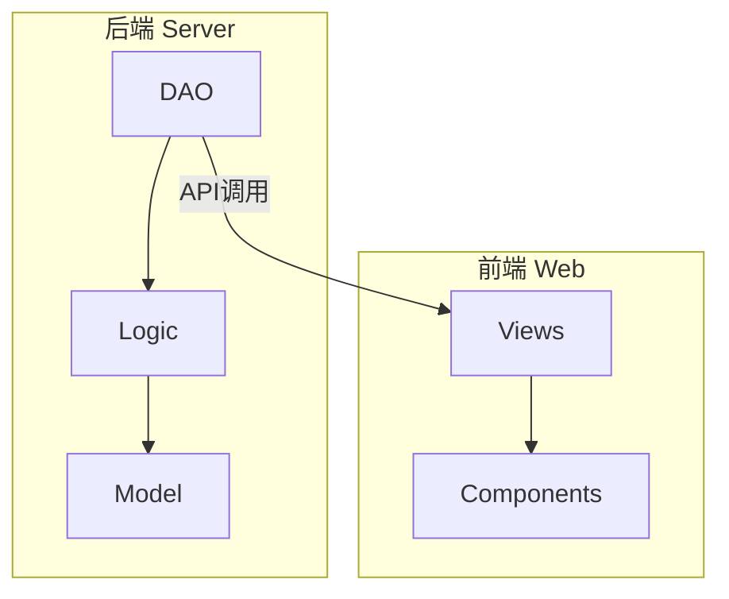
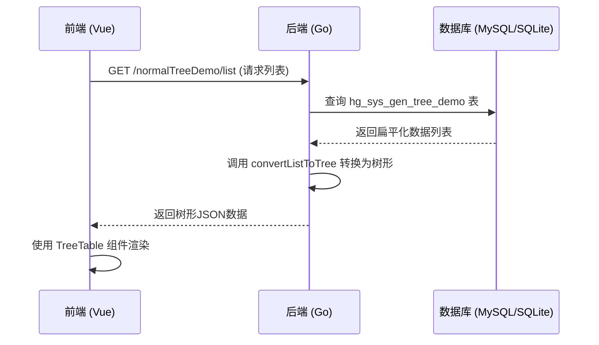
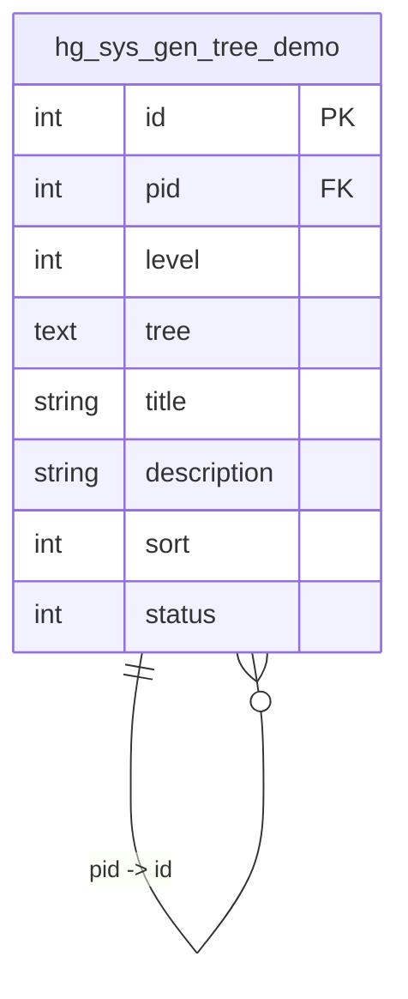
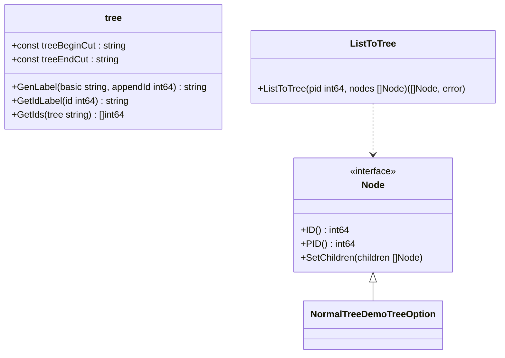
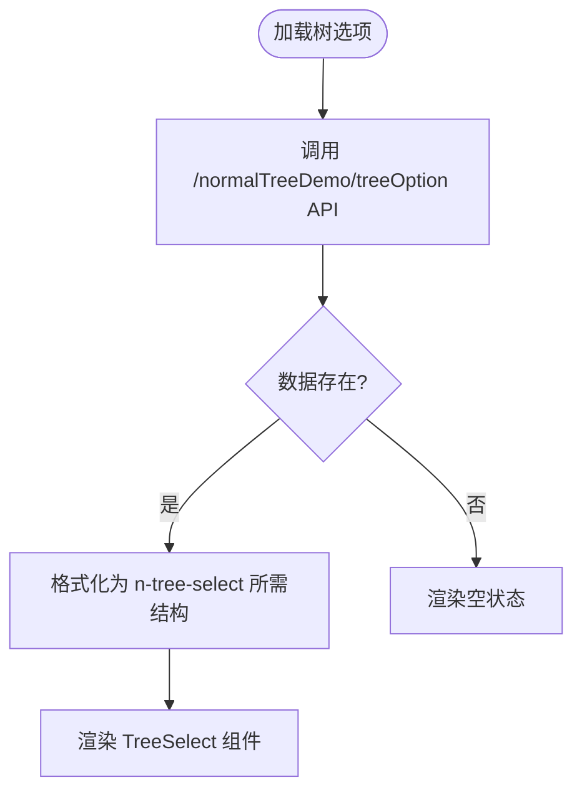
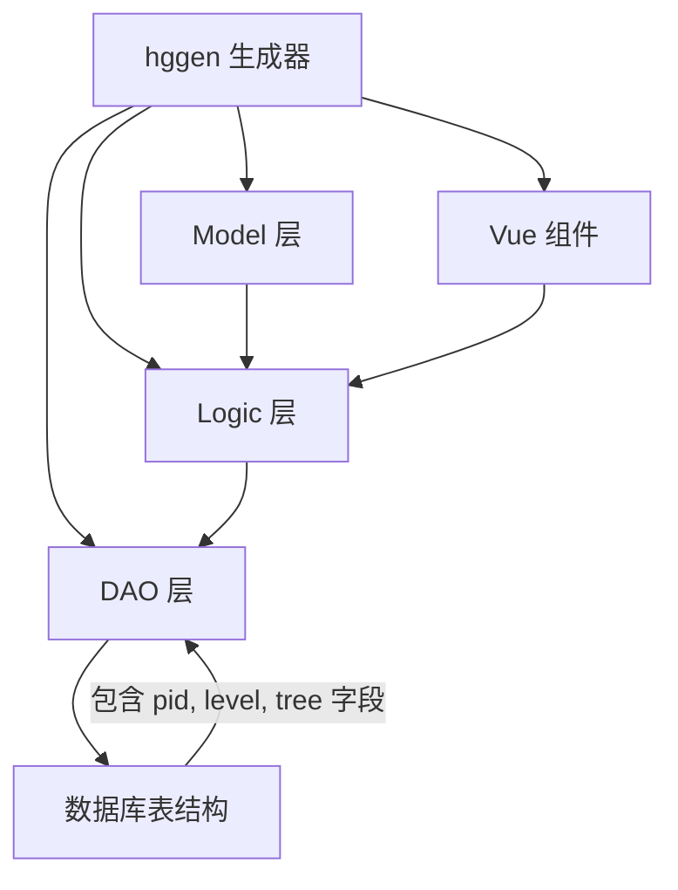

# 树表生成

<cite>
**本文档引用文件**  
- [sys_gen_tree_demo.go](file://server/internal/dao/internal/sys_gen_tree_demo.go)
- [normal_tree_demo.go](file://server/internal/model/input/sysin/normal_tree_demo.go)
- [tree.go](file://server/utility/tree/tree.go)
- [tree_list.go](file://server/utility/tree/tree_list.go)
- [dao_tree.go](file://server/internal/library/hgorm/dao_tree.go)
- [normalTreeDemo/index.vue](file://web/src/views/normalTreeDemo/index.vue)
- [normalTreeDemo/edit.vue](file://web/src/views/normalTreeDemo/edit.vue)
- [optionTreeDemo/index.vue](file://web/src/views/optionTreeDemo/index.vue)
</cite>

## 目录
1. [简介](#简介)
2. [项目结构](#项目结构)
3. [核心组件](#核心组件)
4. [架构概述](#架构概述)
5. [详细组件分析](#详细组件分析)
6. [依赖分析](#依赖分析)
7. [性能考虑](#性能考虑)
8. [故障排除指南](#故障排除指南)
9. [结论](#结论)

## 简介
`hggen`代码生成器支持树形数据结构的生成，适用于部门、分类等具有层级关系的数据模型。通过识别包含`parent_id`（在本系统中为`pid`）字段的数据库表，生成器可自动生成支持树形展示、节点展开/折叠、拖拽排序的前端Vue组件（如`TreeTable`），以及支持树形查询、路径计算和循环检测的后端Logic和DAO代码。本文档详细说明该功能的实现机制、使用方法及与普通CURD生成的差异。

## 项目结构
项目分为`server`（后端）和`web`（前端）两个主要部分。后端使用Go语言开发，基于GoFrame框架，前端使用Vue3 + Naive UI构建。树形功能涉及后端DAO、Logic、Model层及前端views和components。

**Diagram sources**
- [sys_gen_tree_demo.go](file://server/internal/dao/internal/sys_gen_tree_demo.go#L39-L85)
- [normalTreeDemo/index.vue](file://web/src/views/normalTreeDemo/index.vue#L0-L25)

**Section sources**
- [sys_gen_tree_demo.go](file://server/internal/dao/internal/sys_gen_tree_demo.go#L39-L85)
- [normalTreeDemo/index.vue](file://web/src/views/normalTreeDemo/index.vue#L0-L25)

## 核心组件
核心组件包括后端的树形数据处理工具（`utility/tree`）、DAO层的树形操作方法、Logic层的业务逻辑，以及前端的`TreeTable`组件和树形选择器（`n-tree-select`）。

**Section sources**
- [tree.go](file://server/utility/tree/tree.go#L0-L52)
- [tree_list.go](file://server/utility/tree/tree_list.go#L0-L34)
- [dao_tree.go](file://server/internal/library/hgorm/dao_tree.go#L0-L60)
- [normalTreeDemo/index.vue](file://web/src/views/normalTreeDemo/index.vue#L69-L121)

## 架构概述
系统采用分层架构，前端通过API请求与后端交互。后端DAO层负责与数据库交互，Logic层处理业务逻辑，Model层定义数据结构。前端使用`BasicTable`组件结合`convertListToTree`工具方法将扁平数据转换为树形结构进行展示。

**Diagram sources**
- [normalTreeDemo/index.vue](file://web/src/views/normalTreeDemo/index.vue#L69-L121)
- [sys_gen_tree_demo.go](file://server/internal/dao/internal/sys_gen_tree_demo.go#L39-L85)

## 详细组件分析

### 树形数据结构特点
树形数据结构通过`pid`（父ID）字段建立层级关系，`level`字段表示节点深度，`tree`字段存储从根节点到当前节点的完整路径标识（如`tr_1 tr_14 `），用于快速查询所有下级节点和防止循环引用。

#### 树形数据结构定义

**Diagram sources**
- [sys_gen_tree_demo.go](file://server/internal/dao/internal/sys_gen_tree_demo.go#L39-L85)
- [sqlite/tables.sql](file://server/storage/data/sqlite/tables.sql#L469-L490)

### 树形表识别
生成器通过检查数据库表是否包含`pid`、`level`、`tree`三个关键字段来识别树形结构。`CheckTreeTable`函数在`dao_tree.go`中实现此逻辑。

**Section sources**
- [dao_tree.go](file://server/internal/library/hgorm/dao_tree.go#L56-L113)

### 后端树形逻辑
后端通过`utility/tree`包提供树形操作的核心功能，包括路径生成、ID提取和列表转树。

#### 树形工具类

**Diagram sources**
- [tree.go](file://server/utility/tree/tree.go#L0-L52)
- [tree_list.go](file://server/utility/tree/tree_list.go#L0-L34)
- [normal_tree_demo.go](file://server/internal/model/input/sysin/normal_tree_demo.go#L112-L144)

### 前端树形组件
前端使用`n-tree-select`组件实现树形选择，`BasicTable`结合`convertListToTree`方法实现树形表格展示，支持节点展开/折叠。

#### 前端树形选择组件

**Diagram sources**
- [normalTreeDemo/edit.vue](file://web/src/views/normalTreeDemo/edit.vue#L0-L41)
- [normal_tree_demo.go](file://server/internal/model/input/sysin/normal_tree_demo.go#L112-L144)

## 依赖分析
树形生成功能依赖于多个模块的协同工作。

**Diagram sources**
- [sys_gen_tree_demo.go](file://server/internal/dao/internal/sys_gen_tree_demo.go#L39-L85)
- [normal_tree_demo.go](file://server/internal/model/input/sysin/normal_tree_demo.go#L112-L144)
- [normalTreeDemo/index.vue](file://web/src/views/normalTreeDemo/index.vue#L69-L121)

**Section sources**
- [dao_tree.go](file://server/internal/library/hgorm/dao_tree.go#L0-L60)
- [tree.go](file://server/utility/tree/tree.go#L0-L52)

## 性能考虑
- **数据库查询**：使用`tree`字段可以高效查询某个节点的所有下级，避免递归查询。
- **前端渲染**：前端将扁平数据在内存中转换为树形结构，减少后端计算压力，但需注意数据量过大时的性能影响。
- **循环检测**：在更新节点`pid`时，通过解析`tree`字段检查是否形成循环引用，保证数据完整性。

## 故障排除指南
- **树形数据未正确显示**：检查后端返回的数据是否已正确转换为树形结构，确认`convertListToTree`方法的调用。
- **无法选择上级节点**：确认`/treeOption`接口返回的数据结构是否符合`n-tree-select`的`options`要求。
- **更新上级导致循环**：检查`AutoUpdateTree`函数中的循环检测逻辑是否生效，确保`tree`字段正确更新。

**Section sources**
- [dao_tree.go](file://server/internal/library/hgorm/dao_tree.go#L56-L113)
- [normalTreeDemo/index.vue](file://web/src/views/normalTreeDemo/index.vue#L69-L121)

## 结论
`hggen`的树表生成功能通过标准化的数据库字段（`pid`, `level`, `tree`）和配套的工具函数，实现了从数据库到前端的全链路树形数据支持。相比普通CURD生成，它增加了层级关系的维护、路径计算和循环检测等复杂逻辑，为管理具有层级结构的数据提供了完整的解决方案。