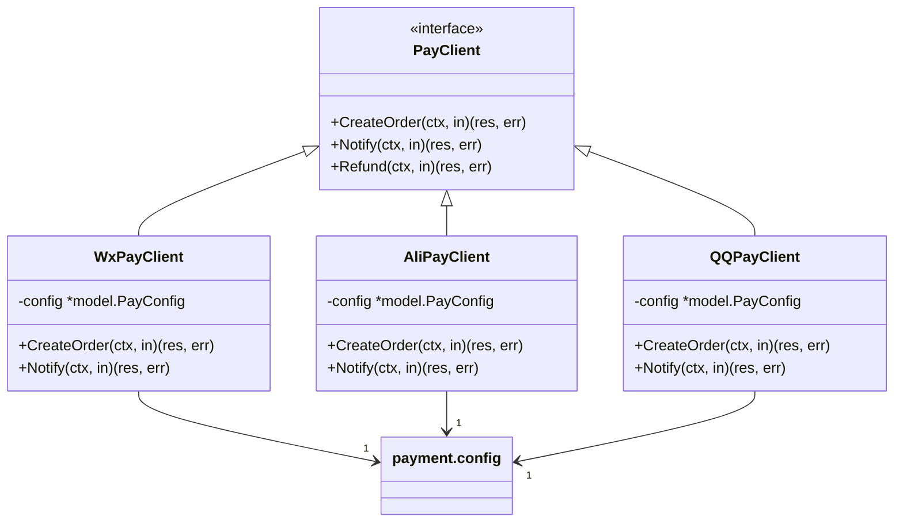
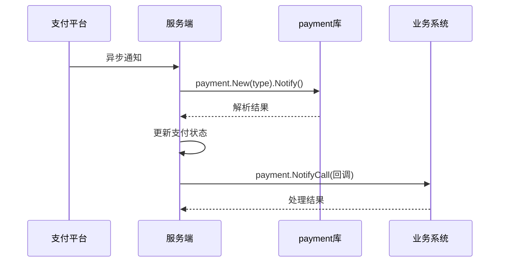
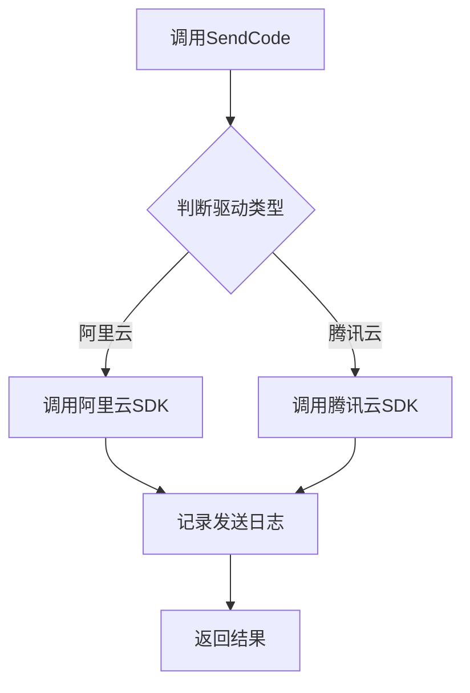

# 外部集成

<cite>
**本文档中引用的文件**  
- [pay.go](file://server/internal/library/payment/payment.go)
- [config.go](file://server/internal/library/payment/config.go)
- [notifycall.go](file://server/internal/library/payment/notifycall.go)
- [create.go](file://server/internal/logic/pay/create.go)
- [notify.go](file://server/internal/logic/pay/notify.go)
- [sms.go](file://server/internal/library/sms/sms.go)
- [config.go](file://server/internal/library/sms/config.go)
- [storager.go](file://server/internal/library/storager/upload.go)
- [config.go](file://server/internal/library/storager/config.go)
- [pay.go](file://server/internal/consts/pay.go)
</cite>

## 目录
1. [支付系统集成](#支付系统集成)
2. [短信服务集成](#短信服务集成)
3. [文件存储集成](#文件存储集成)

## 支付系统集成

本系统通过 `payment` 库统一封装微信支付、支付宝、QQ支付的SDK，提供统一的支付接口。开发者无需直接操作第三方SDK，只需调用封装后的接口即可完成支付功能。

### 支付配置与商户密钥

支付配置通过 `model.PayConfig` 结构体进行管理，配置项包括：

- **微信支付**：`WxPayAppId`、`WxPayMchId`、`WxPayKey`、`WxPayCertPath`、`WxPayKeyPath`
- **支付宝**：`AliPayAppId`、`AliPayPrivateKey`、`AliPayPublicKey`、`AliPayNotifyUrl`
- **QQ支付**：`QQPayAppId`、`QQPayMchId`、`QQPayKey`

配置通过 `payment.SetConfig()` 方法注入，全局使用 `payment.GetConfig()` 获取。所有密钥信息应通过安全方式（如环境变量或配置中心）注入，避免硬编码。

**Section sources**
- [config.go](file://server/internal/library/payment/config.go#L1-L19)
- [pay.go](file://server/internal/consts/pay.go#L1-L97)

### payment库封装机制

`payment` 库采用工厂模式，根据支付类型动态创建对应的支付客户端。核心接口 `PayClient` 定义了统一的支付方法：

```go
type PayClient interface {
    CreateOrder(ctx context.Context, in payin.CreateOrderInp) (res *payin.CreateOrderModel, err error)
    Notify(ctx context.Context, in payin.NotifyInp) (res *payin.NotifyModel, err error)
    Refund(ctx context.Context, in payin.RefundInp) (res *payin.RefundModel, err error)
}
```

通过 `payment.New(payType)` 方法获取对应支付方式的客户端实例，支持 `wxpay`、`alipay`、`qqpay` 三种类型。



**Diagram sources**
- [payment.go](file://server/internal/library/payment/payment.go#L1-L126)
- [config.go](file://server/internal/library/payment/config.go#L1-L19)

### 支付下单流程

支付下单由 `logic/pay.create.go` 中的 `Create` 方法实现。流程如下：

1. 自动识别交易类型（通过 `payment.AutoTradeType` 根据UserAgent判断）
2. 生成业务订单号和商户订单号
3. 创建本地支付日志记录
4. 调用第三方SDK创建支付订单
5. 返回支付参数给前端

关键代码路径：`sPay.Create` → `payment.New(payType).CreateOrder`

**Section sources**
- [create.go](file://server/internal/logic/pay/create.go#L1-L148)

### 异步通知处理

异步通知处理文件位于 `pay_v1_notify_*.go`，系统通过以下机制处理：

1. 接收第三方支付平台的异步通知
2. 调用对应支付客户端的 `Notify` 方法验证并解析通知数据
3. 更新本地支付状态
4. 执行业务回调

通过 `payment.RegisterNotifyCallMap` 注册业务回调函数，实现支付成功后的业务逻辑解耦。



**Diagram sources**
- [notify.go](file://server/internal/logic/pay/notify.go#L1-L99)
- [notifycall.go](file://server/internal/library/payment/notifycall.go#L1-L56)

## 短信服务集成

短信服务通过 `sms` 库封装阿里云、腾讯云短信服务，提供统一的发送接口。

### 配置阿里云、腾讯云短信

配置通过 `model.SmsConfig` 结构体管理，关键字段：

- **阿里云**：`AliYunAccessKeyId`、`AliYunAccessKeySecret`、`AliYunSignName`、`AliYunRegionId`
- **腾讯云**：`TencentSecretId`、`TencentSecretKey`、`TencentSdkAppId`、`TencentSignName`

配置通过 `sms.SetConfig()` 注入，使用 `sms.New()` 工厂方法创建对应驱动实例。

### 发送验证码流程

1. 调用 `sms.New("aliyun")` 或 `sms.New("tencent")` 获取驱动
2. 调用 `SendCode(ctx, in)` 方法发送验证码
3. 验证码发送记录写入 `sys_sms_log` 表



**Section sources**
- [sms.go](file://server/internal/library/sms/sms.go#L1-L40)
- [config.go](file://server/internal/library/sms/config.go#L1-L29)

## 文件存储集成

文件存储通过 `storager` 库支持本地、OSS、COS、MinIO等多种存储方式。

### 配置云存储

配置通过 `model.UploadConfig` 管理，支持：

- **OSS**：`OssEndpoint`、`OssAccessKeyId`、`OssAccessKeySecret`、`OssBucket`
- **COS**：`CosSecretId`、`CosSecretKey`、`CosRegion`、`CosBucket`
- **MinIO**：`MinioEndpoint`、`MinioAccessKey`、`MinioSecretKey`、`MinioBucket`

通过 `storager.SetConfig()` 注入配置，`storager.New()` 创建对应驱动。

### 文件上传API调用

上传流程：

1. 调用 `storager.DoUpload()` 入口方法
2. 验证文件类型和大小
3. 计算文件MD5，检查是否已存在
4. 调用对应驱动的 `Upload` 方法
5. 写入附件记录到 `sys_attachment` 表

```mermaid
flowchart TD
A[DoUpload] --> B[验证文件]
B --> C[检查MD5]
C --> D{已存在?}
D --> |是| E[返回已有记录]
D --> |否| F[New(drive).Upload]
F --> G[写入附件记录]
G --> H[返回结果]
```

**Section sources**
- [upload.go](file://server/internal/library/storager/upload.go#L1-L393)
- [config.go](file://server/internal/library/storager/config.go#L1-L29)