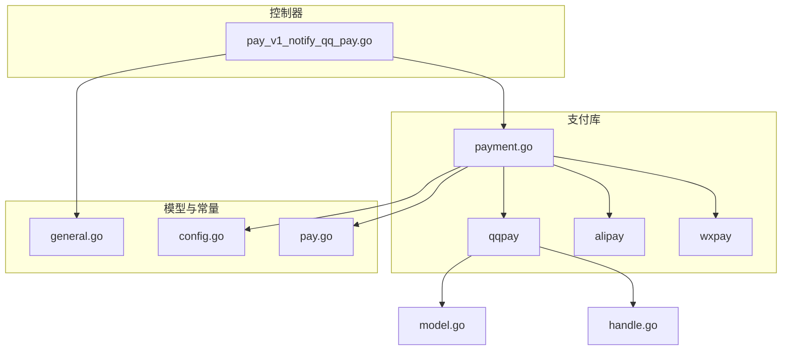
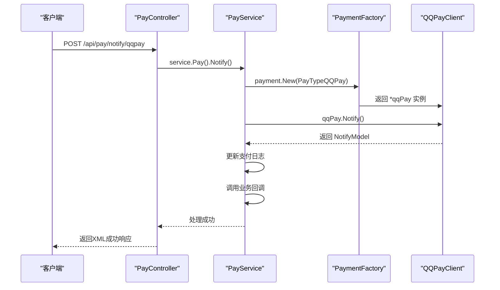
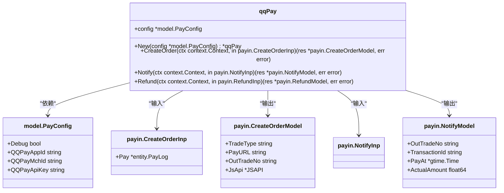
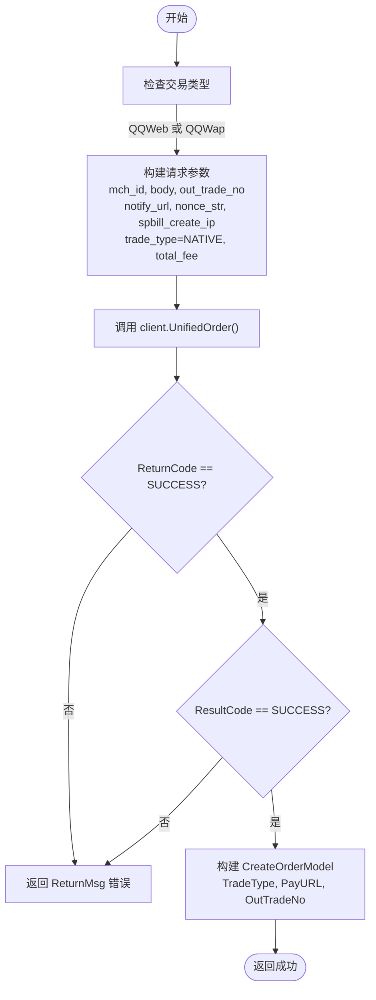
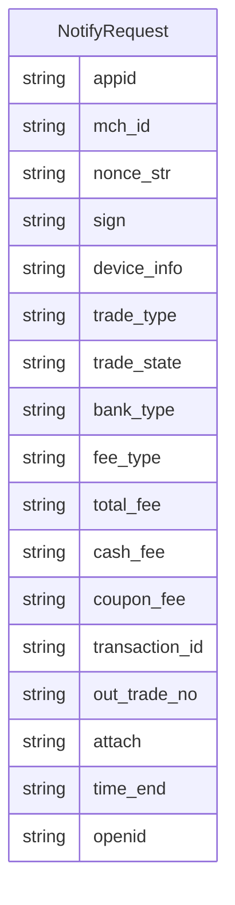
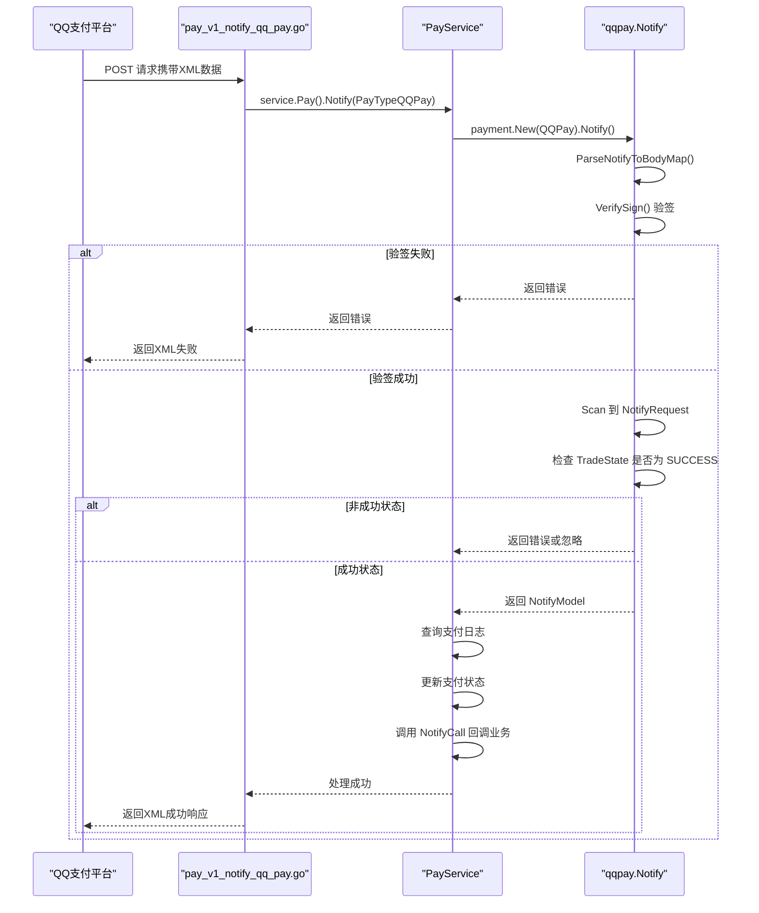
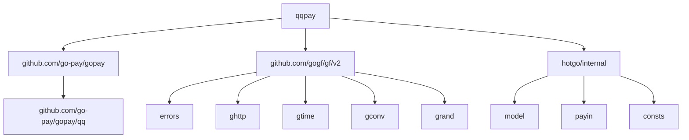

# QQ支付集成

<cite>
**本文档引用的文件**
- [handle.go](file://server/internal/library/payment/qqpay/handle.go)
- [model.go](file://server/internal/library/payment/qqpay/model.go)
- [pay_v1_notify_qq_pay.go](file://server/internal/controller/api/pay/pay_v1_notify_qq_pay.go)
- [payment.go](file://server/internal/library/payment/payment.go)
- [general.go](file://server/internal/model/input/payin/general.go)
- [config.go](file://server/internal/model/config.go)
- [pay.go](file://server/internal/consts/pay.go)
</cite>

## 目录
1. [简介](#简介)
2. [项目结构](#项目结构)
3. [核心组件](#核心组件)
4. [架构概述](#架构概述)
5. [详细组件分析](#详细组件分析)
6. [依赖分析](#依赖分析)
7. [性能考虑](#性能考虑)
8. [故障排除指南](#故障排除指南)
9. [结论](#结论)

## 简介
本文档旨在为开发者提供QQ支付集成的全面指导。由于QQ支付的官方文档相对较少，本文档将作为主要参考，详细阐述`internal/library/payment/qqpay/`包的实现，包括支付请求的发起、响应处理以及异步通知的处理流程。文档将涵盖数据模型定义、控制器逻辑、接入流程和参数配置说明，并提供代码示例与调试技巧，帮助开发者快速、准确地完成集成。

## 项目结构
QQ支付相关的代码主要位于`server/internal/library/payment/qqpay/`目录下，该目录是支付功能模块的一部分，与支付宝、微信支付等其他支付方式并列。支付控制器位于`server/internal/controller/api/pay/`目录，通过统一的支付服务层进行调用。

**Diagram sources**
- [handle.go](file://server/internal/library/payment/qqpay/handle.go)
- [model.go](file://server/internal/library/payment/qqpay/model.go)
- [pay_v1_notify_qq_pay.go](file://server/internal/controller/api/pay/pay_v1_notify_qq_pay.go)
- [payment.go](file://server/internal/library/payment/payment.go)

**Section sources**
- [handle.go](file://server/internal/library/payment/qqpay/handle.go)
- [model.go](file://server/internal/library/payment/qqpay/model.go)
- [pay_v1_notify_qq_pay.go](file://server/internal/controller/api/pay/pay_v1_notify_qq_pay.go)

## 核心组件
本节分析QQ支付集成的核心组件，包括`qqpay`包的实现、数据模型定义以及异步通知的处理逻辑。

**Section sources**
- [handle.go](file://server/internal/library/payment/qqpay/handle.go#L21-L137)
- [model.go](file://server/internal/library/payment/qqpay/model.go#L9-L27)
- [pay_v1_notify_qq_pay.go](file://server/internal/controller/api/pay/pay_v1_notify_qq_pay.go#L1-L27)

## 架构概述
QQ支付集成遵循了统一的支付接口设计模式。`payment`包定义了`PayClient`接口，`qqpay`包实现了该接口。当需要处理支付或通知时，系统通过`payment.New()`工厂方法创建具体的支付客户端实例，然后调用其方法。异步通知由控制器接收，经过统一的服务层处理，最终调用`qqpay`包的`Notify`方法进行验签和数据解析。

**Diagram sources**
- [pay_v1_notify_qq_pay.go](file://server/internal/controller/api/pay/pay_v1_notify_qq_pay.go#L1-L27)
- [payment.go](file://server/internal/library/payment/payment.go#L23-L30)
- [handle.go](file://server/internal/library/payment/qqpay/handle.go#L38-L83)

## 详细组件分析

### QQ支付客户端分析
`qqpay`包的核心是一个实现了`PayClient`接口的结构体`qqPay`，它封装了与QQ支付API的交互逻辑。

#### 对象结构

**Diagram sources**
- [handle.go](file://server/internal/library/payment/qqpay/handle.go#L27-L29)
- [config.go](file://server/internal/model/config.go#L158-L161)
- [general.go](file://server/internal/model/input/payin/general.go#L14-L32)

#### 支付请求发起与响应处理
`CreateOrder`方法负责发起支付请求。它首先根据配置创建一个QQ支付客户端，然后根据交易类型（目前支持`qqweb`和`qqwap`）构建请求参数，调用QQ支付的统一下单API，并处理返回结果。

**Diagram sources**
- [handle.go](file://server/internal/library/payment/qqpay/handle.go#L86-L126)

**Section sources**
- [handle.go](file://server/internal/library/payment/qqpay/handle.go#L86-L126)

#### 数据模型定义
`model.go`文件定义了`NotifyRequest`结构体，用于映射QQ支付异步通知的XML数据。该结构体使用`xml`和`json`标签，确保了数据的正确解析。

**Diagram sources**
- [model.go](file://server/internal/library/payment/qqpay/model.go#L9-L27)

**Section sources**
- [model.go](file://server/internal/library/payment/qqpay/model.go#L9-L27)

### 异步通知处理分析
`pay_v1_notify_qq_pay.go`控制器负责处理来自QQ支付平台的异步通知。

#### 处理流程

**Diagram sources**
- [pay_v1_notify_qq_pay.go](file://server/internal/controller/api/pay/pay_v1_notify_qq_pay.go#L1-L27)
- [handle.go](file://server/internal/library/payment/qqpay/handle.go#L38-L83)
- [payment.go](file://server/internal/library/payment/payment.go#L27-L27)

**Section sources**
- [pay_v1_notify_qq_pay.go](file://server/internal/controller/api/pay/pay_v1_notify_qq_pay.go#L1-L27)

## 依赖分析
QQ支付集成依赖于多个外部库和内部模块。

**Diagram sources**
- [handle.go](file://server/internal/library/payment/qqpay/handle.go#L1-L25)
- [config.go](file://server/internal/model/config.go#L158-L161)
- [pay.go](file://server/internal/consts/pay.go#L23-L23)

**Section sources**
- [handle.go](file://server/internal/library/payment/qqpay/handle.go#L1-L25)

## 性能考虑
- **验签性能**：`VerifySign`操作是通知处理中的关键步骤，应确保`QQPayApiKey`的获取是高效的。
- **数据库查询**：在`Notify`回调中，对`PayLog`表的查询和更新操作应确保有适当的索引（如`out_trade_no`）以保证性能。
- **并发处理**：支付通知可能并发到达，`payment.New()`工厂方法和`qqPay`实例的设计是无状态的，可以安全地处理并发请求。

## 故障排除指南
- **验签不通过**：检查`QQPayApiKey`配置是否正确，确保与QQ支付商户平台上的API密钥完全一致。
- **订单未找到**：检查`out_trade_no`是否正确传递，并确认该订单号在`pay_log`表中存在且状态为“待支付”。
- **交易状态非成功**：`Notify`方法默认只处理`SUCCESS`状态的交易。如果需要处理其他状态（如退款、关闭），需要修改`handle.go`中的逻辑。
- **创建订单失败**：检查`QQPayMchId`、`notify_url`、`total_fee`等参数是否正确，确保网络可以访问QQ支付API。

**Section sources**
- [handle.go](file://server/internal/library/payment/qqpay/handle.go#L38-L83)
- [handle.go](file://server/internal/library/payment/qqpay/handle.go#L86-L126)

## 结论
本文档详细阐述了HotGo项目中QQ支付的集成方案。通过`qqpay`包的`qqPay`结构体实现了`PayClient`接口，完成了支付请求的发起和异步通知的处理。整个流程设计清晰，通过统一的工厂模式和接口定义，保证了代码的可扩展性和可维护性。开发者在集成时，应重点关注配置参数的正确性、验签逻辑以及业务回调的实现。