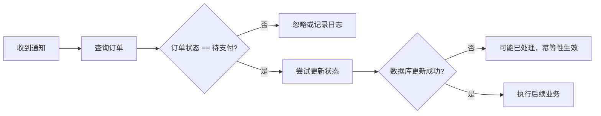
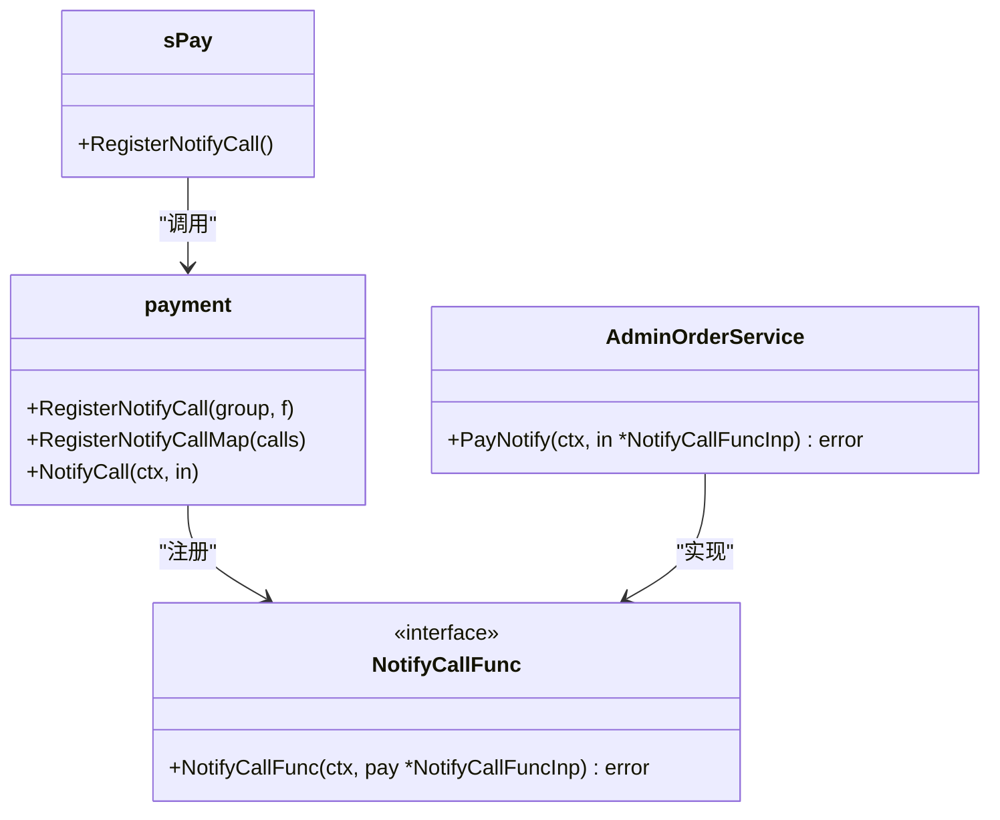

# 异步通知处理

<cite>
**本文档引用的文件**
- [pay_v1_notify_ali_pay.go](file://server/internal/controller/api/pay/pay_v1_notify_ali_pay.go)
- [pay_v1_notify_qq_pay.go](file://server/internal/controller/api/pay/pay_v1_notify_qq_pay.go)
- [pay_v1_notify_wx_pay.go](file://server/internal/controller/api/pay/pay_v1_notify_wx_pay.go)
- [notifycall.go](file://server/internal/library/payment/notifycall.go)
- [payment.go](file://server/internal/library/payment/payment.go)
- [pay.go](file://server/internal/service/pay.go)
- [notify.go](file://server/internal/logic/pay/notify.go)
- [pay.go](file://server/internal/model/input/payin/pay.go)
- [general.go](file://server/internal/model/input/payin/general.go)
</cite>

## 目录
1. [简介](#简介)
2. [核心流程概述](#核心流程概述)
3. [控制器层处理](#控制器层处理)
4. [服务层与逻辑层处理](#服务层与逻辑层处理)
5. [幂等性保障机制](#幂等性保障机制)
6. [异步回调注册与执行](#异步回调注册与执行)
7. [安全最佳实践](#安全最佳实践)
8. [通知状态处理示例](#通知状态处理示例)
9. [测试策略](#测试策略)
10. [总结](#总结)

## 简介
本系统实现了完整的支付异步通知处理机制，用于接收来自支付宝、微信支付和QQ支付的支付结果回调。该机制确保了支付状态的准确更新，并通过幂等性设计防止重复处理，同时支持灵活的业务回调扩展。

## 核心流程概述
支付异步通知的处理流程始于特定支付渠道的控制器，经过初步路由后进入统一的服务层进行验证与处理，最终调用注册的业务逻辑完成订单状态更新等操作。整个流程强调安全性、可靠性和可扩展性。

```mermaid
flowchart TD
A[支付平台发起异步通知] --> B{判断支付渠道}
B --> |支付宝| C[pay_v1_notify_ali_pay.go]
B --> |微信支付| D[pay_v1_notify_wx_pay.go]
B --> |QQ支付| E[pay_v1_notify_qq_pay.go]
C --> F[service.Pay().Notify]
D --> F
E --> F
F --> G[payment.New().Notify]
G --> H[验证签名与数据]
H --> I[查询本地订单]
I --> J{订单是否存在且为待支付?}
J --> |否| K[返回错误或忽略]
J --> |是| L[更新支付状态]
L --> M[执行业务回调]
M --> N[返回成功响应]
```

**图示来源**
- [pay_v1_notify_ali_pay.go](file://server/internal/controller/api/pay/pay_v1_notify_ali_pay.go#L1-L22)
- [pay_v1_notify_wx_pay.go](file://server/internal/controller/api/pay/pay_v1_notify_wx_pay.go#L1-L22)
- [pay_v1_notify_qq_pay.go](file://server/internal/controller/api/pay/pay_v1_notify_qq_pay.go#L1-L26)
- [notify.go](file://server/internal/logic/pay/notify.go#L1-L98)
- [payment.go](file://server/internal/library/payment/payment.go#L1-L125)

## 控制器层处理
系统为每种支付方式提供了独立的HTTP控制器，负责接收原始通知请求。这些控制器位于 `server/internal/controller/api/pay/` 目录下，分别是 `pay_v1_notify_ali_pay.go`、`pay_v1_notify_wx_pay.go` 和 `pay_v1_notify_qq_pay.go`。

每个控制器的主要职责是：
1. 接收HTTP请求。
2. 调用统一的 `service.Pay().Notify` 方法进行后续处理。
3. 根据不同支付平台的要求，返回特定格式的成功响应（如支付宝要求返回 "success" 文本，微信要求返回特定XML，QQ支付也要求返回XML）。

这种设计将渠道特定的响应格式处理与核心业务逻辑分离，提高了代码的清晰度和可维护性。

**本节来源**
- [pay_v1_notify_ali_pay.go](file://server/internal/controller/api/pay/pay_v1_notify_ali_pay.go#L1-L22)
- [pay_v1_notify_wx_pay.go](file://server/internal/controller/api/pay/pay_v1_notify_wx_pay.go#L1-L22)
- [pay_v1_notify_qq_pay.go](file://server/internal/controller/api/pay/pay_v1_notify_qq_pay.go#L1-L26)

## 服务层与逻辑层处理
`service.Pay()` 接口定义了 `Notify` 方法，其具体实现位于 `server/internal/logic/pay/notify.go` 文件的 `sPay` 结构体中。

处理流程如下：
1. **创建支付客户端**：根据传入的 `PayType` 参数，使用 `payment.New(in.PayType)` 创建对应支付渠道的客户端实例。
2. **执行通知验证**：调用客户端的 `Notify` 方法，该方法会解析原始请求数据并验证其签名，确保通知来源的合法性。
3. **查询订单**：使用从支付平台获取的 `OutTradeNo`（商户订单号）在本地数据库中查询对应的支付记录。
4. **状态检查**：确认订单存在且当前状态为“待支付”（`consts.PayStatusWait`），以防止重复处理。
5. **更新状态**：如果检查通过，则更新订单的支付状态、交易号、支付时间、支付IP等信息。
6. **触发回调**：最后，调用 `payment.NotifyCall` 来执行注册的业务回调函数。

**本节来源**
- [notify.go](file://server/internal/logic/pay/notify.go#L1-L98)
- [payment.go](file://server/internal/library/payment/payment.go#L27-L27)

## 幂等性保障机制
幂等性是异步通知处理的核心要求，因为支付平台可能会因网络问题等原因重复发送通知。

本系统通过以下方式实现幂等性：
1. **状态锁**：在更新数据库时，使用 `Where(dao.PayLog.Columns().PayStatus, consts.PayStatusWait)` 作为更新条件。这意味着只有当订单状态仍为“待支付”时，更新操作才会生效。如果订单已被处理（状态已变更为“已支付”），则本次更新将不会影响任何数据行。
2. **数据库影响行数检查**：在执行 `Update()` 操作后，系统会检查 `RowsAffected()` 的返回值。如果为0，说明没有数据被更新，这通常意味着订单已被处理，系统会记录一条警告日志，但不会中断流程。

这种双重检查机制有效防止了同一笔订单被重复扣款或重复发放商品。



**图示来源**
- [notify.go](file://server/internal/logic/pay/notify.go#L1-L98)

## 异步回调注册与执行
系统提供了一个灵活的回调注册机制，允许在支付成功后自动执行特定的业务逻辑，例如更新订单状态、发放商品或增加用户积分。

1. **注册机制**：在 `server/internal/logic/pay/notify.go` 的 `RegisterNotifyCall` 方法中，通过 `payment.RegisterNotifyCallMap` 将不同的业务组（`OrderGroup`）与对应的回调函数进行映射。例如，`consts.OrderGroupAdminOrder` 组的支付成功后，会调用 `service.AdminOrder().PayNotify` 方法。
2. **执行机制**：在核心通知处理流程的最后，会调用 `payment.NotifyCall(ctx, &payin.NotifyCallFuncInp{Pay: models})`。该函数会根据订单的 `OrderGroup` 字段查找并执行注册的回调函数。为了不影响主通知流程，回调函数在 `simple.SafeGo` 中以安全的goroutine方式异步执行。

这种设计实现了支付处理与业务逻辑的解耦，使得新增支付业务变得非常简单。



**图示来源**
- [notifycall.go](file://server/internal/library/payment/notifycall.go#L1-L55)
- [notify.go](file://server/internal/logic/pay/notify.go#L1-L98)
- [general.go](file://server/internal/model/input/payin/general.go#L45-L47)

## 安全最佳实践
系统在设计时充分考虑了安全性：
1. **HTTPS**：所有异步通知URL都应通过HTTPS提供，以加密传输数据，防止中间人攻击。
2. **IP白名单**：虽然代码中未直接体现，但最佳实践建议在服务器或防火墙层面配置支付平台的官方IP地址白名单，只允许来自这些IP的请求访问通知接口。
3. **签名验证**：核心的安全保障在于 `payment.New(in.PayType).Notify()` 方法内部会自动验证支付平台发送的通知签名。这是防止伪造通知的最关键步骤。
4. **详细日志**：系统使用 `g.Log().Warningf` 记录关键的警告信息，如回调执行失败等，便于问题追踪和审计。

**本节来源**
- [payment.go](file://server/internal/library/payment/payment.go#L27-L27)
- [notify.go](file://server/internal/logic/pay/notify.go#L1-L98)

## 通知状态处理示例
虽然核心逻辑主要处理“支付成功”的状态，但支付平台的通知可能包含多种状态。系统通过支付客户端的 `Notify` 方法来解析这些状态。

- **支付成功**：这是最常见的场景，`Notify` 方法会返回包含 `OutTradeNo`, `TransactionId`, `PayAt` 等信息的 `NotifyModel`，系统会据此更新订单。
- **支付失败**：支付客户端的 `Notify` 方法通常会直接返回一个错误，通知流程会在此中断，不会更新订单状态。
- **退款成功**：退款有独立的处理流程，通常由 `PayRefund` 服务处理，不通过此异步通知入口。

**本节来源**
- [payment.go](file://server/internal/library/payment/payment.go#L27-L27)
- [notify.go](file://server/internal/logic/pay/notify.go#L1-L98)

## 测试策略
1. **沙箱环境**：使用支付宝、微信支付和QQ支付提供的官方沙箱环境进行测试。这些环境模拟了真实的支付流程，但不会产生真实交易。
2. **本地调试**：可以使用 `ngrok` 或 `localtunnel` 等工具将本地开发服务器暴露到公网，以便支付平台的沙箱环境能够回调到本地。
3. **日志分析**：仔细检查系统日志，确保通知被正确接收、验证、处理，并且回调函数被成功执行。

## 总结
本系统的异步通知处理机制结构清晰、安全可靠。它通过分层设计将渠道适配、核心验证和业务逻辑解耦，并通过严格的幂等性检查和签名验证保障了交易的准确性。开发者在新增支付业务时，只需在 `RegisterNotifyCall` 中注册对应的回调函数即可，极大地简化了开发工作。