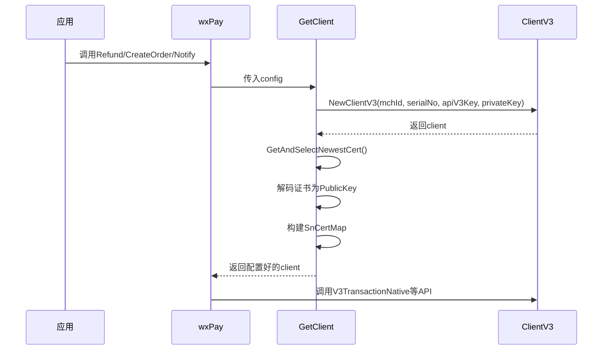
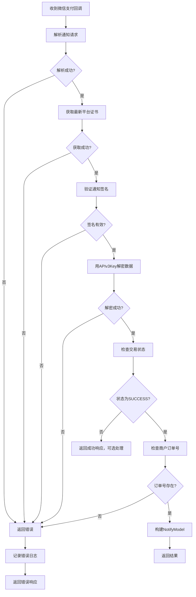

# 微信支付集成

<cite>
**Referenced Files in This Document**   
- [handle.go](file://server/internal/library/payment/wxpay/handle.go)
- [model.go](file://server/internal/library/payment/wxpay/model.go)
- [pay_v1_notify_wx_pay.go](file://server/internal/controller/api/pay/pay_v1_notify_wx_pay.go)
- [config.go](file://server/internal/model/config.go)
- [general.go](file://server/internal/model/input/payin/general.go)
</cite>

## 目录
1. [简介](#简介)
2. [核心组件](#核心组件)
3. [APIv3调用与证书管理](#apiv3调用与证书管理)
4. [支付回调通知处理](#支付回调通知处理)
5. [支付场景接入示例](#支付场景接入示例)
6. [错误处理与安全](#错误处理与安全)

## 简介
本文档深入解析了`hotgo`项目中微信支付的集成实现。文档聚焦于`internal/library/payment/wxpay/`包，详细阐述了V3 API的调用方式、证书与密钥的管理、支付回调通知的验证流程，以及不同支付场景的接入方法。通过本指南，开发者可以全面了解微信支付模块的内部工作机制，确保安全、稳定地集成微信支付功能。

## 核心组件

`internal/library/payment/wxpay/`包是微信支付功能的核心，主要由`handle.go`和`model.go`两个文件构成。`handle.go`文件定义了`wxPay`结构体，实现了`PayClient`接口，提供了创建订单、处理退款和验证异步通知等核心业务逻辑。该结构体通过`New`函数进行初始化，接收包含支付配置的`PayConfig`对象。`model.go`文件目前主要作为包声明，具体的请求和响应数据结构定义在`internal/model/input/payin/`包中。

**Section sources**
- [handle.go](file://server/internal/library/payment/wxpay/handle.go#L1-L315)
- [model.go](file://server/internal/library/payment/wxpay/model.go#L1-L7)

## APIv3调用与证书管理

### V3 API客户端初始化
所有V3 API的调用都依赖于一个正确初始化的`*wechat.ClientV3`客户端。`GetClient`函数负责创建和配置此客户端。它使用商户的`WxPayMchId`（商户ID）、`WxPaySerialNo`（证书序列号）、`WxPayAPIv3Key`（APIv3密钥）和`WxPayPrivateKey`（私钥）来调用`wechat.NewClientV3`。

**Diagram sources**
- [handle.go](file://server/internal/library/payment/wxpay/handle.go#L131-L162)

**Section sources**
- [handle.go](file://server/internal/library/payment/wxpay/handle.go#L131-L182)

### 平台证书自动更新机制
微信支付平台的公钥证书会定期轮换。为确保签名验证的持续有效，系统实现了自动更新机制。在`GetClient`函数中，通过调用`client.GetAndSelectNewestCert()`方法，客户端会向微信支付API发起请求，获取最新的平台证书列表。获取到证书后，代码会使用`xpem.DecodePublicKey`将其解码为`*rsa.PublicKey`对象，并存储在`client.SnCertMap`映射中，以证书序列号（SN）为键。这个过程在每次创建新客户端时都会执行，从而保证了应用始终使用最新的平台证书进行验证。

## 支付回调通知处理

### 通知控制器入口
支付回调的入口是`pay_v1_notify_wx_pay.go`中的`NotifyWxPay`控制器方法。该方法本身逻辑简洁，它将请求委托给`service.Pay().Notify`进行处理。如果处理成功，它会返回一个符合微信支付要求的JSON响应`{"code": "SUCCESS","message": "收单成功"}`，以告知微信支付服务器已成功接收通知。

**Section sources**
- [pay_v1_notify_wx_pay.go](file://server/internal/controller/api/pay/pay_v1_notify_wx_pay.go#L1-L23)

### 通知验证与解密流程
`wxPay.Notify`方法是处理微信支付异步通知的核心，其流程严格遵循微信支付的安全规范。

1.  **解析通知请求**：首先，使用`wechat.V3ParseNotify`函数解析HTTP请求体，得到一个包含加密信息的`notifyReq`对象。
2.  **获取平台证书**：调用`getPublicKeyMap`函数，该函数内部会触发平台证书的拉取和更新，最终返回一个包含所有有效平台公钥的映射。
3.  **验证签名**：使用上一步获取的公钥映射，调用`notifyReq.VerifySignByPKMap(certMap)`来验证通知的签名。这一步确保了通知确实来自微信支付，且内容未被篡改。
4.  **解密支付数据**：签名验证通过后，使用商户配置的`WxPayAPIv3Key`调用`notifyReq.DecryptPayCipherText`对通知中的加密数据（如订单金额、交易状态等）进行解密。
5.  **业务处理**：解密成功后，检查交易状态是否为`SUCCESS`，并提取商户订单号`OutTradeNo`。最后，将关键信息（如交易号、支付时间、实付金额）封装到`NotifyModel`中返回，供上层业务逻辑进行后续处理。

**Diagram sources**
- [handle.go](file://server/internal/library/payment/wxpay/handle.go#L69-L114)

**Section sources**
- [handle.go](file://server/internal/library/payment/wxpay/handle.go#L69-L114)
- [general.go](file://server/internal/model/input/payin/general.go#L37-L42)

## 支付场景接入示例

`wxPay.CreateOrder`方法根据`TradeType`字段的值，统一处理不同场景的支付订单创建。

*   **JSAPI支付 (公众号/小程序)**：当`TradeType`为`consts.TradeTypeWxMP`或`consts.TradeTypeWxMini`时，调用`jsapi`方法。该方法首先通过`weOpen.GetJsConfig`获取JS-SDK的配置，然后调用`client.V3TransactionJsapi`创建预支付订单，并使用`client.PaySignOfJSAPI`生成前端所需的支付参数。
*   **Native支付 (扫码支付)**：当`TradeType`为`consts.TradeTypeWxScan`时，调用`scan`方法。该方法调用`client.V3TransactionNative`创建订单，返回的`CodeUrl`即为支付二维码的内容。
*   **H5支付**：当`TradeType`为`consts.TradeTypeWxH5`时，调用`h5`方法。该方法调用`client.V3TransactionH5`创建订单，返回的`H5Url`是一个支付链接，需要在微信外的浏览器中打开。

**Section sources**
- [handle.go](file://server/internal/library/payment/wxpay/handle.go#L116-L294)

## 错误处理与安全

### APIv3密钥安全
`WxPayAPIv3Key`是用于解密微信支付通知和回调数据的关键密钥，必须严格保密。在代码中，该密钥直接从`PayConfig`结构体中读取，而`PayConfig`的实例通常由系统配置中心或环境变量注入，避免了硬编码。开发者应确保配置的存储和传输过程是安全的。

### 常见错误处理
文档中未直接提及`RESOURCE_DECRYPT_ERROR`，但根据其名称，此错误通常发生在解密步骤。在`wxPay.Notify`方法中，`notifyReq.DecryptPayCipherText`调用失败时会直接返回错误。处理此类错误的首要步骤是检查`WxPayAPIv3Key`是否与微信商户平台配置的一致。其次，应确认平台证书是否已成功更新，因为过期的证书也可能导致解密失败。最后，检查日志以获取更详细的错误信息，并确保网络连接正常。

**Section sources**
- [config.go](file://server/internal/model/config.go#L132-L150)
- [handle.go](file://server/internal/library/payment/wxpay/handle.go#L100-L114)