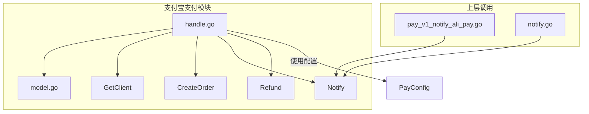
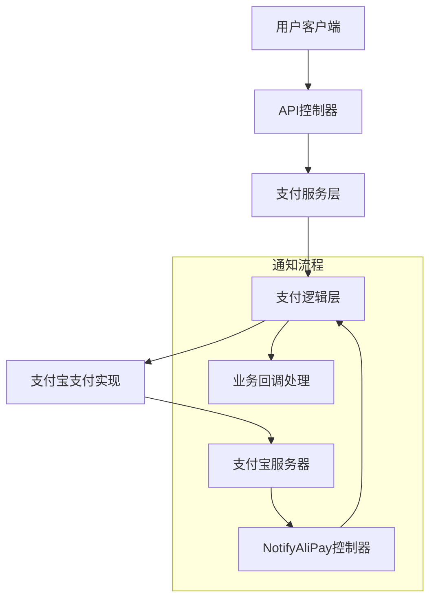
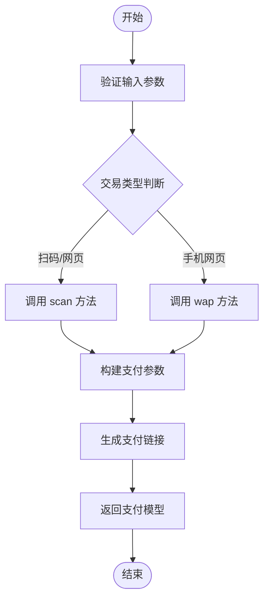
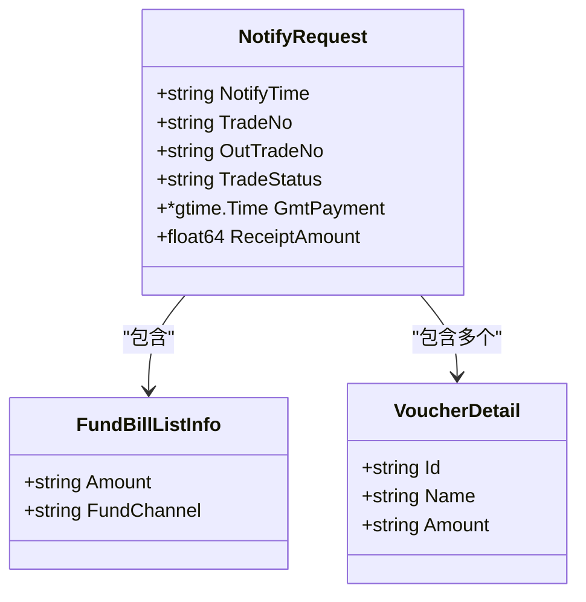
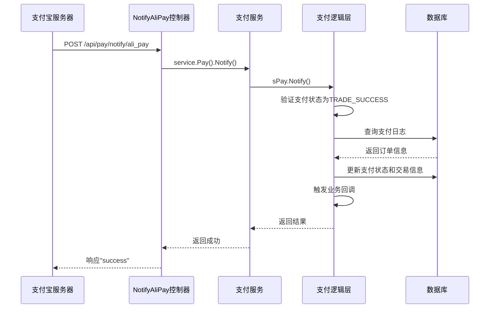
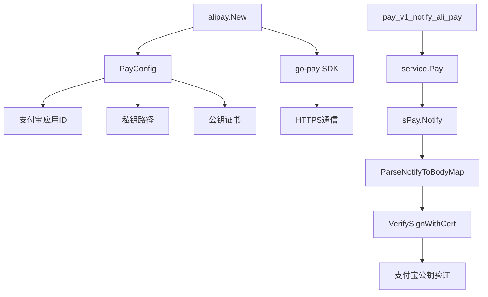

# 支付宝集成

<cite>
**本文档引用文件**  
- [handle.go](file://server/internal/library/payment/alipay/handle.go)
- [model.go](file://server/internal/library/payment/alipay/model.go)
- [pay_v1_notify_ali_pay.go](file://server/internal/controller/api/pay/pay_v1_notify_ali_pay.go)
- [notify.go](file://server/internal/logic/pay/notify.go)
- [pay.go](file://server/internal/service/pay.go)
- [consts/pay.go](file://server/internal/consts/pay.go)
</cite>

## 目录
1. [简介](#简介)
2. [项目结构](#项目结构)
3. [核心组件](#核心组件)
4. [架构概览](#架构概览)
5. [详细组件分析](#详细组件分析)
6. [依赖分析](#依赖分析)
7. [性能考虑](#性能考虑)
8. [故障排除指南](#故障排除指南)
9. [结论](#结论)

## 简介
本文档详细说明了 `internal/library/payment/alipay/` 包的实现机制，重点涵盖支付请求的构造与签名逻辑、异步通知处理流程、数据结构定义以及沙箱环境配置。文档旨在为开发人员提供完整的支付宝集成解决方案，包括常见错误码（如 INVALID_SIGN）的排查方法。

## 项目结构
`alipay` 支付模块位于 `server/internal/library/payment/alipay/` 目录下，主要由 `handle.go` 和 `model.go` 构成。该模块通过统一支付接口与上层业务逻辑解耦，支持扫码、网页、手机网站等多种支付方式。

**Diagram sources**
- [handle.go](file://server/internal/library/payment/alipay/handle.go#L20-L24)
- [model.go](file://server/internal/library/payment/alipay/model.go#L10-L15)

**Section sources**
- [handle.go](file://server/internal/library/payment/alipay/handle.go#L1-L50)
- [model.go](file://server/internal/library/payment/alipay/model.go#L1-L20)

## 核心组件

`alipay` 模块实现了 `PayClient` 接口，提供创建订单、处理异步通知和退款三大核心功能。其通过 `New(config *model.PayConfig)` 初始化客户端实例，并依赖支付宝官方 SDK 进行签名与通信。

**Section sources**
- [handle.go](file://server/internal/library/payment/alipay/handle.go#L20-L24)
- [payment.go](file://server/internal/library/payment/payment.go#L23-L30)

## 架构概览

系统采用分层架构设计，从控制器到支付逻辑层再到具体支付实现，职责清晰。支付宝支付流程涉及多个组件协同工作。

**Diagram sources**
- [pay_v1_notify_ali_pay.go](file://server/internal/controller/api/pay/pay_v1_notify_ali_pay.go#L1-L23)
- [notify.go](file://server/internal/logic/pay/notify.go#L1-L99)

## 详细组件分析

### 支付请求构造与签名逻辑

`CreateOrder` 方法根据交易类型调用不同的支付方式（如扫码、WAP），构造请求参数并生成跳转链接。签名由底层 SDK 自动完成。

#### 支付订单创建流程

**Diagram sources**
- [handle.go](file://server/internal/library/payment/alipay/handle.go#L68-L101)

**Section sources**
- [handle.go](file://server/internal/library/payment/alipay/handle.go#L68-L101)

### 数据结构定义

`model.go` 定义了支付宝异步通知所需的数据结构，包括 `NotifyRequest`、`FundBillListInfo` 和 `VoucherDetail`，用于解析支付宝返回的 JSON 数据。

**Diagram sources**
- [model.go](file://server/internal/library/payment/alipay/model.go#L10-L67)

**Section sources**
- [model.go](file://server/internal/library/payment/alipay/model.go#L10-L67)

### 异步通知处理流程

`pay_v1_notify_ali_pay.go` 控制器接收支付宝的异步通知请求，调用逻辑层进行签名验证和业务处理。

#### 支付宝异步通知处理

**Diagram sources**
- [pay_v1_notify_ali_pay.go](file://server/internal/controller/api/pay/pay_v1_notify_ali_pay.go#L1-L23)
- [notify.go](file://server/internal/logic/pay/notify.go#L1-L99)

**Section sources**
- [pay_v1_notify_ali_pay.go](file://server/internal/controller/api/pay/pay_v1_notify_ali_pay.go#L1-L23)
- [notify.go](file://server/internal/logic/pay/notify.go#L1-L99)

## 依赖分析

支付宝模块依赖多个核心组件，形成清晰的调用链路。

**Diagram sources**
- [handle.go](file://server/internal/library/payment/alipay/handle.go#L20-L24)
- [pay_v1_notify_ali_pay.go](file://server/internal/controller/api/pay/pay_v1_notify_ali_pay.go#L1-L23)

**Section sources**
- [handle.go](file://server/internal/library/payment/alipay/handle.go#L20-L24)
- [pay_v1_notify_ali_pay.go](file://server/internal/controller/api/pay/pay_v1_notify_ali_pay.go#L1-L23)

## 性能考虑

- 使用连接池和客户端复用减少 HTTPS 握手开销
- 异步通知处理应快速响应，避免支付宝重复推送
- 日志记录建议异步写入，防止阻塞主流程
- 公钥证书模式验签性能优于普通公钥模式

## 故障排除指南

### 常见错误码解决方案

| 错误码 | 原因 | 解决方案 |
|-------|------|---------|
| INVALID_SIGN | 签名验证失败 | 检查支付宝公钥是否正确配置，确认请求参数未被篡改 |
| TRADE_STATUS_NOT_SUCCESS | 非支付成功状态 | 仅处理 `TRADE_SUCCESS` 状态的通知，其他状态可忽略或记录日志 |
| OUT_TRADE_NO_NOT_FOUND | 商户订单号缺失 | 检查通知数据中 `out_trade_no` 字段是否存在 |
| PAY_LOG_NOT_FOUND | 本地无对应支付记录 | 检查数据库是否正常写入，确认订单号一致性 |

**Section sources**
- [handle.go](file://server/internal/library/payment/alipay/handle.go#L75-L85)
- [notify.go](file://server/internal/logic/pay/notify.go#L1-L99)

## 结论

本文档全面解析了支付宝集成的实现细节，涵盖了从支付请求构造、异步通知处理到业务回调的完整流程。通过合理的分层设计和严格的签名验证机制，确保了支付系统的安全性和可靠性。建议在生产环境中使用正式的支付宝证书，并定期轮换密钥以增强安全性。