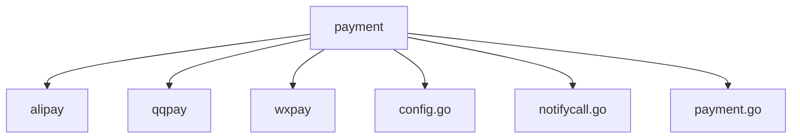
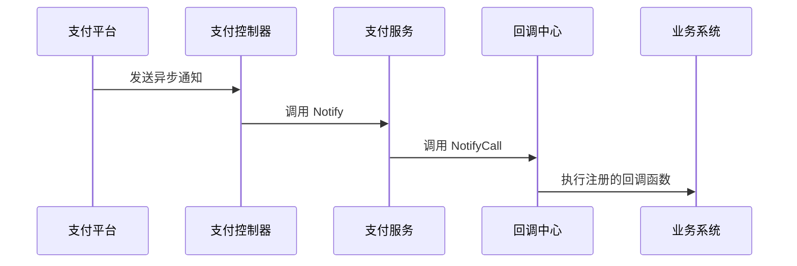

# 支付系统集成

<cite>
**本文档引用文件**  
- [config.yaml](file://server/manifest/config/config.yaml)
- [payment.go](file://server/internal/library/payment/payment.go)
- [notifycall.go](file://server/internal/library/payment/notifycall.go)
- [pay.go](file://server/internal/logic/pay/pay.go)
- [create.go](file://server/internal/logic/pay/create.go)
- [notify.go](file://server/internal/logic/pay/notify.go)
- [pay_v1_notify_ali_pay.go](file://server/internal/controller/api/pay/pay_v1_notify_ali_pay.go)
- [pay_v1_notify_wx_pay.go](file://server/internal/controller/api/pay/pay_v1_notify_wx_pay.go)
- [pay_v1_notify_qq_pay.go](file://server/internal/controller/api/pay/pay_v1_notify_qq_pay.go)
- [pay.go](file://server/internal/service/pay.go)
- [config.go](file://server/internal/library/payment/config.go)
</cite>

## 目录
1. [配置支付参数](#配置支付参数)  
2. [支付库封装结构](#支付库封装结构)  
3. [统一支付接口](#统一支付接口)  
4. [异步通知回调机制](#异步通知回调机制)  
5. [支付下单流程](#支付下单流程)  
6. [异步通知处理流程](#异步通知处理流程)  
7. [错误处理与安全策略](#错误处理与安全策略)  
8. [性能优化建议](#性能优化建议)

## 配置支付参数

在 `config.yaml` 文件中，微信、支付宝、QQ支付的商户信息通过 `system` 配置块进行定义。该文件位于 `server/manifest/config/config.yaml`，是系统核心配置文件。

支付相关参数包括商户ID、API密钥、证书路径等，需根据实际接入的支付平台进行配置。例如：

- **微信支付（WxPay）**：配置 `WxPayMchId`（商户ID）、`WxPayApiKey`（API密钥）、`WxPayCertPath`（证书路径）
- **支付宝（AliPay）**：配置 `AliPayAppId`（应用ID）、`AliPayPrivateKey`（私钥）、`AliPayPublicKey`（公钥）
- **QQ支付（QQPay）**：配置 `QQPayMchId`（商户ID）、`QQPayApiKey`（API密钥）

这些配置项在系统启动时由 `service.SysConfig().LoadConfig()` 加载，并通过 `payment.SetConfig()` 注入到支付库中，供各支付客户端使用。

**Section sources**
- [config.yaml](file://server/manifest/config/config.yaml)
- [config.go](file://server/internal/library/payment/config.go)

## 支付库封装结构

支付系统的核心逻辑封装在 `internal/library/payment` 包中，采用模块化设计，支持多支付平台的统一接入。其目录结构如下：

```
payment/
├── alipay/       # 支付宝实现
├── qqpay/        # QQ支付实现
├── wxpay/        # 微信支付实现
├── config.go     # 支付配置管理
├── notifycall.go # 异步回调注册
└── payment.go    # 统一支付接口
```

该结构实现了支付功能的解耦，各支付方式独立实现，通过统一接口对外暴露，便于扩展和维护。



**Diagram sources**
- [payment.go](file://server/internal/library/payment/payment.go)

## 统一支付接口

`payment.go` 文件定义了 `PayClient` 接口，作为所有支付方式的统一抽象。该接口包含三个核心方法：

- `CreateOrder`：创建支付订单
- `Notify`：处理异步通知
- `Refund`：处理订单退款

通过 `New(payType)` 工厂函数，根据传入的支付类型（如 `wxpay`、`alipay`）返回对应的支付客户端实例。该设计遵循依赖倒置原则，上层逻辑无需关心具体支付实现。

支付订单号生成由 `GenOrderSn` 和 `GenOutTradeNo` 函数负责，确保全局唯一性。交易类型自动识别通过 `AutoTradeType` 函数实现，根据 `userAgent` 判断设备类型并匹配最优支付方式（如微信公众号、小程序、H5等）。

**Section sources**
- [payment.go](file://server/internal/library/payment/payment.go)

## 异步通知回调机制

异步通知是支付系统的关键环节，用于接收支付平台的支付结果通知。`notifycall.go` 文件实现了回调注册机制，核心组件如下：

- `RegisterNotifyCall`：注册支付成功后的业务回调函数
- `NotifyCall`：执行已注册的回调函数，采用 `safeGo` 异步执行，避免阻塞主流程
- `notifyCall`：存储回调函数的映射表，以 `orderGroup` 为键

业务系统（如订单系统）通过 `RegisterNotifyCallMap` 注册自己的回调函数。当支付成功时，系统通过 `NotifyCall` 触发对应业务逻辑，实现支付结果与业务状态的联动。



**Diagram sources**
- [notifycall.go](file://server/internal/library/payment/notifycall.go)
- [notify.go](file://server/internal/logic/pay/notify.go)

## 支付下单流程

完整的支付下单流程从API接收请求开始，最终调用支付库创建订单。流程如下：

1. API层接收 `PayCreateInp` 请求参数
2. 调用 `service.Pay().Create` 方法
3. 逻辑层 `sPay.Create` 生成支付日志并调用 `payment.New().CreateOrder`
4. 对应支付客户端（如 `wxpay.New().CreateOrder`）与第三方平台交互
5. 返回支付参数（如二维码链接、跳转URL）给前端

关键代码路径：`api/pay/v1` → `controller/api/pay` → `service/pay` → `logic/pay.create` → `library/payment`

**Section sources**
- [pay.go](file://server/internal/service/pay.go)
- [create.go](file://server/internal/logic/pay/create.go)

## 异步通知处理流程

异步通知处理由专用控制器 `pay_v1_notify_*.go` 处理，以微信支付为例：

1. `pay_v1_notify_wx_pay.go` 接收微信服务器的POST请求
2. 调用 `service.Pay().Notify` 方法
3. `sPay.Notify` 方法验证签名、解析通知数据
4. 更新 `pay_log` 表中的支付状态
5. 调用 `payment.NotifyCall` 触发业务回调

各支付平台的控制器返回格式不同：
- 支付宝：返回纯文本 `"success"`
- 微信：返回JSON `{"code": "SUCCESS", "message": "收单成功"}`
- QQ支付：返回XML格式

此设计确保符合各支付平台的接口规范。

```mermaid
flowchart TD
A[支付平台通知] --> B{控制器}
B --> C[支付宝]
B --> D[微信]
B --> E[QQ支付]
C --> F[返回"success"]
D --> G[返回JSON]
E --> H[返回XML]
B --> I[调用 service.Pay().Notify]
I --> J[更新支付状态]
J --> K[触发业务回调]
```

**Diagram sources**
- [pay_v1_notify_ali_pay.go](file://server/internal/controller/api/pay/pay_v1_notify_ali_pay.go)
- [pay_v1_notify_wx_pay.go](file://server/internal/controller/api/pay/pay_v1_notify_wx_pay.go)
- [pay_v1_notify_qq_pay.go](file://server/internal/controller/api/pay/pay_v1_notify_qq_pay.go)
- [notify.go](file://server/internal/logic/pay/notify.go)

## 错误处理与安全策略

系统采用分层错误处理机制：
- 支付库层：捕获网络异常、签名验证失败等，返回明确错误码
- 服务层：记录错误日志，确保事务一致性
- 控制器层：返回符合支付平台要求的响应

签名验证由各支付客户端内部实现，确保通知来源可信。敏感信息（如API密钥）在 `config.yaml` 中明文存储，建议在生产环境通过环境变量或密钥管理服务注入。

**Section sources**
- [payment.go](file://server/internal/library/payment/payment.go)
- [notify.go](file://server/internal/logic/pay/notify.go)

## 性能优化建议

1. **缓存支付会话**：使用Redis缓存用户支付会话，避免重复查询数据库
2. **异步回调**：`NotifyCall` 使用 `safeGo` 异步执行，防止阻塞主线程
3. **连接池**：数据库和Redis连接使用连接池，提高并发性能
4. **日志异步化**：支付日志通过队列异步写入，减少主流程耗时

通过合理配置Redis和队列，可显著提升高并发场景下的系统稳定性。

**Section sources**
- [queue.go](file://server/internal/library/queue/queue.go)
- [cache.go](file://server/internal/library/cache/cache.go)