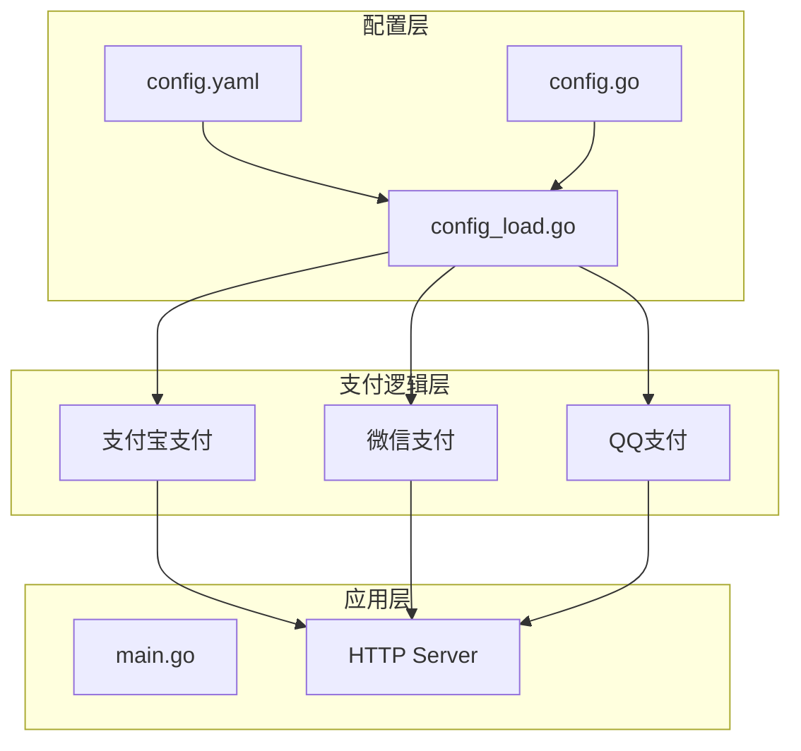
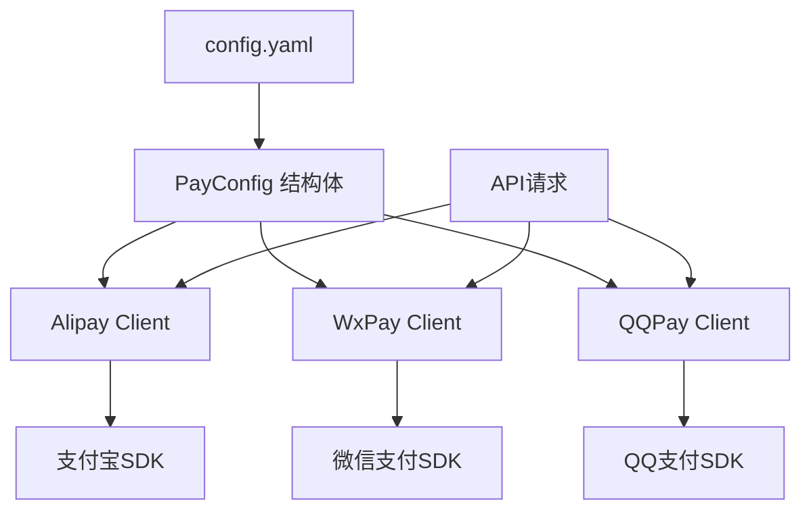
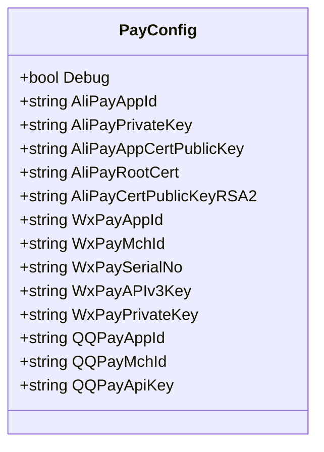
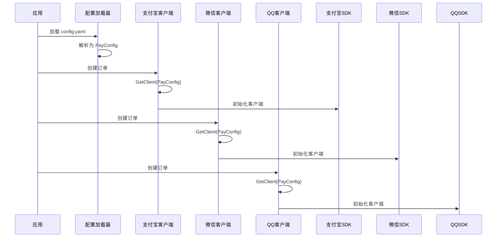
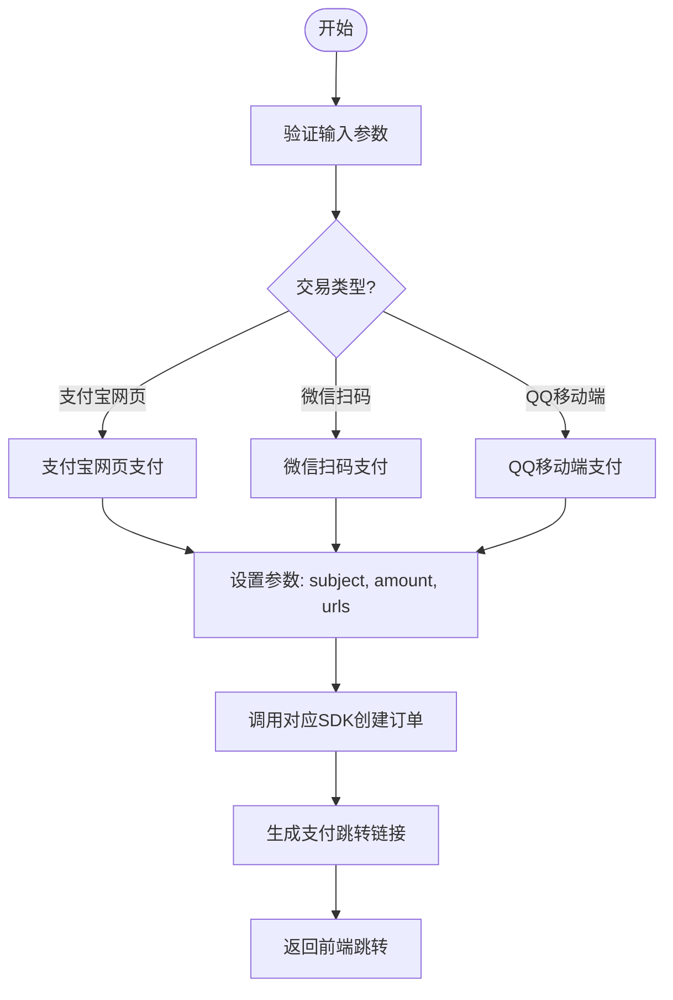
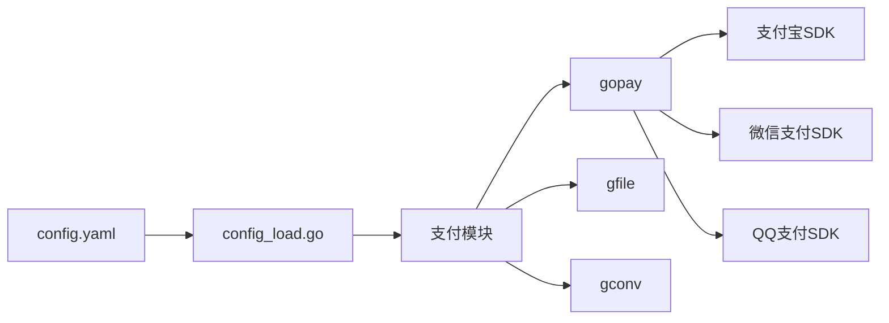

# 支付配置

<cite>
**本文档引用文件**  
- [config.yaml](file://server/manifest/config/config.yaml)
- [config.go](file://server/internal/model/config.go)
- [config_load.go](file://server/internal/model/config_load.go)
- [handle.go](file://server/internal/library/payment/alipay/handle.go)
- [handle.go](file://server/internal/library/payment/qqpay/handle.go)
- [handle.go](file://server/internal/library/payment/wxpay/handle.go)
</cite>

## 目录
1. [简介](#简介)
2. [项目结构](#项目结构)
3. [核心组件](#核心组件)
4. [架构概述](#架构概述)
5. [详细组件分析](#详细组件分析)
6. [依赖分析](#依赖分析)
7. [性能考虑](#性能考虑)
8. [故障排除指南](#故障排除指南)
9. [结论](#结论)

## 简介
本文档详细说明如何在 `config.yaml` 文件中配置微信支付、支付宝和QQ支付的各项参数。涵盖各支付渠道的商户ID（mch_id）、API密钥（api_key）、应用ID（app_id）、异步通知地址（notify_url）、同步返回地址（return_url）以及证书文件路径等关键配置项。同时解释 `internal/library/payment/config.go` 中支付配置结构体的定义与加载机制，并说明配置如何通过 `model/config_load.go` 在应用启动时注入。提供完整的 `config.yaml` 配置示例，并强调敏感信息的安全存储建议。

## 项目结构
本项目采用模块化设计，主要分为前端（web）与后端（server）两大部分。后端基于 GoFrame 框架构建，包含 API 接口、数据库操作、支付逻辑处理、插件系统等。支付相关配置位于 `server/manifest/config/config.yaml`，核心支付逻辑封装在 `internal/library/payment` 目录下，分别实现微信、支付宝和QQ支付的集成。

**Diagram sources**
- [config.yaml](file://server/manifest/config/config.yaml)
- [config.go](file://server/internal/model/config.go)
- [config_load.go](file://server/internal/model/config_load.go)

**Section sources**
- [config.yaml](file://server/manifest/config/config.yaml)
- [config.go](file://server/internal/model/config.go)

## 核心组件
支付系统的核心组件包括支付配置结构体 `PayConfig`、支付客户端初始化逻辑、订单创建与回调处理。这些组件协同工作，确保支付流程的安全性与稳定性。配置通过 `config.yaml` 加载至内存，并在运行时动态注入到各个支付处理器中。

**Section sources**
- [config.go](file://server/internal/model/config.go#L132-L158)
- [handle.go](file://server/internal/library/payment/alipay/handle.go)
- [handle.go](file://server/internal/library/payment/qqpay/handle.go)

## 架构概述
整个支付系统采用分层架构设计，上层为配置管理，中层为支付逻辑处理，底层为第三方SDK调用。配置文件驱动支付行为，通过统一接口抽象不同支付方式的差异，提升系统的可维护性与扩展性。

**Diagram sources**
- [config.go](file://server/internal/model/config.go#L132-L158)
- [handle.go](file://server/internal/library/payment/alipay/handle.go)
- [handle.go](file://server/internal/library/payment/qqpay/handle.go)

## 详细组件分析

### 支付配置结构分析
`PayConfig` 结构体定义了所有支付渠道所需的关键参数，包括调试开关、各平台的应用ID、密钥、证书路径等。该结构体通过 JSON 标签映射 `config.yaml` 中的字段，确保配置正确加载。

**Diagram sources**
- [config.go](file://server/internal/model/config.go#L132-L158)

**Section sources**
- [config.go](file://server/internal/model/config.go#L132-L158)

### 支付客户端初始化流程
支付客户端在首次使用时通过 `GetClient` 方法初始化，读取 `PayConfig` 中的配置信息并传入第三方SDK。例如，支付宝客户端需要应用ID和私钥路径，微信支付需要商户ID和APIv3密钥，QQ支付则依赖商户ID和API密钥。

**Diagram sources**
- [handle.go](file://server/internal/library/payment/alipay/handle.go)
- [handle.go](file://server/internal/library/payment/wxpay/handle.go)
- [handle.go](file://server/internal/library/payment/qqpay/handle.go)

**Section sources**
- [handle.go](file://server/internal/library/payment/alipay/handle.go#L110-L156)
- [handle.go](file://server/internal/library/payment/qqpay/handle.go#L55-L100)

### 支付订单创建流程
当用户发起支付请求时，系统根据 `trade_type` 调用对应支付方式的创建方法。以支付宝网页支付为例，系统构造请求参数（如 subject、total_amount、out_trade_no），设置回调地址（notify_url 和 return_url），然后调用 SDK 生成跳转链接。

**Diagram sources**
- [handle.go](file://server/internal/library/payment/alipay/handle.go#L153-L199)
- [handle.go](file://server/internal/library/payment/qqpay/handle.go#L55-L100)

**Section sources**
- [handle.go](file://server/internal/library/payment/alipay/handle.go#L110-L199)
- [handle.go](file://server/internal/library/payment/qqpay/handle.go#L55-L136)

## 依赖分析
支付模块依赖于多个内部与外部组件：
- 内部依赖：`gopay` 第三方支付库、`gfile` 文件读取工具、`gconv` 类型转换库
- 外部依赖：支付宝SDK、微信支付SDK、QQ支付SDK
- 配置依赖：`config.yaml` 提供运行时参数，`config_load.go` 负责解析注入

**Diagram sources**
- [config_load.go](file://server/internal/model/config_load.go)
- [handle.go](file://server/internal/library/payment/alipay/handle.go)

**Section sources**
- [config_load.go](file://server/internal/model/config_load.go)
- [handle.go](file://server/internal/library/payment/alipay/handle.go)

## 性能考虑
- 支付客户端建议单例模式复用，避免频繁初始化开销
- 证书文件路径应使用绝对路径或相对路径确保加载效率
- 异步通知接口需具备幂等性处理能力，防止重复处理
- 敏感信息如API密钥不应硬编码，推荐使用环境变量或密钥管理服务

## 故障排除指南
常见问题及解决方案：
- **支付失败提示“签名错误”**：检查 `api_key` 或私钥是否正确，确认证书路径可读
- **回调未收到通知**：确认 `notify_url` 可公网访问，防火墙未拦截
- **跳转链接无效**：检查 `return_url` 是否合法，域名是否备案
- **证书加载失败**：确认 `apiclient_cert.pem` 和 `apiclient_key.pem` 文件存在且权限正确

**Section sources**
- [handle.go](file://server/internal/library/payment/alipay/handle.go)
- [handle.go](file://server/internal/library/payment/qqpay/handle.go)

## 结论
本文档全面介绍了 HotGo 支付系统的配置方式与实现机制。通过合理配置 `config.yaml` 并安全管理敏感信息，可快速集成微信、支付宝、QQ支付功能。建议生产环境使用环境变量或密钥管理服务保护API密钥，提升系统安全性。