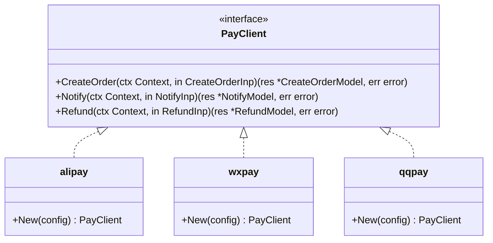
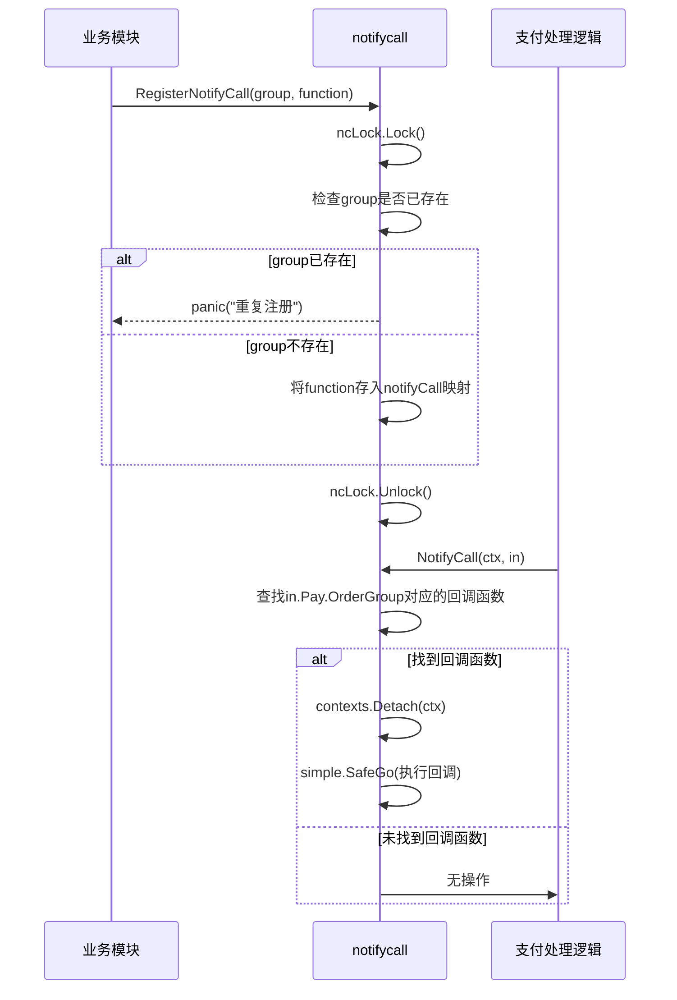

# 核心支付接口

<cite>
**本文档引用的文件**   
- [payment.go](file://server/internal/library/payment/payment.go)
- [notifycall.go](file://server/internal/library/payment/notifycall.go)
- [create.go](file://server/internal/logic/pay/create.go)
- [refund.go](file://server/internal/logic/pay/refund.go)
- [general.go](file://server/internal/model/input/payin/general.go)
</cite>

## 目录
1. [简介](#简介)
2. [统一支付接口设计](#统一支付接口设计)
3. [异步通知回调机制](#异步通知回调机制)
4. [支付业务逻辑实现](#支付业务逻辑实现)
5. [退款流程实现](#退款流程实现)
6. [代码示例：创建支付订单](#代码示例创建支付订单)
7. [异常处理策略](#异常处理策略)

## 简介
本文档详细说明了`hotgo-2.0`项目中核心支付功能的实现。重点阐述了统一支付接口的设计、异步通知回调机制、支付与退款业务逻辑的实现细节。文档旨在为开发者提供清晰的技术指导，帮助理解支付系统的整体架构和关键实现。

## 统一支付接口设计

`internal/library/payment/payment.go`文件中定义了`PayClient`接口，作为统一支付接口的核心。该接口抽象了不同支付渠道（如支付宝、微信支付、QQ支付）的公共操作，实现了支付功能的解耦和可扩展性。



**Diagram sources**
- [payment.go](file://server/internal/library/payment/payment.go#L23-L30)
- [payment.go](file://server/internal/library/payment/payment.go#L32-L53)

### 核心方法签名

`PayClient`接口定义了三个核心方法：

1.  **CreateOrder (创建订单)**:
    *   **参数**: `ctx context.Context`, `in payin.CreateOrderInp`
    *   **返回值**: `res *payin.CreateOrderModel`, `err error`
    *   **功能**: 根据输入参数向第三方支付平台发起支付请求，创建支付订单。

2.  **Notify (异步通知)**:
    *   **参数**: `ctx context.Context`, `in payin.NotifyInp`
    *   **返回值**: `res *payin.NotifyModel`, `err error`
    *   **功能**: 处理来自第三方支付平台的异步支付结果通知。

3.  **Refund (订单退款)**:
    *   **参数**: `ctx context.Context`, `in payin.RefundInp`
    *   **返回值**: `res *payin.RefundModel`, `err error`
    *   **功能**: 向第三方支付平台发起退款请求。

**Section sources**
- [payment.go](file://server/internal/library/payment/payment.go#L23-L30)

### 工厂方法 `New`

`New`函数是一个工厂方法，根据传入的支付类型（`name`）返回对应的具体支付客户端实例（如`alipay.New`、`wxpay.New`）。这使得上层业务逻辑无需关心具体支付渠道的实现细节，只需通过统一的`PayClient`接口进行调用。

**Section sources**
- [payment.go](file://server/internal/library/payment/payment.go#L32-L53)

### 订单号生成

支付库提供了三个用于生成唯一订单号的函数，确保在数据库中不会发生冲突：
*   `GenOrderSn`: 生成业务订单号。
*   `GenOutTradeNo`: 生成商户订单号（发送给支付平台）。
*   `GenRefundSn`: 生成退款订单号。

**Section sources**
- [payment.go](file://server/internal/library/payment/payment.go#L56-L92)

## 异步通知回调机制

`internal/library/payment/notifycall.go`文件实现了一套灵活的异步通知回调注册和执行机制，允许业务模块在支付成功后执行自定义逻辑（如发货、积分发放等）。

### 核心组件

1.  **`NotifyCallFunc` 函数类型**:
    定义了回调函数的签名，接受一个`payin.NotifyCallFuncInp`参数。

2.  **`notifyCall` 全局映射**:
    一个`map[string]NotifyCallFunc`，用于存储注册的回调函数，以`group`（分组）作为键。

3.  **`ncLock` 互斥锁**:
    用于保证对`notifyCall`映射进行读写操作时的线程安全。

### 注册与执行流程



**Diagram sources**
- [notifycall.go](file://server/internal/library/payment/notifycall.go#L15-L55)

### 关键函数

*   **`RegisterNotifyCall`**: 用于注册一个支付成功后的回调函数。如果同一个`group`被重复注册，会触发`panic`。
*   **`RegisterNotifyCallMap`**: 用于批量注册多个回调函数。
*   **`NotifyCall`**: 在支付成功后被调用。它会从`notifyCall`映射中查找与订单`OrderGroup`匹配的回调函数，并在独立的goroutine中安全地执行该函数。

**Section sources**
- [notifycall.go](file://server/internal/library/payment/notifycall.go#L15-L55)

## 支付业务逻辑实现

`internal/logic/pay/create.go`文件中的`sPay`结构体实现了创建支付订单的高层业务逻辑，它协调了支付接口、配置服务和数据库操作。

### `Create` 方法流程

```mermaid
flowchart TD
A[开始] --> B{交易类型为空?}
B --> |是| C[调用AutoTradeType自动识别]
B --> |否| D[使用指定类型]
C --> D
D --> E{支付类型为微信公众号?}
E --> |是| F{openid和ReturnUrl是否设置?}
F --> |否| G[返回错误]
F --> |是| H[继续]
E --> |否| H
H --> I[调用GenNotifyURL生成通知地址]
I --> J[获取支付配置]
J --> K[构建PayLog实体]
K --> L[插入数据库创建支付记录]
L --> M[调用payment.New(payType).CreateOrder]
M --> N{调用成功?}
N --> |是| O[返回成功结果]
N --> |否| P[返回错误]
O --> Q[结束]
P --> Q
```

**Diagram sources**
- [create.go](file://server/internal/logic/pay/create.go#L31-L108)

### 核心步骤

1.  **交易类型识别**: 如果未指定`TradeType`，则调用`payment.AutoTradeType`根据`UserAgent`自动判断是H5、扫码还是小程序支付。
2.  **OpenID获取**: 对于需要`openid`的支付方式（如微信公众号），自动调用`service.CommonWechat().GetOpenId`获取。
3.  **前置校验**: 对微信公众号支付等特殊场景进行必要参数校验。
4.  **生成通知地址**: 调用`GenNotifyURL`方法，结合系统配置的域名和API路由，动态生成支付平台回调的URL。
5.  **构建支付记录**: 创建`entity.PayLog`对象，填充订单信息，并使用`payment.GenOutTradeNo`生成唯一的商户订单号。
6.  **持久化记录**: 将支付记录插入数据库。
7.  **调用底层接口**: 使用`payment.New(in.PayType)`获取对应支付客户端，并调用其`CreateOrder`方法，将`PayLog`作为参数传递。

**Section sources**
- [create.go](file://server/internal/logic/pay/create.go#L31-L108)

## 退款流程实现

`internal/logic/pay/refund.go`文件中的`sPayRefund`结构体负责处理退款业务逻辑。

### `Refund` 方法流程

```mermaid
flowchart TD
A[开始] --> B[根据OrderSn查询PayLog]
B --> C{订单是否存在?}
C --> |否| D[返回错误]
C --> |是| E{订单是否已支付?}
E --> |否| F[返回错误]
E --> |是| G{订单是否已退款?}
G --> |是| H[返回错误]
G --> |否| I[生成退款单号GenRefundSn]
I --> J[构建RefundInp请求]
J --> K[调用payment.New(payType).Refund]
K --> L{调用成功?}
L --> |否| M[返回错误]
L --> |是| N[更新PayLog的退款状态和单号]
N --> O[执行数据库更新]
O --> P[创建PayRefund退款记录]
P --> Q[结束]
```

**Diagram sources**
- [refund.go](file://server/internal/logic/pay/refund.go#L52-L139)

### 核心步骤

1.  **订单查询与校验**: 首先根据`OrderSn`查询支付记录，并进行一系列业务校验：
    *   订单是否存在。
    *   订单是否已成功支付（`PayStatus == consts.PayStatusOk`）。
    *   订单是否已经处理过退款（`IsRefund != consts.RefundStatusNo`）。
2.  **生成退款请求**: 调用`payment.GenRefundSn`生成退款单号，并构建`payin.RefundInp`请求对象。
3.  **调用底层退款接口**: 使用`payment.New(models.PayType)`获取支付客户端，并调用其`Refund`方法。
4.  **更新状态**: 如果第三方退款成功，则更新原支付记录（`PayLog`）的退款状态和退款单号。
5.  **创建退款记录**: 在`PayRefund`表中插入一条新的退款记录，用于审计和对账。

**Section sources**
- [refund.go](file://server/internal/logic/pay/refund.go#L52-L139)

## 代码示例：创建支付订单

以下是一个创建支付订单的高层调用示例。实际代码位于`create.go`中，此处为逻辑说明。

```go
// 1. 准备输入参数
in := payin.PayCreateInp{
    PayType:    consts.PayTypeWxPay,
    OrderSn:    "HG@20231015120000ABCD", // 可选，不填则自动生成
    OrderGroup: "order_group",
    Subject:    "商品购买",
    Detail:     "iPhone 15",
    PayAmount:  9999.00,
    TradeType:  "", // 留空由系统自动判断
    Openid:     "user_openid", // 微信支付需要
    ReturnUrl:  "https://example.com/return", // 同步回调地址
}

// 2. 调用业务逻辑层的Create方法
res, err := service.Pay().Create(ctx, in)
if err != nil {
    // 处理错误
    return err
}

// 3. 获取第三方支付平台返回的支付信息
// res.Order 包含了支付链接、二维码等信息，可直接返回给前端
payInfo := res.Order
```

**Section sources**
- [create.go](file://server/internal/logic/pay/create.go#L31-L108)

## 异常处理策略

系统在多个层面实施了异常处理策略：

1.  **参数校验**: 在业务逻辑层（如`create.go`）对关键参数进行校验，如`openid`、`ReturnUrl`等，提前阻止非法请求。
2.  **业务状态校验**: 在执行核心操作（如退款）前，检查订单的当前状态，防止重复操作或状态不一致。
3.  **数据库操作**: 使用`OmitEmptyData()`等方法避免空值更新，并检查`RowsAffected()`以确认数据更新成功。
4.  **并发安全**: 在`notifycall.go`中使用`sync.Mutex`保护共享的`notifyCall`映射，防止并发写入导致的数据竞争。
5.  **日志记录**: 在关键步骤和错误发生时，使用`g.Log().Warningf`等方法记录日志，便于问题追踪和审计。