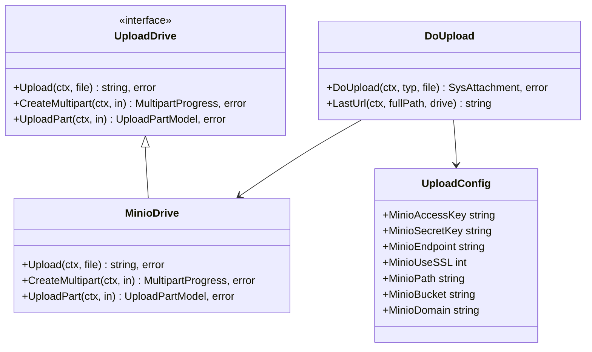
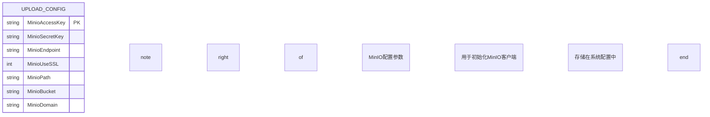
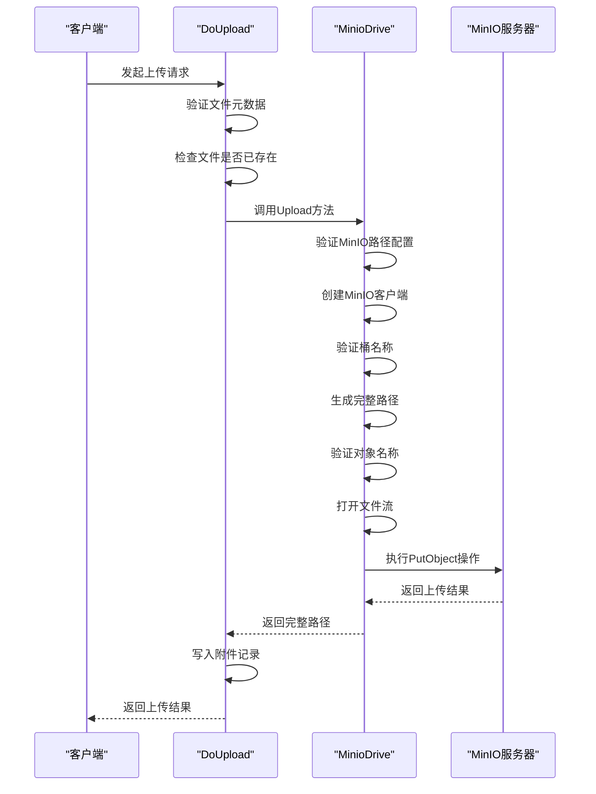
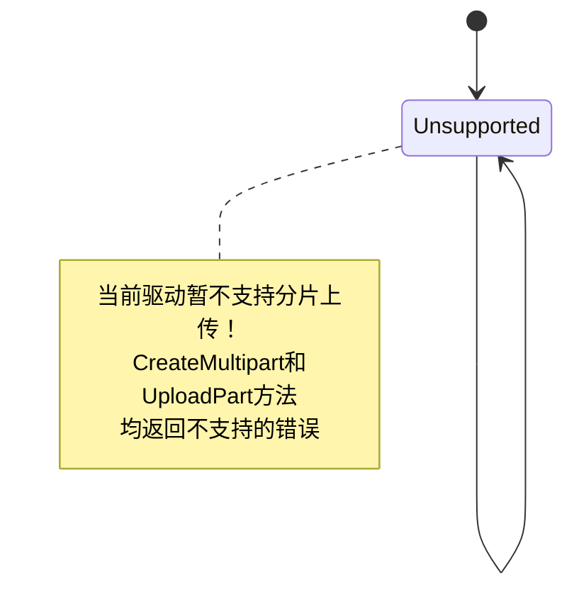
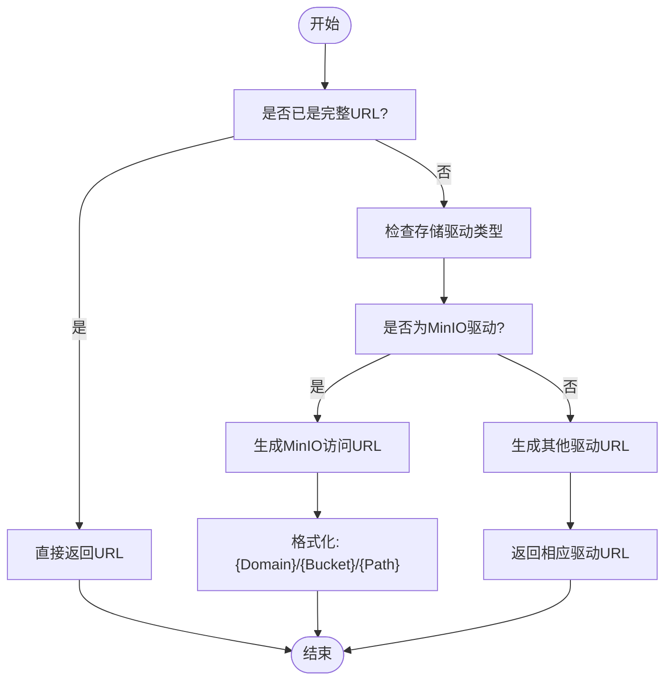

# MinIO集成

<cite>
**Referenced Files in This Document**   
- [upload_minio.go](file://server/internal/library/storager/upload_minio.go)
- [upload.go](file://server/internal/library/storager/upload.go)
- [model.go](file://server/internal/library/storager/model.go)
- [config.go](file://server/internal/model/config.go)
- [upload.go](file://server/internal/consts/upload.go)
</cite>

## 目录
1. [简介](#简介)
2. [核心组件](#核心组件)
3. [MinIO驱动实现](#minio驱动实现)
4. [配置与初始化](#配置与初始化)
5. [上传流程分析](#上传流程分析)
6. [分片上传支持](#分片上传支持)
7. [访问策略与URL生成](#访问策略与url生成)
8. [私有化部署指南](#私有化部署指南)
9. [性能优化建议](#性能优化建议)
10. [集群扩展策略](#集群扩展策略)

## 简介
本文档详细介绍了HotGo框架中MinIO对象存储服务的集成方案。文档涵盖了`upload_minio.go`文件中的核心实现，包括与MinIO服务的交互机制、桶管理、对象操作和策略配置。同时，本文档提供了在私有化部署环境中使用MinIO作为S3兼容存储后端的完整指南，包括分布式模式配置、访问策略设置和加密功能启用等关键内容。

**Section sources**
- [upload_minio.go](file://server/internal/library/storager/upload_minio.go#L1-L77)

## 核心组件
MinIO集成的核心组件主要包括存储驱动接口、MinIO驱动实现、配置管理以及上传流程控制器。这些组件协同工作，实现了文件上传到MinIO对象存储的完整功能。



**Diagram sources**
- [upload.go](file://server/internal/library/storager/upload.go#L41-L68)
- [upload_minio.go](file://server/internal/library/storager/upload_minio.go#L20-L21)
- [config.go](file://server/internal/model/config.go#L90-L96)

**Section sources**
- [upload.go](file://server/internal/library/storager/upload.go#L41-L68)
- [upload_minio.go](file://server/internal/library/storager/upload_minio.go#L20-L21)
- [config.go](file://server/internal/model/config.go#L90-L96)

## MinIO驱动实现
MinIO驱动实现了`UploadDrive`接口，提供了与MinIO对象存储服务交互的核心功能。驱动通过MinIO Go SDK与服务端进行通信，执行文件上传等操作。

### MinIO驱动结构
`MinioDrive`结构体是MinIO存储驱动的核心实现，它实现了`UploadDrive`接口定义的所有方法。

```mermaid
classDiagram
class MinioDrive {
+Upload(ctx, file) string, error
+CreateMultipart(ctx, in) MultipartProgress, error
+UploadPart(ctx, in) UploadPartModel, error
}
note right of MinioDrive
MinIO对象存储驱动
实现了UploadDrive接口
负责与MinIO服务交互
end note
```

**Diagram sources**
- [upload_minio.go](file://server/internal/library/storager/upload_minio.go#L20-L21)

**Section sources**
- [upload_minio.go](file://server/internal/library/storager/upload_minio.go#L20-L21)

## 配置与初始化
MinIO集成需要在系统配置中正确设置相关参数，包括访问密钥、端点、桶名称等。这些配置通过`UploadConfig`结构体进行管理。

### 配置参数
MinIO相关的配置参数定义在`UploadConfig`结构体中，主要包括：



**Diagram sources**
- [config.go](file://server/internal/model/config.go#L90-L96)

**Section sources**
- [config.go](file://server/internal/model/config.go#L90-L96)

## 上传流程分析
文件上传到MinIO的流程涉及多个步骤，从配置验证到实际的文件传输，每个环节都经过精心设计以确保可靠性和安全性。

### 上传流程序列图


**Diagram sources**
- [upload.go](file://server/internal/library/storager/upload.go#L71-L103)
- [upload_minio.go](file://server/internal/library/storager/upload_minio.go#L24-L63)

**Section sources**
- [upload.go](file://server/internal/library/storager/upload.go#L71-L103)
- [upload_minio.go](file://server/internal/library/storager/upload_minio.go#L24-L63)

## 分片上传支持
目前MinIO驱动的分片上传功能尚未实现，相关方法返回不支持的错误信息。

### 分片上传状态


**Diagram sources**
- [upload_minio.go](file://server/internal/library/storager/upload_minio.go#L66-L72)

**Section sources**
- [upload_minio.go](file://server/internal/library/storager/upload_minio.go#L66-L72)

## 访问策略与URL生成
系统通过`LastUrl`函数生成文件的访问URL，该函数根据不同的存储驱动返回相应的访问地址。

### URL生成逻辑


**Diagram sources**
- [upload.go](file://server/internal/library/storager/upload.go#L160-L181)

**Section sources**
- [upload.go](file://server/internal/library/storager/upload.go#L160-L181)

## 私有化部署指南
在私有化部署环境中使用MinIO作为S3兼容存储后端，需要遵循特定的配置和部署策略。

### 分布式模式配置
要配置MinIO的分布式模式，需要在`config.go`中正确设置以下参数：
- `MinioEndpoint`: MinIO服务的访问端点
- `MinioAccessKey`和`MinioSecretKey`: 访问密钥对
- `MinioBucket`: 默认存储桶名称
- `MinioDomain`: 外部访问域名
- `MinioUseSSL`: 是否启用SSL加密

分布式部署建议使用至少4个节点以实现数据冗余和高可用性。

### 访问策略设置
MinIO的访问策略通过IAM（身份和访问管理）系统进行配置。在HotGo框架中，访问策略主要通过以下方式实现：
1. 使用`MinioAccessKey`和`MinioSecretKey`进行身份验证
2. 通过`MinioBucket`限制访问范围
3. 利用`MinioUseSSL`启用传输加密

### 加密功能启用
要启用MinIO的加密功能，需要：
1. 确保`MinioUseSSL`设置为1以启用HTTPS
2. 在MinIO服务器端配置TLS证书
3. 考虑使用MinIO的服务器端加密（SSE）功能保护静态数据

**Section sources**
- [config.go](file://server/internal/model/config.go#L90-L96)
- [upload_minio.go](file://server/internal/library/storager/upload_minio.go#L30-L32)

## 性能优化建议
为了支持大规模文件存储需求，建议采取以下性能优化措施：

1. **连接池管理**: 复用MinIO客户端连接，避免频繁创建和销毁连接
2. **并发上传**: 实现分片上传功能以支持大文件的并行上传
3. **缓存策略**: 利用本地缓存减少对MinIO服务的直接访问
4. **批量操作**: 对于大量小文件，考虑使用批量上传API
5. **网络优化**: 确保应用服务器与MinIO集群之间的网络延迟最小化

**Section sources**
- [upload_minio.go](file://server/internal/library/storager/upload_minio.go#L30-L32)

## 集群扩展策略
为了支持大规模文件存储需求，建议采用以下集群扩展策略：

1. **水平扩展**: 增加MinIO服务器节点以提高存储容量和吞吐量
2. **数据分片**: 根据业务需求将数据分布到不同的存储桶中
3. **负载均衡**: 在MinIO集群前端部署负载均衡器以分发请求
4. **监控告警**: 建立完善的监控系统，实时跟踪集群状态和性能指标
5. **定期维护**: 制定定期维护计划，包括数据备份、节点升级等

通过合理的集群扩展策略，可以确保系统能够随着业务增长而平滑扩展。

**Section sources**
- [upload_minio.go](file://server/internal/library/storager/upload_minio.go#L39-L43)