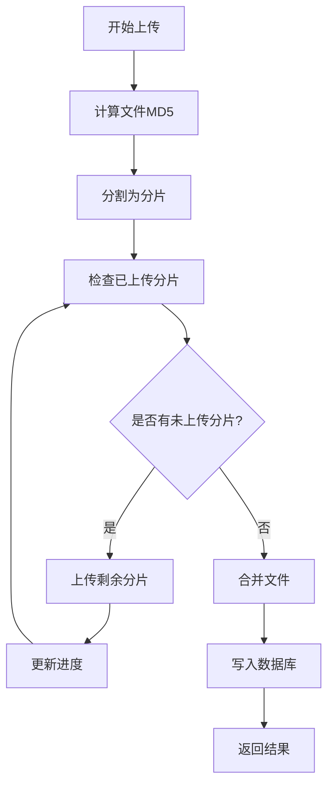
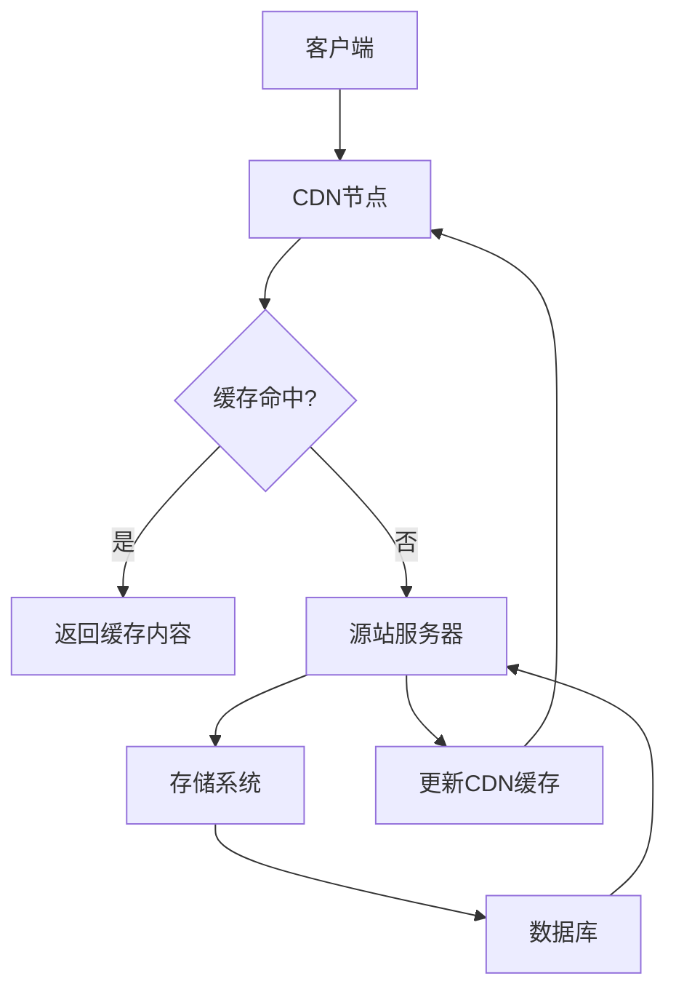

# 存储最佳实践

<cite>
**本文档引用文件**  
- [upload.go](file://server/internal/library/storager/upload.go)
- [config.go](file://server/internal/model/config.go)
- [mime.go](file://server/internal/library/storager/mime.go)
- [multipartUpload.vue](file://web/src/components/Upload/multipartUpload.vue)
- [cache.go](file://server/internal/library/cache/cache.go)
</cite>

## 目录
1. [简介](#简介)
2. [安全措施](#安全措施)
3. [断点续传与分片上传](#断点续传与分片上传)
4. [CDN加速配置](#cdn加速配置)
5. [存储成本优化](#存储成本优化)
6. [监控指标建议](#监控指标建议)

## 简介
本指南旨在为文件存储系统提供全面的最佳实践方案，涵盖从上传安全、大文件处理、CDN加速到成本优化和监控的完整流程。系统支持多种存储驱动，包括本地存储、UCloud、腾讯云COS、阿里云OSS、七牛云和MinIO，具备灵活的配置能力和可扩展性。

## 安全措施

### 文件类型白名单验证
系统通过配置文件中的 `uploadFileType` 和 `uploadImageType` 字段实现文件类型白名单控制。上传时会根据文件扩展名进行验证，仅允许白名单内的文件类型上传。支持的文件类型分为图片、文档、音频、视频、压缩包和其他六大类，每类均有明确的MIME类型映射。

### 大小限制
系统支持对不同类型文件设置大小限制：
- 通用文件大小限制通过 `uploadFileSize` 配置（单位：MB）
- 图片文件大小限制通过 `uploadImageSize` 配置（单位：MB）
当上传文件超过限制时，系统将返回相应的错误提示。

### 敏感内容过滤
前端组件 `text/mint/index.vue` 集成了敏感词汇过滤功能，使用 `mint-filter` 库对用户输入的文本进行实时检测和过滤，可有效防止敏感信息的上传和传播。

**Section sources**
- [config.go](file://server/internal/model/config.go#L53-L85)
- [mime.go](file://server/internal/library/storager/mime.go#L48-L148)
- [upload.go](file://server/internal/library/storager/upload.go#L105-L157)

## 断点续传与分片上传

### 实现原理
系统实现了完整的分片上传机制，支持大文件的断点续传功能。前端使用 `spark-md5` 库计算文件MD5值作为唯一标识，将大文件分割为2MB的分片进行上传。

### 前端流程
1. 读取文件并计算MD5值
2. 将文件分割为固定大小的分片
3. 调用 `CheckMultipart` 接口检查已上传的分片
4. 只上传未完成的分片，实现断点续传
5. 实时更新上传进度

### 后端处理
后端通过缓存系统记录分片上传进度，关键流程包括：
- 使用 `CreateMultipartProgress` 创建上传进度记录
- 使用 `UpdateMultipartProgress` 更新已上传分片索引
- 使用 `MergePartFile` 合并所有分片文件
- 最终生成完整的文件并记录到数据库

**Diagram sources**
- [multipartUpload.vue](file://web/src/components/Upload/multipartUpload.vue#L86-L196)
- [upload.go](file://server/internal/library/storager/upload.go#L294-L391)
- [upload_local.go](file://server/internal/library/storager/upload_local.go#L54-L155)

**Section sources**
- [multipartUpload.vue](file://web/src/components/Upload/multipartUpload.vue#L43-L196)
- [upload.go](file://server/internal/library/storager/upload.go#L294-L391)

## CDN加速配置

### 存储驱动URL生成
系统根据不同存储驱动自动生成最终的文件访问地址：
- 本地存储：拼接服务器地址和相对路径
- UCloud：使用 `uploadUCloudEndpoint` 配置
- 腾讯云COS：使用 `uploadCosBucketURL` 配置
- 阿里云OSS：使用 `uploadOssBucketURL` 配置
- 七牛云：使用 `uploadQiNiuDomain` 配置
- MinIO：组合 `uploadMinioDomain`、`uploadMinioBucket` 和路径

### 缓存策略
系统支持多种缓存适配器，可通过配置文件设置：
- Redis：高性能分布式缓存
- 文件：基于文件系统的缓存
- 内存：默认的内存缓存

分片上传进度信息缓存在 `CacheMultipartUpload` 键下，有效期为7天。

**Diagram sources**
- [upload.go](file://server/internal/library/storager/upload.go#L159-L185)
- [cache.go](file://server/internal/library/cache/cache.go#L30-L57)

**Section sources**
- [upload.go](file://server/internal/library/storager/upload.go#L159-L185)
- [cache.go](file://server/internal/library/cache/cache.go#L30-L57)

## 存储成本优化

### 智能分层存储
系统支持多种存储驱动，可根据业务需求选择合适的存储方案：
- 本地存储：适合小规模应用，成本最低
- 对象存储（COS/OSS/七牛云）：适合大规模应用，具备高可用性和扩展性
- MinIO：适合私有化部署，兼容S3协议

### 生命周期管理
系统通过以下方式实现存储生命周期管理：
- 分片上传临时文件存储在 `tmp/` 目录下
- 合并完成后自动删除临时分片文件
- 使用MD5值去重，避免重复存储相同文件
- 通过配置不同的存储路径实现文件分类管理

**Section sources**
- [config.go](file://server/internal/model/config.go#L53-L97)
- [upload_local.go](file://server/internal/library/storager/upload_local.go#L107-L155)

## 监控指标建议

### 关键监控指标
| 指标名称 | 说明 | 采集方式 |
|--------|------|---------|
| 上传成功率 | 成功上传的文件数与总上传请求数的比例 | 统计上传接口的成功/失败响应 |
| 平均响应时间 | 文件上传请求的平均处理时间 | 记录请求开始到结束的时间差 |
| 存储使用率 | 当前存储空间使用量占总容量的比例 | 查询存储驱动的容量信息 |
| 分片上传完成率 | 成功完成的分片上传任务比例 | 统计分片上传的完成情况 |
| 缓存命中率 | 缓存查询命中的比例 | 统计缓存读取的成功/失败次数 |

### 日志记录
系统在关键操作点记录日志：
- 文件上传开始和结束
- 分片上传进度更新
- 缓存操作（读取、写入、删除）
- 存储驱动操作异常

**Section sources**
- [upload.go](file://server/internal/library/storager/upload.go#L101-L103)
- [cache.go](file://server/internal/library/cache/cache.go#L40-L45)