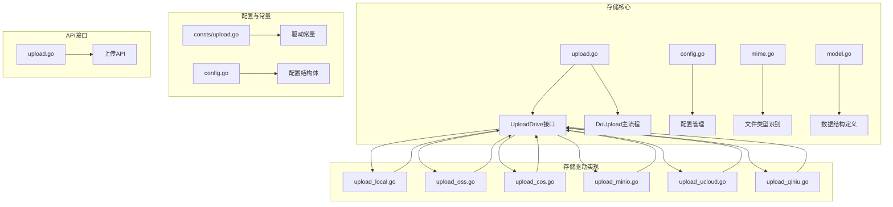
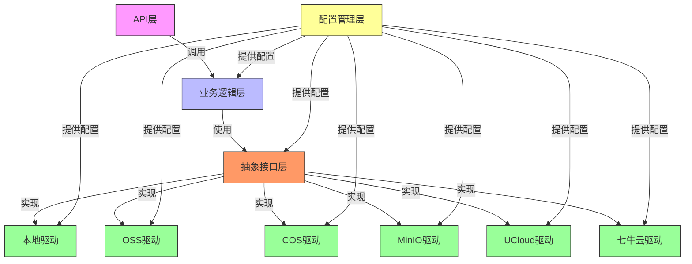
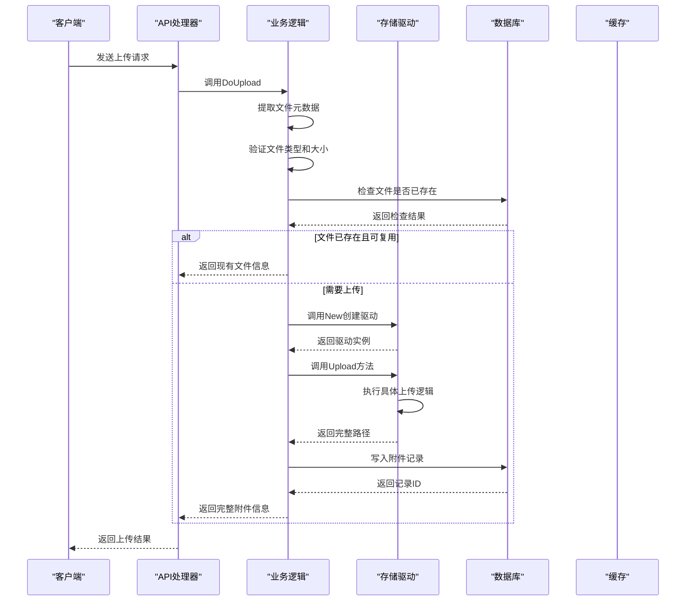
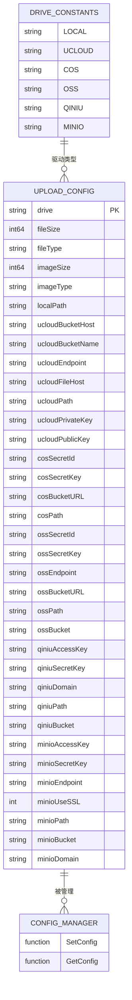
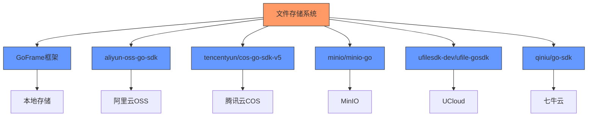

# 文件存储集成

<cite>
**本文档引用文件**  
- [config.go](file://server/internal/library/storager/config.go)
- [model.go](file://server/internal/library/storager/model.go)
- [mime.go](file://server/internal/library/storager/mime.go)
- [upload.go](file://server/internal/library/storager/upload.go)
- [upload_local.go](file://server/internal/library/storager/upload_local.go)
- [upload_oss.go](file://server/internal/library/storager/upload_oss.go)
- [upload_cos.go](file://server/internal/library/storager/upload_cos.go)
- [upload_minio.go](file://server/internal/library/storager/upload_minio.go)
- [upload_ucloud.go](file://server/internal/library/storager/upload_ucloud.go)
- [upload_qiniu.go](file://server/internal/library/storager/upload_qiniu.go)
- [upload.go](file://server/api/admin/common/upload.go)
- [consts/upload.go](file://server/internal/consts/upload.go)
- [config.go](file://server/internal/model/config.go)
</cite>

## 目录
1. [简介](#简介)
2. [项目结构](#项目结构)
3. [核心组件](#核心组件)
4. [架构概述](#架构概述)
5. [详细组件分析](#详细组件分析)
6. [依赖分析](#依赖分析)
7. [性能考虑](#性能考虑)
8. [故障排除指南](#故障排除指南)
9. [结论](#结论)

## 简介
本项目提供了一个统一的文件存储集成解决方案，支持多种存储后端，包括本地存储、阿里云OSS、腾讯云COS、MinIO、七牛云和UCloud。系统通过抽象层设计实现了存储驱动的可插拔性，允许开发者根据需求灵活切换存储方式。上传功能支持普通文件上传和分片上传两种模式，并集成了文件类型验证、大小限制、MD5校验等安全机制。所有配置通过统一的配置结构进行管理，便于维护和扩展。

## 项目结构
文件存储相关功能主要集中在`server/internal/library/storager`目录下，包含配置管理、元数据处理、上传逻辑和各个存储驱动的实现。API接口定义在`server/api/admin/common/upload.go`中，而存储驱动常量定义在`server/internal/consts/upload.go`中。配置结构体定义在`server/internal/model/config.go`中，涵盖了所有支持的存储后端的配置参数。

**图示来源**  
- [upload.go](file://server/internal/library/storager/upload.go#L31-L38)
- [config.go](file://server/internal/library/storager/config.go#L1-L28)
- [mime.go](file://server/internal/library/storager/mime.go#L1-L232)
- [model.go](file://server/internal/library/storager/model.go#L1-L69)
- [consts/upload.go](file://server/internal/consts/upload.go#L1-L16)
- [config.go](file://server/internal/model/config.go#L1-L188)

**本节来源**  
- [server/internal/library/storager](file://server/internal/library/storager)
- [server/api/admin/common/upload.go](file://server/api/admin/common/upload.go#L1-L38)

## 核心组件
系统的核心组件包括存储驱动接口`UploadDrive`、驱动工厂函数`New`、主上传函数`DoUpload`以及统一的配置管理。`UploadDrive`接口定义了所有存储驱动必须实现的方法，确保了不同存储后端的统一调用方式。`New`函数根据配置动态创建相应的存储驱动实例，实现了策略模式。`DoUpload`函数封装了完整的上传流程，包括文件验证、重复检查、驱动上传和记录写入。配置通过`SetConfig`和`GetConfig`函数进行全局管理，确保配置的一致性。

**本节来源**  
- [upload.go](file://server/internal/library/storager/upload.go#L31-L103)
- [config.go](file://server/internal/library/storager/config.go#L1-L28)

## 架构概述
系统采用分层架构设计，从上到下分为API层、业务逻辑层、抽象接口层和具体实现层。API层定义了上传相关的HTTP接口，业务逻辑层处理上传的核心流程，抽象接口层定义了统一的存储操作契约，具体实现层提供了各个存储后端的具体实现。这种设计实现了关注点分离，提高了代码的可维护性和可扩展性。配置管理层贯穿整个系统，为各层提供必要的配置信息。

**图示来源**  
- [upload.go](file://server/internal/library/storager/upload.go#L31-L38)
- [upload.go](file://server/internal/library/storager/upload.go#L71-L103)
- [config.go](file://server/internal/library/storager/config.go#L1-L28)

## 详细组件分析

### 存储驱动接口分析
`UploadDrive`接口是整个存储系统的核心契约，定义了所有存储驱动必须实现的三个方法：`Upload`用于普通文件上传，`CreateMultipart`用于创建分片上传事件，`UploadPart`用于上传单个分片。这种设计确保了不同存储后端的统一调用方式，使得上层业务逻辑无需关心具体的存储实现。

**图示来源**  
- [upload.go](file://server/internal/library/storager/upload.go#L31-L38)
- [upload_local.go](file://server/internal/library/storager/upload_local.go#L1-L156)
- [upload_oss.go](file://server/internal/library/storager/upload_oss.go#L1-L59)
- [upload_cos.go](file://server/internal/library/storager/upload_cos.go#L1-L59)
- [upload_minio.go](file://server/internal/library/storager/upload_minio.go#L1-L76)
- [upload_ucloud.go](file://server/internal/library/storager/upload_ucloud.go#L1-L62)
- [upload_qiniu.go](file://server/internal/library/storager/upload_qiniu.go#L1-L69)

### 上传流程分析
文件上传流程从API接口开始，经过一系列验证和处理，最终完成文件存储和记录写入。流程包括文件元数据提取、类型和大小验证、重复文件检查、驱动上传和数据库记录写入。对于大文件，系统支持分片上传，通过缓存记录上传进度，确保断点续传的可靠性。

**图示来源**  
- [upload.go](file://server/internal/library/storager/upload.go#L71-L103)
- [upload.go](file://server/internal/library/storager/upload.go#L105-L180)
- [upload.go](file://server/internal/library/storager/upload.go#L305-L320)

### 配置管理分析
系统通过`UploadConfig`结构体统一管理所有存储相关的配置，包括通用配置、本地存储配置和各个云存储的特定配置。配置通过`SetConfig`和`GetConfig`函数进行全局管理，确保配置的一致性和线程安全性。驱动类型通过常量定义，便于维护和避免硬编码。

**图示来源**  
- [config.go](file://server/internal/model/config.go#L1-L188)
- [consts/upload.go](file://server/internal/consts/upload.go#L1-L16)
- [config.go](file://server/internal/library/storager/config.go#L1-L28)

## 依赖分析
系统依赖于多个外部库来实现不同存储后端的功能。本地存储依赖于GoFrame框架的文件处理功能，阿里云OSS依赖于`aliyun-oss-go-sdk`，腾讯云COS依赖于`tencentyun/cos-go-sdk-v5`，MinIO依赖于`minio/minio-go`，UCloud依赖于`ufilesdk-dev/ufile-gosdk`，七牛云依赖于`qiniu/go-sdk`。这些依赖通过接口抽象进行隔离，确保了系统的可测试性和可维护性。

**图示来源**  
- [upload_local.go](file://server/internal/library/storager/upload_local.go#L1-L156)
- [upload_oss.go](file://server/internal/library/storager/upload_oss.go#L1-L59)
- [upload_cos.go](file://server/internal/library/storager/upload_cos.go#L1-L59)
- [upload_minio.go](file://server/internal/library/storager/upload_minio.go#L1-L76)
- [upload_ucloud.go](file://server/internal/library/storager/upload_ucloud.go#L1-L62)
- [upload_qiniu.go](file://server/internal/library/storager/upload_qiniu.go#L1-L69)

## 性能考虑
系统在设计时考虑了多个性能优化点。首先，通过MD5校验实现文件去重，避免重复上传和存储相同文件，节省带宽和存储空间。其次，使用缓存存储分片上传进度，减少数据库查询压力。文件路径生成采用时间戳加随机字符串的方式，确保路径唯一性的同时避免热点目录问题。对于大文件上传，系统支持分片上传，提高上传成功率和用户体验。

## 故障排除指南
常见问题包括存储驱动配置错误、权限不足、网络连接问题等。对于配置错误，应检查对应存储后端的access key、secret key、endpoint、bucket name等参数是否正确。对于权限问题，需确保应用具有足够的权限访问存储服务。网络问题可能需要检查防火墙设置或使用代理。分片上传失败时，可检查缓存服务是否正常运行。所有错误都有相应的错误信息返回，便于定位问题。

**本节来源**  
- [upload.go](file://server/internal/library/storager/upload.go#L71-L103)
- [upload_local.go](file://server/internal/library/storager/upload_local.go#L1-L156)
- [upload_oss.go](file://server/internal/library/storager/upload_oss.go#L1-L59)
- [upload_cos.go](file://server/internal/library/storager/upload_cos.go#L1-L59)
- [upload_minio.go](file://server/internal/library/storager/upload_minio.go#L1-L76)
- [upload_ucloud.go](file://server/internal/library/storager/upload_ucloud.go#L1-L62)
- [upload_qiniu.go](file://server/internal/library/storager/upload_qiniu.go#L1-L69)

## 结论
本文件存储集成系统提供了一个灵活、可扩展的解决方案，支持多种存储后端。通过清晰的分层架构和接口抽象，系统实现了高内聚低耦合的设计目标。配置管理集中化，便于维护和部署。虽然当前各云存储驱动尚未实现分片上传功能，但接口设计已预留扩展空间，未来可逐步完善。系统整体设计合理，具备良好的可维护性和可扩展性，能够满足大多数应用场景的需求。