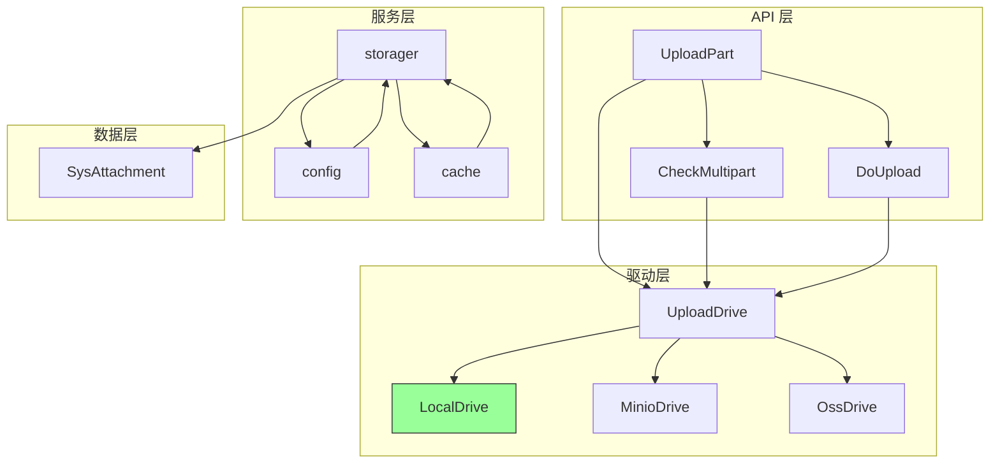
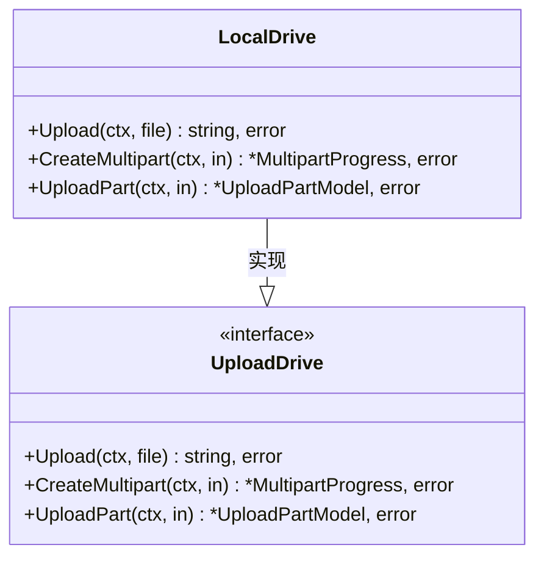
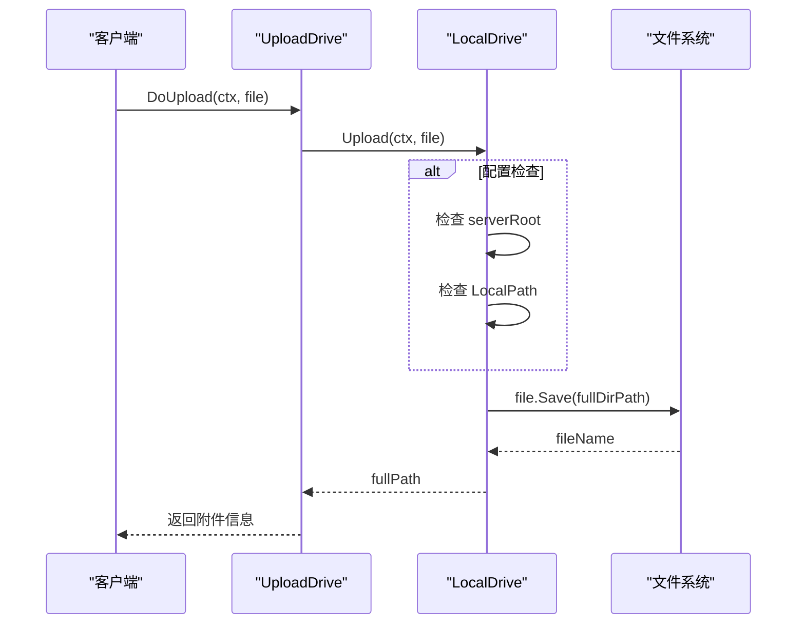
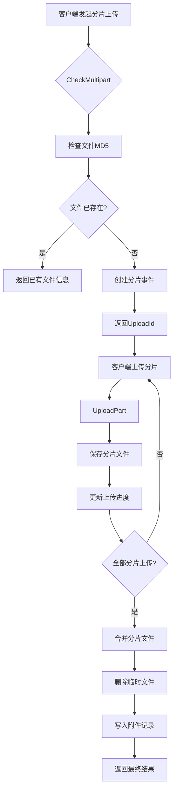
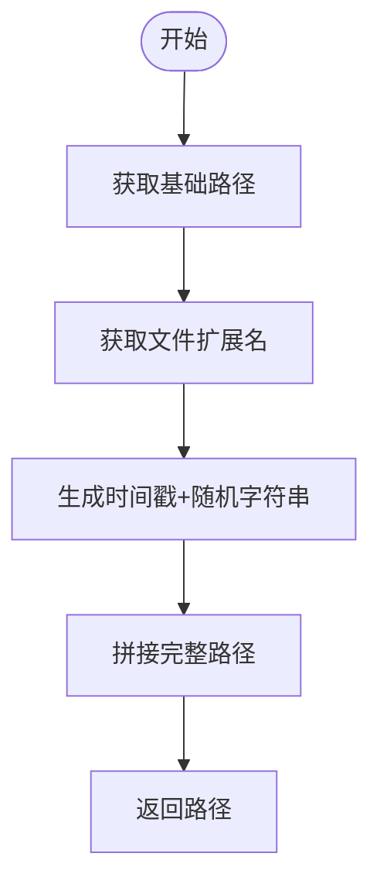
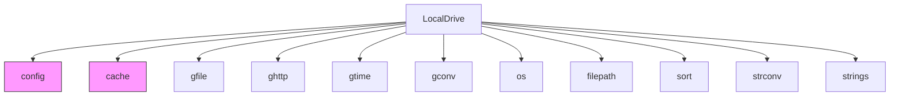

# 本地存储

<cite>
**Referenced Files in This Document**  
- [upload_local.go](file://server/internal/library/storager/upload_local.go)
- [upload.go](file://server/internal/library/storager/upload.go)
- [model.go](file://server/internal/library/storager/model.go)
- [config.go](file://server/internal/model/config.go)
- [consts/upload.go](file://server/internal/consts/upload.go)
- [config.go](file://server/internal/library/storager/config.go)
</cite>

## 目录
1. [简介](#简介)
2. [核心组件](#核心组件)
3. [架构概述](#架构概述)
4. [详细组件分析](#详细组件分析)
5. [依赖分析](#依赖分析)
6. [性能考虑](#性能考虑)
7. [故障排除指南](#故障排除指南)
8. [结论](#结论)

## 简介
本文档详细阐述了`hotgo-2.0`项目中本地存储集成的实现机制。重点分析了`upload_local.go`文件中文件上传、下载、删除和元数据获取等接口的实现方式。文档涵盖了文件存储路径生成规则、目录创建机制、权限设置、文件名冲突处理、特殊字符处理等关键方面。同时提供了性能优化建议和安全考虑，为开发者和系统管理员提供了全面的技术参考。

## 核心组件
本文档的核心是`LocalDrive`结构体及其方法，它实现了`UploadDrive`接口，负责处理所有本地文件存储操作。该组件与配置管理、元数据处理和分片上传机制紧密协作，构成了完整的本地存储解决方案。

**Section sources**
- [upload_local.go](file://server/internal/library/storager/upload_local.go#L1-L156)
- [upload.go](file://server/internal/library/storager/upload.go#L1-L392)

## 架构概述
本地存储系统采用分层架构设计，各组件职责明确，通过清晰的接口进行交互。

**Diagram sources**
- [upload.go](file://server/internal/library/storager/upload.go#L37-L39)
- [upload_local.go](file://server/internal/library/storager/upload_local.go#L10-L12)

## 详细组件分析

### LocalDrive 结构体分析
`LocalDrive`是本地存储的核心实现，它是一个空结构体，仅作为方法的接收者，所有逻辑都封装在其方法中。

**Diagram sources**
- [upload_local.go](file://server/internal/library/storager/upload_local.go#L10-L12)
- [upload.go](file://server/internal/library/storager/upload.go#L37-L39)

### 文件上传流程分析
文件上传是本地存储的核心功能，`LocalDrive.Upload`方法处理了从接收到保存的完整流程。

#### 上传流程序列图

**Diagram sources**
- [upload_local.go](file://server/internal/library/storager/upload_local.go#L27-L52)
- [upload.go](file://server/internal/library/storager/upload.go#L71-L103)

### 分片上传机制分析
对于大文件，系统采用分片上传机制，`LocalDrive.CreateMultipart`和`LocalDrive.UploadPart`方法共同协作完成此功能。

#### 分片上传流程图

**Diagram sources**
- [upload_local.go](file://server/internal/library/storager/upload_local.go#L55-L135)
- [upload.go](file://server/internal/library/storager/upload.go#L261-L315)

### 文件存储路径生成
`GenFullPath`函数负责生成唯一的文件存储路径，确保文件名不冲突。

**Diagram sources**
- [upload.go](file://server/internal/library/storager/upload.go#L205-L209)

## 依赖分析
本地存储组件依赖于多个其他模块，形成了一个紧密协作的系统。

**Diagram sources**
- [upload_local.go](file://server/internal/library/storager/upload_local.go#L1-L15)
- [config.go](file://server/internal/library/storager/config.go#L1-L28)

**Section sources**
- [upload_local.go](file://server/internal/library/storager/upload_local.go#L1-L156)
- [config.go](file://server/internal/library/storager/config.go#L1-L28)

## 性能考虑
为了优化本地存储的性能，建议采取以下措施：

1. **使用SSD存储**：将`LocalPath`配置指向SSD磁盘，可以显著提高文件读写速度。
2. **配置合适的文件系统块大小**：对于大量小文件的场景，使用较小的块大小（如4KB）；对于大文件，使用较大的块大小（如64KB）以减少碎片。
3. **定期清理临时文件**：分片上传的临时文件存储在`tmp/`目录下，应设置定时任务定期清理过期文件。
4. **优化缓存策略**：`MultipartProgress`信息存储在缓存中，默认过期时间为7天，可根据实际需求调整。

## 故障排除指南
在使用本地存储时，可能会遇到以下常见问题：

**Section sources**
- [upload_local.go](file://server/internal/library/storager/upload_local.go#L27-L155)
- [upload.go](file://server/internal/library/storager/upload.go#L71-L391)

### 常见错误及解决方案
| 错误信息 | 可能原因 | 解决方案 |
|--------|--------|--------|
| "本地上传驱动必须配置静态路径!" | `server.serverRoot`未配置 | 检查`config.yaml`文件中的`server.serverRoot`配置 |
| "本地上传驱动必须配置本地存储路径!" | `uploadLocalPath`为空 | 在后台配置中设置本地存储路径 |
| "合并分片文件出错" | 权限不足或磁盘空间不足 | 检查目标目录权限和磁盘剩余空间 |
| "该分片已上传过了" | 客户端重复上传同一分片 | 客户端应记录已上传的分片索引 |

### 安全考虑
1. **防止路径遍历攻击**：系统通过`ghttp.UploadFile.Save`方法保存文件，该方法会自动处理路径安全，防止`../`等恶意路径。
2. **设置文件访问权限**：上传的文件应设置适当的文件权限（如644），避免敏感文件被未授权访问。
3. **定期清理临时文件**：`tmp/`目录下的分片文件应及时清理，避免占用过多磁盘空间和成为安全漏洞。

## 结论
`hotgo-2.0`的本地存储系统设计合理，功能完整。通过`LocalDrive`实现了文件上传、分片上传等核心功能，并通过配置化的方式支持了多种存储驱动。系统在性能和安全性方面都有充分考虑，为应用提供了可靠的文件存储服务。开发者在使用时应关注配置项的正确设置，并根据实际需求进行性能优化。