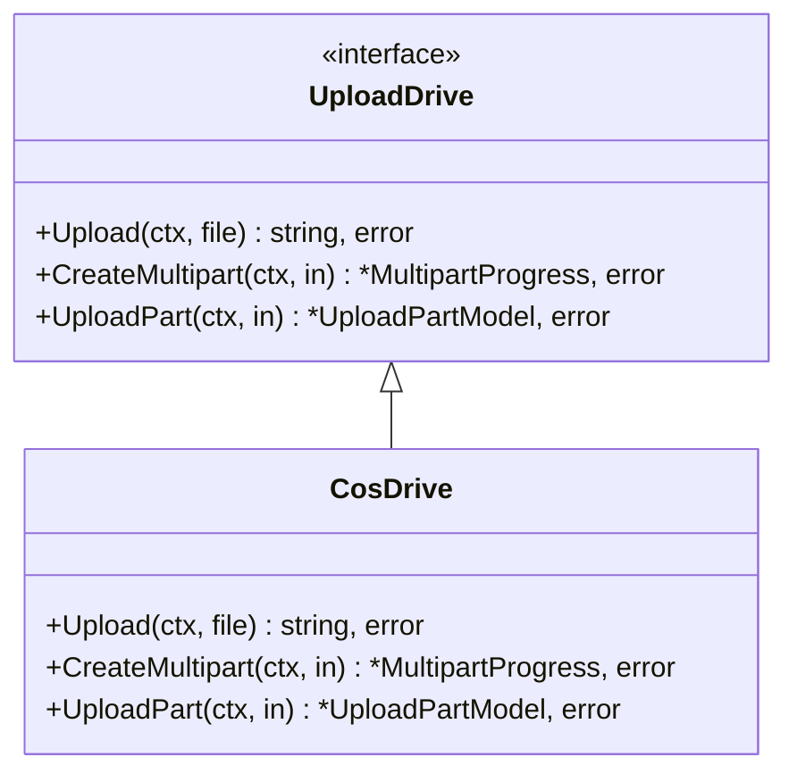
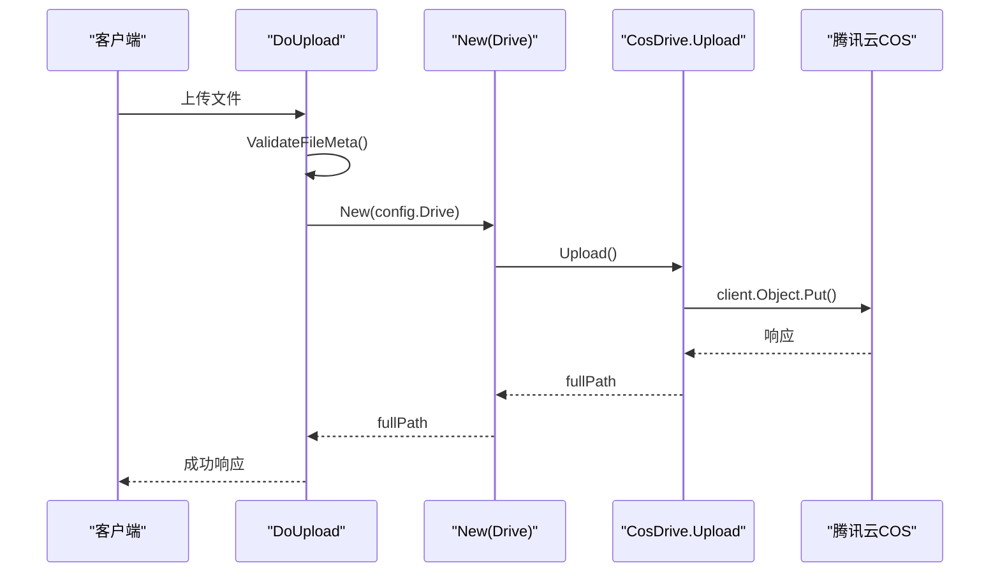
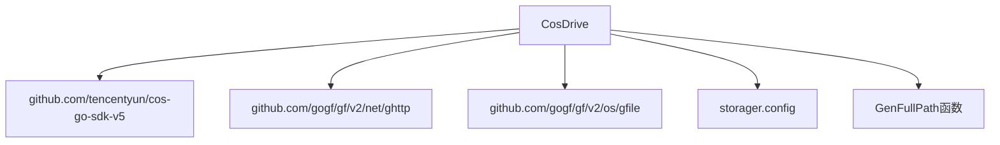

# 腾讯云COS集成

<cite>
**本文档引用文件**  
- [upload_cos.go](file://server/internal/library/storager/upload_cos.go)
- [config.go](file://server/internal/library/storager/config.go)
- [model.go](file://server/internal/library/storager/model.go)
- [upload.go](file://server/internal/library/storager/upload.go)
- [config.go](file://server/internal/model/config.go)
- [upload.go](file://server/internal/consts/upload.go)
- [cache.go](file://server/internal/consts/cache.go)
</cite>

## 目录
1. [简介](#简介)
2. [项目结构](#项目结构)
3. [核心组件](#核心组件)
4. [架构概述](#架构概述)
5. [详细组件分析](#详细组件分析)
6. [依赖分析](#依赖分析)
7. [性能考虑](#性能考虑)
8. [故障排除指南](#故障排除指南)
9. [结论](#结论)

## 简介
本文档详细阐述了如何在 `hotgo` 项目中集成腾讯云对象存储（COS），包括文件上传、下载与管理功能的实现。同时说明了防盗链、跨域访问（CORS）、版本控制、预签名URL生成、高可用性配置以及监控告警机制的设置方法。

## 项目结构
项目中与腾讯云COS集成相关的文件主要位于 `server/internal/library/storager/` 目录下，该模块负责统一管理多种存储驱动，包括本地、UCloud、COS、OSS、七牛云和MinIO等。


**图示来源**  
- [upload.go](file://server/internal/library/storager/upload.go#L1-L50)
- [upload_cos.go](file://server/internal/library/storager/upload_cos.go#L1-L10)

## 核心组件
本节分析与腾讯云COS集成的核心组件，包括上传驱动、配置模型和通用上传逻辑。

**章节来源**  
- [upload_cos.go](file://server/internal/library/storager/upload_cos.go#L1-L60)
- [upload.go](file://server/internal/library/storager/upload.go#L1-L393)
- [model.go](file://server/internal/library/storager/model.go#L1-L70)

## 架构概述
系统采用插件化存储驱动设计，通过接口抽象不同云服务商的实现细节。上传请求由统一入口处理，根据配置动态选择具体驱动执行。

```mermaid
graph TB
Client[客户端] --> API[上传API]
API --> Upload[DoUpload]
Upload --> Validator[ValidateFileMeta]
Upload --> Drive[New(config.Drive)]
Drive --> Local[LocalDrive]
Drive --> Cos[CosDrive]
Drive --> Oss[OssDrive]
Drive --> QiNiu[QiNiuDrive]
Drive --> Minio[MinioDrive]
Drive --> UCloud[UCloudDrive]
Cos --> COS[腾讯云COS]
```

**图示来源**  
- [upload.go](file://server/internal/library/storager/upload.go#L31-L38)
- [upload_cos.go](file://server/internal/library/storager/upload_cos.go#L18-L19)

## 详细组件分析

### CosDrive 分析
`CosDrive` 是腾讯云COS的存储驱动实现，实现了 `UploadDrive` 接口，目前支持小文件流式上传，暂不支持分片上传。

#### 类图


**图示来源**  
- [upload.go](file://server/internal/library/storager/upload.go#L31-L38)
- [upload_cos.go](file://server/internal/library/storager/upload_cos.go#L18-L46)

#### 上传流程序列图


**图示来源**  
- [upload.go](file://server/internal/library/storager/upload.go#L205-L209)
- [upload_cos.go](file://server/internal/library/storager/upload_cos.go#L22-L46)

### 配置管理分析
系统通过 `UploadConfig` 结构体统一管理所有存储配置，COS相关配置项以 `uploadCos` 为前缀。

#### 配置结构表
| 配置项 | 键名 | 说明 |
|--------|------|------|
| 存储驱动 | uploadDrive | 存储驱动类型，COS为 "cos" |
| 秘钥ID | uploadCosSecretId | 腾讯云子账号SecretId |
| 秘钥Key | uploadCosSecretKey | 腾讯云子账号SecretKey |
| 存储桶URL | uploadCosBucketURL | COS存储桶访问域名 |
| 存储路径 | uploadCosPath | COS中相对存储路径 |

**章节来源**  
- [config.go](file://server/internal/model/config.go#L72-L75)
- [upload.go](file://server/internal/consts/upload.go#L11-L11)

## 依赖分析
COS集成依赖于腾讯云Go SDK和项目内部的配置、缓存、上下文等基础库。



**图示来源**  
- [upload_cos.go](file://server/internal/library/storager/upload_cos.go#L1-L60)
- [upload.go](file://server/internal/library/storager/upload.go#L205-L209)

## 性能考虑
- **小文件优化**：当前实现采用流式上传，适合小文件直接上传。
- **大文件限制**：暂不支持分片上传，大文件上传可能失败。
- **缓存机制**：使用Redis缓存分片上传进度，有效期7天。
- **文件去重**：基于MD5值检查文件是否已存在，避免重复上传。

## 故障排除指南
### 常见问题
1. **上传失败提示"必须配置存储路径"**  
   检查 `uploadCosPath` 配置项是否为空。

2. **403权限错误**  
   确认 `uploadCosSecretId` 和 `uploadCosSecretKey` 配置正确，且子账号具有COS写入权限。

3. **无法访问上传文件**  
   检查 `uploadCosBucketURL` 配置是否正确，确保COS存储桶为公共读或已配置预签名URL。

4. **分片上传不支持**  
   当前版本 `CosDrive` 暂不支持分片上传功能。

**章节来源**  
- [upload_cos.go](file://server/internal/library/storager/upload_cos.go#L22-L46)
- [config.go](file://server/internal/model/config.go#L72-L75)

## 结论
当前腾讯云COS集成实现了基本的文件上传功能，通过统一的存储驱动接口便于扩展。建议后续支持分片上传以提升大文件传输稳定性，并完善下载和管理功能。同时应配置COS防盗链、CORS和版本控制等安全策略，结合监控告警确保存储服务的高可用性。