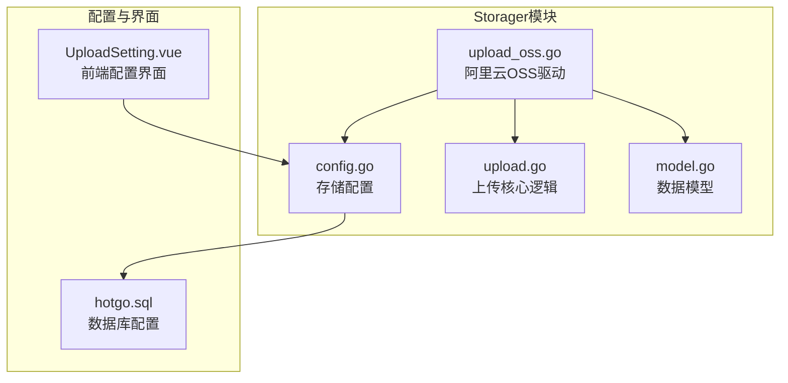
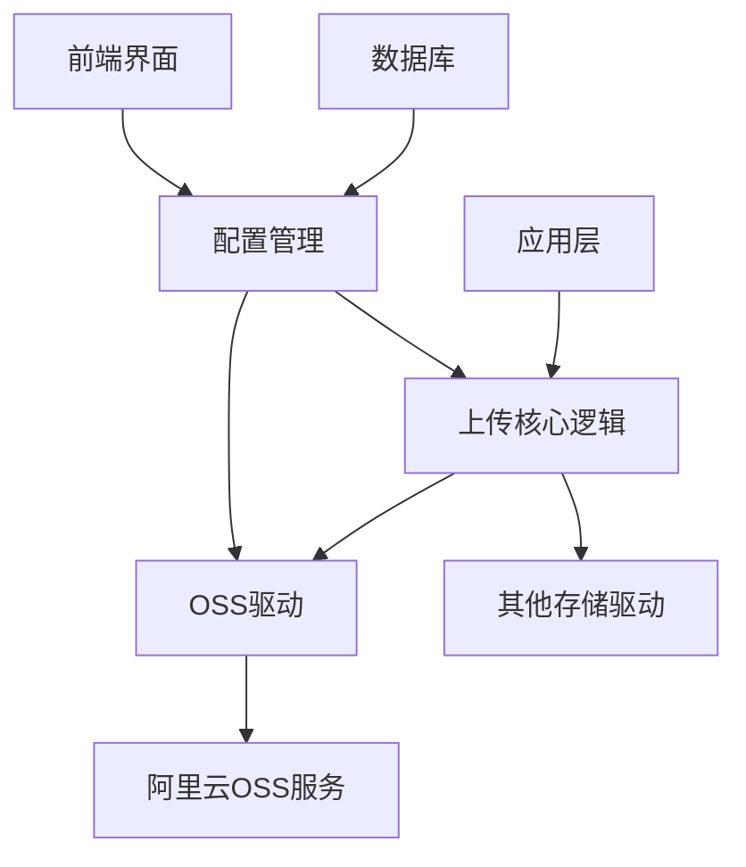
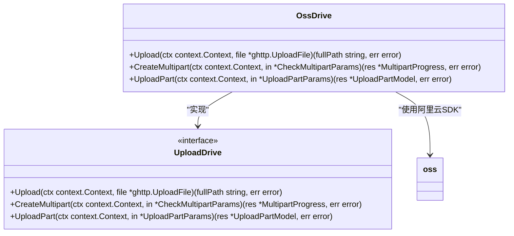
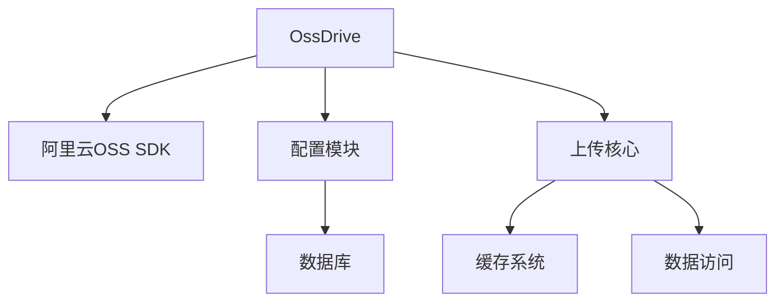
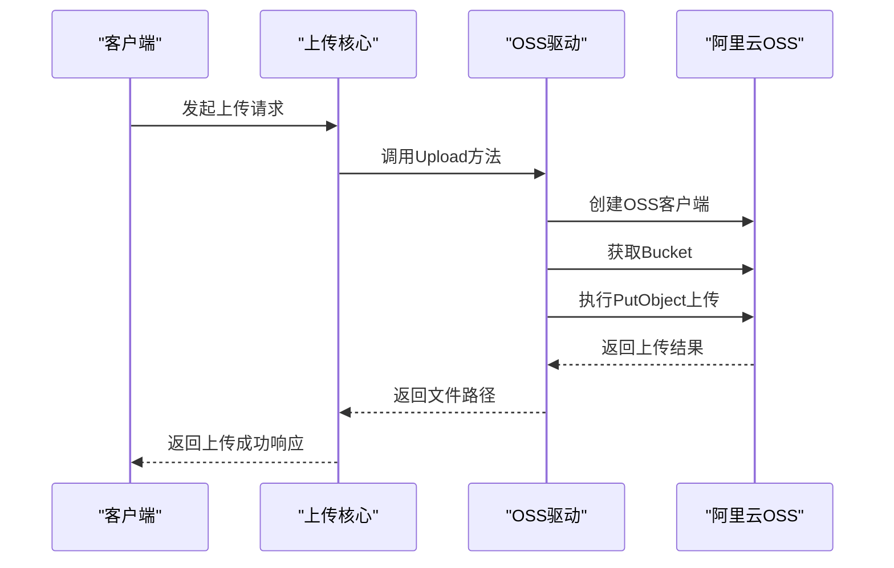

# 阿里云OSS集成

<cite>
**Referenced Files in This Document**   
- [upload_oss.go](file://server/internal/library/storager/upload_oss.go)
- [config.go](file://server/internal/library/storager/config.go)
- [upload.go](file://server/internal/library/storager/upload.go)
- [model.go](file://server/internal/library/storager/model.go)
- [upload.go](file://server/api/admin/common/upload.go)
- [hotgo.sql](file://server/storage/data/hotgo.sql)
- [UploadSetting.vue](file://web/src/views/system/config/UploadSetting.vue)
</cite>

## 目录
1. [简介](#简介)
2. [项目结构](#项目结构)
3. [核心组件](#核心组件)
4. [架构概述](#架构概述)
5. [详细组件分析](#详细组件分析)
6. [依赖分析](#依赖分析)
7. [性能考虑](#性能考虑)
8. [故障排除指南](#故障排除指南)
9. [结论](#结论)

## 简介
本文档全面介绍了在HotGo项目中如何集成和使用阿里云OSS（对象存储服务）。文档详细说明了`upload_oss.go`文件中实现的OSS操作，包括文件上传、配置管理、访问控制等核心功能。同时，文档还涵盖了OSS的配置策略、性能优化建议和成本控制策略，为开发者提供了一站式的OSS集成指南。

## 项目结构
HotGo项目中的OSS集成主要位于`server/internal/library/storager`目录下，该目录包含了所有与存储相关的驱动和配置。OSS相关的代码文件组织清晰，遵循了模块化的设计原则。

**Diagram sources**
- [upload_oss.go](file://server/internal/library/storager/upload_oss.go)
- [config.go](file://server/internal/library/storager/config.go)
- [upload.go](file://server/internal/library/storager/upload.go)
- [model.go](file://server/internal/library/storager/model.go)
- [hotgo.sql](file://server/storage/data/hotgo.sql)
- [UploadSetting.vue](file://web/src/views/system/config/UploadSetting.vue)

**Section sources**
- [upload_oss.go](file://server/internal/library/storager/upload_oss.go)
- [config.go](file://server/internal/library/storager/config.go)

## 核心组件
OSS集成的核心组件主要包括`OssDrive`结构体、配置管理模块和上传核心逻辑。`OssDrive`实现了`UploadDrive`接口，提供了与阿里云OSS交互的具体方法。配置管理模块负责加载和管理OSS相关的配置参数，而上传核心逻辑则处理了文件上传的通用流程。

**Section sources**
- [upload_oss.go](file://server/internal/library/storager/upload_oss.go#L20-L58)
- [upload.go](file://server/internal/library/storager/upload.go#L50-L100)
- [config.go](file://server/internal/library/storager/config.go#L15-L25)

## 架构概述
OSS集成的架构设计遵循了分层和解耦的原则。上层应用通过统一的上传接口与存储系统交互，而具体的OSS操作由`OssDrive`驱动实现。配置信息通过`config`模块集中管理，确保了配置的一致性和可维护性。

**Diagram sources**
- [upload_oss.go](file://server/internal/library/storager/upload_oss.go)
- [upload.go](file://server/internal/library/storager/upload.go)
- [config.go](file://server/internal/library/storager/config.go)

## 详细组件分析

### OSS驱动分析
`OssDrive`是阿里云OSS的驱动实现，负责与阿里云OSS服务进行交互。目前实现了基本的文件上传功能，但分片上传功能尚未支持。

#### OSS驱动类图

**Diagram sources**
- [upload_oss.go](file://server/internal/library/storager/upload_oss.go#L15-L60)

**Section sources**
- [upload_oss.go](file://server/internal/library/storager/upload_oss.go#L15-L60)

### 配置管理分析
OSS的配置信息通过数据库进行管理，包括Endpoint、Bucket名称、AccessKey等关键参数。配置信息在系统启动时加载到内存中，供OSS驱动使用。

#### 配置参数表
| 配置项 | 参数名 | 说明 |
|--------|--------|------|
| OSS存储路径 | uploadOssPath | OSS对象存储中的相对路径 |
| AccessKey ID | uploadOssSecretId | 阿里云账号AccessKey ID |
| AccessKey Secret | uploadOssSecretKey | 阿里云账号AccessKey Secret |
| Endpoint | uploadOssEndpoint | OSS服务的地域节点 |
| Bucket名称 | uploadOssBucket | OSS存储空间名称 |
| Bucket域名 | uploadOssBucketURL | Bucket的访问域名 |

**Diagram sources**
- [hotgo.sql](file://server/storage/data/hotgo.sql#L1469-L1475)
- [UploadSetting.vue](file://web/src/views/system/config/UploadSetting.vue#L40-L70)

**Section sources**
- [hotgo.sql](file://server/storage/data/hotgo.sql#L1469-L1475)
- [UploadSetting.vue](file://web/src/views/system/config/UploadSetting.vue#L40-L70)

## 依赖分析
OSS集成依赖于阿里云OSS的Go SDK，通过该SDK与OSS服务进行通信。同时，OSS驱动依赖于项目的配置管理模块和通用上传逻辑模块。

**Diagram sources**
- [upload_oss.go](file://server/internal/library/storager/upload_oss.go)
- [config.go](file://server/internal/library/storager/config.go)
- [upload.go](file://server/internal/library/storager/upload.go)

**Section sources**
- [upload_oss.go](file://server/internal/library/storager/upload_oss.go)
- [config.go](file://server/internal/library/storager/config.go)
- [upload.go](file://server/internal/library/storager/upload.go)

## 性能考虑
当前OSS集成的性能优化主要集中在文件上传流程上。通过流式上传的方式，可以有效减少内存占用，提高大文件上传的效率。然而，由于分片上传功能尚未实现，大文件上传的稳定性和效率有待提升。

### 上传流程时序图

**Diagram sources**
- [upload_oss.go](file://server/internal/library/storager/upload_oss.go#L20-L46)
- [upload.go](file://server/internal/library/storager/upload.go#L150-L200)

## 故障排除指南
在使用OSS集成时，可能会遇到以下常见问题：

1. **配置错误**：确保所有OSS配置参数正确无误，特别是Endpoint、Bucket名称和AccessKey。
2. **权限不足**：检查AccessKey是否有足够的权限访问指定的Bucket。
3. **网络问题**：确保服务器能够正常访问OSS服务的Endpoint。
4. **分片上传不支持**：当前版本不支持分片上传，大文件上传可能会失败。

**Section sources**
- [upload_oss.go](file://server/internal/library/storager/upload_oss.go#L49-L58)
- [hotgo.sql](file://server/storage/data/hotgo.sql#L1469-L1475)

## 结论
当前的OSS集成实现了基本的文件上传功能，但在分片上传、断点续传等高级功能上还有待完善。建议在后续版本中实现分片上传功能，以提高大文件上传的稳定性和效率。同时，可以考虑集成OSS的生命周期管理、跨区域复制等高级功能，以满足更复杂的业务需求。