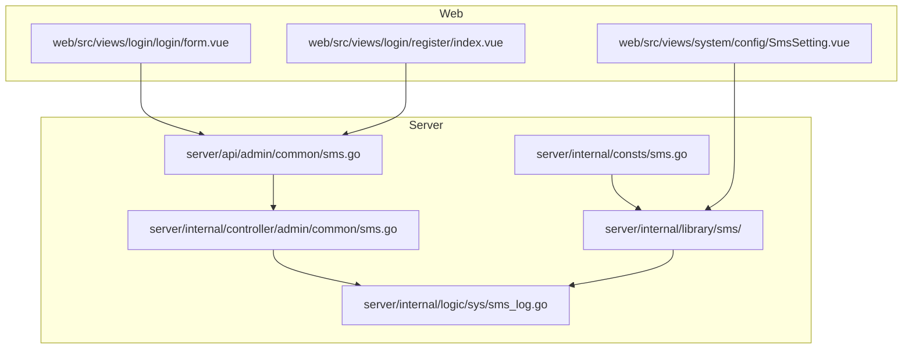
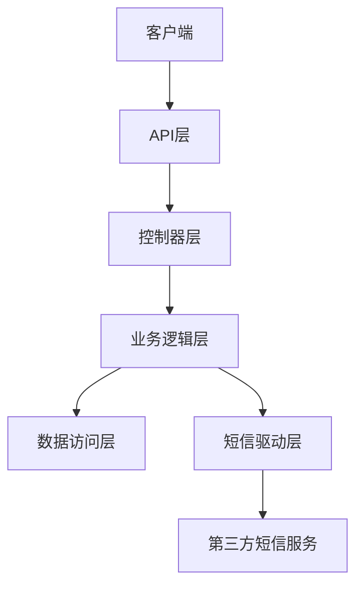
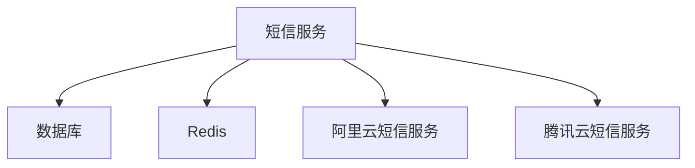

# 短信服务使用示例

<cite>
**本文档引用文件**  
- [sms.go](file://server/api/admin/common/sms.go)
- [sms_log.go](file://server/internal/logic/sys/sms_log.go)
- [sms.go](file://server/internal/library/sms/sms.go)
- [sms_aliyun.go](file://server/internal/library/sms/sms_aliyun.go)
- [sms_tencent.go](file://server/internal/library/sms/sms_tencent.go)
- [sms.go](file://server/internal/consts/sms.go)
- [sms_log.go](file://server/internal/model/input/sysin/sms_log.go)
- [SmsSetting.vue](file://web/src/views/system/config/SmsSetting.vue)
- [form.vue](file://web/src/views/login/login/form.vue)
- [index.vue](file://web/src/views/login/register/index.vue)
</cite>

## 目录
1. [简介](#简介)
2. [项目结构](#项目结构)
3. [核心组件](#核心组件)
4. [架构概述](#架构概述)
5. [详细组件分析](#详细组件分析)
6. [依赖分析](#依赖分析)
7. [性能考虑](#性能考虑)
8. [故障排除指南](#故障排除指南)
9. [结论](#结论)

## 简介
本文档旨在为短信服务的实际使用提供全面的示例和指导。通过具体的业务场景，如用户注册验证码发送、登录安全验证、支付通知等，展示如何在系统中集成和使用短信服务。文档详细说明了HTTP接口设计、请求参数验证、频率限制（基于Redis）和异步发送机制。此外，还涵盖了验证码生成、缓存存储、短信服务调用及响应处理的完整流程。异常处理策略，如短信发送失败时的备用通知方式，以及开发环境中的模拟短信功能也将在文档中进行详细说明。

## 项目结构
项目结构清晰地展示了各个模块的组织方式，特别是与短信服务相关的部分。主要文件和目录包括：

- `server/api/admin/common/sms.go`：定义了短信服务的HTTP接口。
- `server/internal/consts/sms.go`：包含了短信驱动和模板的常量定义。
- `server/internal/controller/admin/common/sms.go`：实现了短信服务的控制器逻辑。
- `server/internal/library/sms/`：包含短信服务的具体实现，支持阿里云和腾讯云。
- `server/internal/logic/sys/sms_log.go`：处理短信日志和验证码的发送与验证逻辑。
- `web/src/views/system/config/SmsSetting.vue`：前端配置界面，用于设置短信服务参数。
- `web/src/views/login/login/form.vue` 和 `web/src/views/login/register/index.vue`：登录和注册页面，展示了短信验证码的使用。



**图表来源**
- [sms.go](file://server/api/admin/common/sms.go)
- [sms.go](file://server/internal/consts/sms.go)
- [sms.go](file://server/internal/library/sms/sms.go)
- [sms_log.go](file://server/internal/logic/sys/sms_log.go)
- [SmsSetting.vue](file://web/src/views/system/config/SmsSetting.vue)
- [form.vue](file://web/src/views/login/login/form.vue)
- [index.vue](file://web/src/views/login/register/index.vue)

**章节来源**
- [sms.go](file://server/api/admin/common/sms.go)
- [sms.go](file://server/internal/consts/sms.go)
- [sms.go](file://server/internal/library/sms/sms.go)
- [sms_log.go](file://server/internal/logic/sys/sms_log.go)
- [SmsSetting.vue](file://web/src/views/system/config/SmsSetting.vue)
- [form.vue](file://web/src/views/login/login/form.vue)
- [index.vue](file://web/src/views/login/register/index.vue)

## 核心组件
短信服务的核心组件包括HTTP接口定义、控制器逻辑、短信驱动实现和验证码处理逻辑。这些组件协同工作，确保短信服务的高效和可靠。

**章节来源**
- [sms.go](file://server/api/admin/common/sms.go)
- [sms_log.go](file://server/internal/logic/sys/sms_log.go)
- [sms.go](file://server/internal/library/sms/sms.go)

## 架构概述
短信服务的架构设计遵循分层原则，确保各组件之间的职责明确和松耦合。主要层次包括：

- **API层**：定义了HTTP接口，接收客户端请求。
- **控制器层**：处理请求，调用业务逻辑。
- **业务逻辑层**：实现短信发送和验证码验证的核心逻辑。
- **数据访问层**：与数据库交互，记录短信日志。
- **短信驱动层**：封装了与第三方短信服务（如阿里云、腾讯云）的通信。



**图表来源**
- [sms.go](file://server/api/admin/common/sms.go)
- [sms_log.go](file://server/internal/logic/sys/sms_log.go)
- [sms.go](file://server/internal/library/sms/sms.go)

## 详细组件分析
### 发送验证码
发送验证码的流程包括请求参数验证、频率限制检查、验证码生成、短信发送和日志记录。

#### 请求参数验证
请求参数必须包含事件类型和手机号码。事件类型用于确定短信模板，手机号码用于接收验证码。

```go
type SendCodeInp struct {
    Event  string `json:"event"     description:"事件"`  // 必填
    Mobile string `json:"mobile"    description:"手机号"` // 必填
    Code   string `json:"code"      description:"验证码或短信内容"`
}
```

#### 频率限制
为了防止滥用，系统实现了基于Redis的频率限制。同一IP地址在一天内发送短信的次数有限制，且两次发送之间有最小间隔。

```go
func (s *sSysSmsLog) AllowSend(ctx context.Context, models *entity.SysSmsLog, config *model.SmsConfig) (err error) {
    if gtime.Now().Before(models.CreatedAt.Add(time.Second * time.Duration(config.SmsMinInterval))) {
        err = gerror.New("发送频繁，请稍后再试！")
        return
    }

    if config.SmsMaxIpLimit > 0 {
        count, err := s.NowDayIpSendCount(ctx, models.Event)
        if err != nil {
            return err
        }

        if count >= config.SmsMaxIpLimit {
            err = gerror.New("今天发送短信过多，请次日后再试！")
            return err
        }
    }
    return
}
```

#### 验证码生成
如果请求中未提供验证码，系统会自动生成一个4位数字的验证码。

```go
if in.Code == "" {
    in.Code = grand.Digits(4)
}
```

#### 短信发送
根据配置的短信驱动（阿里云或腾讯云），调用相应的短信服务发送验证码。

```go
if err = sms.New(config.SmsDrive).SendCode(ctx, in); err != nil {
    return
}
```

#### 日志记录
发送成功后，系统会将相关信息记录到数据库中，包括事件类型、手机号码、验证码、IP地址和状态。

```go
var data = new(entity.SysSmsLog)
data.Event = in.Event
data.Mobile = in.Mobile
data.Code = in.Code
data.Ip = location.GetClientIp(ghttp.RequestFromCtx(ctx))
data.Status = consts.CodeStatusNotUsed
data.CreatedAt = gtime.Now()
data.UpdatedAt = gtime.Now()

_, err = dao.SysSmsLog.Ctx(ctx).Data(data).OmitEmptyData().Insert()
```

**图表来源**
- [sms_log.go](file://server/internal/logic/sys/sms_log.go)
- [sms.go](file://server/internal/library/sms/sms.go)

**章节来源**
- [sms_log.go](file://server/internal/logic/sys/sms_log.go)
- [sms.go](file://server/internal/library/sms/sms.go)

### 验证验证码
验证验证码的流程包括检查事件类型、手机号码、验证码是否正确，以及验证码是否已过期或已使用。

```go
func (s *sSysSmsLog) VerifyCode(ctx context.Context, in *sysin.VerifyCodeInp) (err error) {
    if in.Event == "" {
        err = gerror.New("事件不能为空")
        return
    }

    if in.Mobile == "" {
        err = gerror.New("手机号不能为空")
        return
    }

    config, err := service.SysConfig().GetSms(ctx)
    if err != nil {
        return
    }

    var models *entity.SysSmsLog
    cols := dao.SysSmsLog.Columns()
    if err = dao.SysSmsLog.Ctx(ctx).Where(cols.Event, in.Event).Where(cols.Mobile, in.Mobile).OrderDesc(cols.Id).Scan(&models); err != nil {
        err = gerror.Wrap(err, consts.ErrorORM)
        return
    }

    if models == nil {
        err = gerror.New("验证码错误")
        return
    }

    if models.Times >= 10 {
        err = gerror.New("验证码错误次数过多，请重新发送！")
        return
    }

    if in.Event != consts.SmsTemplateCode {
        if models.Status == consts.CodeStatusUsed {
            err = gerror.New("验证码已使用，请重新发送！")
            return
        }
    }

    if gtime.Now().After(models.CreatedAt.Add(time.Second * time.Duration(config.SmsCodeExpire))) {
        err = gerror.New("验证码已过期，请重新发送")
        return
    }

    if models.Code != in.Code {
        _, _ = dao.SysSmsLog.Ctx(ctx).WherePri(models.Id).Increment(cols.Times, 1)
        err = gerror.New("验证码错误！")
        return
    }

    _, err = dao.SysSmsLog.Ctx(ctx).WherePri(models.Id).Data(g.Map{
        cols.Times:     models.Times + 1,
        cols.Status:    consts.CodeStatusUsed,
        cols.UpdatedAt: gtime.Now(),
    }).Update()
    return
}
```

**图表来源**
- [sms_log.go](file://server/internal/logic/sys/sms_log.go)

**章节来源**
- [sms_log.go](file://server/internal/logic/sys/sms_log.go)

## 依赖分析
短信服务依赖于多个外部组件，包括数据库、Redis、阿里云和腾讯云的短信服务。这些依赖关系确保了系统的稳定性和可靠性。



**图表来源**
- [sms_log.go](file://server/internal/logic/sys/sms_log.go)
- [sms.go](file://server/internal/library/sms/sms.go)

**章节来源**
- [sms_log.go](file://server/internal/logic/sys/sms_log.go)
- [sms.go](file://server/internal/library/sms/sms.go)

## 性能考虑
为了确保短信服务的高性能，系统采用了异步发送机制和缓存策略。异步发送可以避免阻塞主线程，提高响应速度。缓存策略则减少了对数据库的频繁访问，提高了查询效率。

## 故障排除指南
### 短信发送失败
- **检查配置**：确保短信驱动和模板配置正确。
- **检查网络**：确保与第三方短信服务的网络连接正常。
- **查看日志**：检查系统日志，查找具体的错误信息。

### 验证码验证失败
- **检查输入**：确保用户输入的验证码正确。
- **检查状态**：确认验证码未过期且未被使用。
- **查看日志**：检查系统日志，查找具体的错误信息。

**章节来源**
- [sms_log.go](file://server/internal/logic/sys/sms_log.go)
- [sms.go](file://server/internal/library/sms/sms.go)

## 结论
本文档详细介绍了短信服务的使用示例，涵盖了从请求参数验证到验证码生成、发送和验证的完整流程。通过合理的架构设计和依赖管理，确保了系统的高效和可靠。希望本文档能帮助开发者更好地理解和使用短信服务。