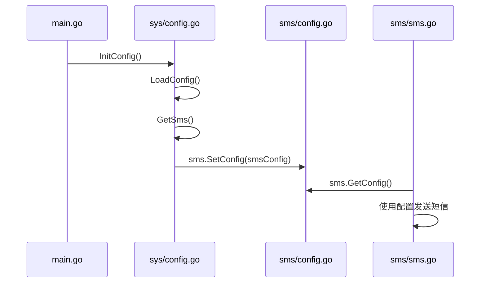
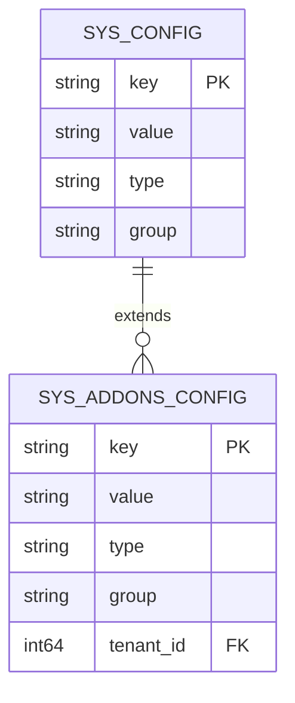

# 短信服务通用配置

<cite>
**Referenced Files in This Document**   
- [config.go](file://server/internal/model/config.go)
- [config.yaml](file://server/hack/config.yaml)
- [config.go](file://server/internal/library/sms/config.go)
- [sms.go](file://server/internal/library/sms/sms.go)
- [sms_aliyun.go](file://server/internal/library/sms/sms_aliyun.go)
- [sms_tencent.go](file://server/internal/library/sms/sms_tencent.go)
- [config.go](file://server/internal/logic/sys/config.go)
- [config.go](file://server/internal/model/input/sysin/config.go)
</cite>

## Table of Contents
1. [SmsConfig结构体设计](#smsconfig结构体设计)
2. [配置文件与系统管理界面](#配置文件与系统管理界面)
3. [配置加载与运行时机制](#配置加载与运行时机制)
4. [多租户与环境隔离](#多租户与环境隔离)
5. [配置验证与测试](#配置验证与测试)

## SmsConfig结构体设计

`SmsConfig` 结构体定义了短信服务的完整配置，采用分层设计，包含基础参数、阿里云和腾讯云服务商的专用配置。

### 基础配置字段
- **SmsDrive**: 短信服务驱动，决定使用哪个服务商（如 `aliyun`, `tencent`）。
- **SmsMinInterval**: 发送短信的最小时间间隔（秒），用于防止频繁发送。
- **SmsMaxIpLimit**: 单个IP地址的最大发送次数限制，用于防刷。
- **SmsCodeExpire**: 验证码的有效期（秒），过期后验证码失效。

### 阿里云配置字段
- **AliYunAccessKeyID**: 阿里云AccessKey ID，用于身份认证。
- **AliYunAccessKeySecret**: 阿里云AccessKey Secret，用于身份认证，必须安全存储。
- **AliYunSign**: 短信签名，必须是已在阿里云平台审核通过的签名。
- **AliYunTemplate**: 阿里云短信模板数组，包含模板ID（Key）和模板内容（Value）。

### 腾讯云配置字段
- **TencentSecretId**: 腾讯云SecretId，用于身份认证。
- **TencentSecretKey**: 腾讯云SecretKey，用于身份认证，必须安全存储。
- **TencentEndpoint**: 腾讯云API接入点域名。
- **TencentRegion**: 腾讯云服务地域。
- **TencentAppId**: 短信应用SDK AppID。
- **TencentSign**: 短信签名，必须是已在腾讯云平台审核通过的签名。
- **TencentTemplate**: 腾讯云短信模板数组，包含模板ID（Key）和模板内容（Value）。

**安全存储建议**：`AccessKeySecret` 和 `SecretKey` 等敏感信息应避免硬编码在代码或配置文件中。建议通过环境变量注入，或使用专门的密钥管理服务（如Vault）。

**Section sources**
- [config.go](file://server/internal/model/config.go#L111-L130)

## 配置文件与系统管理界面

系统支持通过 `config.yaml` 文件进行初始配置，并可通过系统管理界面进行动态修改。

### config.yaml 配置
`config.yaml` 文件位于 `server/hack/` 目录下，主要用于开发环境的CLI工具配置。短信服务的默认参数通常在此文件中进行初始化设置，但生产环境的配置主要通过数据库和管理界面维护。

```yaml
# server/hack/config.yaml 示例片段
gfcli:
  build:
    name: "hotgo"
    # ... 其他配置
```

### 系统管理界面动态修改
系统提供了基于Web的管理界面，允许管理员在不重启服务的情况下动态修改短信配置。所有配置项都存储在数据库的 `sys_config` 表中。当通过管理界面更新配置时，系统会自动触发配置同步，确保运行时配置立即生效。

**Section sources**
- [config.yaml](file://server/hack/config.yaml#L1-L48)
- [config.go](file://server/internal/logic/sys/config.go#L295-L324)

## 配置加载与运行时机制

系统的配置加载机制确保了配置的高效访问和实时更新。

### 配置加载流程
1.  **初始化**: 在应用启动时，`InitConfig` 方法被调用。
2.  **加载**: `LoadConfig` 方法从数据库中读取所有配置分组（如 `sms`, `pay`, `wechat`）。
3.  **注入**: 使用 `SetConfig` 函数将加载的配置注入到对应的库（如 `sms.SetConfig`）的全局变量中。

### 运行时配置访问
短信服务库通过 `GetConfig()` 函数提供对当前配置的单例访问。所有短信发送逻辑都通过这个全局配置实例来获取服务商的密钥、签名和模板等信息。



**Diagram sources**
- [config.go](file://server/internal/logic/sys/config.go#L40-L84)
- [config.go](file://server/internal/library/sms/config.go#L17-L23)
- [sms.go](file://server/internal/library/sms/sms.go#L21-L23)

**Section sources**
- [config.go](file://server/internal/logic/sys/config.go#L40-L84)
- [config.go](file://server/internal/library/sms/config.go#L17-L23)

## 多租户与环境隔离

系统通过配置分组和数据库隔离实现了多租户和环境隔离。

### 配置分组
配置被划分为不同的组（`group`），如 `sms`, `pay`, `upload`。每个分组的配置独立存储和管理。`SmsConfig` 属于 `sms` 分组。

### 环境变量覆盖
虽然核心配置存储在数据库中，但系统也支持通过环境变量来覆盖特定配置，这在不同部署环境（开发、测试、生产）中非常有用。例如，可以设置 `SMS_DRIVE=aliyun` 来强制使用阿里云驱动。

### 多租户策略
系统通过 `sys_addons_config` 表支持多租户配置。每个租户可以拥有自己独立的短信配置，确保了不同租户之间的配置隔离和数据安全。



**Diagram sources**
- [config.go](file://server/internal/model/config.go#L111-L130)
- [config.go](file://server/internal/dao/internal/sys_addons_config.go#L1-L10)

**Section sources**
- [config.go](file://server/internal/model/config.go#L111-L130)
- [config.go](file://server/internal/dao/internal/sys_addons_config.go#L1-L10)

## 配置验证与测试

为确保配置有效性，系统提供了多种验证和测试机制。

### 内置验证
- **驱动验证**: `New` 函数会检查 `SmsDrive` 的值，如果指定了不支持的驱动，会直接 `panic`。
- **必填项检查**: 在 `GetConfigByGroup` 方法中，会对分组名称进行非空检查。

### 测试配置有效性
最佳实践是创建一个测试接口，该接口模拟发送短信的流程，但不实际调用服务商的API。例如：
1.  调用 `sms.New()` 创建驱动实例。
2.  检查 `GetConfig()` 返回的配置是否包含所有必需的密钥和ID。
3.  对于阿里云，可以检查 `AliYunAccessKeyID` 和 `AliYunSign` 是否非空。
4.  对于腾讯云，可以检查 `TencentSecretId` 和 `TencentSign` 是否非空。

这可以在不消耗短信额度和不打扰用户的情况下验证配置的完整性。

**Section sources**
- [sms.go](file://server/internal/library/sms/sms.go#L19-L38)
- [config.go](file://server/internal/logic/sys/config.go#L250-L260)