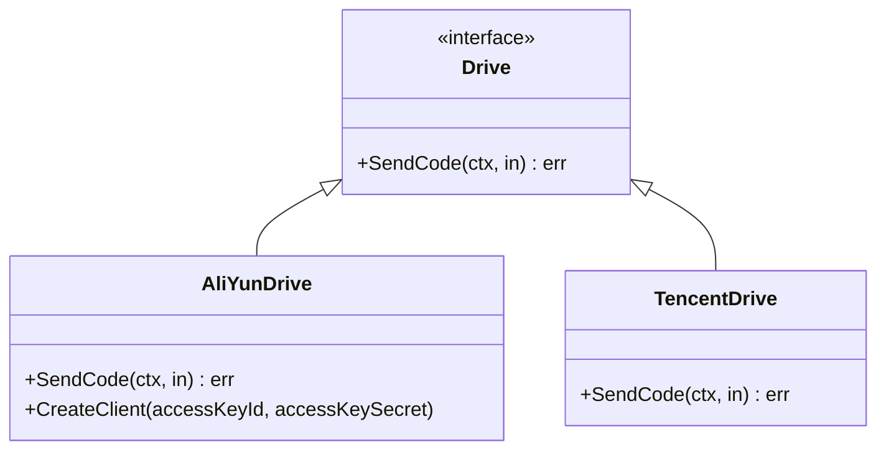
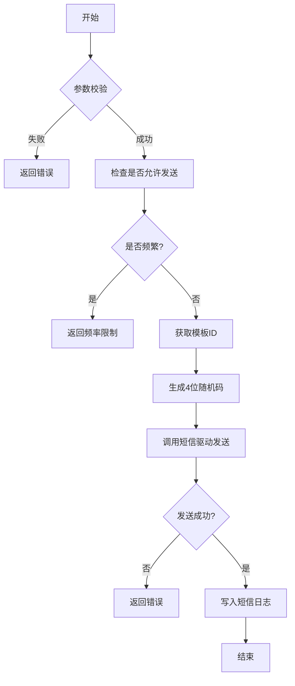

# 短信服务集成

<cite>
**本文档引用文件**  
- [sms.go](file://server/internal/library/sms/sms.go)
- [sms_aliyun.go](file://server/internal/library/sms/sms_aliyun.go)
- [sms_tencent.go](file://server/internal/library/sms/sms_tencent.go)
- [config.go](file://server/internal/library/sms/config.go)
- [sms.go](file://server/internal/consts/sms.go)
- [config.go](file://server/internal/model/config.go)
- [sms_log.go](file://server/internal/logic/sys/sms_log.go)
</cite>

## 目录
1. [简介](#简介)
2. [系统配置](#系统配置)
3. [统一短信接口设计](#统一短信接口设计)
4. [阿里云与腾讯云实现差异](#阿里云与腾讯云实现差异)
5. [发送验证码完整流程](#发送验证码完整流程)
6. [频率限制与失败重试机制](#频率限制与失败重试机制)
7. [成本控制策略](#成本控制策略)
8. [调试技巧](#调试技巧)
9. [总结](#总结)

## 简介
本系统集成了阿里云和腾讯云短信服务，提供统一的接口用于发送验证码、登录通知、注册确认等场景。通过配置驱动模式，支持灵活切换短信服务商，并内置频率控制、日志记录和错误处理机制，确保高可用性和安全性。

## 系统配置
短信服务的配置信息存储在系统配置模块中，主要包括基础设置、阿里云和腾讯云各自的密钥、签名、模板及区域信息。

### 配置项说明
- **基础配置**：
  - `smsDrive`：短信驱动（aliyun/tencent）
  - `smsMinInterval`：最小发送间隔（秒）
  - `smsMaxIpLimit`：单IP每日最大发送次数
  - `smsCodeExpire`：验证码过期时间（秒）

- **阿里云配置**：
  - `smsAliYunAccessKeyID`：AccessKey ID
  - `smsAliYunAccessKeySecret`：AccessKey Secret
  - `smsAliYunSign`：短信签名
  - `smsAliYunTemplate`：模板映射列表（事件 → 模板ID）

- **腾讯云配置**：
  - `smsTencentSecretId`：SecretId
  - `smsTencentSecretKey`：SecretKey
  - `smsTencentEndpoint`：接入域名
  - `smsTencentRegion`：地域信息（如 ap-guangzhou）
  - `smsTencentAppId`：应用ID
  - `smsTencentSign`：短信签名
  - `smsTencentTemplate`：模板映射列表（事件 → 模板ID）

这些配置通过 `model.SmsConfig` 结构体定义，并由 `service.SysConfig().GetSms()` 方法加载到内存中供运行时使用。

**Section sources**
- [config.go](file://server/internal/model/config.go#L130-L188)

## 统一短信接口设计
系统采用接口抽象的方式实现多平台支持，核心是 `Drive` 接口和工厂方法 `New()`。

### 接口定义
```go
type Drive interface {
    SendCode(ctx context.Context, in *sysin.SendCodeInp) (err error)
}
```

该接口仅定义一个 `SendCode` 方法，接收上下文和输入参数对象，返回错误信息。

### 工厂模式创建实例
通过 `New(name ...string)` 函数根据配置动态创建对应驱动实例：

```go
func New(name ...string) Drive {
	var instanceName = consts.SmsDriveAliYun
	if len(name) > 0 && name[0] != "" {
		instanceName = name[0]
	}

	switch instanceName {
	case consts.SmsDriveAliYun:
		return &AliYunDrive{}
	case consts.SmsDriveTencent:
		return &TencentDrive{}
	default:
		panic(fmt.Sprintf("暂不支持短信驱动:%v", instanceName))
	}
}
```

此设计实现了松耦合，便于扩展新的短信服务商。



**Diagram sources**
- [sms.go](file://server/internal/library/sms/sms.go#L19-L38)
- [sms_aliyun.go](file://server/internal/library/sms/sms_aliyun.go#L21-L51)
- [sms_tencent.go](file://server/internal/library/sms/sms_tencent.go#L23-L128)

**Section sources**
- [sms.go](file://server/internal/library/sms/sms.go#L19-L38)

## 阿里云与腾讯云实现差异
虽然两者都实现了 `Drive` 接口，但在参数构造、SDK调用方式上存在明显差异。

### 阿里云实现特点
- 使用 `alibabacloud-go/dysmsapi-20170525` SDK
- 模板参数需以 JSON 字符串形式传递：`{"code":"1234"}`
- 请求参数直接构造为 `SendSmsRequest` 对象
- 签名自动由 SDK 完成

### 腾讯云实现特点
- 使用 `tencentcloud-sdk-go/tencentcloud/sms/v20210111` SDK
- 模板参数为字符串数组：`["1234"]`
- 需显式创建 `Credential` 和 `ClientProfile`
- 支持自定义签名方法（默认 HmacSHA1）
- 手机号需符合 E.164 标准（+86 开头）

### 关键差异对比表
| 项目 | 阿里云 | 腾讯云 |
|------|--------|--------|
| SDK 包名 | dysmsapi-20170525 | sms/v20210111 |
| 模板参数格式 | JSON 字符串 | 字符串切片 |
| 手机号格式 | 原始号码 | +86前缀 |
| 签名方式 | 自动 | 可配置 |
| 应用标识 | SignName | SmsSdkAppId |

**Section sources**
- [sms_aliyun.go](file://server/internal/library/sms/sms_aliyun.go#L21-L51)
- [sms_tencent.go](file://server/internal/library/sms/sms_tencent.go#L23-L128)

## 发送验证码完整流程
完整的验证码发送流程包括：生成随机码 → 存储至Redis → 调用短信接口 → 记录日志。

### 流程图


**Diagram sources**
- [sms_log.go](file://server/internal/logic/sys/sms_log.go#L150-L180)

### 核心逻辑说明
1. **参数校验**：检查事件类型和手机号是否为空
2. **频率控制**：调用 `AllowSend()` 检查最小间隔和IP限制
3. **模板获取**：根据事件类型从配置中查找对应模板ID
4. **验证码生成**：使用 `grand.Digits(4)` 生成4位数字验证码
5. **短信发送**：通过 `sms.New(config.SmsDrive).SendCode()` 调用具体实现
6. **日志记录**：将发送记录插入 `sys_sms_log` 表

**Section sources**
- [sms_log.go](file://server/internal/logic/sys/sms_log.go#L150-L180)

## 频率限制与失败重试机制
系统内置多层次防护机制防止滥用和提升可靠性。

### 频率限制策略
- **时间间隔限制**：同一事件同一手机号需间隔 `smsMinInterval` 秒才能再次发送
- **IP级限制**：单个IP每日最多发送 `smsMaxIpLimit` 次
- **验证码错误次数**：单条记录最多允许10次错误尝试

### 失败重试机制
当前版本未实现自动重试，但提供了完善的错误捕获和日志记录：
- 所有发送结果均记录到 `sys_sms_log` 表
- 错误信息通过日志输出（Debug级别）
- 支持通过管理后台查看失败记录并手动重发

### 状态码管理
使用常量定义验证码状态：
```go
const (
    CodeStatusNotUsed = 1 // 未使用
    CodeStatusUsed    = 2 // 已使用
)
```

**Section sources**
- [sms_log.go](file://server/internal/logic/sys/sms_log.go#L200-L230)
- [sms.go](file://server/internal/consts/sms.go#L30-L34)

## 成本控制策略
为避免不必要的费用支出，系统采取以下措施：

### 模板预审机制
所有短信模板必须在云平台审核通过后方可使用，避免因内容违规导致扣费无效。

### 精细化配置
- 按业务场景配置不同模板（登录、注册、找回密码等）
- 支持多服务商切换，可选择性价比更高的供应商
- 提供配置热更新，无需重启服务即可生效

### 日志审计
所有发送记录均持久化存储，支持按时间、手机号、事件类型查询，便于对账和分析。

### 开发环境模拟
在非生产环境下可关闭实际调用，仅记录日志而不真正发送短信。

**Section sources**
- [config.go](file://server/internal/model/config.go#L130-L188)
- [sms_log.go](file://server/internal/logic/sys/sms_log.go#L150-L180)

## 调试技巧
### 开发环境模拟短信发送
可通过修改 `SendCode` 方法实现模拟发送：

```go
func (d *AliYunDrive) SendCode(ctx context.Context, in *sysin.SendCodeInp) (err error) {
    // 开发环境直接返回成功
    if g.Cfg().MustGet(ctx, "server.debug").Bool() {
        g.Log().Info(ctx, "dev mode: skip real sms send")
        return nil
    }
    // 正常发送逻辑...
}
```

### 日志查看
启用 Debug 日志可查看完整响应：
```go
g.Log().Debugf(ctx, "aliyun.sendCode response:%+v", response.GoString())
```

### 单元测试建议
- 使用 `mock` 框架模拟 `Drive` 接口
- 验证 `AllowSend` 是否正确拦截高频请求
- 测试不同配置下的模板匹配逻辑

**Section sources**
- [sms_aliyun.go](file://server/internal/library/sms/sms_aliyun.go#L21-L51)
- [sms_tencent.go](file://server/internal/library/sms/sms_tencent.go#L23-L128)

## 总结
本短信服务集成方案具备良好的可扩展性、安全性和可维护性。通过统一接口抽象屏蔽了不同云服务商的技术细节，结合频率控制和日志审计机制有效控制了运营成本和风险。建议在生产环境中定期检查配置项，并监控短信发送成功率以及时发现问题。