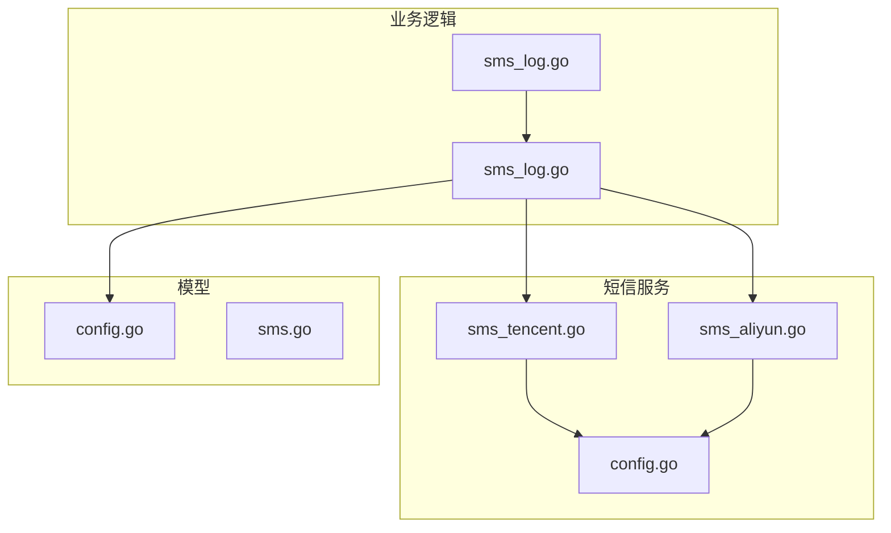
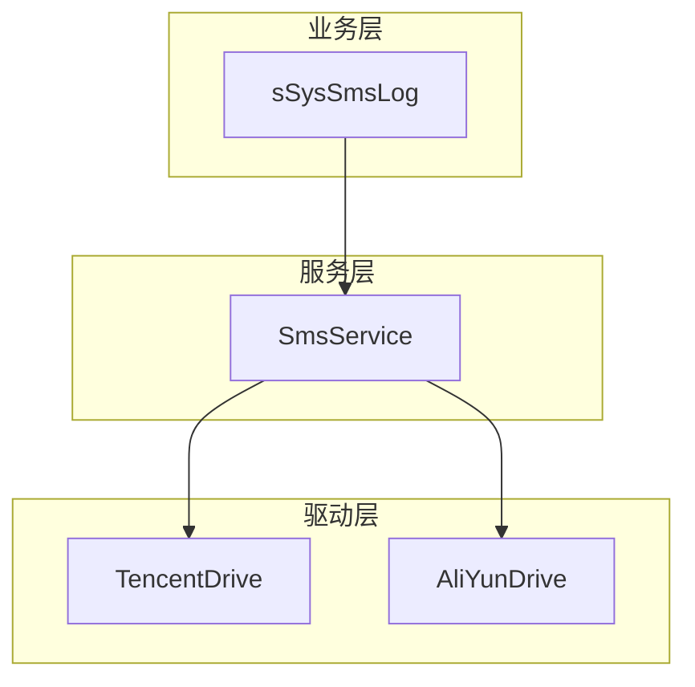
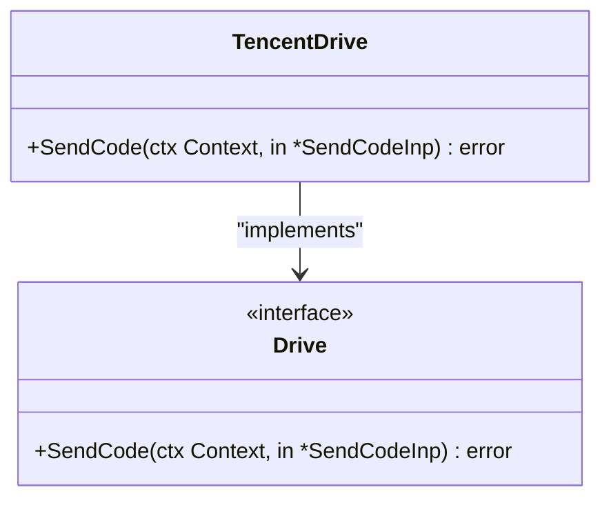
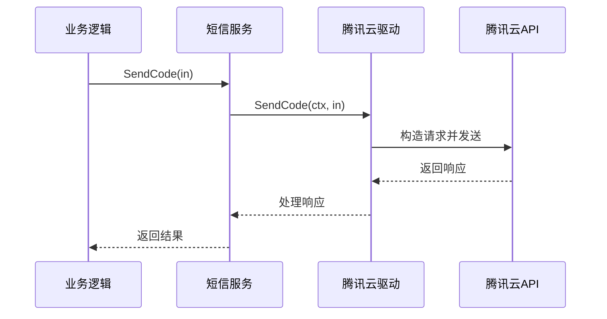
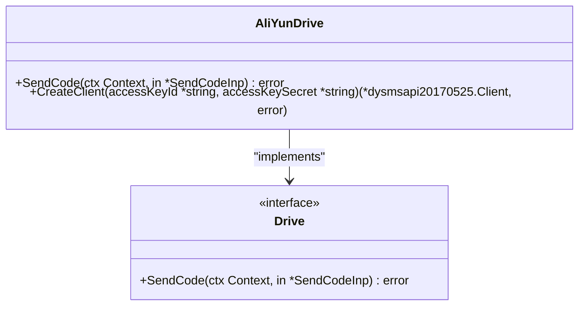
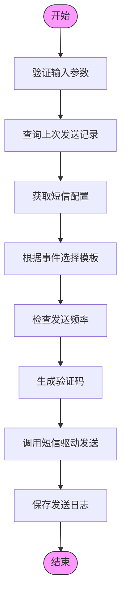
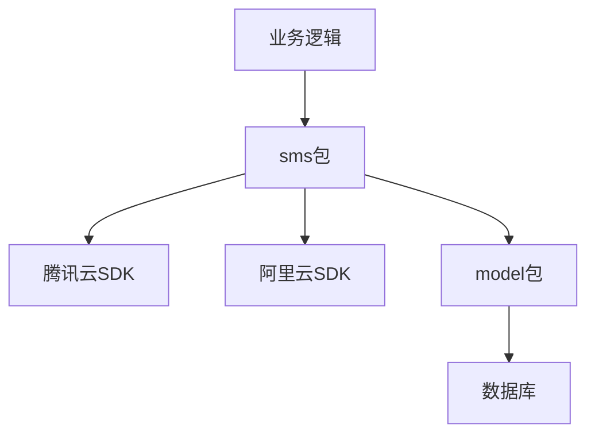

# 腾讯云短信集成

<cite>
**Referenced Files in This Document**   
- [sms_tencent.go](file://server/internal/library/sms/sms_tencent.go)
- [sms_aliyun.go](file://server/internal/library/sms/sms_aliyun.go)
- [config.go](file://server/internal/library/sms/config.go)
- [sms.go](file://server/internal/library/sms/sms.go)
- [sms_log.go](file://server/internal/logic/sys/sms_log.go)
- [sms_log.go](file://server/internal/model/input/sysin/sms_log.go)
- [config.go](file://server/internal/model/config.go)
- [sms.go](file://server/internal/consts/sms.go)
</cite>

## 目录
1. [简介](#简介)
2. [项目结构](#项目结构)
3. [核心组件](#核心组件)
4. [架构概述](#架构概述)
5. [详细组件分析](#详细组件分析)
6. [依赖分析](#依赖分析)
7. [性能考虑](#性能考虑)
8. [故障排除指南](#故障排除指南)
9. [结论](#结论)

## 简介
本文档详细说明了腾讯云短信服务在HotGo项目中的集成实现。重点分析了`sms_tencent.go`文件的实现机制，包括腾讯云API v3签名流程、SDK集成方式、地域选择和失败处理策略。同时，文档对比了与阿里云实现的差异，特别是请求参数结构和错误响应格式的不同。此外，还涵盖了如何利用腾讯云的短信套餐包进行成本优化，以及如何配置跨地域容灾。通过实际代码示例，展示了模板消息发送、状态报告接收和用量统计功能的实现。

## 项目结构
项目中短信功能主要位于`server/internal/library/sms/`目录下，包含腾讯云和阿里云两种短信服务的实现。核心文件包括`sms_tencent.go`和`sms_aliyun.go`，分别实现了两种云服务商的短信发送逻辑。配置信息通过`config.go`文件管理，而短信日志和业务逻辑则在`sys`包中处理。

**Diagram sources**
- [sms_tencent.go](file://server/internal/library/sms/sms_tencent.go)
- [sms_aliyun.go](file://server/internal/library/sms/sms_aliyun.go)
- [config.go](file://server/internal/library/sms/config.go)
- [sms_log.go](file://server/internal/logic/sys/sms_log.go)
- [config.go](file://server/internal/model/config.go)

**Section sources**
- [sms_tencent.go](file://server/internal/library/sms/sms_tencent.go)
- [sms_aliyun.go](file://server/internal/library/sms/sms_aliyun.go)
- [config.go](file://server/internal/library/sms/config.go)

## 核心组件
核心组件包括腾讯云短信驱动`TencentDrive`、阿里云短信驱动`AliYunDrive`，以及统一的短信服务接口`Drive`。这些组件通过工厂模式`New`函数进行实例化，根据配置选择相应的短信服务商。短信配置`SmsConfig`结构体包含了两种服务商的所有必要参数，如密钥、应用ID、签名和模板等。

**Section sources**
- [sms_tencent.go](file://server/internal/library/sms/sms_tencent.go)
- [sms_aliyun.go](file://server/internal/library/sms/sms_aliyun.go)
- [config.go](file://server/internal/library/sms/config.go)
- [config.go](file://server/internal/model/config.go)

## 架构概述
系统采用分层架构，上层业务逻辑通过`service.SysSmsLog()`调用短信服务，中间层的`sms`包提供统一的接口，底层则分别实现了腾讯云和阿里云的SDK集成。这种设计实现了业务逻辑与具体云服务商的解耦，便于未来扩展其他短信服务商。

**Diagram sources**
- [sms_log.go](file://server/internal/logic/sys/sms_log.go)
- [sms.go](file://server/internal/library/sms/sms.go)
- [sms_tencent.go](file://server/internal/library/sms/sms_tencent.go)
- [sms_aliyun.go](file://server/internal/library/sms/sms_aliyun.go)

## 详细组件分析

### 腾讯云短信驱动分析
`TencentDrive`结构体实现了`Drive`接口的`SendCode`方法，负责与腾讯云短信API进行交互。该实现遵循腾讯云SDK的最佳实践，包括使用环境变量或配置文件管理密钥、设置客户端配置、构造请求对象等。

#### 腾讯云短信驱动类图

**Diagram sources**
- [sms_tencent.go](file://server/internal/library/sms/sms_tencent.go)

#### 腾讯云短信发送序列图

**Diagram sources**
- [sms_tencent.go](file://server/internal/library/sms/sms_tencent.go)
- [sms_log.go](file://server/internal/logic/sys/sms_log.go)

### 阿里云短信驱动分析
`AliYunDrive`结构体同样实现了`Drive`接口，但其API调用方式与腾讯云有所不同。阿里云使用了不同的SDK包和请求构造方式，特别是在模板参数的处理上采用了JSON字符串格式。

#### 阿里云短信驱动类图

**Diagram sources**
- [sms_aliyun.go](file://server/internal/library/sms/sms_aliyun.go)

### 短信业务逻辑分析
`sSysSmsLog`结构体封装了短信发送的完整业务逻辑，包括验证码生成、发送频率控制、模板选择和状态验证等功能。它作为业务层与短信驱动层之间的桥梁，提供了更高级别的API。

#### 短信业务逻辑流程图

**Diagram sources**
- [sms_log.go](file://server/internal/logic/sys/sms_log.go)

## 依赖分析
系统通过`go.mod`文件管理外部依赖，主要依赖包括腾讯云SDK `github.com/tencentcloud/tencentcloud-sdk-go` 和阿里云SDK `github.com/alibabacloud-go/darabonba-openapi`。内部依赖关系清晰，`sms`包依赖`model`包获取配置，`sys`包依赖`sms`包进行短信发送。

**Diagram sources**
- [go.mod](file://go.mod)
- [sms_tencent.go](file://server/internal/library/sms/sms_tencent.go)
- [sms_aliyun.go](file://server/internal/library/sms/sms_aliyun.go)
- [config.go](file://server/internal/library/sms/config.go)

**Section sources**
- [go.mod](file://go.mod)
- [sms_tencent.go](file://server/internal/library/sms/sms_tencent.go)
- [sms_aliyun.go](file://server/internal/library/sms/sms_aliyun.go)
- [config.go](file://server/internal/library/sms/config.go)

## 性能考虑
系统在设计时考虑了性能和可靠性。通过配置`SmsMinInterval`和`SmsMaxIpLimit`参数，可以有效防止短信轰炸攻击。同时，使用`gtime.Now()`和数据库查询来控制发送频率，确保了系统的稳定运行。对于高并发场景，建议结合Redis等缓存技术进一步优化性能。

## 故障排除指南
常见问题包括签名或模板未审核通过、应用ID验证失败等。根据腾讯云API返回的错误码，可以快速定位问题。例如，`FailedOperation.SignatureIncorrectOrUnapproved`表示签名问题，`UnauthorizedOperation.SmsSdkAppIdVerifyFail`表示应用ID验证失败。详细的错误解决方案可参考腾讯云官方文档。

**Section sources**
- [sms_tencent.go](file://server/internal/library/sms/sms_tencent.go)
- [sms_aliyun.go](file://server/internal/library/sms/sms_aliyun.go)

## 结论
本文档详细介绍了腾讯云短信服务在HotGo项目中的集成方案。通过模块化的设计，系统能够灵活支持多种短信服务商，并提供了完善的业务逻辑处理。未来可以考虑增加更多云服务商的支持，以及实现更精细的用量统计和成本分析功能。