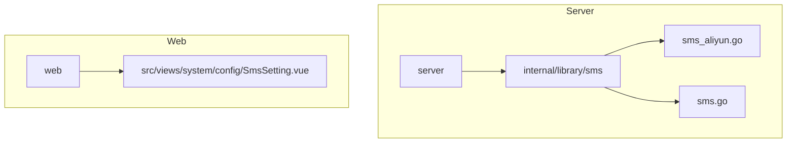
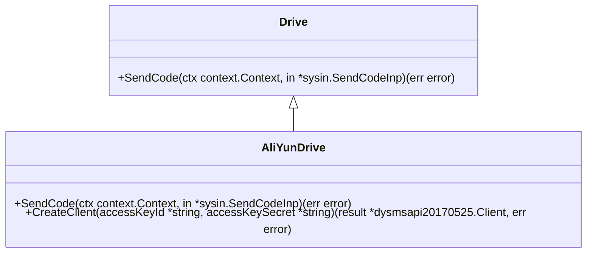
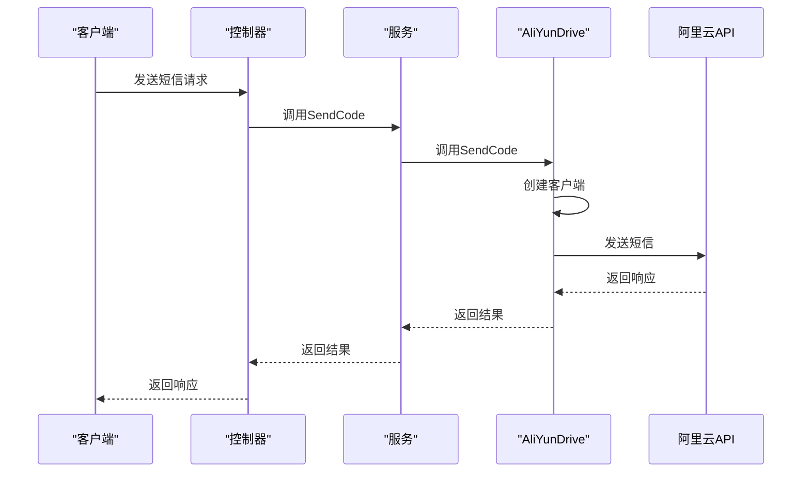
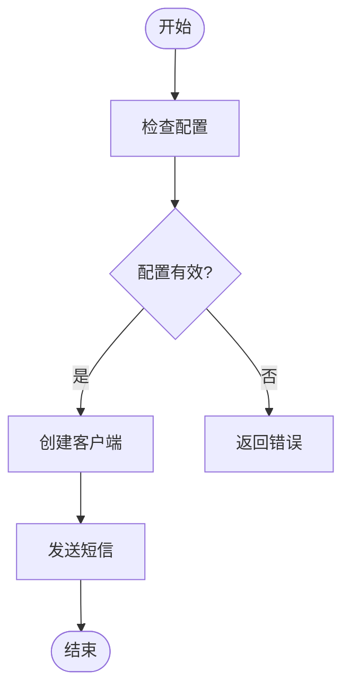
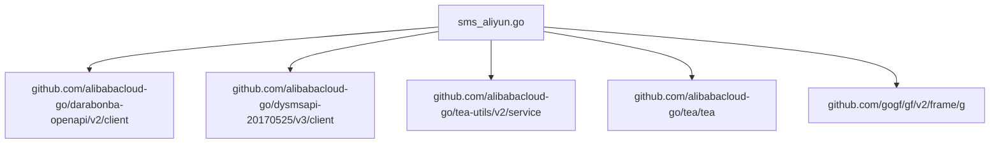

# 阿里云短信集成

<cite>
**本文档引用文件**   
- [sms_aliyun.go](file://server/internal/library/sms/sms_aliyun.go)
- [sms.go](file://server/internal/library/sms/sms.go)
- [config.go](file://server/internal/model/config.go)
- [sms.go](file://server/api/admin/common/sms.go)
- [sys.go](file://server/internal/service/sys.go)
- [sms_log.go](file://server/internal/logic/sys/sms_log.go)
- [sysin\sms_log.go](file://server/internal/model/input/sysin/sms_log.go)
- [sms.go](file://server/internal/consts/sms.go)
</cite>

## 目录
1. [简介](#简介)
2. [项目结构](#项目结构)
3. [核心组件](#核心组件)
4. [架构概述](#架构概述)
5. [详细组件分析](#详细组件分析)
6. [依赖分析](#依赖分析)
7. [性能考虑](#性能考虑)
8. [故障排除指南](#故障排除指南)
9. [结论](#结论)

## 简介
本文档详细介绍了如何在HotGo项目中集成阿里云短信服务。文档深入分析了`sms_aliyun.go`的实现，包括如何使用阿里云Go SDK、请求签名算法、错误码处理和重试策略。同时，文档解释了与统一接口`sms.go`的适配方式，以及如何处理阿里云特有的限制如模板变量命名规则。提供了完整的代码示例，展示从初始化客户端到发送短信的全过程。此外，文档还涵盖了性能优化技巧，如连接池配置和异步发送，以及如何处理阿里云的频率限制和账户余额监控。

## 项目结构
HotGo项目的结构清晰，主要分为`server`和`web`两个部分。`server`目录包含了后端逻辑，而`web`目录则包含了前端代码。在`server`目录中，`internal/library/sms`目录包含了短信服务的实现，包括阿里云和腾讯云的驱动。

**图表来源**
- [sms_aliyun.go](file://server/internal/library/sms/sms_aliyun.go#L1-L65)
- [sms.go](file://server/internal/library/sms/sms.go#L1-L40)
- [SmsSetting.vue](file://web/src/views/system/config/SmsSetting.vue#L280-L284)

**章节来源**
- [sms_aliyun.go](file://server/internal/library/sms/sms_aliyun.go#L1-L65)
- [sms.go](file://server/internal/library/sms/sms.go#L1-L40)

## 核心组件
阿里云短信服务的核心组件包括`AliYunDrive`结构体和`SendCode`方法。`AliYunDrive`结构体实现了`Drive`接口，提供了发送短信的功能。`SendCode`方法负责构建请求并调用阿里云SDK发送短信。

**章节来源**
- [sms_aliyun.go](file://server/internal/library/sms/sms_aliyun.go#L18-L64)
- [sms.go](file://server/internal/library/sms/sms.go#L15-L38)

## 架构概述
阿里云短信服务的架构基于Go语言的接口和结构体实现。`Drive`接口定义了发送短信的通用方法，而`AliYunDrive`结构体实现了该接口，提供了阿里云短信服务的具体实现。通过`New`函数，可以根据配置选择不同的短信驱动。

**图表来源**
- [sms.go](file://server/internal/library/sms/sms.go#L15-L17)
- [sms_aliyun.go](file://server/internal/library/sms/sms_aliyun.go#L21-L51)

## 详细组件分析
### AliYunDrive 分析
`AliYunDrive`结构体是阿里云短信服务的核心实现。它通过`CreateClient`方法初始化阿里云SDK客户端，并通过`SendCode`方法发送短信。

#### 对象导向组件

**图表来源**
- [sms_aliyun.go](file://server/internal/library/sms/sms_aliyun.go#L18-L64)
- [sms.go](file://server/internal/library/sms/sms.go#L15-L17)

#### API/服务组件

**图表来源**
- [sms_aliyun.go](file://server/internal/library/sms/sms_aliyun.go#L21-L51)
- [sms.go](file://server/internal/library/sms/sms.go#L19-L38)

### 统一接口适配
`sms.go`文件中的`New`函数根据配置选择不同的短信驱动。通过`Drive`接口，可以轻松地切换不同的短信服务提供商。

**图表来源**
- [sms.go](file://server/internal/library/sms/sms.go#L19-L38)

**章节来源**
- [sms.go](file://server/internal/library/sms/sms.go#L19-L38)

## 依赖分析
阿里云短信服务依赖于阿里云Go SDK，包括`darabonba-openapi`和`dysmsapi-20170525`。此外，项目还依赖于`gogf/gf/v2`框架进行日志记录和错误处理。

**图表来源**
- [sms_aliyun.go](file://server/internal/library/sms/sms_aliyun.go#L1-L65)

**章节来源**
- [sms_aliyun.go](file://server/internal/library/sms/sms_aliyun.go#L1-L65)

## 性能考虑
为了优化性能，可以配置连接池和异步发送。此外，还需要处理阿里云的频率限制和账户余额监控，以确保短信服务的稳定运行。

## 故障排除指南
在使用阿里云短信服务时，可能会遇到各种问题，如配置错误、网络问题或API调用失败。通过查看日志和调试信息，可以快速定位和解决问题。

**章节来源**
- [sms_aliyun.go](file://server/internal/library/sms/sms_aliyun.go#L21-L51)
- [sms_log.go](file://server/internal/logic/sys/sms_log.go#L93-L146)

## 结论
本文档详细介绍了如何在HotGo项目中集成阿里云短信服务。通过深入分析代码实现和架构设计，提供了完整的集成指南和最佳实践。希望本文档能帮助开发者顺利集成阿里云短信服务，提升应用的用户体验。