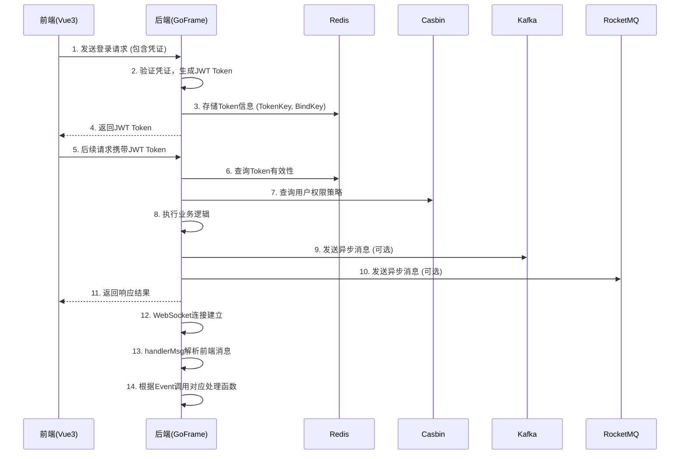

# 技术栈与依赖

<cite>
**本文档引用文件**  
- [go.mod](file://server/go.mod)
- [package.json](file://web/package.json)
- [enforcer.go](file://server/internal/library/casbin/enforcer.go)
- [token.go](file://server/internal/library/token/token.go)
- [kafkamq.go](file://server/internal/library/queue/kafkamq.go)
- [rocketmq.go](file://server/internal/library/queue/rocketmq.go)
- [redismq.go](file://server/internal/library/queue/redismq.go)
- [router.go](file://server/internal/websocket/router.go)
</cite>

## 目录
1. [后端技术栈](#后端技术栈)  
2. [前端技术栈](#前端技术栈)  
3. [核心依赖版本](#核心依赖版本)  
4. [技术选型原因](#技术选型原因)  
5. [依赖交互关系图](#依赖交互关系图)  
6. [开发环境搭建建议](#开发环境搭建建议)

## 后端技术栈

### GoFrame 框架核心作用
GoFrame 是 hotgo-2.0 项目的核心后端框架，提供了一整套企业级开发解决方案，包括但不限于：HTTP 服务、数据库操作、缓存管理、日志记录、配置管理、定时任务、WebSocket 通信等。其模块化设计和丰富的内置组件显著提升了开发效率。

GoFrame 通过 `g.Redis()`、`g.Cfg()`、`g.Log()` 等全局实例简化了对 Redis、配置文件和日志系统的访问。项目中的 `server/internal/library` 目录下封装了大量基于 GoFrame 的扩展库，如 `hgrds`（Redis 封装）、`hgorm`（GORM 封装）、`casbin`（权限封装）等，体现了其作为基础框架的核心地位。

**Section sources**
- [go.mod](file://server/go.mod#L10-L15)
- [token.go](file://server/internal/library/token/token.go#L15)

### GORM 在数据访问层的应用
项目通过 `github.com/gogf/gf/contrib/drivers/mysql/v2` 驱动集成 GORM，作为 ORM 层与 MySQL 数据库交互。`server/internal/dao` 目录下的文件（如 `admin_member.go`, `sys_config.go`）定义了数据访问对象（DAO），这些对象继承自 GoFrame 的 `gdao.Dao`，并利用 GORM 的能力进行数据库的增删改查操作。

GORM 被用于处理复杂的关联查询，例如在 `casbin/enforcer.go` 中，通过 `g.Model()` 构建了 `AdminRole`、`AdminRoleMenu` 和 `AdminMenu` 三张表的左连接查询，以加载角色的权限策略。

**Section sources**
- [go.mod](file://server/go.mod#L10)
- [enforcer.go](file://server/internal/library/casbin/enforcer.go#L55-L65)

### Casbin 在权限控制中的实现机制
项目采用 Casbin 作为权限管理引擎，实现了基于角色的访问控制（RBAC）。其核心实现位于 `server/internal/library/casbin` 包中。

`InitEnforcer` 函数初始化 Casbin Enforcer 实例，从 `manifest/config/casbin.conf` 文件加载权限模型（Model），并使用自定义的数据库适配器（Adapter）从 MySQL 中读取策略（Policy）。权限策略的加载逻辑在 `loadPermissions` 函数中实现，它通过查询 `admin_role`、`admin_role_menu` 和 `admin_menu` 三张表，将角色（Key）与菜单的权限字符串（Permissions）关联起来，并调用 `Enforcer.AddPolicies` 批量添加策略。

权限校验通常在中间件中完成，开发者可以通过 `Enforcer.Enforce()` 方法检查当前用户是否有权访问特定资源。

**Section sources**
- [enforcer.go](file://server/internal/library/casbin/enforcer.go#L36-L71)

### Redis、Kafka、RocketMQ 等消息/缓存组件的集成方式
#### Redis
Redis 在项目中扮演双重角色：一是作为缓存（Cache），通过 `github.com/gogf/gf/contrib/nosql/redis/v2` 驱动，由 `g.Redis()` 全局实例管理，用于存储 JWT Token、验证码、会话等；二是作为轻量级消息队列（RedisMQ），在 `server/internal/library/queue/redismq.go` 中实现。

`RedisMq` 结构体通过 `LPUSH` 和 `RPOP` 命令实现生产者-消费者模式。它支持普通消息和延迟消息（通过 `ZADD` 和 `ZRANGEBYSCORE` 实现）。生产者调用 `SendMsg`，消费者通过 `ListenReceiveMsgDo` 启动一个无限循环的 goroutine 来监听队列。

#### Kafka
Kafka 集成在 `server/internal/library/queue/kafkamq.go` 中。`KafkaMq` 结构体封装了 `sarama` 客户端。`RegisterKafkaProducer` 和 `RegisterKafkaConsumer` 函数分别用于注册生产者和消费者实例。

生产者使用 `sarama.AsyncProducer` 异步发送消息，并通过监听 `Successes()` 和 `Errors()` 通道来获取发送结果。消费者使用 `sarama.ConsumerGroup` 实现，`ListenReceiveMsgDo` 方法启动一个消费者组来消费指定主题的消息。

#### RocketMQ
RocketMQ 集成在 `server/internal/library/queue/rocketmq.go` 中。`RocketMq` 结构体封装了 `apache/rocketmq-client-go/v2` 客户端。`RegisterRocketMqProducer` 和 `RegisterRocketMqConsumer` 函数用于注册生产者和消费者。

生产者通过 `SendSync` 同步发送消息。消费者为 `PushConsumer` 模式，`ListenReceiveMsgDo` 方法订阅主题后，消息会由 RocketMQ 服务器主动推送给客户端，并在一个独立的 goroutine 池（`grpool`）中处理，以提高并发处理能力。

**Section sources**
- [redismq.go](file://server/internal/library/queue/redismq.go#L197-L199)
- [kafkamq.go](file://server/internal/library/queue/kafkamq.go#L122-L154)
- [rocketmq.go](file://server/internal/library/queue/rocketmq.go#L266-L304)

## 前端技术栈

### Vue3 的组合式 API
前端项目基于 Vue3 构建，充分利用了组合式 API（Composition API）的优势。在 `web/src` 目录下，`setup` 函数和 `script setup` 语法被广泛使用，使得逻辑关注点可以更好地组织和复用。

`web/src/hooks` 目录下定义了大量自定义 Hook（如 `useAsync.ts`, `useBoolean.ts`），这些 Hook 封装了通用的响应式逻辑，可以在不同的组件中导入使用，极大地提高了代码的可维护性和开发效率。

### Vite 的构建优化
项目使用 Vite 作为构建工具，提供了极快的冷启动和热更新速度。`vite.config.ts` 配置文件中集成了多种优化插件，如 `vite-plugin-compression`（生成 gzip 压缩文件）、`unplugin-vue-components`（自动按需导入组件）、`vite-plugin-html`（注入环境变量）等。

Vite 的原生 ES 模块支持和 Rollup 打包能力，确保了开发体验的流畅和生产环境构建产物的高效。

### Naive UI 组件库的使用
项目采用 Naive UI 作为主要的 UI 组件库，其在 `package.json` 中的版本为 `^2.42.0`。`web/src/plugins/naive.ts` 文件负责初始化 Naive UI，并可能进行全局配置。

Naive UI 提供了丰富、美观且类型安全的组件，如 `NButton`, `NModal`, `NTable` 等，项目中的 `web/src/components` 目录下也基于 Naive UI 封装了一些业务组件（如 `Application`, `CitySelector`）。

### Tailwind CSS 的原子化样式方案
项目使用 Tailwind CSS 作为 CSS 框架，其原子化（Utility-First）的设计理念允许开发者直接在 HTML 模板中通过类名快速构建 UI。`tailwind.config.js` 文件定义了项目的主题、颜色、间距等设计系统。

`web/src/styles/tailwind.css` 是 Tailwind 的入口文件，通过 `@tailwind` 指令注入基础、组件和工具类样式。这种方案避免了编写大量自定义 CSS，提高了样式编写的效率和一致性。

**Section sources**
- [package.json](file://web/package.json#L10-L20)
- [vite.config.ts](file://web/vite.config.ts)
- [naive.ts](file://web/src/plugins/naive.ts)
- [tailwind.css](file://web/src/styles/tailwind.css)

## 核心依赖版本

| 技术类别 | 技术名称 | 版本号 | 来源文件 |
| :--- | :--- | :--- | :--- |
| **后端框架** | GoFrame | v2.9.1 | go.mod |
| **数据库驱动** | GORM MySQL | v2.9.0 | go.mod |
| **权限管理** | Casbin | v2.108.0 | go.mod |
| **缓存/消息** | Redis Go Client | v8.11.5 | go.mod |
| **消息队列** | Kafka Go Client (Sarama) | v1.45.2 | go.mod |
| **消息队列** | RocketMQ Go Client | v2.1.2 | go.mod |
| **前端框架** | Vue | ^3.4.38 | package.json |
| **UI 组件库** | Naive UI | ^2.42.0 | package.json |
| **构建工具** | Vite | ^5.4.2 | package.json |
| **CSS 框架** | Tailwind CSS | ^3.4.10 | package.json |

## 技术选型原因

- **GoFrame**: 选择 GoFrame 是因为其功能全面、文档完善、社区活跃，且由国内团队维护，更符合中文开发者的使用习惯。它提供了开箱即用的企业级解决方案，减少了项目初期的技术选型和集成成本。
- **GORM**: GORM 是 Go 语言中最流行和成熟的 ORM 库，拥有强大的功能和庞大的社区支持。与 GoFrame 的集成也十分顺畅。
- **Casbin**: Casbin 是一个强大的、高效的开源访问控制框架，支持多种访问控制模型（如 RBAC, ABAC）。其策略可存储在多种后端（如文件、数据库），非常适合 hotgo-2.0 这类需要灵活权限管理的后台系统。
- **Redis/Kafka/RocketMQ**: Redis 用于缓存和简单队列，因其高性能和低延迟。Kafka 和 RocketMQ 用于处理高吞吐量、高可靠性的异步消息场景。项目同时支持两者，为开发者提供了根据实际业务需求（如云服务提供商）进行选择的灵活性。
- **Vue3**: Vue3 提供了更好的性能、更小的包体积和更强大的 Composition API，是现代前端开发的主流选择。
- **Vite**: Vite 利用现代浏览器的原生 ES 模块支持，提供了闪电般的开发服务器启动速度和热更新，极大地提升了开发体验。
- **Naive UI**: Naive UI 是一个基于 Vue3 的高质量 UI 库，设计美观，文档优秀，且完全支持 TypeScript，有助于构建类型安全的应用。
- **Tailwind CSS**: Tailwind CSS 的原子化方法允许快速 UI 开发，避免了传统 CSS 命名的困扰，并且与组件化开发理念高度契合。

## 依赖交互关系图

**Diagram sources**
- [token.go](file://server/internal/library/token/token.go#L52-L89)
- [token.go](file://server/internal/library/token/token.go#L133-L255)
- [enforcer.go](file://server/internal/library/casbin/enforcer.go#L55-L65)
- [router.go](file://server/internal/websocket/router.go#L15-L52)

## 开发环境搭建建议

为开发者搭建开发环境，建议遵循以下技术选型：

1.  **后端**:
    *   **Go**: 安装 Go 1.24 或更高版本。
    *   **数据库**: 准备 MySQL 5.7+ 或兼容数据库。
    *   **缓存/消息**: 准备 Redis 6.0+ 服务。根据需要选择部署 Kafka 或 RocketMQ。
    *   **IDE**: 推荐使用 Goland 或 VS Code 配合 Go 插件。
2.  **前端**:
    *   **Node.js**: 安装 Node.js 16+ (根据 `package.json` 的 `engines` 字段)。
    *   **包管理器**: 使用 pnpm (根据 `package.json`)。
    *   **IDE**: 推荐使用 WebStorm 或 VS Code。
3.  **配置**:
    *   根据 `server/hack/config.yaml` 模板创建配置文件，填写数据库、Redis、消息队列等连接信息。
    *   确保 `web/.env` 等环境变量文件配置正确。
4.  **启动**:
    *   后端：进入 `server` 目录，运行 `go run main.go`。
    *   前端：进入 `web` 目录，运行 `pnpm run dev`。

此技术栈组合提供了高性能、高可维护性和良好的开发体验，是构建现代全栈应用的坚实基础。