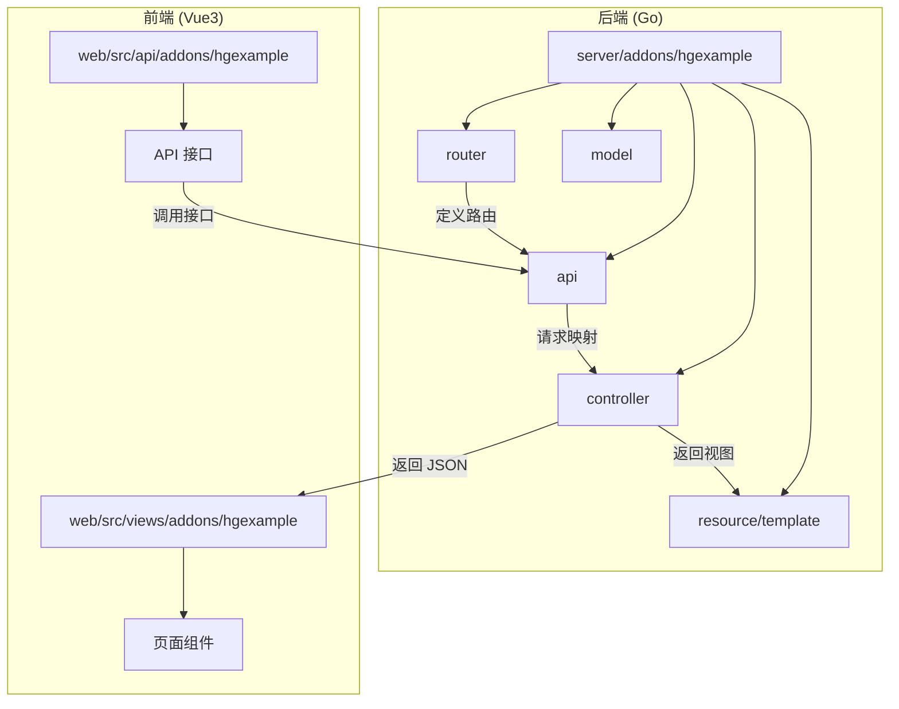
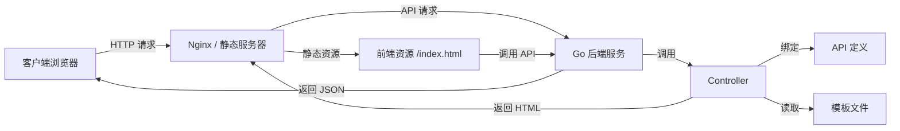
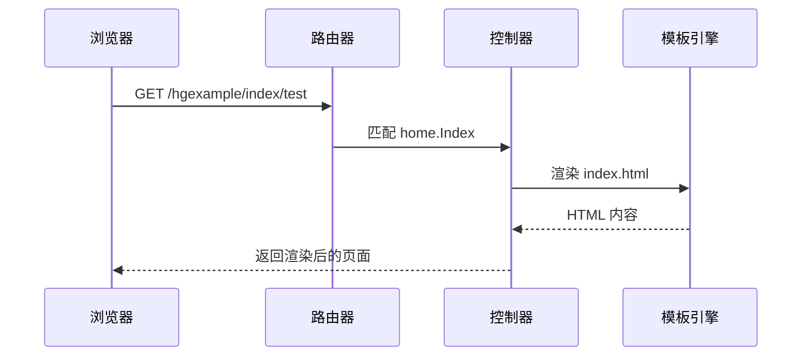
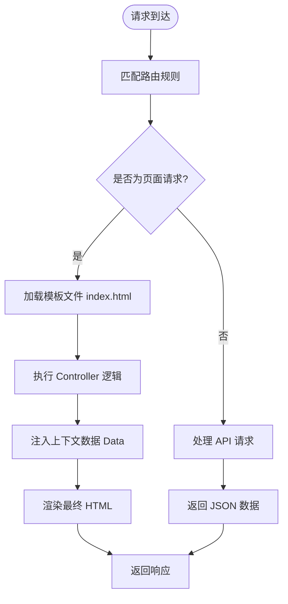
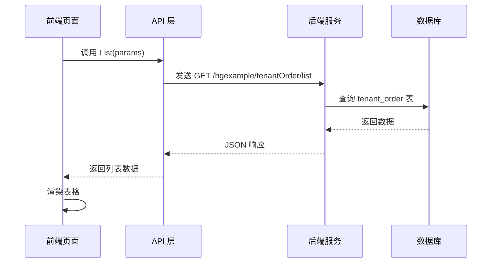
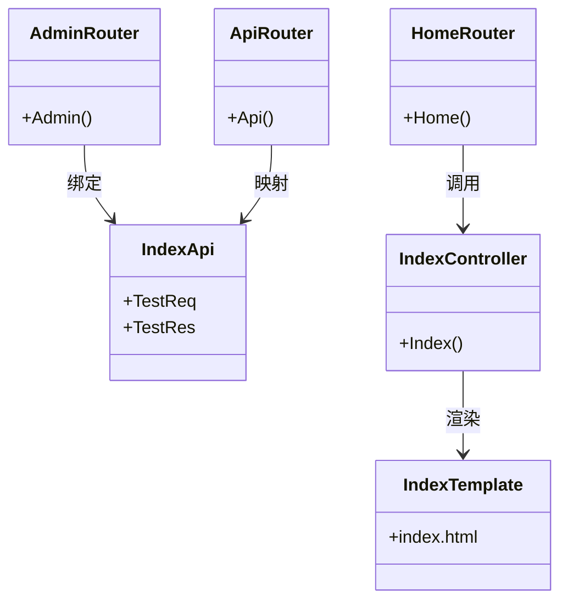

# 前后端集成

<cite>
**本文档引用的文件**  
- [admin.go](file://server/addons/hgexample/router/admin.go)
- [api.go](file://server/addons/hgexample/router/api.go)
- [home.go](file://server/addons/hgexample/router/home.go)
- [index.go](file://server/addons/hgexample/api/admin/index/index.go)
- [index.go](file://server/addons/hgexample/api/home/index/index.go)
- [index.html](file://server/resource/addons/hgexample/template/home/index.html)
- [index.ts](file://web/src/api/addons/hgexample/tenantOrder/index.ts)
- [index.vue](file://web/src/views/addons/hgexample/tenantOrder/index.vue)
</cite>

## 目录

1. [简介](#简介)
2. [项目结构概览](#项目结构概览)
3. [核心组件分析](#核心组件分析)
4. [架构概述](#架构概述)
5. [详细组件分析](#详细组件分析)
6. [依赖分析](#依赖分析)
7. [性能考虑](#性能考虑)
8. [故障排除指南](#故障排除指南)
9. [结论](#结论)

## 简介

本文档旨在指导开发者如何将插件无缝集成到前后端系统中。重点说明如何在 `router` 中定义新的 API 路由，并通过 `api` 层暴露接口。同时解释 `resource/addons/hgexample/template` 目录下的前端模板文件如何被服务端渲染或通过静态路由访问。展示 `web/src/api/addons/hgexample` 和 `web/src/views/addons/hgexample` 中对应的前端 API 调用与页面组件，实现前后端功能的联动。最后提供一个完整的示例，展示从定义后端 API 到创建前端页面的全过程。

## 项目结构概览

本项目采用模块化设计，前后端分离架构。后端基于 Go 语言开发，使用 GF 框架处理 HTTP 请求；前端使用 Vue3 + Vite 构建，通过 Axios 进行 API 调用。



**Diagram sources**  
- [router](file://server/addons/hgexample/router)
- [api](file://server/addons/hgexample/api)
- [web/src/views](file://web/src/views)
- [web/src/api](file://web/src/api)

**Section sources**  
- [server/addons/hgexample](file://server/addons/hgexample)
- [web/src](file://web/src)

## 核心组件分析

插件的核心组件包括路由管理、API 定义、控制器逻辑、数据模型以及前端视图与 API 调用。通过 `router` 文件注册不同类型的路由（管理后台、前台接口、页面访问），`api` 层定义请求结构和响应格式，`controller` 实现业务逻辑，前端通过 `api` 模块调用后端接口并在 `views` 中渲染页面。

**Section sources**  
- [router](file://server/addons/hgexample/router)
- [api](file://server/addons/hgexample/api)
- [controller](file://server/addons/hgexample/controller)
- [web/src/api](file://web/src/api/addons/hgexample)
- [web/src/views](file://web/src/views/addons/hgexample)

## 架构概述

系统采用典型的 MVC 架构模式，结合前后端分离设计。后端负责数据处理与接口暴露，前端负责用户交互与展示。



**Diagram sources**  
- [server/addons/hgexample/router](file://server/addons/hgexample/router)
- [server/resource/addons/hgexample/template](file://server/resource/addons/hgexample/template)
- [web/src/api](file://web/src/api/addons/hgexample)

## 详细组件分析

### 路由定义与 API 暴露

在 `server/addons/hgexample/router` 目录中，分别定义了管理后台、API 接口和页面访问三种路由。

#### 管理后台路由
```go
func Admin(ctx context.Context, group *ghttp.RouterGroup)
```
该函数注册管理员端路由，使用中间件进行权限验证，并绑定控制器方法。

#### 前台接口路由
```go
func Api(ctx context.Context, group *ghttp.RouterGroup)
```
用于暴露对外 API 接口，支持认证与非认证访问路径。

#### 前台页面路由
```go
func Home(ctx context.Context, group *ghttp.RouterGroup)
```
处理页面级别的请求，通常返回 HTML 模板内容。



**Diagram sources**  
- [home.go](file://server/addons/hgexample/router/home.go)
- [index.go](file://server/addons/hgexample/api/home/index/index.go)
- [index.html](file://server/resource/addons/hgexample/template/home/index.html)

**Section sources**  
- [server/addons/hgexample/router/home.go](file://server/addons/hgexample/router/home.go)
- [server/addons/hgexample/api/home/index/index.go](file://server/addons/hgexample/api/home/index/index.go)

### 前端模板渲染机制

位于 `server/resource/addons/hgexample/template/home/index.html` 的模板文件支持变量注入，使用 `@{.Data.xxx}` 语法进行动态渲染。

```html
<h1>Hello，@{.Data.name}!!</h1>
<h2>@{.Data.module}</h2>
<h2>服务器时间：@{.Data.time}</h2>
```

当控制器返回此模板时，会自动填充上下文数据并输出完整 HTML。



**Diagram sources**  
- [index.html](file://server/resource/addons/hgexample/template/home/index.html)
- [home/index/index.go](file://server/addons/hgexample/api/home/index/index.go)

**Section sources**  
- [server/resource/addons/hgexample/template/home/index.html](file://server/resource/addons/hgexample/template/home/index.html)

### 前后端联动示例：多租户订单管理

以 `tenantOrder` 模块为例，展示完整的前后端集成流程。

#### 后端 API 定义
在 `web/src/api/addons/hgexample/tenantOrder/index.ts` 中定义了以下接口：
- `List(params)`：获取列表
- `Delete(params)`：删除记录
- `Edit(params)`：添加/编辑
- `View(params)`：查看详情
- `Export(params)`：导出数据

#### 前端页面实现
`web/src/views/addons/hgexample/tenantOrder/index.vue` 使用 `BasicTable` 和 `BasicForm` 组件构建表格界面，并通过 `useForm` 和 `usePermission` 实现表单验证与权限控制。



**Diagram sources**  
- [index.ts](file://web/src/api/addons/hgexample/tenantOrder/index.ts)
- [index.vue](file://web/src/views/addons/hgexample/tenantOrder/index.vue)

**Section sources**  
- [web/src/api/addons/hgexample/tenantOrder/index.ts](file://web/src/api/addons/hgexample/tenantOrder/index.ts)
- [web/src/views/addons/hgexample/tenantOrder/index.vue](file://web/src/views/addons/hgexample/tenantOrder/index.vue)

## 依赖分析

系统各模块之间存在明确的依赖关系：



**Diagram sources**  
- [admin.go](file://server/addons/hgexample/router/admin.go)
- [api.go](file://server/addons/hgexample/router/api.go)
- [home.go](file://server/addons/hgexample/router/home.go)
- [index.go](file://server/addons/hgexample/api/admin/index/index.go)

## 性能考虑

- 模板文件建议启用缓存以减少磁盘 I/O。
- API 接口应合理使用分页和字段过滤，避免传输过多数据。
- 前端组件采用懒加载方式提升首屏加载速度。
- 静态资源可通过 CDN 加速访问。

## 故障排除指南

常见问题及解决方案：

| 问题现象 | 可能原因 | 解决方案 |
|--------|--------|--------|
| 页面无法访问 | 路由未注册 | 检查 `router/home.go` 是否正确绑定 |
| 接口返回 404 | API 路径错误 | 确认 `api` 层 `g.Meta` 中的 `path` 配置 |
| 模板变量未渲染 | 数据未传递 | 检查控制器是否设置 `Data` 上下文 |
| 前端调用失败 | 跨域问题 | 确保后端已配置 CORS 中间件 |

**Section sources**  
- [server/addons/hgexample/router](file://server/addons/hgexample/router)
- [server/addons/hgexample/api](file://server/addons/hgexample/api)
- [web/src/api](file://web/src/api/addons/hgexample)

## 结论

通过本指南，开发者可以清晰地了解如何将插件集成到 HotGo 框架中。关键步骤包括：
1. 在 `router` 中定义合适的路由入口；
2. 在 `api` 层声明请求与响应结构；
3. 使用 `controller` 实现业务逻辑并返回视图或数据；
4. 前端通过 `api` 模块调用接口并在 `views` 中展示结果；
5. 利用模板引擎实现服务端渲染。

整个流程体现了高内聚、低耦合的设计理念，便于维护与扩展。