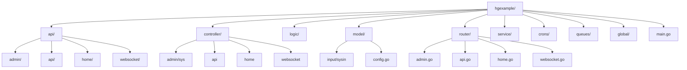
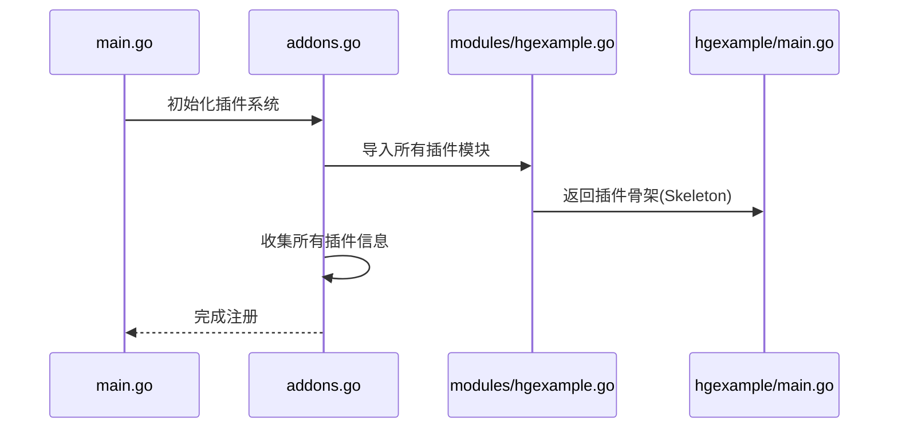
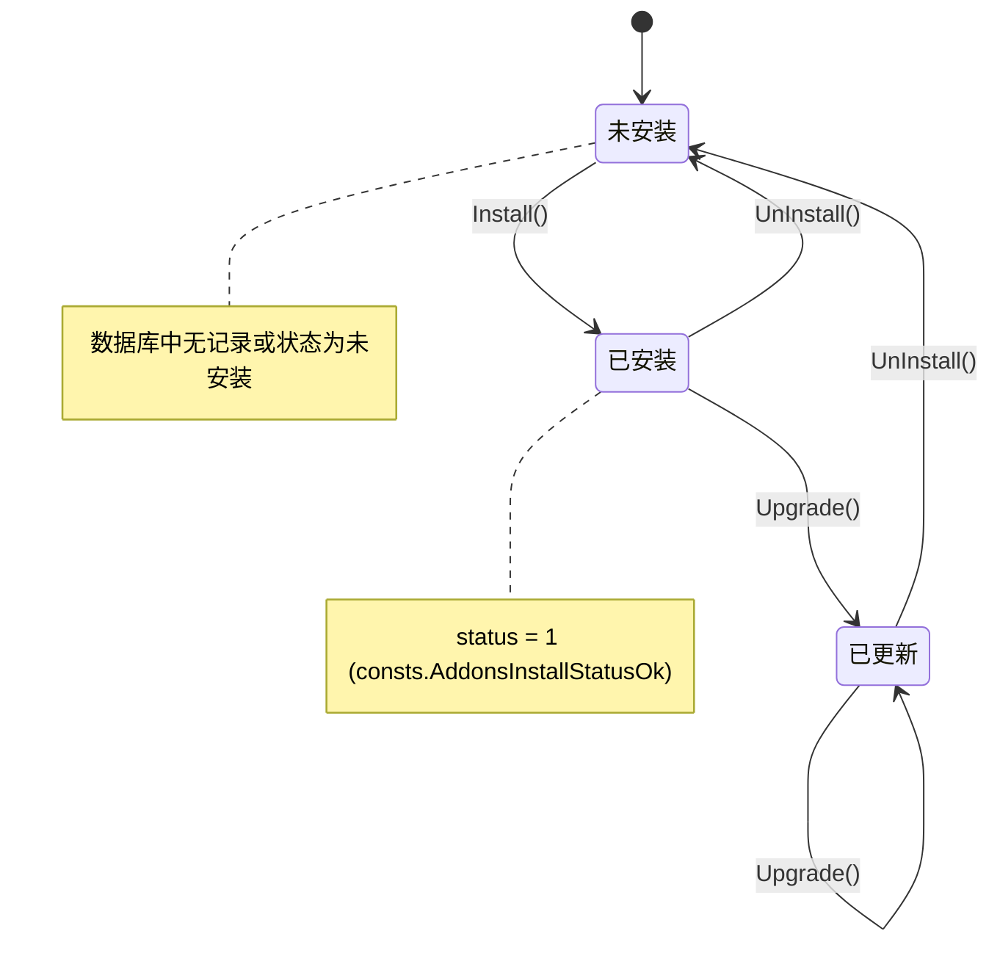

# 插件系统开发

<cite>
**本文档中引用的文件**  
- [server/addons/hgexample/main.go](file://server/addons/hgexample/main.go)
- [server/addons/modules/hgexample.go](file://server/addons/modules/hgexample.go)
- [server/addons/addons.go](file://server/addons/addons.go)
- [server/internal/library/addons/addons.go](file://server/internal/library/addons/addons.go)
- [server/internal/library/addons/build.go](file://server/internal/library/addons/build.go)
- [server/internal/library/addons/install.go](file://server/internal/library/addons/install.go)
- [server/addons/hgexample/router/api.go](file://server/addons/hgexample/router/api.go)
- [server/addons/hgexample/model/config.go](file://server/addons/hgexample/model/config.go)
- [resource/addons/hgexample/template/home/index.html](file://resource/addons/hgexample/template/home/index.html)
- [web/src/views/addons/hgexample/home/index.vue](file://web/src/views/addons/hgexample/home/index.vue)
- [web/src/api/addons/hgexample/home/index.ts](file://web/src/api/addons/hgexample/home/index.ts)
</cite>

## 目录

1. [简介](#简介)
2. [插件目录标准结构](#插件目录标准结构)
3. [插件注册机制](#插件注册机制)
4. [插件构建与安装流程](#插件构建与安装流程)
5. [定义API路由](#定义api路由)
6. [数据库表设计](#数据库表设计)
7. [前端页面集成](#前端页面集成)
8. [插件与主应用通信](#插件与主应用通信)
9. [实战教程：创建天气预报插件](#实战教程创建天气预报插件)
10. [总结](#总结)

## 简介

本指南旨在为开发者提供一套完整的插件开发体系，基于`hotgo-2.0`框架的插件机制，详细阐述如何从零开始创建一个功能完备的插件。以`hgexample`插件为参考模板，深入解析插件的注册、构建、安装、API定义、数据库集成及前后端联动机制。

## 插件目录标准结构

`hotgo`框架的插件遵循统一的目录结构，确保可维护性和一致性。以`server/addons/hgexample`为例，其核心结构如下：



**目录说明：**
- **api**: 存放API请求参数结构体，按模块（admin, api, home）划分。
- **controller**: 控制器层，处理HTTP请求，调用logic层。
- **logic**: 业务逻辑层，实现核心功能。
- **model**: 数据模型层，包含数据库实体、输入输出结构体和配置。
- **router**: 路由定义，注册API端点。
- **service**: 服务层，可选，用于封装跨模块的业务服务。
- **crons**: 定时任务。
- **queues**: 消息队列消费者。
- **global**: 插件全局变量和初始化逻辑。
- **main.go**: 插件入口，实现`Module`接口。

**Section sources**
- [server/addons/hgexample/main.go](file://server/addons/hgexample/main.go)
- [server/addons/hgexample/router/api.go](file://server/addons/hgexample/router/api.go)
- [server/addons/hgexample/model/config.go](file://server/addons/hgexample/model/config.go)

## 插件注册机制

新插件需在`server/addons/modules`目录下创建一个Go文件（如`hgexample.go`），并导入到`server/addons/addons.go`中。



`internal/library/addons/module.go`定义了`Module`接口，每个插件必须实现：
- `GetSkeleton()`: 返回插件元信息（名称、标签、版本等）。
- `Install(ctx)`: 安装时执行的逻辑（如建表）。
- `Upgrade(ctx)`: 升级时执行的逻辑。
- `UnInstall(ctx)`: 卸载时执行的逻辑。

**Section sources**
- [server/addons/modules/hgexample.go](file://server/addons/modules/hgexample.go)
- [server/addons/addons.go](file://server/addons/addons.go)

## 插件构建与安装流程

`internal/library/addons`包提供了插件的构建、安装和加载机制。

### 构建机制

`build.go`中的`Build`函数负责创建新插件。它使用模板（skeleton）填充变量（如`@{.name}`）生成新插件的代码骨架。

**关键函数：**
- `Build(ctx, option *BuildOption)`: 核心构建函数。
- `GetModulePath(name)`: 获取插件模块路径。
- `ViewPath(name, basePath)`: 获取插件模板路径。
- `StaticPath(name, basePath)`: 获取插件静态资源路径映射。

### 安装机制

`install.go`提供了插件的全生命周期管理。



**核心函数：**
- `IsInstall(m Module)`: 检查插件是否已安装。
- `Install(m Module)`: 执行安装，先调用`m.Install(ctx)`再更新数据库记录。
- `Upgrade(m Module)`: 执行升级。
- `UnInstall(m Module)`: 执行卸载。

**Diagram sources**
- [server/internal/library/addons/build.go](file://server/internal/library/addons/build.go)
- [server/internal/library/addons/install.go](file://server/internal/library/addons/install.go)

## 定义API路由

插件的API路由在`router`目录下定义。以`api.go`为例：

```go
func init() {
    // 注册API路由
    apiRouterGroup.Add("/hgexample", func(group web.RouterGroup) {
        group.GET("/index", controller.Api.Index)
    })
}
```

路由前缀由`internal/library/addons/addons.go`中的`RouterPrefix`函数生成，格式为`/应用名/插件名`。

**Section sources**
- [server/addons/hgexample/router/api.go](file://server/addons/hgexample/router/api.go)
- [server/internal/library/addons/addons.go](file://server/internal/library/addons/addons.go)

## 数据库表设计

插件的数据库表应在`model`包中定义，并在`Install`方法中创建。

1.  **定义模型**：在`model`目录下创建GORM模型。
    ```go
    type AddonHgexampleTable struct {
        Id   int64 `json:"id" gorm:"column:id;primaryKey;autoIncrement;comment:主键编码"`
        Name string `json:"name" gorm:"column:name;size:64;not null;comment:名称"`
        // ... 其他字段
    }
    ```

2.  **创建表**：在`main.go`的`Install`方法中使用GORM自动迁移。
    ```go
    func (m *hgexample) Install(ctx context.Context) error {
        return dao.AddonHgexampleTable.Ctx(ctx).AutoMigrate(&entity.AddonHgexampleTable{})
    }
    ```

**Section sources**
- [server/addons/hgexample/main.go](file://server/addons/hgexample/main.go)
- [server/internal/dao/internal/addon_hgexample_table.go](file://server/internal/dao/internal/addon_hgexample_table.go)

## 前端页面集成

插件的前端页面位于`web/src/views/addons/{插件名}`，API调用位于`web/src/api/addons/{插件名}`。

1.  **前端页面**：在`web/src/views/addons/hgexample`下创建Vue组件。
2.  **API调用**：在`web/src/api/addons/hgexample`下定义API函数。
3.  **资源路径**：静态资源通过`/addons/{插件名}`访问，由`StaticPath`函数映射。

**Section sources**
- [web/src/views/addons/hgexample/home/index.vue](file://web/src/views/addons/hgexample/home/index.vue)
- [web/src/api/addons/hgexample/home/index.ts](file://web/src/api/addons/hgexample/home/index.ts)

## 插件与主应用通信

插件可通过以下方式与主应用通信：

1.  **调用主应用服务**：直接导入并调用`internal/service`包中的服务。
    ```go
    import "hotgo/internal/service"
    // 在logic层调用
    user, err := service.Admin.GetProfile(ctx, &input.AdminGetProfileInp{Id: userId})
    ```

2.  **事件总线**：使用`internal/library/simple/event`发布和订阅事件。
3.  **共享数据库**：通过读写主应用的数据库表进行数据交换。

**Section sources**
- [server/internal/service/sys.go](file://server/internal/service/sys.go)
- [server/internal/library/simple/event.go](file://server/internal/library/simple/event.go)

## 实战教程：创建天气预报插件

本教程将创建一个名为`weather`的插件。

### 步骤1：构建插件骨架

使用CLI工具或手动复制`hgexample`，将所有`hgexample`替换为`weather`。

### 步骤2：注册插件

在`server/addons/modules`下创建`weather.go`，实现`GetSkeleton`返回`&addons.Skeleton{...}`。

### 步骤3：定义数据库模型

在`model`中定义`WeatherData`结构体，并在`Install`方法中创建表。

### 步骤4：定义API

1.  在`api/home`下定义`GetWeatherInp`。
2.  在`controller/home`下创建`GetWeather`方法。
3.  在`logic`下实现获取天气数据的逻辑（可调用第三方API）。
4.  在`router/home.go`中注册`GET /weather/index`路由。

### 步骤5：开发前端页面

1.  在`web/src/views/addons/weather/home`创建`Weather.vue`。
2.  在`web/src/api/addons/weather/home`创建`getWeather`函数。
3.  在页面中调用API并展示数据。

### 步骤6：安装与测试

编译并运行主程序，在管理后台的插件管理页面安装`weather`插件，访问`/home/weather/index`测试。

**Section sources**
- [server/addons/weather/main.go](file://server/addons/weather/main.go)
- [server/addons/modules/weather.go](file://server/addons/modules/weather.go)
- [web/src/views/addons/weather/home/Weather.vue](file://web/src/views/addons/weather/home/Weather.vue)

## 总结

`hotgo`的插件系统提供了一套清晰、模块化的开发范式。通过遵循标准的目录结构、利用`internal/library/addons`包提供的构建和安装机制，开发者可以高效地创建、集成和管理插件。关键在于理解`Module`接口的生命周期、路由注册方式以及前后端的协同开发模式。