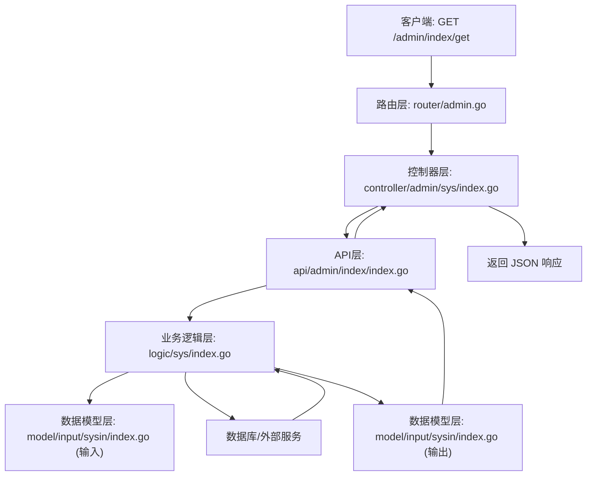

# 插件结构

<cite>
**本文档中引用的文件**  
- [main.go](file://server/addons/hgexample/main.go)
- [global.go](file://server/addons/hgexample/global/global.go)
- [init.go](file://server/addons/hgexample/global/init.go)
- [crons.go](file://server/addons/hgexample/crons/crons.go)
- [queues.go](file://server/addons/hgexample/queues/queues.go)
- [router/admin.go](file://server/addons/hgexample/router/admin.go)
- [router/api.go](file://server/addons/hgexample/router/api.go)
- [controller/admin/sys/index.go](file://server/addons/hgexample/controller/admin/sys/index.go)
- [logic/sys/index.go](file://server/addons/hgexample/logic/sys/index.go)
- [model/input/sysin/index.go](file://server/addons/hgexample/model/input/sysin/index.go)
- [api/admin/index/index.go](file://server/addons/hgexample/api/admin/index/index.go)
</cite>

## 目录结构

`hgexample` 插件遵循清晰的分层架构，各子目录职责明确，便于维护和扩展。其核心目录结构如下：

```
hgexample/
├── api/               # API 接口定义层
├── controller/        # 控制器层，处理请求分发
├── logic/             # 业务逻辑层，实现核心功能
├── model/             # 数据模型层，定义输入输出结构
├── router/            # 路由注册层，绑定 URL 与控制器
├── crons/             # 定时任务模块
├── queues/            # 消息队列消费者模块
├── global/            # 插件全局状态与初始化逻辑
├── service/           # 服务层（可选）
├── main.go            # 插件入口文件
└── README.MD          # 插件说明文档
```

**Section sources**
- [main.go](file://server/addons/hgexample/main.go#L1-L98)

## 目录职责说明

### `api` 目录
`api` 目录用于定义插件对外暴露的 HTTP 接口。它通常按访问端（如 `admin`、`api`、`home`、`websocket`）进行子目录划分，每个子目录下再按功能模块组织。该层主要负责接收请求参数、调用控制器，并返回标准化响应。

例如，`api/admin/index/index.go` 定义了后台管理端关于“首页”的接口。

**Section sources**
- [api/admin/index/index.go](file://server/addons/hgexample/api/admin/index/index.go#L1-L20)

### `controller` 目录
`controller` 目录是请求的处理中枢，负责接收来自路由的请求，调用相应的业务逻辑，并返回结果。它同样按访问端和功能模块进行组织。控制器应尽量保持轻量，仅负责流程控制，不包含复杂业务规则。

例如，`controller/admin/sys/index.go` 处理后台“首页”相关的请求，调用 `logic` 层获取数据。

**Section sources**
- [controller/admin/sys/index.go](file://server/addons/hgexample/controller/admin/sys/index.go#L1-L30)

### `logic` 目录
`logic` 目录是插件的核心业务逻辑实现层。它封装了所有与业务相关的处理，如数据计算、状态变更、事务处理等。该层被 `controller` 调用，同时可能调用 `model` 层进行数据结构转换或访问数据库。

例如，`logic/sys/index.go` 实现了“首页”所需的数据聚合、统计计算等核心逻辑。

**Section sources**
- [logic/sys/index.go](file://server/addons/hgexample/logic/sys/index.go#L1-L40)

### `model` 目录
`model` 目录定义了插件中使用的数据结构，特别是 API 的输入和输出模型。`input` 子目录（如 `input/sysin`）通常存放请求参数的结构体，确保参数校验和类型安全。

例如，`model/input/sysin/index.go` 定义了“首页”接口所需的查询参数结构。

**Section sources**
- [model/input/sysin/index.go](file://server/addons/hgexample/model/input/sysin/index.go#L1-L25)

### `router` 目录
`router` 目录负责注册插件的路由规则，将 URL 路径、HTTP 方法与具体的控制器函数关联起来。`admin.go`、`api.go` 等文件分别注册不同访问端的路由。

**Section sources**
- [router/admin.go](file://server/addons/hgexample/router/admin.go#L1-L50)
- [router/api.go](file://server/addons/hgexample/router/api.go#L1-L50)

## `main.go` 入口文件

`main.go` 是插件的入口文件，其核心作用是向主应用注册该插件模块。它通过 `init()` 函数自动执行 `newModule()` 来创建并注册一个实现了 `addons.Module` 接口的模块实例。

`Start()` 方法在插件启动时被调用，负责：
1.  调用 `global.Init()` 进行插件级初始化。
2.  通过 `option.Server.Group()` 注册插件的所有路由。

`main.go` 中通过 `_` 方式导入 `crons` 和 `queues` 包，是为了触发这些包的 `init()` 函数，从而完成定时任务和消息队列消费者的注册。

**Section sources**
- [main.go](file://server/addons/hgexample/main.go#L1-L98)

## `global` 包初始化逻辑

`global` 包用于存储插件的全局状态，如 `skeleton`（插件元信息）。`init.go` 文件中的 `Init()` 函数在 `main.go` 的 `Start()` 方法中被显式调用，此时传入主应用提供的上下文和插件骨架信息，完成全局变量的初始化。

`GetSkeleton()` 函数提供了一个安全的访问点，确保在全局状态未初始化时会触发 panic，避免后续使用出现 nil 指针错误。

**Section sources**
- [global.go](file://server/addons/hgexample/global/global.go#L1-L13)
- [init.go](file://server/addons/hgexample/global/init.go#L1-L23)

## `crons` 和 `queues` 目录

### `crons` 目录
`crons` 目录用于存放插件的定时任务。通过在 `main.go` 中导入 `_ "hotgo/addons/hgexample/crons"`，可以触发 `crons` 包的 `init()` 函数。开发者可以在 `crons.go` 或其子文件中注册具体的定时任务（如使用 `cron` 库），这些任务将在应用启动后按计划执行。

**Section sources**
- [crons.go](file://server/addons/hgexample/crons/crons.go#L1-L10)

### `queues` 目录
`queues` 目录用于存放插件的消息队列消费者。与 `crons` 类似，通过在 `main.go` 中导入 `_ "hotgo/addons/hgexample/queues"` 来触发初始化。开发者可以在此注册消费者，监听特定主题的消息并进行异步处理。

**Section sources**
- [queues.go](file://server/addons/hgexample/queues/queues.go#L1-L10)

## 数据流动示例

以下是一个典型的请求数据流，以获取后台首页数据为例：



**Diagram sources**
- [router/admin.go](file://server/addons/hgexample/router/admin.go#L1-L50)
- [controller/admin/sys/index.go](file://server/addons/hgexample/controller/admin/sys/index.go#L1-L30)
- [api/admin/index/index.go](file://server/addons/hgexample/api/admin/index/index.go#L1-L20)
- [logic/sys/index.go](file://server/addons/hgexample/logic/sys/index.go#L1-L40)
- [model/input/sysin/index.go](file://server/addons/hgexample/model/input/sysin/index.go#L1-L25)

## 与主应用MVC结构的对应关系

`hgexample` 插件的分层结构与主应用的MVC模式高度对应：

- **`api` 和 `controller`** 共同对应 **Controller (控制器)** 层。`api` 定义接口契约，`controller` 处理请求和响应，是MVC中C的体现。
- **`logic`** 对应 **Model (模型)** 层的核心部分。它包含了业务规则和数据处理逻辑，是MVC中M的业务逻辑部分。
- **`model`** 目录定义了数据结构，可以看作是 **Model (模型)** 层的数据契约部分，确保了数据在各层间传递的一致性。
- **`router`** 是MVC架构的前端入口，负责将HTTP请求分发到对应的控制器。

这种设计使得插件能够无缝集成到主应用的MVC框架中，保持了代码结构的一致性和可维护性。

**Section sources**
- [main.go](file://server/addons/hgexample/main.go#L1-L98)
- [router/admin.go](file://server/addons/hgexample/router/admin.go#L1-L50)
- [controller/admin/sys/index.go](file://server/addons/hgexample/controller/admin/sys/index.go#L1-L30)
- [logic/sys/index.go](file://server/addons/hgexample/logic/sys/index.go#L1-L40)