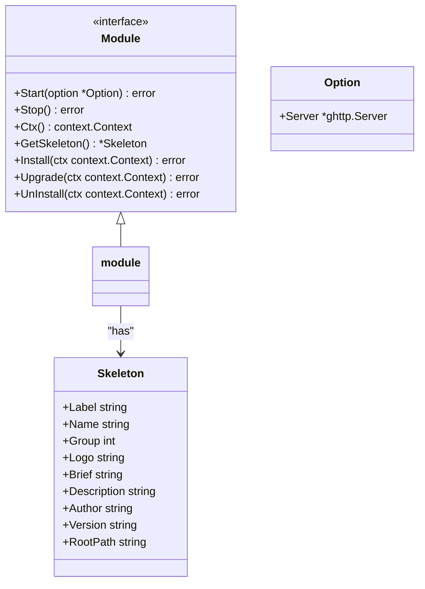
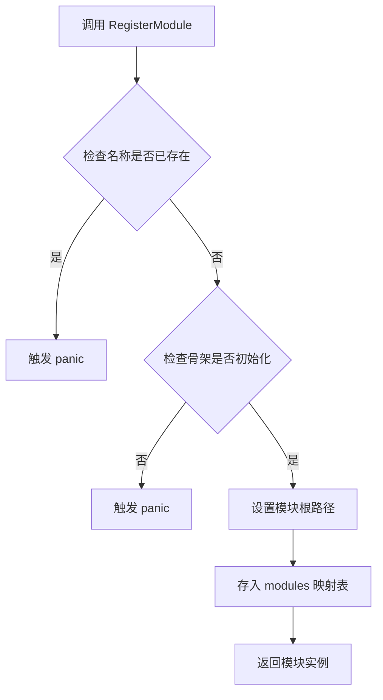
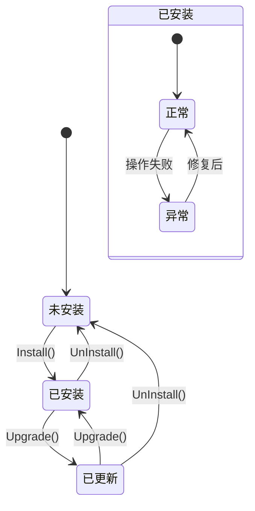
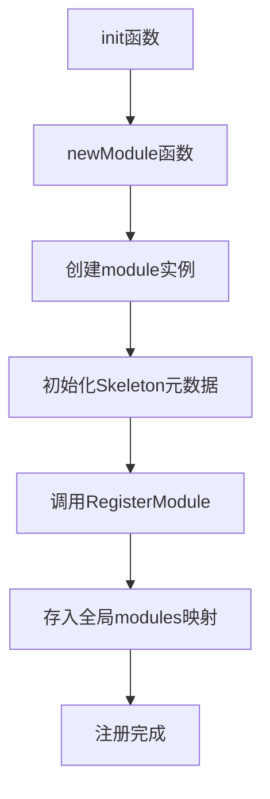

# 注册与加载

<cite>
**Referenced Files in This Document**   
- [addons.go](file://server/addons/addons.go)
- [module.go](file://server/internal/library/addons/module.go)
- [addons.go](file://server/internal/library/addons/addons.go)
- [build.go](file://server/internal/library/addons/build.go)
- [install.go](file://server/internal/library/addons/install.go)
- [main.go](file://server/addons/hgexample/main.go)
- [addons.go](file://server/internal/logic/sys/addons.go)
</cite>

## 目录
1. [插件注册机制概述](#插件注册机制概述)
2. [核心组件分析](#核心组件分析)
3. [插件动态加载与路由注册](#插件动态加载与路由注册)
4. [插件构建与安装流程](#插件构建与安装流程)
5. [安全注册新插件模块](#安全注册新插件模块)
6. [异常处理与最佳实践](#异常处理与最佳实践)

## 插件注册机制概述

本系统采用模块化插件架构，通过`server/internal/library/addons`包提供了一套完整的插件管理机制。该机制允许开发者动态地注册、加载、构建和安装插件模块，实现了系统的高度可扩展性。核心功能包括插件的注册与发现、动态加载、路由注册、静态资源映射以及完整的构建和安装生命周期管理。

**Section sources**
- [module.go](file://server/internal/library/addons/module.go#L1-L187)
- [addons.go](file://server/internal/library/addons/addons.go#L1-L62)

## 核心组件分析

### 插件模块接口与骨架

系统定义了`Module`接口作为所有插件模块的契约，规定了插件必须实现的生命周期方法，包括`Start`、`Stop`、`Install`、`Upgrade`和`UnInstall`。每个插件模块都必须实现此接口，以确保系统能够统一管理其生命周期。

与`Module`接口配套的是`Skeleton`结构体，它作为插件的元数据容器，包含了插件的标识（Label）、名称（Name）、分组（Group）、版本号（Version）等基本信息。这些元数据在插件注册时被系统收集，用于插件的管理和展示。



**Diagram sources**
- [module.go](file://server/internal/library/addons/module.go#L25-L54)

### 插件注册中心

`RegisterModule`函数是插件注册的核心入口。它接收一个实现了`Module`接口的实例，并将其注册到全局的`modules`映射表中。注册过程包含线程安全的互斥锁保护，防止并发注册冲突。注册时，系统会检查插件名称是否已存在，若存在则会触发panic，防止重复注册。

`GetModule`函数则用于根据插件名称从注册表中获取对应的模块实例。如果请求的模块不存在，该函数同样会触发panic，确保调用者能够立即发现错误。



**Diagram sources**
- [module.go](file://server/internal/library/addons/module.go#L84-L101)

**Section sources**
- [module.go](file://server/internal/library/addons/module.go#L84-L101)

## 插件动态加载与路由注册

### 插件启动流程

`StartModules`函数负责启动所有已安装的插件模块。它遍历全局注册表，对每个已安装的模块调用其`Start`方法。启动成功后，系统会为所有已安装的插件模块统一设置静态资源路径，确保前端资源能够正确访问。

```mermaid
sequenceDiagram
participant System as 系统
participant ModuleManager as 模块管理器
participant ModuleA as 插件A
participant ModuleB as 插件B
System->>ModuleManager : StartModules()
ModuleManager->>ModuleManager : filterInstalled()
ModuleManager->>ModuleA : Start(option)
alt 启动成功
ModuleA-->>ModuleManager : 返回 nil
else 启动失败
ModuleA-->>ModuleManager : 返回 err
ModuleManager-->>System : 返回 err
deactivate System
end
ModuleManager->>ModuleB : Start(option)
alt 启动成功
ModuleB-->>ModuleManager : 返回 nil
else 启动失败
ModuleB-->>ModuleManager : 返回 err
ModuleManager-->>System : 返回 err
deactivate System
end
ModuleManager->>ModuleManager : AddStaticPath()
ModuleManager-->>System : 返回 nil
```

**Diagram sources**
- [module.go](file://server/internal/library/addons/module.go#L60-L70)

### 路由与静态资源注册

`RouterPrefix`函数根据配置动态生成插件的路由前缀。它首先从配置中读取应用级别的路由前缀，然后将其与插件名称拼接，形成最终的访问路径。例如，一个名为`hgexample`的插件，其API路由前缀可能为`/api/hgexample`。

`AddStaticPath`函数负责将插件的静态资源目录映射到HTTP服务器。它会根据插件资源路径配置和插件名称，计算出静态资源的URL前缀和物理路径，并调用HTTP服务器的`AddStaticPath`方法完成映射。

**Section sources**
- [addons.go](file://server/internal/library/addons/addons.go#L31-L61)
- [module.go](file://server/internal/library/addons/module.go#L139-L156)

## 插件构建与安装流程

### 插件构建

`Build`函数实现了插件的自动化构建。它接收一个`BuildOption`，其中包含插件的元数据（`Skeleton`）和构建配置。函数会根据模板文件（`.template`）生成新的插件代码，将模板中的占位符（如`@{.name}`）替换为实际的插件信息。构建过程还会自动创建Web端的API和视图文件，并生成插件的静态资源和模板目录。

### 插件安装与状态管理

`Install`、`Upgrade`和`UnInstall`函数构成了插件的完整生命周期管理。这些函数通过操作`sys_addons_install`数据库表来记录插件的安装状态和版本信息。`IsInstall`函数用于检查插件是否已安装且状态正常。



**Diagram sources**
- [install.go](file://server/internal/library/addons/install.go#L1-L121)

**Section sources**
- [install.go](file://server/internal/library/addons/install.go#L1-L121)
- [build.go](file://server/internal/library/addons/build.go#L1-L139)

## 安全注册新插件模块

### 示例插件注册

以`hgexample`插件为例，其注册过程在`main.go`文件的`init`函数中完成。首先，创建一个实现了`Module`接口的结构体`module`，并在`newModule`函数中初始化其`Skeleton`元数据。最后，调用`addons.RegisterModule(m)`将实例注册到系统中。



**Diagram sources**
- [main.go](file://server/addons/hgexample/main.go#L1-L98)

### 系统级集成

插件的管理功能被集成到系统的`sys`服务中。`sSysAddons`结构体实现了`service.SysAddons`接口，提供了`List`、`Build`、`Install`、`Upgrade`和`UnInstall`等方法，供上层业务逻辑（如API控制器）调用，从而实现对插件的增删改查操作。

**Section sources**
- [main.go](file://server/addons/hgexample/main.go#L1-L98)
- [addons.go](file://server/internal/logic/sys/addons.go#L1-L128)

## 异常处理与最佳实践

### 异常处理策略

系统在插件管理的各个环节都实现了完善的异常处理：
- **注册时**：通过panic防止重复注册和未初始化的模块，确保注册表的完整性。
- **启动时**：`StartModules`函数在启动任一模块失败时立即返回错误，防止部分启动导致的系统不稳定。
- **静态资源映射时**：使用`gfile.Search`检查物理路径是否存在，并记录警告日志，避免因资源缺失导致服务中断。
- **数据库操作时**：所有安装、更新、卸载操作均在数据库事务中执行，保证了数据的一致性。

### 最佳实践

1.  **唯一性保证**：确保插件名称（Name）全局唯一，避免注册冲突。
2.  **版本管理**：合理使用版本号，当插件需要更新时，通过`Upgrade`函数实现平滑升级。
3.  **资源路径配置**：正确配置`system.addonsResourcePath`，确保静态资源和模板能够被正确加载。
4.  **错误处理**：在实现`Install`、`Upgrade`等方法时，应充分考虑各种异常情况，并返回有意义的错误信息。