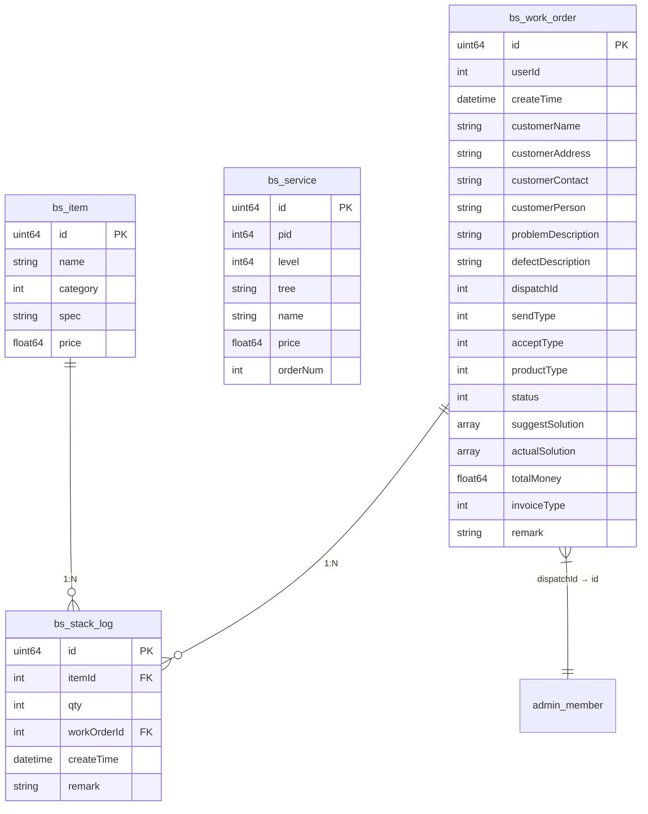

# 业务服务数据模型

<cite>
**本文档引用文件**  
- [bs_item.go](file://server/internal/model/entity/bs_item.go)
- [bs_service.go](file://server/internal/model/entity/bs_service.go)
- [bs_work_order.go](file://server/internal/model/entity/bs_work_order.go)
- [bs_stack_log.go](file://server/internal/model/entity/bs_stack_log.go)
- [bs_item.go](file://server/internal/dao/bs_item.go)
- [bs_service.go](file://server/internal/dao/bs_service.go)
- [bs_work_order.go](file://server/internal/dao/bs_work_order.go)
- [bs_stack_log.go](file://server/internal/dao/bs_stack_log.go)
- [bs_item.go](file://server/internal/logic/sys/bs_item.go)
- [bs_service.go](file://server/internal/logic/sys/bs_service.go)
- [bs_work_order.go](file://server/internal/logic/sys/bs_work_order.go)
- [bs_stack_log.go](file://server/internal/logic/sys/bs_stack_log.go)
- [status.go](file://server/internal/consts/status.go)
</cite>

## 目录
1. [简介](#简介)
2. [核心实体定义](#核心实体定义)
3. [实体关联关系](#实体关联关系)
4. [工单状态机](#工单状态机)
5. [服务与项目的多对多关系实现](#服务与项目的多对多关系实现)
6. [堆栈日志记录机制](#堆栈日志记录机制)
7. [数据模型图示](#数据模型图示)
8. [应用场景](#应用场景)

## 简介
本文档详细阐述了业务服务模块中的四个核心数据实体：业务项目（bs_item）、服务类型（bs_service）、工单（bs_work_order）和堆栈日志（bs_stack_log）。通过分析其数据结构、字段定义、关联关系及状态流转机制，为业务流程自动化、工单系统开发和运维监控提供底层数据结构参考。

## 核心实体定义

### 业务项目（bs_item）
表示仓库中的物品信息，包含基础属性如名称、类别、规格型号和单价。

**实体字段：**
- `id`：主键
- `name`：物品名称
- `category`：物品类别
- `spec`：规格型号
- `price`：单价

**Section sources**
- [bs_item.go](file://server/internal/model/entity/bs_item.go#L1-L14)

### 服务类型（bs_service）
表示可提供的服务项目，支持树形结构组织，用于分类管理服务类型。

**实体字段：**
- `id`：主键
- `pid`：父键（用于构建树形结构）
- `level`：关系树级别
- `tree`：关系树路径
- `name`：服务名称
- `price`：价格
- `orderNum`：序号（用于排序）

**Section sources**
- [bs_service.go](file://server/internal/model/entity/bs_service.go#L1-L16)

### 工单（bs_work_order）
记录客户问题处理的完整流程，包含客户信息、问题描述、处理方案、状态和金额等。

**实体字段：**
- `id`：主键
- `userId`：用户ID（创建人）
- `createTime`：创建时间
- `customerName`：客户名称
- `customerAddress`：客户地址
- `customerContact`：客户联系方式
- `customerPerson`：客户对接人
- `problemDescription`：问题描述
- `defectDescription`：检测描述
- `dispatchId`：分配处理人ID
- `sendType`：发起类型
- `acceptType`：收取方式
- `productType`：产品类型
- `status`：工单状态
- `suggestSolution`：建议处理方案（多选）
- `actualSolution`：实际处理方案（多选）
- `totalMoney`：总金额
- `invoiceType`：开票类型
- `remark`：备注

**Section sources**
- [bs_work_order.go](file://server/internal/model/entity/bs_work_order.go#L1-L32)

### 堆栈日志（bs_stack_log）
记录物品出入库的流水信息，关联具体工单和物品。

**实体字段：**
- `id`：主键
- `itemId`：物品ID
- `qty`：数量
- `workOrderId`：工单ID
- `createTime`：创建时间
- `remark`：备注

**Section sources**
- [bs_stack_log.go](file://server/internal/model/entity/bs_stack_log.go#L1-L19)

## 实体关联关系

### 主要关联路径
- **工单 → 堆栈日志**：一个工单可产生多条堆栈日志（出库记录）
- **堆栈日志 → 业务项目**：每条日志记录对应一个具体的物品
- **工单 → 用户**：工单由特定用户创建并分配给处理人
- **服务类型 → 工单明细**：服务项目被引用在工单处理过程中（通过 `bs_report_detail` 表）

### 外键关系
- `bs_stack_log.itemId` → `bs_item.id`
- `bs_stack_log.workOrderId` → `bs_work_order.id`
- `bs_work_order.dispatchId` → `admin_member.id`（系统用户表）

**Section sources**
- [bs_stack_log.go](file://server/internal/model/entity/bs_stack_log.go#L1-L19)
- [bs_work_order.go](file://server/internal/model/entity/bs_work_order.go#L1-L32)

## 工单状态机

工单状态通过 `status` 字段管理，其值定义如下：

| 状态值 | 状态名称 | 说明 |
|--------|----------|------|
| 1 | 待分派 | 工单已创建，尚未分配处理人 |
| 2 | 处理中 | 工单已被分配，正在处理 |
| 3 | 已完结 | 工单处理完成，流程结束 |

状态变更通过 `Status` 方法实现，支持在事务中更新状态。

**状态变更逻辑：**
- 创建工单时默认状态为 `1`（待分派）
- 分配处理人后可更新为 `2`（处理中）
- 处理完成后调用 `Process` 方法自动更新为 `3`（已完结）

**Section sources**
- [bs_work_order.go](file://server/internal/logic/sys/bs_work_order.go#L150-L175)
- [status.go](file://server/internal/consts/status.go#L1-L49)

## 服务与项目的多对多关系实现

虽然当前模型未直接体现 `bs_service` 与 `bs_item` 的多对多关系，但通过工单处理流程间接实现：

1. **工单处理（Process）**：在处理工单时，可选择多个服务项目（`serviceList`）
2. **服务与物品关联**：每个服务项目可对应需要出库的物品（通过业务逻辑关联）
3. **堆栈日志记录**：服务执行过程中触发物品出库，生成 `bs_stack_log` 记录

该设计通过业务逻辑层而非数据库外键实现灵活的多对多映射，适应复杂的服务组合场景。

**Section sources**
- [bs_work_order.go](file://server/internal/logic/sys/bs_work_order.go#L1-L145)
- [bs_stack_log.go](file://server/internal/logic/sys/bs_stack_log.go#L1-L142)

## 堆栈日志记录机制

堆栈日志用于追踪物品的使用情况，主要在以下场景被记录：

### 触发时机
- 当工单处理完成（`Process` 方法）时，根据服务需求自动创建出库记录
- 手动新增库存流水（通过 `Edit` 方法）

### 记录内容
- `itemId`：关联的物品ID
- `qty`：操作数量（当前模型中未显式记录数量，需业务层补充）
- `workOrderId`：关联的工单ID，实现溯源
- `createTime`：操作时间
- `remark`：备注信息

### 查询支持
支持通过左连接查询物品名称和工单信息，便于展示完整上下文。

**Section sources**
- [bs_stack_log.go](file://server/internal/logic/sys/bs_stack_log.go#L1-L142)
- [bs_stack_log.go](file://server/internal/model/entity/bs_stack_log.go#L1-L19)

## 数据模型图示

**Diagram sources**
- [bs_item.go](file://server/internal/model/entity/bs_item.go#L1-L14)
- [bs_service.go](file://server/internal/model/entity/bs_service.go#L1-L16)
- [bs_work_order.go](file://server/internal/model/entity/bs_work_order.go#L1-L32)
- [bs_stack_log.go](file://server/internal/model/entity/bs_stack_log.go#L1-L19)

## 应用场景

### 业务流程自动化
- 工单创建 → 自动校验客户信息
- 工单处理 → 自动计算总金额并更新状态
- 工单完成 → 自动触发库存扣减（通过堆栈日志）

### 工单系统开发
- 支持复杂查询：按客户、时间、状态、产品类型等多维度筛选
- 支持导出功能：基于 `Export` 方法实现数据导出
- 支持树形服务选择：通过 `TreeOption` 方法获取服务分类

### 运维监控
- 通过堆栈日志追踪物品使用情况
- 分析工单处理时效与成本
- 监控高频服务类型与耗材使用

**Section sources**
- [bs_work_order.go](file://server/internal/logic/sys/bs_work_order.go#L1-L295)
- [bs_stack_log.go](file://server/internal/logic/sys/bs_stack_log.go#L1-L142)
- [bs_service.go](file://server/internal/logic/sys/bs_service.go#L1-L147)