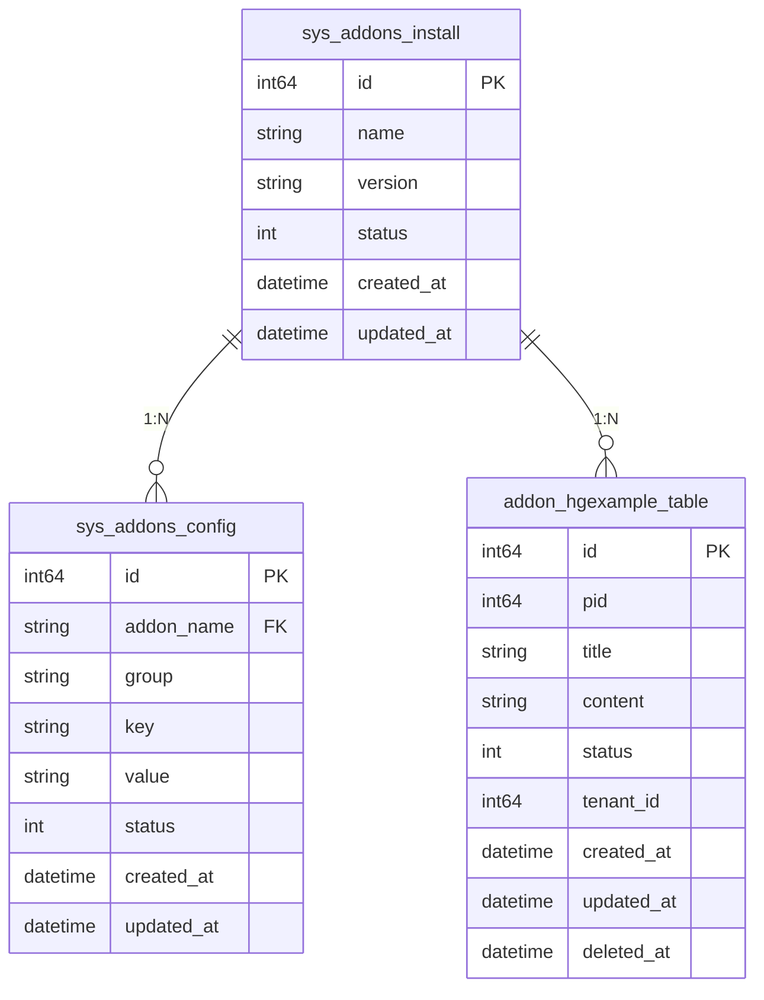

# 插件系统数据模型

<cite>
**本文档引用文件**  
- [sys_addons_install.go](file://server/internal/dao/internal/sys_addons_install.go)
- [sys_addons_config.go](file://server/internal/dao/internal/sys_addons_config.go)
- [addon_hgexample_table.go](file://server/internal/dao/internal/addon_hgexample_table.go)
- [entity/sys_addons_install.go](file://server/internal/model/entity/sys_addons_install.go)
- [entity/sys_addons_config.go](file://server/internal/model/entity/sys_addons_config.go)
- [entity/addon_hgexample_table.go](file://server/internal/model/entity/addon_hgexample_table.go)
- [do/sys_addons_install.go](file://server/internal/model/do/sys_addons_install.go)
- [do/sys_addons_config.go](file://server/internal/model/do/sys_addons_config.go)
- [do/addon_hgexample_table.go](file://server/internal/model/do/addon_hgexample_table.go)
</cite>

## 目录
1. [简介](#简介)
2. [核心数据表结构](#核心数据表结构)
3. [插件安装记录表（sys_addons_install）](#插件安装记录表sys_addons_install)
4. [插件配置表（sys_addons_config）](#插件配置表sys_addons_config)
5. [插件独立数据表示例（hgexample）](#插件独立数据表示例hgexample)
6. [多租户集成机制](#多租户集成机制)
7. [开发者指导建议](#开发者指导建议)

## 简介
本文档旨在详细描述 HotGo 框架中的插件系统数据模型，重点解析插件的安装记录、配置管理以及自定义数据表的设计原则。通过分析 `sys_addons_install` 和 `sys_addons_config` 两张核心系统表，并以 `hgexample` 插件为例，说明插件如何在数据库层面实现独立存储与主系统集成，为开发者提供清晰的数据存储开发规范。

## 核心数据表结构
插件系统的数据模型由三类主要表构成：
- **系统级插件元数据表**：用于统一管理所有插件的安装状态与全局配置
- **插件专属数据表**：每个插件可定义自己的数据表，实现业务隔离
- **多租户支持字段**：通过 `tenant_id` 实现数据隔离，支持 SaaS 架构



**图表来源**  
- [sys_addons_install.go](file://server/internal/dao/internal/sys_addons_install.go#L14-L19)
- [sys_addons_config.go](file://server/internal/dao/internal/sys_addons_config.go#L14-L19)
- [addon_hgexample_table.go](file://server/internal/dao/internal/addon_hgexample_table.go#L14-L19)

## 插件安装记录表（sys_addons_install）

该表用于记录所有已安装插件的基本信息和状态，是插件生命周期管理的核心。

### 字段说明
| 字段名 | 类型 | 是否主键 | 允许空 | 默认值 | 描述 |
|--------|------|----------|--------|--------|------|
| id | int64 | 是 | 否 | 无 | 主键 |
| name | string | 否 | 否 | 无 | 插件名称（唯一标识） |
| version | string | 否 | 否 | 无 | 当前安装版本号 |
| status | int | 否 | 否 | 无 | 安装状态（如：0-未启用，1-已启用） |
| created_at | datetime | 否 | 否 | 无 | 创建时间 |
| updated_at | datetime | 否 | 否 | 无 | 更新时间 |

### 用途说明
- **插件启用/禁用控制**：通过 `status` 字段控制插件是否激活
- **版本管理**：`version` 字段支持插件升级检测与兼容性判断
- **安装状态追踪**：记录插件的安装时间与最后更新时间

**本节来源**  
- [sys_addons_install.go](file://server/internal/dao/internal/sys_addons_install.go#L14-L19)
- [entity/sys_addons_install.go](file://server/internal/model/entity/sys_addons_install.go#L11-L18)
- [do/sys_addons_install.go](file://server/internal/model/do/sys_addons_install.go#L12-L20)

## 插件配置表（sys_addons_config）

该表用于存储各插件的可配置参数，支持分组、类型化配置项管理。

### 字段说明
| 字段名 | 类型 | 是否主键 | 允许空 | 默认值 | 描述 |
|--------|------|----------|--------|--------|------|
| id | int64 | 是 | 否 | 无 | 配置ID |
| addon_name | string | 否 | 否 | 无 | 所属插件名称（外键） |
| group | string | 否 | 是 | null | 配置分组（如：basic, advanced） |
| name | string | 否 | 是 | null | 参数名称（显示用） |
| type | string | 否 | 否 | 无 | 键值类型（string/int/uint/bool/datetime/date） |
| key | string | 否 | 否 | 无 | 参数键名（代码中引用） |
| value | string | 否 | 是 | null | 参数键值 |
| default_value | string | 否 | 是 | null | 默认值 |
| sort | int | 否 | 否 | 0 | 排序权重 |
| tip | string | 否 | 是 | null | 变量描述（提示信息） |
| is_default | int | 否 | 否 | 0 | 是否为系统默认配置 |
| status | int | 否 | 否 | 1 | 状态（0-禁用，1-启用） |
| created_at | datetime | 否 | 否 | 无 | 创建时间 |
| updated_at | datetime | 否 | 否 | 无 | 更新时间 |

### 设计特点
- **灵活的键值对结构**：支持多种数据类型，便于动态配置
- **前后端分离设计**：`key` 用于代码访问，`name` 用于界面展示
- **可扩展性强**：新增配置无需修改表结构

**本节来源**  
- [sys_addons_config.go](file://server/internal/dao/internal/sys_addons_config.go#L14-L19)
- [entity/sys_addons_config.go](file://server/internal/model/entity/sys_addons_config.go#L11-L26)
- [do/sys_addons_config.go](file://server/internal/model/do/sys_addons_config.go#L12-L28)

## 插件独立数据表示例（hgexample）

以 `hgexample` 插件为例，其独立数据表 `hg_addon_hgexample_table` 展示了插件自定义表的设计规范。

### 命名规范
- **前缀统一**：所有插件表均以 `hg_addon_` 开头
- **插件名小写**：插件标识符全小写（如 `hgexample`）
- **语义清晰**：表名反映业务含义（如 `table`, `tenant_order`）

### 表结构特征
- **完整生命周期字段**：包含 `created_at`, `updated_at`, `deleted_at`（软删除）
- **操作审计字段**：`created_by`, `updated_by` 记录操作人
- **树形结构支持**：`pid`, `level`, `tree` 支持无限级分类
- **富媒体字段**：支持单图、多图、附件、动态键值对等复杂类型
- **状态控制**：`status` 字段统一控制数据可见性

### 典型字段示例
```go
type AddonHgexampleTable struct {
	Id          int64       `json:"id" orm:"id" description:"ID"`
	Pid         int64       `json:"pid" orm:"pid" description:"上级ID"`
	Title       string      `json:"title" orm:"title" description:"标题"`
	Content     string      `json:"content" orm:"content" description:"内容"`
	Images      *gjson.Json `json:"images" orm:"images" description:"多图"`
	Switch      int         `json:"switch" orm:"switch" description:"开关"`
	Status      int         `json:"status" orm:"status" description:"状态"`
	CreatedAt   *gtime.Time `json:"createdAt" orm:"created_at" description:"创建时间"`
	DeletedAt   *gtime.Time `json:"deletedAt" orm:"deleted_at" description:"删除时间"`
}
```

**本节来源**  
- [addon_hgexample_table.go](file://server/internal/dao/internal/addon_hgexample_table.go#L14-L19)
- [entity/addon_hgexample_table.go](file://server/internal/model/entity/addon_hgexample_table.go#L12-L50)
- [do/addon_hgexample_table.go](file://server/internal/model/do/addon_hgexample_table.go#L13-L52)

## 多租户集成机制

系统通过以下方式实现插件表与主系统的多租户集成：

### 租户隔离字段
虽然当前示例表中未显式包含 `tenant_id`，但框架通过以下机制支持多租户：
- **DAO 层自动注入**：在数据访问层（DAO）中自动添加 `tenant_id` 过滤条件
- **上下文传递**：通过请求上下文（context）传递当前租户信息
- **软硬结合**：既支持字段级隔离，也支持数据库/Schema 级隔离

### 集成方式
1. **逻辑隔离**：在同一张表中通过 `tenant_id` 字段区分不同租户数据
2. **物理隔离**：为每个租户创建独立的数据表或数据库
3. **混合模式**：核心共享表 + 租户专属表组合使用

### 最佳实践
- 所有插件表应预留 `tenant_id` 字段或设计为可扩展
- 在 DAO 查询中统一处理租户过滤逻辑
- 提供租户上下文获取工具方法

**本节来源**  
- [addon_hgexample_table.go](file://server/internal/dao/internal/addon_hgexample_table.go#L14-L19)
- [sys_addons_install.go](file://server/internal/dao/internal/sys_addons_install.go#L14-L19)

## 开发者指导建议

### 插件数据表开发规范
1. **命名规范**：`hg_addon_{插件名}_{业务表名}`，全部小写，使用下划线分隔
2. **必选字段**：
   - `id`: 主键
   - `created_at`, `updated_at`: 时间戳
   - `status`: 状态控制
   - `deleted_at`: 软删除支持
3. **可选通用字段**：
   - `tenant_id`: 多租户支持
   - `created_by`, `updated_by`: 操作审计
   - `sort`: 排序支持

### 配置管理建议
- 使用 `sys_addons_config` 表存储可变配置
- 配置项应有明确的 `group` 分组和 `tip` 提示
- 敏感配置（如密钥）应加密存储

### 数据访问最佳实践
- 使用 GoFrame ORM 的 `Do` 结构体进行查询构造
- 在 Service 层封装业务逻辑，避免直接操作 DAO
- 利用 `Ctx` 方法传递上下文，确保租户隔离

**本节来源**  
- [sys_addons_install.go](file://server/internal/dao/internal/sys_addons_install.go)
- [sys_addons_config.go](file://server/internal/dao/internal/sys_addons_config.go)
- [addon_hgexample_table.go](file://server/internal/dao/internal/addon_hgexample_table.go)