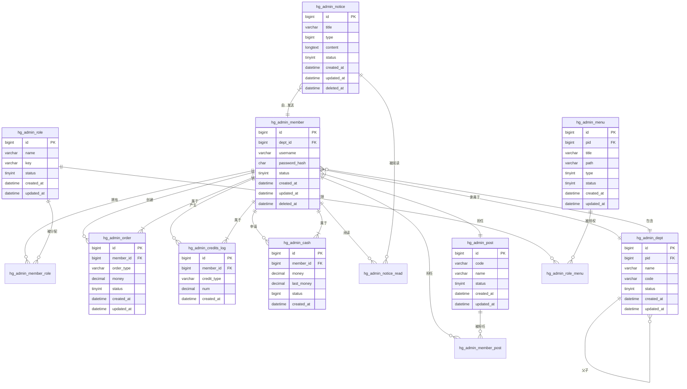

# 数据模型设计

<cite>
**本文档引用的文件**   
- [hotgo.sql](file://server/storage/data/hotgo.sql)
- [admin_member.go](file://server/internal/dao/admin_member.go)
- [admin_role.go](file://server/internal/dao/admin_role.go)
- [admin_menu.go](file://server/internal/dao/admin_menu.go)
- [admin_order.go](file://server/internal/dao/admin_order.go)
- [admin_dept.go](file://server/internal/dao/admin_dept.go)
- [admin_post.go](file://server/internal/dao/admin_post.go)
- [admin_notice.go](file://server/internal/dao/admin_notice.go)
- [admin_credits_log.go](file://server/internal/dao/admin_credits_log.go)
- [admin_cash.go](file://server/internal/dao/admin_cash.go)
</cite>

## 目录
1. [简介](#简介)
2. [核心实体关系图](#核心实体关系图)
3. [核心表字段说明](#核心表字段说明)
   - [管理员用户表 (hg_admin_member)](#管理员用户表-hg_admin_member)
   - [角色信息表 (hg_admin_role)](#角色信息表-hg_admin_role)
   - [菜单权限表 (hg_admin_menu)](#菜单权限表-hg_admin_menu)
   - [充值订单表 (hg_admin_order)](#充值订单表-hg_admin_order)
   - [部门表 (hg_admin_dept)](#部门表-hg_admin_dept)
   - [岗位表 (hg_admin_post)](#岗位表-hg_admin_post)
   - [通知公告表 (hg_admin_notice)](#通知公告表-hg_admin_notice)
   - [资产变动表 (hg_admin_credits_log)](#资产变动表-hg_admin_credits_log)
   - [提现记录表 (hg_admin_cash)](#提现记录表-hg_admin_cash)
4. [软删除机制](#软删除机制)
5. [GORM模型映射](#gorm模型映射)
6. [附录](#附录)

## 简介
本文档旨在为数据库管理员和需要进行复杂查询的开发者提供一份权威的数据模型参考。文档基于项目`storage/`目录下的SQL脚本和`internal/dao/`目录中的GORM模型，详细阐述了系统的核心数据实体及其关系。文档内容包括核心实体关系图（ERD）、关键数据表的字段说明、软删除实现机制以及GORM模型与数据库字段的映射方式。

**本文档引用的文件**   
- [hotgo.sql](file://server/storage/data/hotgo.sql)

## 核心实体关系图
以下实体关系图（ERD）描绘了系统中最核心的几个实体及其相互关系，包括用户、角色、菜单、部门、岗位、订单和日志等。



**图示来源**  
- [hotgo.sql](file://server/storage/data/hotgo.sql)

## 核心表字段说明

### 管理员用户表 (hg_admin_member)
该表存储系统管理员用户的核心信息。

| 字段名 | 数据类型 | 约束 | 业务含义 |
| :--- | :--- | :--- | :--- |
| `id` | bigint(20) | PRIMARY KEY, NOT NULL | 管理员ID，主键 |
| `dept_id` | bigint(20) | DEFAULT '0' | 部门ID，外键关联`hg_admin_dept` |
| `role_id` | bigint(20) | DEFAULT '10' | 角色ID，外键关联`hg_admin_role` |
| `real_name` | varchar(32) | DEFAULT '' | 真实姓名 |
| `username` | varchar(20) | NOT NULL, DEFAULT '' | 登录账号，唯一 |
| `password_hash` | char(32) | NOT NULL, DEFAULT '' | 密码哈希值 |
| `salt` | char(16) | NOT NULL | 密码盐值 |
| `integral` | decimal(10,2) | unsigned, DEFAULT '0.00' | 积分余额 |
| `balance` | decimal(10,2) | unsigned, DEFAULT '0.00' | 账户余额 |
| `avatar` | char(150) | DEFAULT '' | 头像URL |
| `sex` | tinyint(1) | DEFAULT '1' | 性别 (1:男, 2:女) |
| `email` | varchar(60) | DEFAULT '' | 邮箱地址 |
| `mobile` | varchar(20) | DEFAULT '' | 手机号码 |
| `pid` | bigint(20) | NOT NULL | 上级管理员ID，用于构建上下级关系树 |
| `level` | int(11) | DEFAULT '1' | 关系树等级 |
| `tree` | varchar(512) | NOT NULL | 关系树路径，如 'tr_1 tr_3' |
| `invite_code` | varchar(12) | DEFAULT NULL | 邀请码 |
| `last_active_at` | datetime | DEFAULT NULL | 最后活跃时间 |
| `status` | tinyint(1) | DEFAULT '1' | 状态 (1:正常, 0:禁用) |
| `created_at` | datetime | DEFAULT NULL | 创建时间 |
| `updated_at` | datetime | DEFAULT NULL | 修改时间 |
| `deleted_at` | datetime | DEFAULT NULL | 删除时间，用于软删除 |

**表来源**  
- [hotgo.sql](file://server/storage/data/hotgo.sql#L180-L270)

### 角色信息表 (hg_admin_role)
该表定义了系统中的角色及其权限范围。

| 字段名 | 数据类型 | 约束 | 业务含义 |
| :--- | :--- | :--- | :--- |
| `id` | bigint(20) | PRIMARY KEY, NOT NULL | 角色ID，主键 |
| `name` | varchar(32) | NOT NULL | 角色名称，如“超级管理员” |
| `key` | varchar(128) | NOT NULL | 角色权限字符串，用于权限校验 |
| `data_scope` | tinyint(1) | DEFAULT '1' | 数据范围 (1:全部, 2:本部门, 3:本部门及子部门, 5:本人, 7:自定义) |
| `custom_dept` | json | DEFAULT NULL | 自定义部门权限，当`data_scope`=7时使用 |
| `pid` | bigint(20) | DEFAULT '0' | 上级角色ID，用于构建角色继承关系 |
| `level` | int(11) | NOT NULL, DEFAULT '1' | 关系树等级 |
| `tree` | varchar(512) | DEFAULT NULL | 关系树路径 |
| `remark` | varchar(255) | DEFAULT NULL | 备注信息 |
| `sort` | int(11) | NOT NULL, DEFAULT '0' | 排序 |
| `status` | tinyint(1) | NOT NULL, DEFAULT '1' | 角色状态 (1:启用, 0:禁用) |
| `created_at` | datetime | DEFAULT NULL | 创建时间 |
| `updated_at` | datetime | DEFAULT NULL | 更新时间 |

**表来源**  
- [hotgo.sql](file://server/storage/data/hotgo.sql#L650-L700)

### 菜单权限表 (hg_admin_menu)
该表定义了后台系统的菜单结构和权限点。

| 字段名 | 数据类型 | 约束 | 业务含义 |
| :--- | :--- | :--- | :--- |
| `id` | bigint(20) | PRIMARY KEY, NOT NULL | 菜单ID，主键 |
| `pid` | bigint(20) | DEFAULT '0' | 父菜单ID，用于构建菜单树 |
| `level` | int(11) | NOT NULL, DEFAULT '1' | 关系树等级 |
| `tree` | varchar(255) | NOT NULL | 关系树路径 |
| `title` | varchar(64) | NOT NULL | 菜单名称，如“控制台” |
| `name` | varchar(128) | NOT NULL | 名称编码，前端路由标识 |
| `path` | varchar(200) | DEFAULT NULL | 路由地址 |
| `icon` | varchar(128) | DEFAULT NULL | 菜单图标 |
| `type` | tinyint(1) | NOT NULL, DEFAULT '1' | 菜单类型 (1:目录, 2:菜单, 3:按钮) |
| `component` | varchar(255) | NOT NULL | 前端组件路径 |
| `permissions` | varchar(512) | DEFAULT NULL | 菜单包含的权限集合 |
| `permission_name` | varchar(64) | DEFAULT NULL | 权限名称 |
| `sort` | int(11) | DEFAULT '0' | 排序 |
| `status` | tinyint(1) | DEFAULT '1' | 菜单状态 (1:启用, 0:禁用) |
| `created_at` | datetime | DEFAULT NULL | 创建时间 |
| `updated_at` | datetime | DEFAULT NULL | 更新时间 |

**表来源**  
- [hotgo.sql](file://server/storage/data/hotgo.sql#L310-L400)

### 充值订单表 (hg_admin_order)
该表记录了管理员用户的充值和退款订单。

| 字段名 | 数据类型 | 约束 | 业务含义 |
| :--- | :--- | :--- | :--- |
| `id` | bigint(20) | PRIMARY KEY, NOT NULL | 主键ID |
| `member_id` | bigint(20) | DEFAULT '0' | 管理员ID，外键关联`hg_admin_member` |
| `order_type` | varchar(32) | NOT NULL | 订单类型 (如 'recharge') |
| `product_id` | bigint(20) | DEFAULT NULL | 产品ID |
| `order_sn` | varchar(64) | DEFAULT '' | 订单号 |
| `money` | decimal(10,2) | NOT NULL | 交易金额 |
| `remark` | varchar(255) | DEFAULT NULL | 备注 |
| `refund_reason` | varchar(255) | DEFAULT NULL | 退款原因 |
| `reject_refund_reason` | varchar(255) | DEFAULT NULL | 拒绝退款原因 |
| `status` | tinyint(4) | DEFAULT '1' | 订单状态 (1:待支付, 2:已支付, 3:已退款, 4:退款中) |
| `created_at` | datetime | DEFAULT NULL | 创建时间 |
| `updated_at` | datetime | DEFAULT NULL | 修改时间 |

**表来源**  
- [hotgo.sql](file://server/storage/data/hotgo.sql#L950-L1000)

### 部门表 (hg_admin_dept)
该表用于组织管理，存储部门信息。

| 字段名 | 数据类型 | 约束 | 业务含义 |
| :--- | :--- | :--- | :--- |
| `id` | bigint(20) | PRIMARY KEY, NOT NULL | 部门ID，主键 |
| `pid` | bigint(20) | DEFAULT '0' | 父部门ID，用于构建部门树 |
| `name` | varchar(32) | DEFAULT NULL | 部门名称 |
| `code` | varchar(255) | DEFAULT NULL | 部门编码 |
| `type` | varchar(10) | DEFAULT NULL | 部门类型 (company:公司, dept:部门, tenant:租户) |
| `leader` | varchar(32) | DEFAULT NULL | 负责人 |
| `phone` | varchar(11) | DEFAULT NULL | 联系电话 |
| `email` | varchar(64) | DEFAULT NULL | 邮箱 |
| `level` | int(11) | NOT NULL | 关系树等级 |
| `tree` | varchar(512) | DEFAULT NULL | 关系树路径 |
| `sort` | int(11) | DEFAULT '0' | 排序 |
| `status` | tinyint(1) | DEFAULT '1' | 部门状态 (1:正常, 0:禁用) |
| `created_at` | datetime | DEFAULT NULL | 创建时间 |
| `updated_at` | datetime | DEFAULT NULL | 更新时间 |

**表来源**  
- [hotgo.sql](file://server/storage/data/hotgo.sql#L270-L310)

### 岗位表 (hg_admin_post)
该表定义了系统中的岗位信息。

| 字段名 | 数据类型 | 约束 | 业务含义 |
| :--- | :--- | :--- | :--- |
| `id` | bigint(20) | PRIMARY KEY, NOT NULL | 岗位ID，主键 |
| `code` | varchar(64) | NOT NULL | 岗位编码 |
| `name` | varchar(50) | NOT NULL | 岗位名称 |
| `remark` | varchar(500) | DEFAULT NULL | 备注 |
| `sort` | int(11) | NOT NULL | 排序 |
| `status` | tinyint(1) | NOT NULL | 状态 (1:启用, 0:禁用) |
| `created_at` | datetime | DEFAULT NULL | 创建时间 |
| `updated_at` | datetime | DEFAULT NULL | 更新时间 |

**表来源**  
- [hotgo.sql](file://server/storage/data/hotgo.sql#L600-L650)

### 通知公告表 (hg_admin_notice)
该表用于存储系统通知、公告和私信。

| 字段名 | 数据类型 | 约束 | 业务含义 |
| :--- | :--- | :--- | :--- |
| `id` | bigint(20) | PRIMARY KEY, NOT NULL | 公告ID，主键 |
| `title` | varchar(64) | NOT NULL | 公告标题 |
| `type` | bigint(20) | NOT NULL | 公告类型 (1:公告, 2:通知, 3:私信) |
| `tag` | int(11) | DEFAULT NULL | 标签 |
| `content` | longtext | NOT NULL | 公告内容 |
| `receiver` | json | DEFAULT NULL | 接收者ID列表，当`type`=3(私信)时使用 |
| `sort` | int(11) | NOT NULL, DEFAULT '0' | 排序 |
| `status` | tinyint(1) | DEFAULT '1' | 公告状态 (1:启用, 0:禁用) |
| `created_by` | bigint(20) | DEFAULT NULL | 发送人ID |
| `created_at` | datetime | DEFAULT NULL | 创建时间 |
| `updated_at` | datetime | DEFAULT NULL | 更新时间 |
| `deleted_at` | datetime | DEFAULT NULL | 删除时间，用于软删除 |

**表来源**  
- [hotgo.sql](file://server/storage/data/hotgo.sql#L700-L750)

### 资产变动表 (hg_admin_credits_log)
该表记录了管理员用户积分和余额的变动流水。

| 字段名 | 数据类型 | 约束 | 业务含义 |
| :--- | :--- | :--- | :--- |
| `id` | bigint(20) | PRIMARY KEY, NOT NULL | 变动ID，主键 |
| `member_id` | bigint(20) | DEFAULT '0' | 管理员ID，外键关联`hg_admin_member` |
| `credit_type` | varchar(32) | NOT NULL, DEFAULT '' | 变动类型 (balance:余额, integral:积分) |
| `credit_group` | varchar(32) | DEFAULT NULL | 变动组别 (incr:增加, decr:减少, apply_cash:申请提现) |
| `before_num` | decimal(10,2) | DEFAULT '0.00' | 变动前数值 |
| `num` | decimal(10,2) | DEFAULT '0.00' | 变动数值 |
| `after_num` | decimal(10,2) | DEFAULT '0.00' | 变动后数值 |
| `remark` | varchar(255) | DEFAULT NULL | 备注 |
| `ip` | varchar(20) | DEFAULT NULL | 操作人IP |
| `status` | tinyint(1) | DEFAULT '1' | 状态 (1:成功, 0:失败) |
| `created_at` | datetime | DEFAULT NULL | 创建时间 |

**表来源**  
- [hotgo.sql](file://server/storage/data/hotgo.sql#L150-L200)

### 提现记录表 (hg_admin_cash)
该表记录了管理员用户的提现申请和处理记录。

| 字段名 | 数据类型 | 约束 | 业务含义 |
| :--- | :--- | :--- | :--- |
| `id` | bigint(20) | PRIMARY KEY, NOT NULL | ID，主键 |
| `member_id` | bigint(20) | NOT NULL | 管理员ID，外键关联`hg_admin_member` |
| `money` | decimal(10,2) | NOT NULL | 提现金额 |
| `fee` | decimal(10,2) | NOT NULL | 手续费 |
| `last_money` | decimal(10,2) | NOT NULL | 最终到账金额 |
| `ip` | varchar(128) | NOT NULL | 申请人IP |
| `status` | bigint(20) | NOT NULL | 状态码 (1:待处理, 2:已打款, 3:已拒绝) |
| `msg` | varchar(128) | NOT NULL | 处理结果 |
| `handle_at` | datetime | DEFAULT NULL | 处理时间 |
| `created_at` | datetime | NOT NULL | 申请时间 |

**表来源**  
- [hotgo.sql](file://server/storage/data/hotgo.sql#L100-L150)

## 软删除机制
本系统采用软删除（Soft Delete）机制来处理数据的删除操作。该机制并非真正从数据库中物理删除记录，而是通过设置一个特定的字段来标记记录的“已删除”状态。

*   **实现方式**：在需要支持软删除的数据表中，均包含一个名为 `deleted_at` 的 `datetime` 类型字段。
*   **工作原理**：
    1.  当执行删除操作时，系统不会执行 `DELETE FROM table` 语句。
    2.  相反，系统会执行 `UPDATE table SET deleted_at = NOW() WHERE id = ?` 操作，将当前时间戳写入 `deleted_at` 字段。
    3.  在查询数据时，除非特别指定，否则查询条件会自动包含 `deleted_at IS NULL`，从而只返回未被删除的记录。
*   **优势**：
    *   **数据可恢复**：误删的数据可以通过将 `deleted_at` 字段置为 `NULL` 来轻松恢复。
    *   **数据审计**：保留了数据的历史记录，便于进行审计和追踪。
    *   **完整性**：避免了因物理删除导致的外键约束问题。

**相关表来源**  
- [hotgo.sql](file://server/storage/data/hotgo.sql#L180-L270) (hg_admin_member)
- [hotgo.sql](file://server/storage/data/hotgo.sql#L700-L750) (hg_admin_notice)

## GORM模型映射
GORM 是本项目使用的 ORM（对象关系映射）框架。它通过结构体标签（struct tags）将 Go 语言中的结构体（Struct）与数据库中的表（Table）进行映射。

*   **基本映射**：GORM 会自动将结构体的驼峰命名法（CamelCase）字段转换为数据库的蛇形命名法（snake_case）字段。例如，结构体字段 `UserName` 会映射到数据库字段 `user_name`。
*   **自定义映射**：通过 `gorm` 标签，可以精确控制映射关系。例如：
    ```go
    type User struct {
        ID       uint   `gorm:"primaryKey"`
        Name     string `gorm:"size:100;not null"`
        Email    string `gorm:"uniqueIndex;not null"`
        Password string `gorm:"column:pwd"` // 显式指定映射到数据库的 `pwd` 字段
    }
    ```
*   **JSON映射**：`json` 标签用于控制该字段在序列化（如API响应）时的输出名称。例如，`json:"id"` 表示在JSON输出中，该字段的键名为 `id`，而不是结构体的字段名 `ID`。
*   **在本项目中的体现**：虽然 `internal/dao/` 目录下的文件主要是DAO（数据访问对象）的声明，但其底层的模型定义（通常在 `internal/model/entity` 目录下）会使用这些标签来确保Go结构体与数据库表结构的正确映射。

**相关文件来源**  
- [admin_member.go](file://server/internal/dao/admin_member.go)
- [admin_role.go](file://server/internal/dao/admin_role.go)
- [admin_menu.go](file://server/internal/dao/admin_menu.go)
- [admin_order.go](file://server/internal/dao/admin_order.go)

## 附录
本文档基于 `server\storage\data\hotgo.sql` 文件和 `server\internal\dao\` 目录下的DAO文件生成。所有信息均来源于此，确保了文档的准确性和权威性。