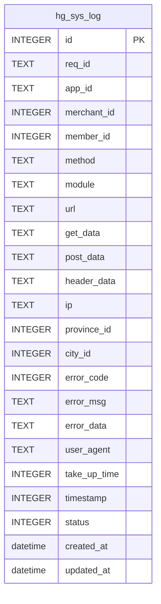
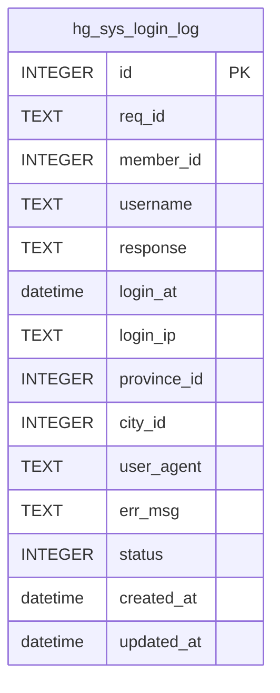
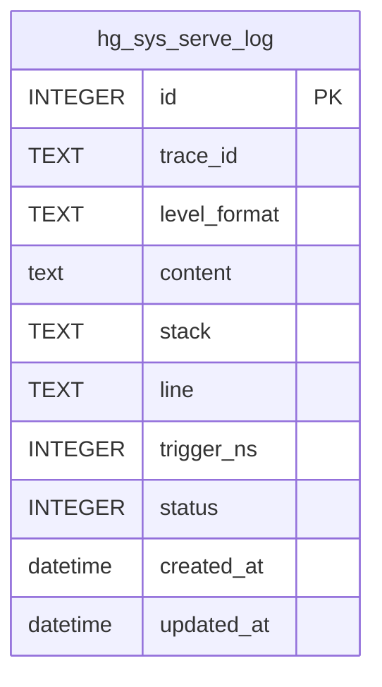
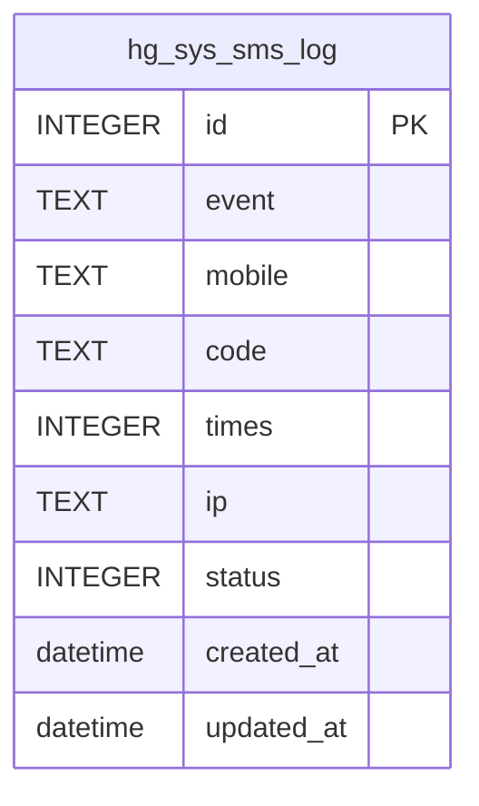
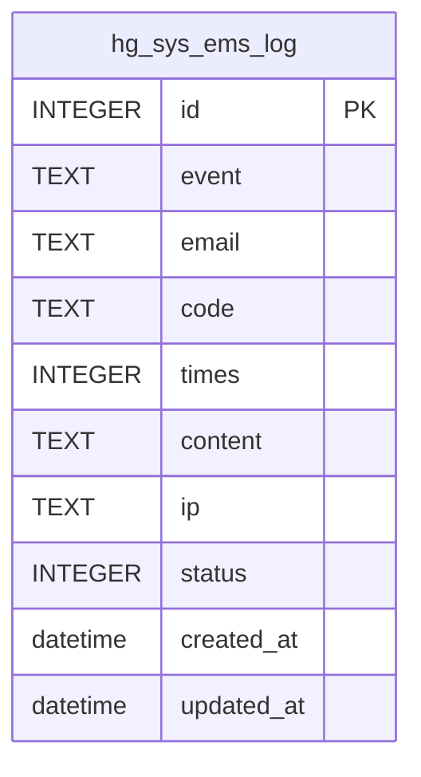

# 日志审计数据模型

<cite>
**本文档引用文件**  
- [sys_log.go](file://server/internal/dao/internal/sys_log.go)
- [sys_login_log.go](file://server/internal/dao/internal/sys_login_log.go)
- [sys_serve_log.go](file://server/internal/dao/internal/sys_serve_log.go)
- [sys_sms_log.go](file://server/internal/dao/internal/sys_sms_log.go)
- [sys_ems_log.go](file://server/internal/dao/internal/sys_ems_log.go)
- [tables.sql](file://server/storage/data/sqlite/tables.sql)
- [config.yaml](file://server/manifest/config/config.yaml)
- [reader.go](file://server/internal/library/queue/disk/reader.go)
- [writer.go](file://server/internal/library/queue/disk/writer.go)
</cite>

## 目录
1. [简介](#简介)
2. [日志表结构设计](#日志表结构设计)
3. [通用字段规范](#通用字段规范)
4. [索引策略分析](#索引策略分析)
5. [日志归档与清理机制](#日志归档与清理机制)
6. [应用场景支持](#应用场景支持)
7. [结论](#结论)

## 简介
本文件系统化地介绍了 hotgo-2.0 系统中日志审计模块的数据模型设计。涵盖操作日志、登录日志、服务日志、短信日志和邮件日志五类核心日志表的结构设计，分析其通用字段规范、索引策略及归档机制，为系统监控、安全审计和故障排查提供数据支持。

## 日志表结构设计
系统定义了五种日志表，分别用于记录不同类型的系统行为。每种日志表均通过 DAO（Data Access Object）模式进行封装，确保数据访问的一致性和安全性。

### 操作日志（sys_log）
记录系统全局操作行为，包括请求方法、URL、参数、IP、用户代理等信息。



**图表来源**  
- [sys_log.go](file://server/internal/dao/internal/sys_log.go#L14-L34)
- [tables.sql](file://server/storage/data/sqlite/tables.sql#L578-L608)

### 登录日志（sys_login_log）
记录用户登录行为，包括登录时间、IP、用户代理、登录结果等。



**图表来源**  
- [sys_login_log.go](file://server/internal/dao/internal/sys_login_log.go#L14-L29)
- [tables.sql](file://server/storage/data/sqlite/tables.sql#L609-L622)

### 服务日志（sys_serve_log）
记录系统运行时的服务级日志，如警告、错误、致命异常等，包含链路ID、日志级别、堆栈信息。



**图表来源**  
- [sys_serve_log.go](file://server/internal/dao/internal/sys_serve_log.go#L14-L29)
- [tables.sql](file://server/storage/data/sqlite/tables.sql#L641-L647)

### 短信日志（sys_sms_log）
记录短信发送行为，包括手机号、验证码、发送状态、IP等。



**图表来源**  
- [sys_sms_log.go](file://server/internal/dao/internal/sys_sms_log.go#L14-L27)
- [tables.sql](file://server/storage/data/sqlite/tables.sql#L656-L665)

### 邮件日志（sys_ems_log）
记录邮件发送行为，包括邮箱地址、验证码、邮件内容、发送状态等。



**图表来源**  
- [sys_ems_log.go](file://server/internal/dao/internal/sys_ems_log.go#L14-L27)
- [tables.sql](file://server/storage/data/sqlite/tables.sql#L623-L634)

## 通用字段规范
为确保日志数据的一致性和可分析性，系统对关键字段进行了统一规范：

| 字段名 | 类型 | 说明 |
|--------|------|------|
| `created_at` | datetime | 所有日志表均包含创建时间，用于时间序列分析 |
| `updated_at` | datetime | 所有日志表均包含修改时间，便于追踪更新 |
| `ip` | TEXT | 记录操作者IP地址，用于安全审计和地理位置分析 |
| `user_agent` | TEXT | 记录客户端UA信息，用于设备识别 |
| `member_id` | INTEGER | 记录操作用户ID，用于用户行为追踪 |
| `status` | INTEGER | 统一状态码（1:正常，其他:异常），便于状态过滤 |
| `req_id` | TEXT | 请求唯一标识，用于链路追踪 |

**来源说明**  
上述字段在所有日志表中均存在，确保跨表查询和关联分析的可行性。

## 索引策略分析
为支持高效查询，系统在关键字段上建立了数据库索引，提升查询性能。

```sql
CREATE INDEX `hg_sys_log_member_id` ON `hg_sys_log` (`member_id`);
CREATE INDEX `hg_sys_login_log_member_id` ON `hg_sys_login_log` (`member_id`);
CREATE INDEX `hg_sys_login_log_req_id` ON `hg_sys_login_log` (`req_id`);
CREATE INDEX `hg_sys_serve_log_traceid` ON `hg_sys_serve_log` (`trace_id`);
CREATE INDEX `hg_sys_sms_log_mobile` ON `hg_sys_sms_log` (`mobile`);
```

### 索引设计原则
- **用户维度**：在 `member_id` 上建立索引，支持按用户查询操作历史
- **链路追踪**：在 `trace_id` 上建立索引，支持分布式系统调用链分析
- **请求定位**：在 `req_id` 上建立索引，支持快速定位特定请求日志
- **手机号查询**：在 `mobile` 上建立索引，支持短信发送记录检索
- **状态过滤**：部分表对 `status` 建立索引，支持快速筛选异常日志

**图表来源**  
- [tables.sql](file://server/storage/data/sqlite/tables.sql#L648-L655)

## 日志归档与清理机制
系统通过配置文件和队列机制实现日志的自动归档与清理。

### 文件级日志保留策略
根据 `config.yaml` 配置，系统日志文件保留7天，最多保留2个备份，并启用压缩。

```yaml
defaultLogger: &defaultLogger
  rotateExpire: "7d"                      # 日志保留天数
  rotateBackupLimit: 2                    # 最大备份数量
  rotateBackupCompress: 2                 # 日志文件压缩级别
```

### 队列驱动的日志清理
系统使用磁盘队列（disk queue）存储异步日志，通过分片机制实现自动清理：

- **分片存储**：日志按时间分片存储为 `.data` 文件
- **过期清理**：读取器在遍历时自动删除索引之前的旧分片文件
- **数量限制**：每个 topic 最多保留 3000 个分片文件

```go
// 删除过期分片
if index < r.checkpoint.Index {
    _ = os.Remove(file) // remove expired segment
}
```

**来源说明**  
- [config.yaml](file://server/manifest/config/config.yaml#L29-L38)
- [reader.go](file://server/internal/library/queue/disk/reader.go#L164-L165)
- [writer.go](file://server/internal/library/queue/disk/writer.go#L100)

## 应用场景支持
该数据模型设计支持多种运维与安全场景：

### 系统监控
- 通过 `sys_serve_log` 监控系统运行状态
- 基于 `level_format` 和 `status` 过滤异常日志
- 利用 `trace_id` 实现全链路追踪

### 安全审计
- 通过 `ip` 和 `user_agent` 分析登录行为
- 结合 `member_id` 追踪用户操作历史
- 使用 `req_id` 关联跨模块操作

### 故障排查
- 通过 `error_code` 和 `error_data` 快速定位错误
- 利用 `created_at` 进行时间序列分析
- 通过 `post_data` 和 `get_data` 还原请求上下文

## 结论
hotgo-2.0 的日志审计数据模型设计具有良好的一致性、可扩展性和查询性能。通过统一的字段规范、合理的索引策略和自动化的归档机制，为系统的可观测性、安全性和可维护性提供了坚实的数据基础。建议在实际使用中结合链路追踪和日志分析平台，进一步提升日志价值。