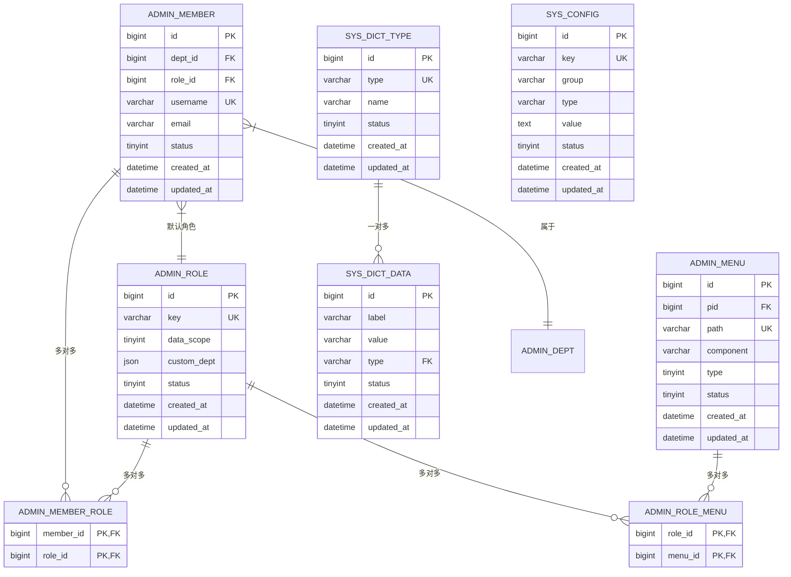

# 系统管理数据模型

<cite>
**本文档引用文件**  
- [admin_member.go](file://server/internal/model/entity/admin_member.go)
- [admin_role.go](file://server/internal/model/entity/admin_role.go)
- [admin_menu.go](file://server/internal/model/entity/admin_menu.go)
- [sys_config.go](file://server/internal/model/entity/sys_config.go)
- [sys_dict_type.go](file://server/internal/model/entity/sys_dict_type.go)
- [sys_dict_data.go](file://server/internal/model/entity/sys_dict_data.go)
- [admin_member_role.go](file://server/internal/model/entity/admin_member_role.go)
- [admin_role_menu.go](file://server/internal/model/entity/admin_role_menu.go)
- [hotgo.sql](file://server/storage/data/hotgo.sql)
</cite>

## 目录
1. [简介](#简介)
2. [核心实体字段定义](#核心实体字段定义)
3. [GORM结构体标签映射规则](#gorm结构体标签映射规则)
4. [实体关系图（ERD）](#实体关系图erd)
5. [软删除机制实现](#软删除机制实现)
6. [数据约束与索引策略](#数据约束与索引策略)
7. [查询示例](#查询示例)
8. [性能优化建议](#性能优化建议)

## 简介
本文档详细描述了系统管理模块中的核心数据实体，包括用户（admin_member）、角色（admin_role）、菜单（admin_menu）、配置（sys_config）和字典（sys_dict_type）等。文档涵盖字段定义、主外键关系、GORM标签映射、软删除机制、数据约束、索引策略及典型查询场景，为开发者提供完整的数据模型参考。

## 核心实体字段定义

### 用户（admin_member）
表示系统管理员账户信息。

**字段定义：**
- `id`: bigint，主键，管理员ID
- `deptId`: bigint，部门ID
- `roleId`: bigint，角色ID
- `realName`: varchar(32)，真实姓名
- `username`: varchar(20)，登录账号
- `passwordHash`: char(32)，密码哈希值
- `salt`: char(16)，密码盐
- `avatar`: char(150)，头像路径
- `sex`: tinyint，性别（1男，2女）
- `email`: varchar(60)，邮箱地址
- `mobile`: varchar(20)，手机号
- `status`: tinyint，状态（1启用，0禁用）
- `createdAt`: datetime，创建时间
- `updatedAt`: datetime，更新时间

**Section sources**
- [admin_member.go](file://server/internal/model/entity/admin_member.go#L1-L24)
- [hotgo.sql](file://server/storage/data/hotgo.sql#L213-L237)

### 角色（admin_role）
定义系统角色及其权限范围。

**字段定义：**
- `id`: bigint，主键，角色ID
- `name`: varchar(50)，角色名称
- `key`: varchar(100)，角色权限字符串（用于权限校验）
- `dataScope`: tinyint，数据范围（1全部，2自定义）
- `customDept`: json，自定义部门权限（当dataScope=2时有效）
- `pid`: bigint，上级角色ID（用于角色继承）
- `level`: int，关系树等级
- `tree`: varchar(512)，关系树路径
- `remark`: varchar(255)，备注
- `sort`: int，排序权重
- `status`: tinyint，状态（1启用，0禁用）
- `createdAt`: datetime，创建时间
- `updatedAt`: datetime，更新时间

**Section sources**
- [admin_role.go](file://server/internal/model/entity/admin_role.go#L1-L26)
- [hotgo.sql](file://server/storage/data/sqlite/tables.sql#L235-L261)

### 菜单（admin_menu）
定义系统菜单结构及权限控制。

**字段定义：**
- `id`: bigint，主键，菜单ID
- `pid`: bigint，父菜单ID
- `level`: int，关系树等级
- `tree`: varchar(512)，关系树路径
- `title`: varchar(50)，菜单显示名称
- `name`: varchar(50)，名称编码（前端路由使用）
- `path`: varchar(200)，路由地址
- `icon`: varchar(100)，菜单图标
- `type`: tinyint，菜单类型（1目录，2菜单，3按钮）
- `redirect`: varchar(200)，重定向地址
- `permissions`: varchar(255)，权限集合（多个权限逗号分隔）
- `permissionName`: varchar(100)，权限名称
- `component`: varchar(200)，前端组件路径
- `status`: tinyint，状态（1启用，0禁用）
- `createdAt`: datetime，创建时间
- `updatedAt`: datetime，更新时间

**Section sources**
- [admin_menu.go](file://server/internal/model/entity/admin_menu.go#L1-L24)
- [hotgo.sql](file://server/storage/data/sqlite/tables.sql#L141-L179)

### 配置（sys_config）
系统级参数配置表。

**字段定义：**
- `id`: bigint，主键，配置ID
- `group`: varchar(50)，配置分组（如：upload, sms, email）
- `name`: varchar(100)，参数名称（显示用）
- `type`: varchar(20)，键值类型（string, int, bool, datetime等）
- `key`: varchar(100)，参数键名（程序中引用）
- `value`: text，参数键值
- `defaultValue`: text，默认值
- `sort`: int，排序
- `tip`: varchar(255)，变量描述（提示信息）
- `isDefault`: tinyint，是否为系统默认（1是，0否）
- `status`: tinyint，状态（1启用，0禁用）
- `createdAt`: datetime，创建时间
- `updatedAt`: datetime，更新时间

**Section sources**
- [sys_config.go](file://server/internal/model/entity/sys_config.go#L1-L25)
- [hotgo.sql](file://server/storage/data/hotgo.sql#L1738-L1752)

### 字典类型（sys_dict_type）与字典数据（sys_dict_data）
实现系统字典枚举功能。

**字典类型字段定义：**
- `id`: bigint，主键，字典类型ID
- `pid`: bigint，父类字典类型ID（支持树形结构）
- `name`: varchar(50)，字典类型名称
- `type`: varchar(50)，字典类型编码（唯一标识）
- `sort`: int，排序
- `remark`: varchar(255)，备注
- `status`: tinyint，状态（1启用，0禁用）
- `createdAt`: datetime，创建时间
- `updatedAt`: datetime，更新时间

**字典数据字段定义：**
- `id`: bigint，主键，字典数据ID
- `label`: varchar(100)，字典标签（显示值）
- `value`: varchar(100)，字典键值（存储值）
- `valueType`: varchar(20)，键值数据类型
- `type`: varchar(50)，所属字典类型
- `listClass`: varchar(50)，表格回显样式（如：success, warning）
- `isDefault`: tinyint，是否为系统默认
- `sort`: int，排序
- `remark`: varchar(255)，备注
- `status`: tinyint，状态
- `createdAt`: datetime，创建时间
- `updatedAt`: datetime，更新时间

**Section sources**
- [sys_dict_type.go](file://server/internal/model/entity/sys_dict_type.go#L1-L21)
- [sys_dict_data.go](file://server/internal/model/entity/sys_dict_data.go#L1-L24)

## GORM结构体标签映射规则

GORM通过结构体标签将Go字段映射到数据库列，主要使用`json`和`orm`标签：

- `json:"fieldName"`：定义JSON序列化时的字段名，用于API响应输出
- `orm:"column_name"`：指定对应数据库字段名，实现Go驼峰命名与数据库下划线命名的转换
- `description:"说明"`：字段描述，用于生成文档和注释

例如：
```go
Username string `json:"username" orm:"username" description:"帐号"`
```
映射规则：
- Go结构体字段 `Username` → JSON输出 `username` → 数据库字段 `username`

该机制实现了代码可读性、API兼容性和数据库规范性的统一。

**Section sources**
- [admin_member.go](file://server/internal/model/entity/admin_member.go#L1-L24)
- [admin_role.go](file://server/internal/model/entity/admin_role.go#L1-L26)

## 实体关系图（ERD）



**Diagram sources**
- [admin_member.go](file://server/internal/model/entity/admin_member.go)
- [admin_role.go](file://server/internal/model/entity/admin_role.go)
- [admin_menu.go](file://server/internal/model/entity/admin_menu.go)
- [sys_config.go](file://server/internal/model/entity/sys_config.go)
- [sys_dict_type.go](file://server/internal/model/entity/sys_dict_type.go)

## 软删除机制实现

系统采用GORM内置软删除功能，通过`deleted_at`字段实现逻辑删除：

1. **字段定义**：所有支持软删除的表均包含`deleted_at`字段，类型为datetime，初始值为NULL
2. **删除操作**：调用`Delete()`时，GORM自动将当前时间写入`deleted_at`
3. **查询过滤**：正常查询自动添加`deleted_at IS NULL`条件，隐藏已删除记录
4. **恢复机制**：可通过`Unscoped().Update("deleted_at", nil)`恢复记录

在实体结构体中，该字段定义为：
```go
DeletedAt *gtime.Time `json:"deletedAt" orm:"deleted_at" description:"删除时间"`
```

此机制保障数据可追溯性，避免误删导致的数据丢失。

**Section sources**
- [sys_gen_curd_demo.go](file://server/internal/model/entity/sys_gen_curd_demo.go#L26-L29)
- [hotgo.sql](file://server/storage/data/hotgo.sql)

## 数据约束与索引策略

### 主键约束
所有主表均使用`id`作为自增主键，确保记录唯一性。

### 唯一约束（UK）
- `admin_member.username`：保证账号唯一
- `admin_role.key`：保证角色权限字符串唯一
- `admin_menu.path`：保证路由地址唯一
- `sys_config.key`：保证配置键名唯一
- `sys_dict_type.type`：保证字典类型编码唯一

### 外键约束（FK）
通过业务逻辑维护关联完整性，未在数据库层面强制外键约束，提高灵活性。

### 索引策略
- 所有`_id`字段均建立索引（如`dept_id`, `role_id`, `pid`）
- 状态字段（`status`）建立索引，加速启用/禁用筛选
- 创建时间（`created_at`）建立索引，优化时间范围查询
- 组合索引用于多条件查询场景（如`member_id + role_id`）

**Section sources**
- [hotgo.sql](file://server/storage/data/hotgo.sql)
- [admin_member.go](file://server/internal/model/entity/admin_member.go)

## 查询示例

### 基于角色获取菜单列表
```sql
SELECT m.*
FROM hg_admin_menu m
JOIN hg_admin_role_menu rm ON m.id = rm.menu_id
WHERE rm.role_id = ?
  AND m.status = 1
  AND m.deleted_at IS NULL
ORDER BY m.sort, m.id;
```

### 用户与岗位关联查询
```sql
SELECT am.*, ap.*
FROM hg_admin_member am
JOIN hg_admin_member_post amp ON am.id = amp.member_id
JOIN hg_admin_post ap ON amp.post_id = ap.id
WHERE am.id = ?;
```

### 获取指定配置组的所有配置
```sql
SELECT *
FROM hg_sys_config
WHERE `group` = 'upload'
  AND status = 1
  AND deleted_at IS NULL
ORDER BY sort, id;
```

### 查询某字典类型下的所有有效数据
```sql
SELECT *
FROM hg_sys_dict_data
WHERE type = 'sys_user_status'
  AND status = 1
  AND deleted_at IS NULL
ORDER BY sort, id;
```

**Section sources**
- [admin_menu.go](file://server/internal/model/entity/admin_menu.go)
- [admin_member_role.go](file://server/internal/model/entity/admin_member_role.go)
- [sys_config.go](file://server/internal/model/entity/sys_config.go)

## 性能优化建议

1. **批量操作**：使用GORM的`CreateInBatches`、`UpdateColumns`等方法减少数据库交互次数
2. **字段选择**：避免`SELECT *`，使用`Fields()`指定必要字段，减少网络传输
3. **预加载**：合理使用`With()`预加载关联数据，避免N+1查询问题
4. **缓存策略**：对`sys_config`、`sys_dict_data`等静态数据使用Redis缓存，设置合理过期时间
5. **分页查询**：大数据量场景使用`Limit().Offset()`分页，避免内存溢出
6. **连接池配置**：合理设置数据库连接池大小，平衡并发性能与资源消耗
7. **读写分离**：高并发场景可考虑主从复制，将查询请求分发到从库

通过以上优化策略，可显著提升系统数据访问性能。

**Section sources**
- [admin_member.go](file://server/internal/model/entity/admin_member.go)
- [sys_config.go](file://server/internal/model/entity/sys_config.go)
- [hotgo.sql](file://server/storage/data/hotgo.sql)