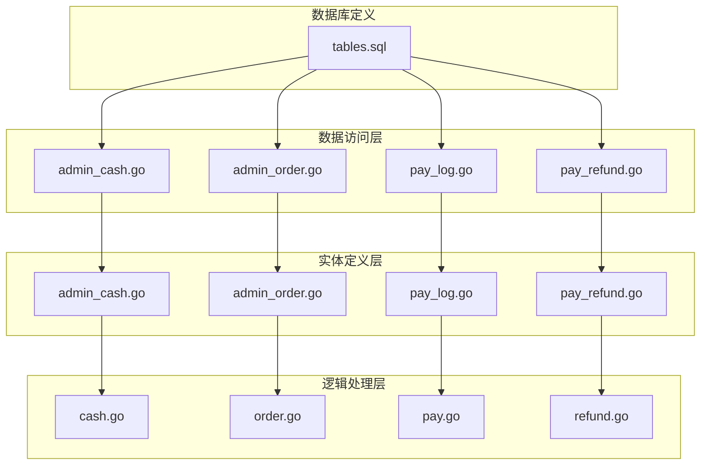
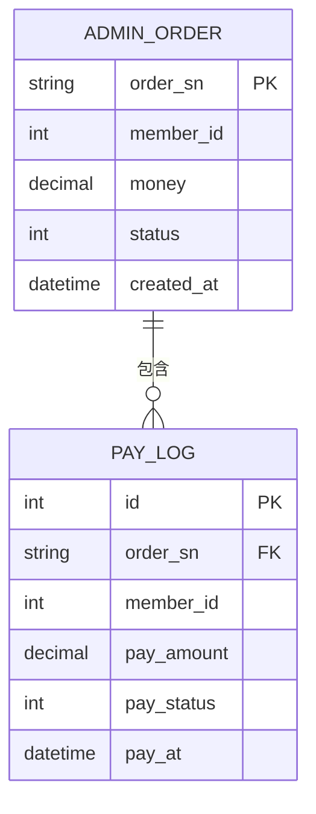
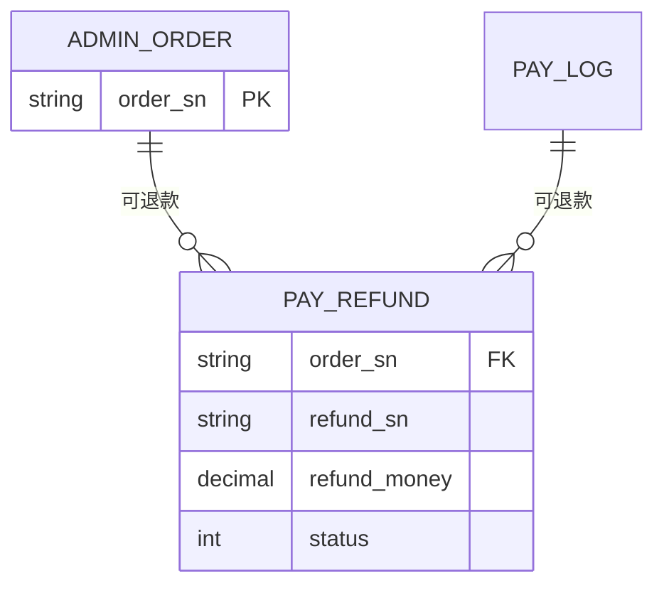

# 资产交易数据模型

<cite>
**本文档引用文件**  
- [admin_cash.go](file://server/internal/dao/internal/admin_cash.go)
- [admin_order.go](file://server/internal/dao/internal/admin_order.go)
- [pay_log.go](file://server/internal/dao/internal/pay_log.go)
- [pay_refund.go](file://server/internal/dao/internal/pay_refund.go)
- [tables.sql](file://server/storage/data/sqlite/tables.sql)
- [pay_log.go](file://server/internal/model/entity/pay_log.go)
- [pay.go](file://server/internal/model/input/payin/pay.go)
- [cash.go](file://server/internal/logic/admin/cash.go)
</cite>

## 目录
1. [简介](#简介)
2. [项目结构](#项目结构)
3. [核心数据模型](#核心数据模型)
4. [表结构详解](#表结构详解)
5. [关键字段业务规则与状态流转](#关键字段业务规则与状态流转)
6. [实体关系与关联机制](#实体关系与关联机制)
7. [GORM模型处理机制](#gorm模型处理机制)
8. [财务对账与状态机设计参考](#财务对账与状态机设计参考)
9. [结论](#结论)

## 简介
本文档旨在全面解析资产交易模块的核心数据模型，涵盖资金账户（admin_cash）、订单（admin_order）、支付日志（pay_log）和退款记录（pay_refund）四张核心表的结构设计、字段含义、业务规则及相互关系。通过深入分析关键字段如订单状态、支付方式、交易金额和回调结果的状态流转机制，为财务对账系统开发与交易状态机设计提供权威的数据层面参考。

## 项目结构
资产交易相关数据模型主要分布在服务层的 `dao` 与 `entity` 模块中，SQL 表结构定义位于 `storage/data/sqlite/tables.sql` 文件。核心逻辑处理位于 `internal/logic/admin` 和 `internal/logic/pay` 目录下。

**Diagram sources**
- [admin_cash.go](file://server/internal/dao/internal/admin_cash.go)
- [admin_order.go](file://server/internal/dao/internal/admin_order.go)
- [pay_log.go](file://server/internal/dao/internal/pay_log.go)
- [pay_refund.go](file://server/internal/dao/internal/pay_refund.go)
- [tables.sql](file://server/storage/data/sqlite/tables.sql)

**Section sources**
- [admin_cash.go](file://server/internal/dao/internal/admin_cash.go)
- [admin_order.go](file://server/internal/dao/internal/admin_order.go)
- [pay_log.go](file://server/internal/dao/internal/pay_log.go)
- [pay_refund.go](file://server/internal/dao/internal/pay_refund.go)
- [tables.sql](file://server/storage/data/sqlite/tables.sql)

## 核心数据模型
资产交易模块围绕用户资金流动构建，以订单（admin_order）为业务核心，支付日志（pay_log）记录交易详情，资金账户（admin_cash）管理提现，退款记录（pay_refund）处理逆向流程。四者通过会员ID（member_id）和订单号（order_sn）建立关联，形成完整的交易闭环。

**Section sources**
- [admin_cash.go](file://server/internal/dao/internal/admin_cash.go)
- [admin_order.go](file://server/internal/dao/internal/admin_order.go)
- [pay_log.go](file://server/internal/dao/internal/pay_log.go)
- [pay_refund.go](file://server/internal/dao/internal/pay_refund.go)

## 表结构详解

### 资金账户表 (hg_admin_cash)
记录用户提现申请信息。

| 字段名 | 类型 | 默认值 | 说明 |
|--------|------|--------|------|
| id | INTEGER | - | 主键ID |
| member_id | INTEGER | 0 | 会员ID |
| money | decimal(10,2) | 0.00 | 提现金额 |
| fee | decimal(10,2) | 0.00 | 手续费 |
| last_money | decimal(10,2) | 0.00 | 到账金额 |
| ip | TEXT | NULL | 操作IP |
| status | INTEGER | 1 | 状态 |
| msg | TEXT | NULL | 处理备注 |
| handle_at | datetime | NULL | 处理时间 |
| created_at | datetime | NULL | 创建时间 |

**Section sources**
- [admin_cash.go](file://server/internal/dao/internal/admin_cash.go#L35-L86)
- [tables.sql](file://server/storage/data/sqlite/tables.sql)

### 订单表 (hg_admin_order)
记录用户交易订单信息。

| 字段名 | 类型 | 默认值 | 说明 |
|--------|------|--------|------|
| id | INTEGER | - | 主键ID |
| member_id | INTEGER | 0 | 会员ID |
| order_type | INTEGER | 0 | 订单类型 |
| product_id | INTEGER | 0 | 产品ID |
| order_sn | TEXT | '' | 订单号 |
| money | decimal(10,2) | 0.00 | 订单金额 |
| remark | TEXT | NULL | 备注 |
| refund_reason | TEXT | NULL | 退款原因 |
| reject_refund_reason | TEXT | NULL | 拒绝退款原因 |
| status | INTEGER | 1 | 状态 |
| created_at | datetime | NULL | 创建时间 |
| updated_at | datetime | NULL | 修改时间 |

**Section sources**
- [admin_order.go](file://server/internal/dao/internal/admin_order.go#L37-L81)
- [tables.sql](file://server/storage/data/sqlite/tables.sql)

### 支付日志表 (hg_pay_log)
记录每一笔支付的详细信息。

| 字段名 | 类型 | 默认值 | 说明 |
|--------|------|--------|------|
| id | INTEGER | - | 主键ID |
| member_id | INTEGER | 0 | 会员ID |
| app_id | TEXT | '' | 应用ID |
| addons_name | TEXT | '' | 插件名称 |
| order_sn | TEXT | '' | 关联订单号 |
| order_group | TEXT | '' | 组别 |
| openid | TEXT | NULL | OpenID |
| mch_id | TEXT | NULL | 商户账户 |
| subject | TEXT | '' | 订单标题 |
| detail | TEXT | NULL | 商品详情 |
| auth_code | TEXT | NULL | 刷卡码 |
| out_trade_no | TEXT | NULL | 商户订单号 |
| transaction_id | TEXT | NULL | 交易号 |
| pay_type | TEXT | '' | 支付类型 |
| pay_amount | decimal(10,2) | 0.00 | 支付金额 |
| actual_amount | decimal(10,2) | NULL | 实付金额 |
| pay_status | INTEGER | 0 | 支付状态 |
| pay_at | datetime | NULL | 支付时间 |
| trade_type | TEXT | '' | 交易类型 |
| refund_sn | TEXT | NULL | 退款单号 |
| is_refund | INTEGER | 0 | 是否退款 |
| custom | text | NULL | 自定义参数 |
| create_ip | TEXT | NULL | 创建者IP |
| pay_ip | TEXT | NULL | 支付者IP |
| notify_url | TEXT | NULL | 回调地址 |
| return_url | TEXT | NULL | 跳转地址 |
| trace_ids | TEXT | NULL | 链路ID集合 |
| status | INTEGER | 1 | 状态 |
| created_at | datetime | NULL | 创建时间 |
| updated_at | datetime | NULL | 修改时间 |

**Section sources**
- [pay_log.go](file://server/internal/dao/internal/pay_log.go#L55-L107)
- [tables.sql](file://server/storage/data/sqlite/tables.sql)

### 退款记录表 (hg_pay_refund)
记录支付退款的申请与处理信息。

| 字段名 | 类型 | 默认值 | 说明 |
|--------|------|--------|------|
| id | INTEGER | - | 主键ID |
| member_id | INTEGER | 0 | 会员ID |
| app_id | TEXT | '' | 应用ID |
| order_sn | TEXT | '' | 关联订单号 |
| refund_trade_no | TEXT | '' | 退款交易号 |
| refund_money | decimal(10,2) | 0.00 | 退款金额 |
| refund_way | INTEGER | 0 | 退款方式 |
| ip | TEXT | NULL | 操作IP |
| reason | TEXT | NULL | 退款原因 |
| remark | TEXT | NULL | 备注 |
| status | INTEGER | 1 | 状态 |
| created_at | datetime | NULL | 创建时间 |
| updated_at | datetime | NULL | 修改时间 |

**Section sources**
- [pay_refund.go](file://server/internal/dao/internal/pay_refund.go#L38-L83)
- [tables.sql](file://server/storage/data/sqlite/tables.sql)

## 关键字段业务规则与状态流转

### 订单状态 (status)
- **定义**：在 `admin_order` 表中表示订单的生命周期状态。
- **流转规则**：通常包含待支付、已支付、已发货、已完成、已取消、退款中、已退款等状态，具体值由业务常量定义。
- **影响**：状态变更触发支付、发货、退款等后续流程。

### 支付方式 (pay_type)
- **定义**：在 `pay_log` 表中标识支付渠道，如支付宝、微信支付、银联等。
- **业务规则**：由支付插件动态注册，确保系统可扩展性。支付请求时根据此字段路由至对应支付网关。

### 交易金额 (amount)
- **支付金额 (pay_amount)**：用户需支付的原始金额。
- **实付金额 (actual_amount)**：扣除优惠、折扣后的实际支付金额。
- **退款金额 (refund_money)**：实际退还给用户的金额，需小于等于支付金额。

### 回调结果 (notify_result)
- **机制**：支付平台异步通知商户服务器支付结果，通过 `notify_url` 字段传递。
- **处理**：系统需验证通知签名，更新 `pay_log` 表中的 `pay_status` 和 `pay_at` 字段，并同步更新 `admin_order` 的状态。
- **幂等性**：必须保证回调处理的幂等性，防止重复处理。

**Section sources**
- [pay_log.go](file://server/internal/model/entity/pay_log.go)
- [pay.go](file://server/internal/model/input/payin/pay.go)
- [admin_order.go](file://server/internal/dao/internal/admin_order.go)

## 实体关系与关联机制

### 订单与支付日志的一对多关系
一个订单（admin_order）可对应多笔支付日志（pay_log），例如部分支付、补差价等场景。通过 `order_sn` 字段建立关联。

**Diagram sources**
- [admin_order.go](file://server/internal/dao/internal/admin_order.go)
- [pay_log.go](file://server/internal/dao/internal/pay_log.go)

### 退款申请与原订单的关联机制
退款记录（pay_refund）通过 `order_sn` 字段与原订单（admin_order）建立强关联。退款成功后，`pay_log` 表的 `is_refund` 字段置为1，并记录 `refund_sn`。

**Diagram sources**
- [admin_order.go](file://server/internal/dao/internal/admin_order.go)
- [pay_log.go](file://server/internal/dao/internal/pay_log.go)
- [pay_refund.go](file://server/internal/dao/internal/pay_refund.go)

## GORM模型处理机制

### 时间戳处理
所有核心表均包含 `created_at` 和 `updated_at` 字段。GORM 通过 `gtime.Time` 类型自动处理时间的序列化与反序列化，并在创建和更新记录时自动填充。

### 加密字段处理
- **交易凭证**：如 `auth_code`（刷卡码）等敏感字段，在存储前应通过系统加密模块（如 `utility/encrypt`）进行加密。
- **实现方式**：在实体模型的 `Scan` 和 `Value` 方法中集成加解密逻辑，确保数据在持久化层透明加密。

**Section sources**
- [pay_log.go](file://server/internal/model/entity/pay_log.go)
- [admin_cash.go](file://server/internal/dao/internal/admin_cash.go)
- [encrypt.go](file://server/utility/encrypt/encrypt.go)

## 财务对账与状态机设计参考

### 财务对账数据基础
- **对账依据**：以 `pay_log` 表的 `transaction_id`（支付平台交易号）和 `out_trade_no`（商户订单号）为核心，与支付平台对账单进行匹配。
- **金额核对**：对比 `pay_amount`（应收）与 `actual_amount`（实收），以及 `refund_money`（退款）的准确性。
- **状态一致性**：确保 `pay_log.pay_status` 与 `admin_order.status` 在支付成功后保持一致。

### 交易状态机设计
- **状态定义**：基于 `status` 字段，定义清晰的状态集合和转换条件。
- **事件驱动**：支付回调、退款请求、手动操作等作为状态变更的触发事件。
- **持久化**：状态变更需通过事务同时更新 `admin_order` 和 `pay_log` 等相关表，保证数据一致性。

**Section sources**
- [admin_order.go](file://server/internal/dao/internal/admin_order.go)
- [pay_log.go](file://server/internal/dao/internal/pay_log.go)
- [pay_refund.go](file://server/internal/dao/internal/pay_refund.go)
- [cash.go](file://server/internal/logic/admin/cash.go)

## 结论
本文档系统性地梳理了资产交易模块的数据模型，明确了各核心表的结构、关键字段的业务含义及实体间的关联关系。特别强调了订单状态流转、支付回调处理和退款关联机制，为构建稳定、可靠的财务对账系统和交易状态机提供了坚实的数据基础。建议在开发中严格遵循此模型定义，确保数据的一致性和完整性。