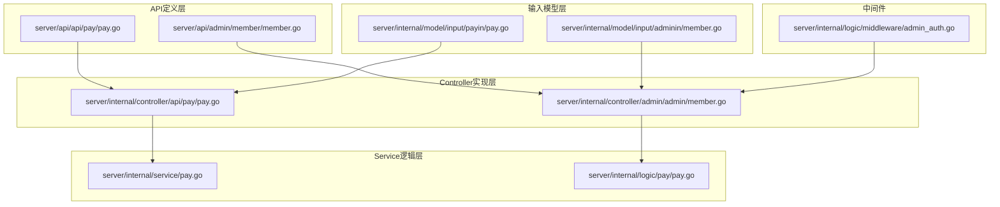
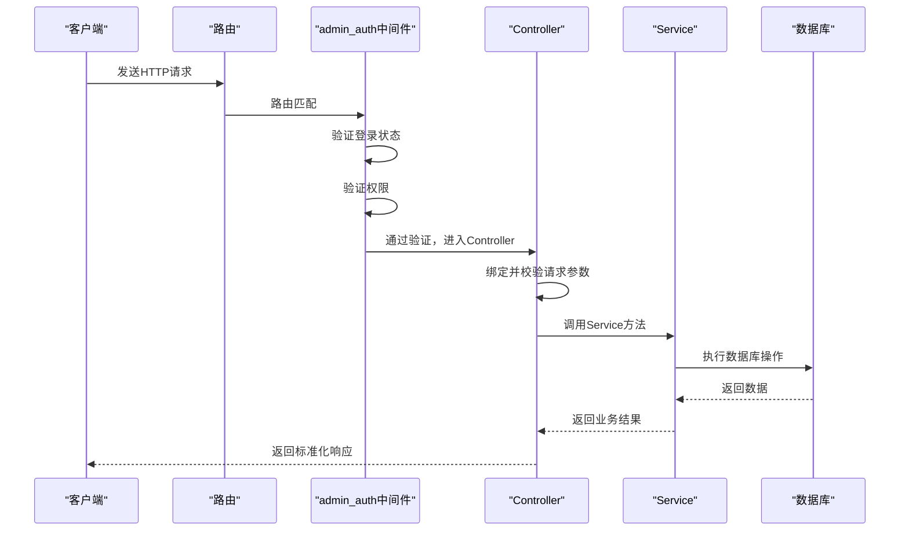
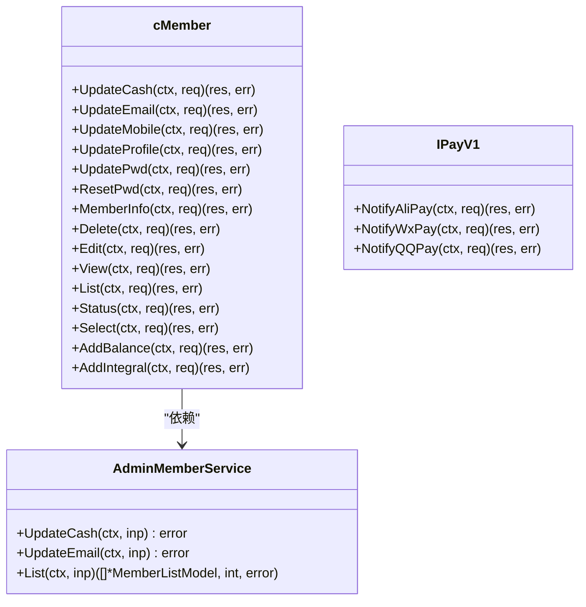
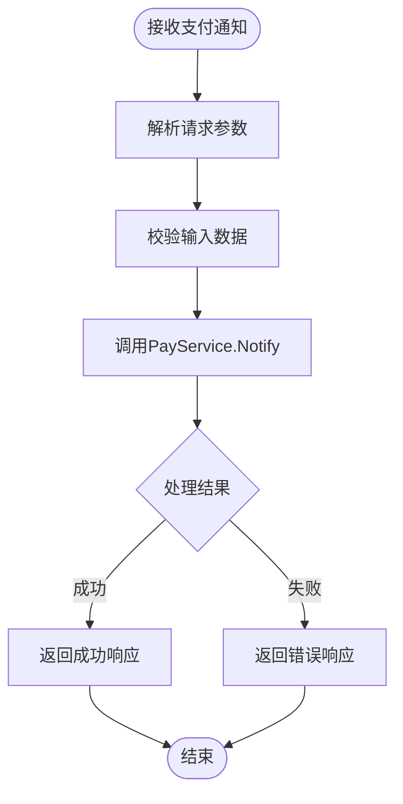
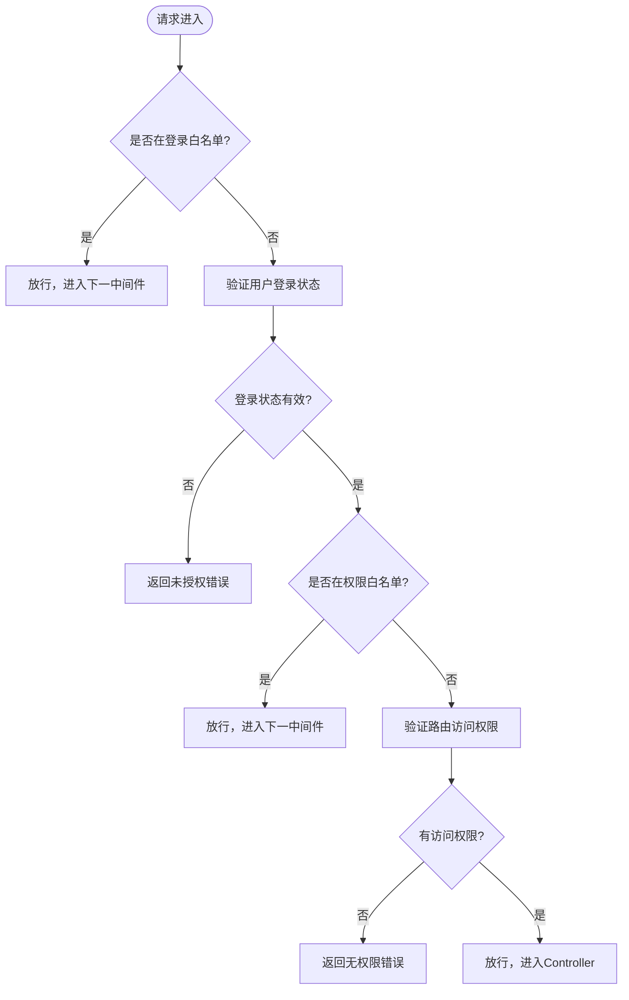
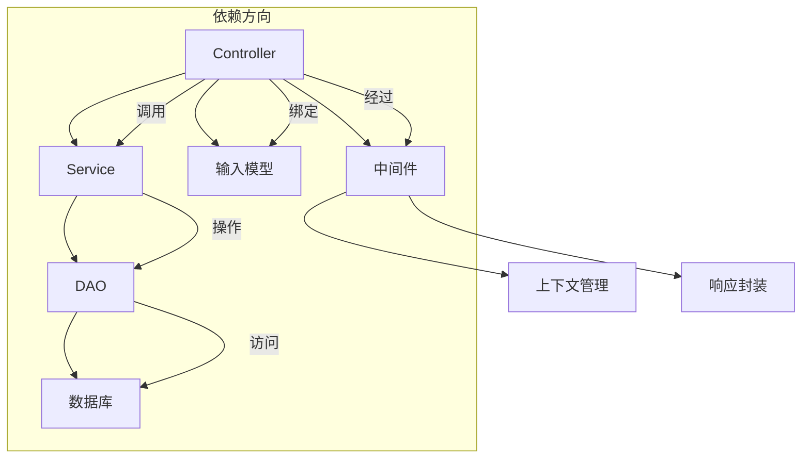

# Controller层详解

<cite>
**本文档引用文件**  
- [member.go](file://server/api/admin/member/member.go)
- [pay.go](file://server/api/api/pay/pay.go)
- [member.go](file://server/internal/controller/admin/admin/member.go)
- [pay.go](file://server/internal/controller/api/pay/pay.go)
- [admin_auth.go](file://server/internal/logic/middleware/admin_auth.go)
- [pay.go](file://server/internal/logic/pay/pay.go)
- [pay.go](file://server/internal/service/pay.go)
- [member.go](file://server/internal/model/input/adminin/member.go)
- [pay.go](file://server/internal/model/input/payin/pay.go)
</cite>

## 目录
1. [引言](#引言)
2. [项目结构](#项目结构)
3. [核心组件](#核心组件)
4. [架构概述](#架构概述)
5. [详细组件分析](#详细组件分析)
6. [依赖分析](#依赖分析)
7. [性能考虑](#性能考虑)
8. [故障排除指南](#故障排除指南)
9. [结论](#结论)

## 引言
本文档旨在深入解析`hotgo-2.0`项目中Controller层的设计与实现。Controller作为HTTP请求的入口，承担着路由分发、参数绑定与校验、上下文管理以及调用Service接口的核心职责。通过分析用户管理与支付两大核心模块，展示RESTful API和WebSocket消息处理的具体实现方式，并阐述权限控制、依赖注入等关键机制。

## 项目结构

**图示来源**  
- [member.go](file://server/api/admin/member/member.go)
- [pay.go](file://server/api/api/pay/pay.go)
- [member.go](file://server/internal/controller/admin/admin/member.go)
- [pay.go](file://server/internal/controller/api/pay/pay.go)
- [pay.go](file://server/internal/service/pay.go)
- [pay.go](file://server/internal/logic/pay/pay.go)
- [member.go](file://server/internal/model/input/adminin/member.go)
- [pay.go](file://server/internal/model/input/payin/pay.go)
- [admin_auth.go](file://server/internal/logic/middleware/admin_auth.go)

## 核心组件

Controller层是MVC架构中的核心枢纽，负责接收HTTP请求、解析参数、执行业务逻辑并返回响应。在`hotgo-2.0`框架中，Controller通过清晰的职责划分和标准化的接口设计，实现了高内聚、低耦合的系统结构。

**本节来源**  
- [member.go](file://server/internal/controller/admin/admin/member.go)
- [pay.go](file://server/internal/controller/api/pay/pay.go)

## 架构概述

**图示来源**  
- [admin_auth.go](file://server/internal/logic/middleware/admin_auth.go)
- [member.go](file://server/internal/controller/admin/admin/member.go)
- [pay.go](file://server/internal/service/pay.go)

## 详细组件分析

### 用户管理Controller分析

#### 职责与实现
`internal/controller/admin/admin/member.go`中的`cMember`结构体实现了后台用户管理的所有API接口。每个方法都遵循统一的模式：接收上下文和请求对象，调用对应的Service方法，并返回响应或错误。

**图示来源**  
- [member.go](file://server/internal/controller/admin/admin/member.go)
- [member.go](file://server/api/admin/member/member.go)
- [member.go](file://server/internal/model/input/adminin/member.go)

### 支付Controller分析

#### RESTful API实现
`api/api/pay/pay.go`定义了支付模块的API接口契约，而`internal/controller/api/pay/pay.go`是其具体实现。该Controller主要处理支付异步通知，是典型的RESTful API端点。

**图示来源**  
- [pay.go](file://server/api/api/pay/pay.go)
- [pay.go](file://server/internal/controller/api/pay/pay.go)
- [pay.go](file://server/internal/service/pay.go)

### 权限控制机制

#### 中间件工作流程
`admin_auth.go`中的`AdminAuth`中间件是后台系统权限控制的核心。它在请求到达Controller之前执行，确保只有经过身份验证和授权的用户才能访问受保护的资源。

**图示来源**  
- [admin_auth.go](file://server/internal/logic/middleware/admin_auth.go)

## 依赖分析

**图示来源**  
- [member.go](file://server/internal/controller/admin/admin/member.go)
- [pay.go](file://server/internal/service/pay.go)
- [member.go](file://server/internal/model/input/adminin/member.go)
- [admin_auth.go](file://server/internal/logic/middleware/admin_auth.go)

**本节来源**  
- [member.go](file://server/internal/controller/admin/admin/member.go)
- [pay.go](file://server/internal/service/pay.go)
- [member.go](file://server/internal/model/input/adminin/member.go)
- [admin_auth.go](file://server/internal/logic/middleware/admin_auth.go)

## 性能考虑
Controller层本身不包含复杂的计算逻辑，其性能主要取决于网络I/O和下游Service的执行效率。通过使用GoFrame框架的高效路由和中间件机制，确保了请求处理的低延迟。参数绑定与校验在框架层面进行了优化，减少了不必要的反射开销。

## 故障排除指南

当Controller层出现问题时，可按以下步骤排查：

1.  **检查路由配置**：确认请求路径和方法是否与Controller中定义的`g.Meta`标签匹配。
2.  **验证中间件**：检查`admin_auth`等中间件是否正确执行，特别是权限校验逻辑。
3.  **审查输入模型**：确认请求参数的结构和字段标签（如`v:"required"`）是否正确。
4.  **跟踪Service调用**：如果Controller方法调用Service后返回错误，需深入Service层进行调试。
5.  **查看日志**：检查框架日志，特别是中间件中`g.Log().Debugf`输出的调试信息。

**本节来源**  
- [admin_auth.go](file://server/internal/logic/middleware/admin_auth.go)
- [member.go](file://server/internal/controller/admin/admin/member.go)

## 结论
`hotgo-2.0`的Controller层设计体现了清晰的分层思想和良好的工程实践。通过将API定义、实现、输入模型和中间件分离，实现了代码的高可维护性和可扩展性。依赖注入机制使得Controller与Service之间的耦合度降到最低，便于单元测试和功能替换。遵循此模式，开发者可以高效地定义和实现新的API端点。