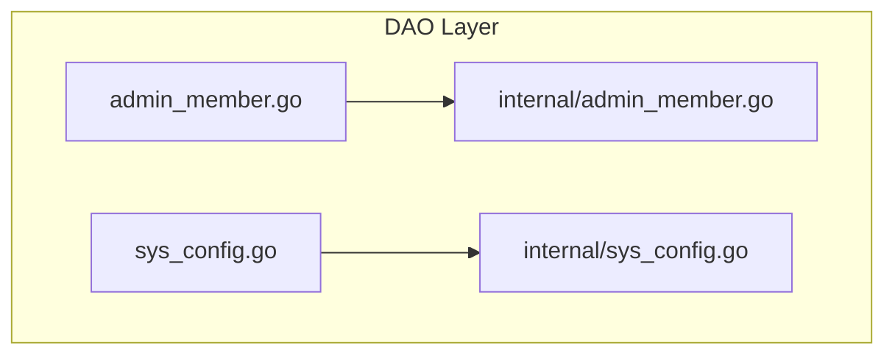
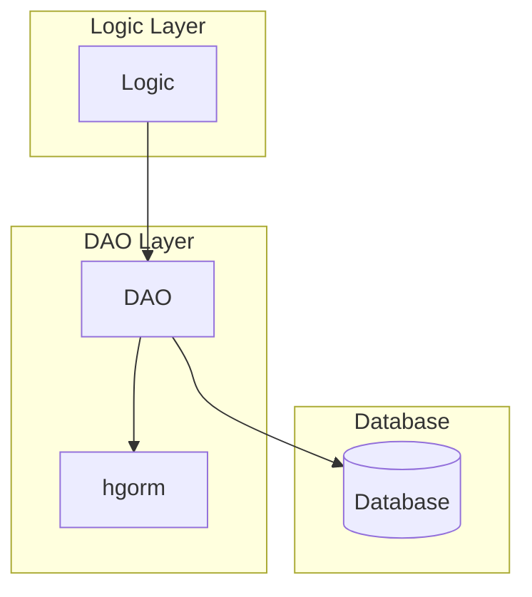
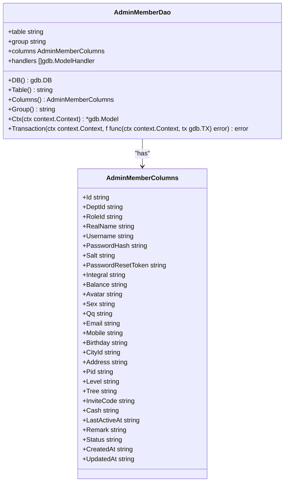
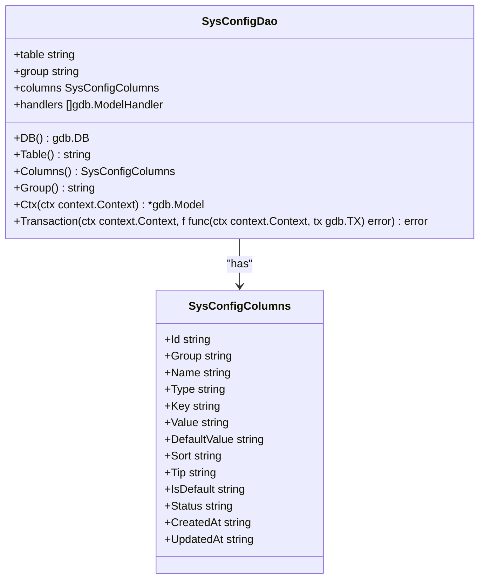
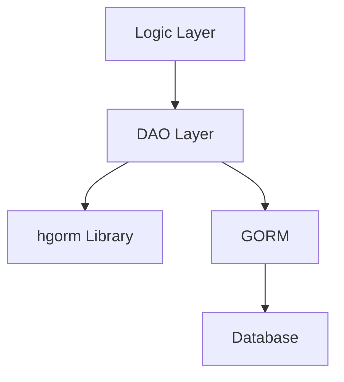

# DAO层详解

<cite>
**本文档引用的文件**  
- [admin_member.go](file://server/internal/dao/admin_member.go)
- [sys_config.go](file://server/internal/dao/sys_config.go)
- [dao.go](file://server/internal/library/hgorm/dao.go)
- [dao_tree.go](file://server/internal/library/hgorm/dao_tree.go)
- [admin_member.go](file://server/internal/dao/internal/admin_member.go)
- [sys_config.go](file://server/internal/dao/internal/sys_config.go)
- [member.go](file://server/internal/logic/admin/member.go)
- [config.go](file://server/internal/logic/sys/config.go)
- [entity/admin_member.go](file://server/internal/model/entity/admin_member.go)
- [entity/sys_config.go](file://server/internal/model/entity/sys_config.go)
</cite>

## 目录
1. [简介](#简介)
2. [项目结构](#项目结构)
3. [核心组件](#核心组件)
4. [架构概述](#架构概述)
5. [详细组件分析](#详细组件分析)
6. [依赖分析](#依赖分析)
7. [性能考量](#性能考量)
8. [故障排除指南](#故障排除指南)
9. [结论](#结论)

## 简介
本技术文档详细阐述了基于GORM实现的DAO层数据持久化机制。文档以`dao/admin_member.go`中的用户数据访问和`dao/sys_config.go`中的配置项操作为例，深入解析CRUD操作的具体实现方式。同时，文档还探讨了DAO层如何支持多数据库、读写分离及分表策略，并阐明其与Logic层的调用契约。此外，文档涵盖了自定义查询方法的编写、索引优化建议、N+1查询问题规避技巧，并提供了性能监控和SQL日志调试的实用方法。

## 项目结构
DAO层位于`server/internal/dao`目录下，采用分层设计模式。该层主要由两部分组成：自动生成的内部DAO（位于`internal`子目录）和可扩展的外部DAO。外部DAO通过组合内部DAO实例来提供基础的CRUD功能，并允许开发者添加自定义方法。这种设计既保证了代码生成的便利性，又提供了足够的灵活性以满足特定业务需求。

**图示来源**
- [admin_member.go](file://server/internal/dao/admin_member.go)
- [sys_config.go](file://server/internal/dao/sys_config.go)
- [internal/admin_member.go](file://server/internal/dao/internal/admin_member.go)
- [internal/sys_config.go](file://server/internal/dao/internal/sys_config.go)

**本节来源**
- [admin_member.go](file://server/internal/dao/admin_member.go)
- [sys_config.go](file://server/internal/dao/sys_config.go)

## 核心组件
DAO层的核心是基于GORM的`AdminMemberDao`和`SysConfigDao`，它们分别负责管理员用户和系统配置的数据访问。这些DAO通过`Ctx`方法创建数据库模型实例，该方法会自动注入上下文信息，确保所有数据库操作都与当前请求上下文相关联。此外，DAO层还提供了`Transaction`方法来封装事务逻辑，确保数据的一致性和完整性。

**本节来源**
- [admin_member.go](file://server/internal/dao/admin_member.go)
- [sys_config.go](file://server/internal/dao/sys_config.go)
- [internal/admin_member.go](file://server/internal/dao/internal/admin_member.go)
- [internal/sys_config.go](file://server/internal/dao/internal/sys_config.go)

## 架构概述
DAO层的架构设计遵循了清晰的分层原则。上层的Logic组件通过服务接口调用DAO层提供的方法，而DAO层则通过GORM与底层数据库进行交互。为了支持复杂的业务逻辑，DAO层引入了`hgorm`库，该库提供了诸如`IsUnique`、`FilterKeywordsWithOr`等通用方法，简化了常见操作的实现。

**图示来源**
- [admin_member.go](file://server/internal/dao/admin_member.go)
- [sys_config.go](file://server/internal/dao/sys_config.go)
- [dao.go](file://server/internal/library/hgorm/dao.go)

**本节来源**
- [admin_member.go](file://server/internal/dao/admin_member.go)
- [sys_config.go](file://server/internal/dao/sys_config.go)
- [dao.go](file://server/internal/library/hgorm/dao.go)

## 详细组件分析
### AdminMemberDAO分析
`AdminMemberDao`是管理员用户数据访问的核心组件。它不仅提供了标准的CRUD操作，还通过`VerifyUnique`方法确保用户名、邮箱、手机号等字段的唯一性。在Logic层中，`sAdminMember`结构体利用`FilterAuthModel`方法实现了细粒度的权限控制，确保非超级管理员用户只能操作其下级用户。

#### 类图

**图示来源**
- [internal/admin_member.go](file://server/internal/dao/internal/admin_member.go)

**本节来源**
- [admin_member.go](file://server/internal/dao/admin_member.go)
- [internal/admin_member.go](file://server/internal/dao/internal/admin_member.go)
- [member.go](file://server/internal/logic/admin/member.go)

### SysConfigDAO分析
`SysConfigDao`负责系统配置的管理，支持按分组加载和更新配置。`sSysConfig`结构体中的`GetConfigByGroup`方法能够将数据库中的配置项转换为Go结构体，便于在应用程序中使用。此外，`UpdateConfigByGroup`方法支持集群环境下的配置同步，确保所有节点都能及时获取最新的配置信息。

#### 类图

**图示来源**
- [internal/sys_config.go](file://server/internal/dao/internal/sys_config.go)

**本节来源**
- [sys_config.go](file://server/internal/dao/sys_config.go)
- [internal/sys_config.go](file://server/internal/dao/internal/sys_config.go)
- [config.go](file://server/internal/logic/sys/config.go)

## 依赖分析
DAO层的依赖关系清晰明了。外部DAO依赖于内部DAO提供的基础功能，而内部DAO则依赖于GORM框架与数据库进行交互。`hgorm`库作为辅助工具，为DAO层提供了通用的方法支持。此外，DAO层与Logic层之间通过服务接口进行松耦合通信，确保了系统的可维护性和可扩展性。

**图示来源**
- [admin_member.go](file://server/internal/dao/admin_member.go)
- [sys_config.go](file://server/internal/dao/sys_config.go)
- [dao.go](file://server/internal/library/hgorm/dao.go)

**本节来源**
- [admin_member.go](file://server/internal/dao/admin_member.go)
- [sys_config.go](file://server/internal/dao/sys_config.go)
- [dao.go](file://server/internal/library/hgorm/dao.go)

## 性能考量
为了优化性能，DAO层采用了多种策略。首先，通过`ScanAndCount`方法一次性获取数据和总数，减少了数据库查询次数。其次，利用GORM的预加载功能避免N+1查询问题。最后，通过合理的索引设计和查询条件优化，提高了查询效率。此外，建议开启SQL日志调试，以便于发现和解决潜在的性能瓶颈。

## 故障排除指南
当遇到DAO层相关的问题时，可以按照以下步骤进行排查：
1. 检查数据库连接是否正常。
2. 查看SQL日志，确认生成的SQL语句是否正确。
3. 验证事务是否正确提交或回滚。
4. 检查模型字段与数据库表结构是否匹配。
5. 确认上下文信息是否正确传递。

**本节来源**
- [admin_member.go](file://server/internal/dao/admin_member.go)
- [sys_config.go](file://server/internal/dao/sys_config.go)
- [dao.go](file://server/internal/library/hgorm/dao.go)

## 结论
DAO层作为数据访问的核心，其设计直接影响到整个系统的稳定性和性能。通过合理利用GORM框架和自定义辅助库，本项目实现了高效、灵活且易于维护的数据访问机制。未来可以通过引入缓存、读写分离等技术进一步提升系统性能。