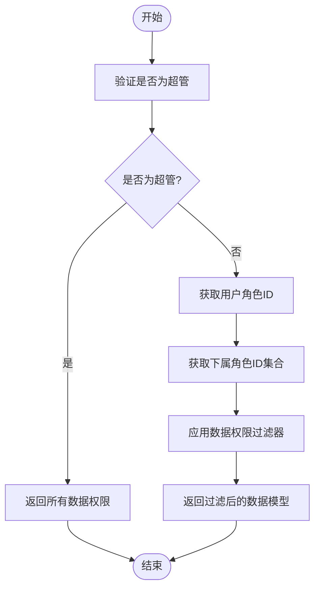
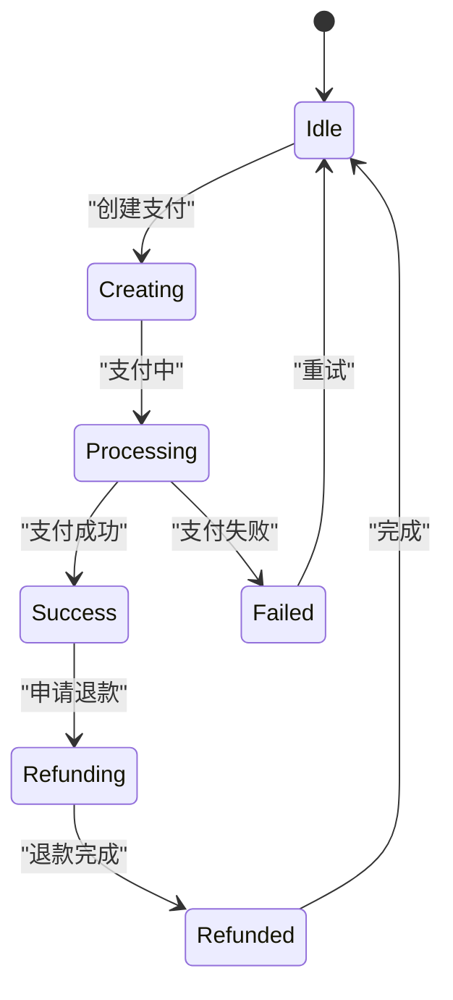
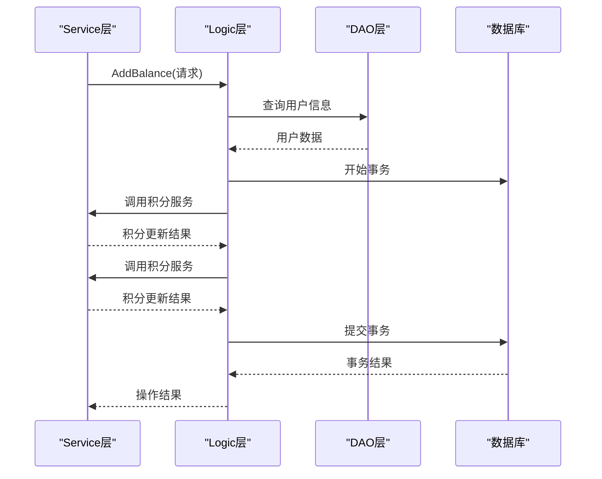
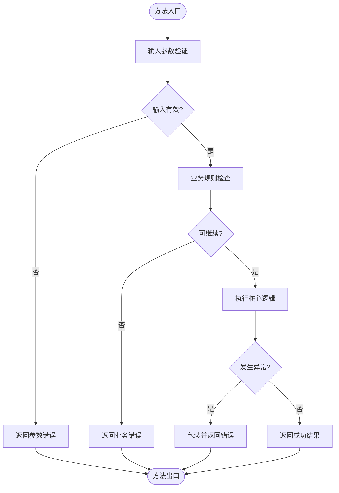
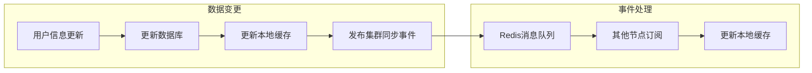

# Logic层详解

<cite>
**本文档引用的文件**
- [member.go](file://server/internal/logic/admin/member.go)
- [pay.go](file://server/internal/logic/pay/pay.go)
- [admin.go](file://server/internal/service/admin.go)
- [pay.go](file://server/internal/service/pay.go)
- [admin_member.go](file://server/internal/dao/admin_member.go)
- [pay_log.go](file://server/internal/dao/pay_log.go)
</cite>

## 目录
1. [简介](#简介)
2. [核心组件](#核心组件)
3. [用户权限校验逻辑](#用户权限校验逻辑)
4. [支付状态机处理](#支付状态机处理)
5. [数据操作与事务管理](#数据操作与事务管理)
6. [业务异常处理](#业务异常处理)
7. [领域事件与缓存策略](#领域事件与缓存策略)
8. [最佳实践指南](#最佳实践指南)

## 简介
Logic层作为核心业务逻辑封装单元，在保证业务规则一致性和实现领域服务方面具有关键地位。本文档深入解析Logic层的设计与实现，重点分析用户权限校验和支付状态机处理等复杂业务流程。

## 核心组件

Logic层是业务逻辑的核心封装单元，负责协调数据访问层（DAO）和上层服务（Service），确保业务规则的一致性。通过分析`logic/admin/member.go`和`logic/pay/pay.go`文件，我们可以深入了解其在实际应用中的实现方式。

**本文档引用的文件**
- [member.go](file://server/internal/logic/admin/member.go)
- [pay.go](file://server/internal/loopay/pay.go)

## 用户权限校验逻辑

用户权限校验是系统安全性的关键环节。在`logic/admin/member.go`中，通过`FilterAuthModel`方法实现了精细的权限控制机制。

**图表来源**
- [member.go](file://server/internal/logic/admin/member.go#L888-L913)

该机制确保非超管用户只能操作其下属角色的用户数据，同时满足自身角色的数据权限设置。`VerifySuperId`方法通过检查用户ID是否存在于超管ID集合中来判断用户是否为超级管理员。

**本文档引用的文件**
- [member.go](file://server/internal/logic/admin/member.go#L839-L850)
- [member.go](file://server/internal/logic/admin/member.go#L888-L913)

## 支付状态机处理

支付状态机处理是复杂业务流程的典型代表。在`logic/pay/pay.go`中，通过一系列方法实现了支付日志的全生命周期管理。

**图表来源**
- [pay.go](file://server/internal/logic/pay/pay.go)

支付状态机涵盖了从创建支付订单到最终完成或失败的完整流程。`Status`方法负责更新支付日志状态，确保状态转换的合法性。

**本文档引用的文件**
- [pay.go](file://server/internal/logic/pay/pay.go#L129-L149)

## 数据操作与事务管理

Logic层通过调用DAO进行数据操作，并与Service层协作完成事务管理。以用户余额增加为例，展示了跨表事务的实现方式。

**图表来源**
- [member.go](file://server/internal/logic/admin/member.go#L59-L100)

在`AddBalance`方法中，使用`g.DB().Transaction`确保了余额更新操作的原子性。事务内调用`AdminCreditsLog().SaveBalance`服务，实现了跨表数据的一致性更新。

**本文档引用的文件**
- [member.go](file://server/internal/logic/admin/member.go#L59-L100)
- [member.go](file://server/internal/logic/admin/member.go#L103-L144)

## 业务异常处理

Logic层实现了完善的业务异常处理机制，通过`gerror`包提供详细的错误信息。每个业务方法都包含输入验证、业务规则检查和异常捕获。

**图表来源**
- [member.go](file://server/internal/logic/admin/member.go)

异常处理遵循统一的模式：首先进行输入验证，然后检查业务规则，最后执行核心逻辑。任何环节出现问题都会返回带有上下文信息的错误。

**本文档引用的文件**
- [member.go](file://server/internal/logic/admin/member.go)

## 领域事件与缓存策略

Logic层通过事件机制和缓存策略提高系统性能和响应性。在用户数据变更时，会触发相应的领域事件并更新缓存。

**图表来源**
- [member.go](file://server/internal/logic/admin/member.go#L882-L884)

当超级管理员角色或用户权限发生变化时，通过`ClusterSyncSuperAdmin`方法发布集群同步事件，确保所有节点的缓存数据一致性。

**本文档引用的文件**
- [member.go](file://server/internal/logic/admin/member.go#L882-L884)
- [member.go](file://server/internal/logic/admin/member.go#L853-L879)

## 最佳实践指南

编写可测试、可复用的业务逻辑需要遵循以下最佳实践：

### 1. 单一职责原则
每个Logic类应该只负责一个业务领域的逻辑，如`sAdminMember`只处理用户管理相关的业务。

### 2. 依赖注入
通过接口定义服务依赖，便于单元测试和替换实现。例如`service.AdminCreditsLog()`的调用。

### 3. 事务管理
对于涉及多个数据变更的操作，必须使用事务确保数据一致性。

### 4. 错误处理
提供有意义的错误信息，使用`gerror.Wrap`保留错误堆栈。

### 5. 缓存策略
合理使用缓存，避免缓存雪崩，及时更新或失效缓存数据。

### 6. 并发安全
对于共享状态，使用适当的同步机制，如`sync.RWMutex`。

### 7. 日志记录
在关键路径添加日志记录，便于问题排查和审计。

**本文档引用的文件**
- [member.go](file://server/internal/logic/admin/member.go)
- [pay.go](file://server/internal/logic/pay/pay.go)