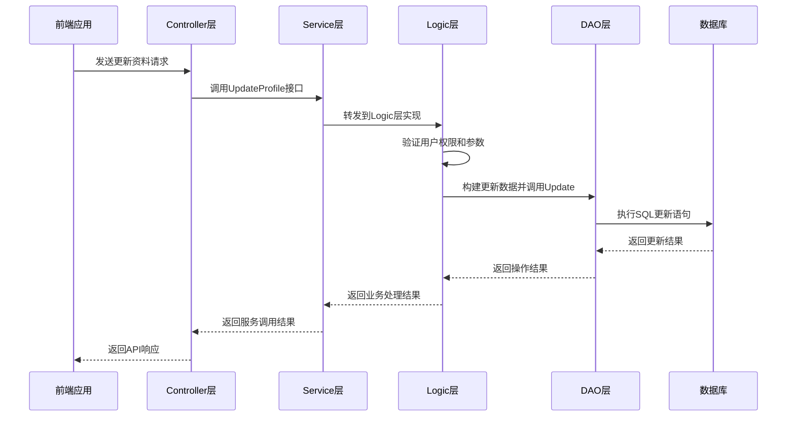

# MVC分层设计

<cite>
**本文档引用文件**  
- [member.go](file://server/internal/controller/admin/admin/member.go)
- [member.go](file://server/internal/logic/admin/member.go)
- [admin.go](file://server/internal/service/admin.go)
- [admin_member.go](file://server/internal/dao/admin_member.go)
</cite>

## 目录
1. [MVC架构概述](#mvc架构概述)
2. [各层职责详解](#各层职责详解)
3. [调用链分析](#调用链分析)
4. [数据流序列图](#数据流序列图)
5. [依赖关系与解耦策略](#依赖关系与解耦策略)
6. [最佳实践](#最佳实践)

## MVC架构概述

本项目采用清晰的MVC分层架构，将系统划分为`Controller`、`Service`、`Logic`和`DAO`四层，实现了关注点分离和职责单一原则。该架构确保了代码的可维护性、可测试性和可扩展性。

## 各层职责详解

### Controller层
`Controller`层作为HTTP请求的入口，位于`server/internal/controller/admin/admin/member.go`。其主要职责包括：
- 路由分发：接收并处理来自前端的HTTP请求
- 参数绑定与校验：将请求参数绑定到对应的输入模型
- 调用Service接口：通过`service.AdminMember()`调用业务服务
- 返回响应：将服务层的处理结果封装为API响应

### Service层
`Service`层作为协调者，位于`server/internal/service/admin.go`。其主要职责包括：
- 管理事务：通过`g.DB().Transaction()`确保数据一致性
- 组合多个Logic模块：协调不同业务逻辑的执行顺序
- 提供统一的业务接口：定义`IAdminMember`接口供Controller层调用
- 依赖注入：通过`RegisterAdminMember()`实现接口注册和依赖管理

### Logic层
`Logic`层封装核心业务逻辑，位于`server/internal/logic/admin/member.go`。其主要职责包括：
- 实现具体业务规则：如用户信息验证、权限检查、数据完整性校验
- 确保规则一致性：在多个操作中复用相同的业务逻辑
- 处理复杂业务流程：如`Edit()`方法中包含新增和修改两种逻辑
- 维护领域模型：通过`SuperAdmin`结构体管理超管状态

### DAO层
`DAO`层基于GORM实现数据持久化，位于`server/internal/dao/admin_member.go`。其主要职责包括：
- 提供类型安全的数据库操作：通过`AdminMember`全局变量暴露数据访问接口
- 封装CRUD操作：提供`Scan`、`Update`、`Delete`等基础方法
- 支持链式调用：利用GORM的查询构建器实现灵活的数据查询
- 处理数据库连接：通过`Ctx(ctx)`方法管理上下文相关的数据库连接

**Section sources**
- [member.go](file://server/internal/controller/admin/admin/member.go#L1-L146)
- [member.go](file://server/internal/logic/admin/member.go#L1-L915)
- [admin.go](file://server/internal/service/admin.go#L1-L403)
- [admin_member.go](file://server/internal/dao/admin_member.go#L1-L23)

## 调用链分析

以"修改用户资料"功能为例，展示从API请求到数据访问的完整调用链：

1. **Controller层**：`cMember.UpdateProfile()`接收HTTP请求，调用`service.AdminMember().UpdateProfile()`
2. **Service层**：`IAdminMember.UpdateProfile()`接口被调用，实际由`Logic`层实现
3. **Logic层**：`sAdminMember.UpdateProfile()`执行业务逻辑，包括参数验证和权限检查
4. **DAO层**：通过`dao.AdminMember.Ctx(ctx).WherePri(memberId).Data(update).Update()`执行数据库更新操作

该调用链体现了清晰的分层结构，每一层只与相邻的上下层交互，实现了良好的解耦。

**Section sources**
- [member.go](file://server/internal/controller/admin/admin/member.go#L88-L97)
- [member.go](file://server/internal/logic/admin/member.go#L287-L321)

## 数据流序列图

**Diagram sources**
- [member.go](file://server/internal/controller/admin/admin/member.go#L88-L97)
- [member.go](file://server/internal/logic/admin/member.go#L287-L321)
- [admin_member.go](file://server/internal/dao/admin_member.go#L1-L23)

## 依赖关系与解耦策略

本架构通过以下策略实现各层之间的解耦：

1. **接口隔离**：Service层定义`IAdminMember`接口，Controller层依赖接口而非具体实现
2. **依赖注入**：通过`RegisterAdminMember()`方法注册具体实现，实现控制反转
3. **上下文传递**：使用`context.Context`传递请求上下文，避免全局状态
4. **数据传输对象**：使用`adminin.MemberUpdateProfileInp`等输入模型进行层间数据传递
5. **单一职责**：每层只关注自己的核心职责，不越界操作

这种设计使得各层可以独立开发、测试和部署，提高了系统的可维护性和可扩展性。

**Section sources**
- [admin.go](file://server/internal/service/admin.go#L69-L123)
- [member.go](file://server/internal/controller/admin/admin/member.go#L1-L146)

## 最佳实践

### Controller层修改建议
- 保持轻量：避免在Controller中编写复杂业务逻辑
- 统一错误处理：使用`gerror.Wrap()`包装错误信息
- 参数校验：充分利用输入模型进行参数验证

### Service层扩展建议
- 事务管理：对于涉及多个数据表的操作，使用`g.DB().Transaction()`确保数据一致性
- 接口设计：保持接口方法的粒度适中，既不过于细碎也不过于庞大
- 异常处理：定义清晰的错误码和错误信息，便于前端处理

### Logic层优化建议
- 业务规则复用：将通用的业务规则提取为私有方法
- 性能优化：对于频繁访问的数据，考虑引入缓存机制
- 日志记录：在关键业务节点添加日志，便于问题排查

### DAO层使用建议
- 查询优化：合理使用`Fields()`和`FieldsEx()`减少不必要的字段查询
- 连接管理：始终使用`Ctx(ctx)`方法确保数据库操作与请求上下文关联
- 类型安全：充分利用GORM的类型安全特性，避免SQL注入风险

**Section sources**
- [member.go](file://server/internal/logic/admin/member.go#L44-L46)
- [admin.go](file://server/internal/service/admin.go#L304-L309)
- [admin_member.go](file://server/internal/dao/admin_member.go#L18-L18)