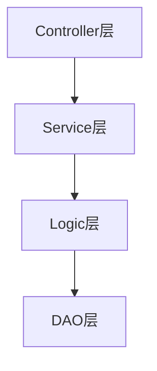
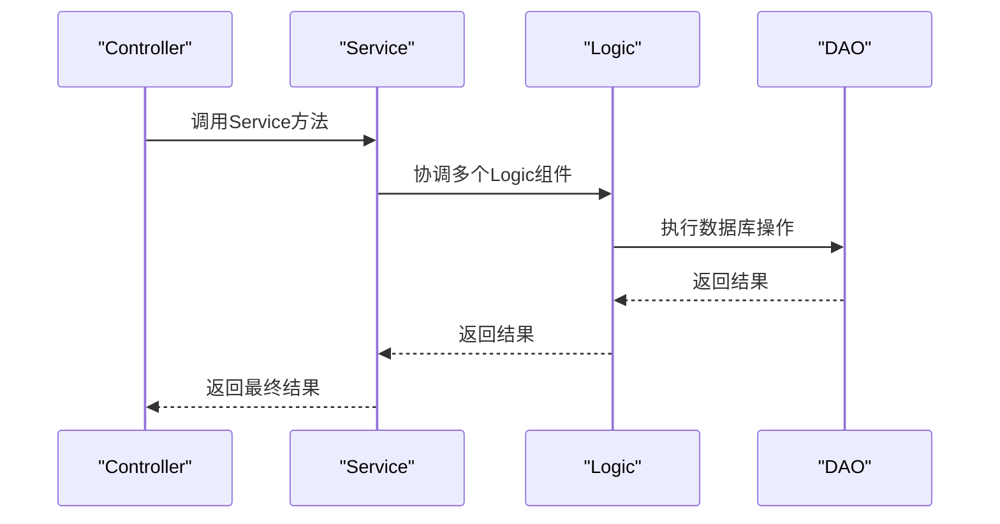
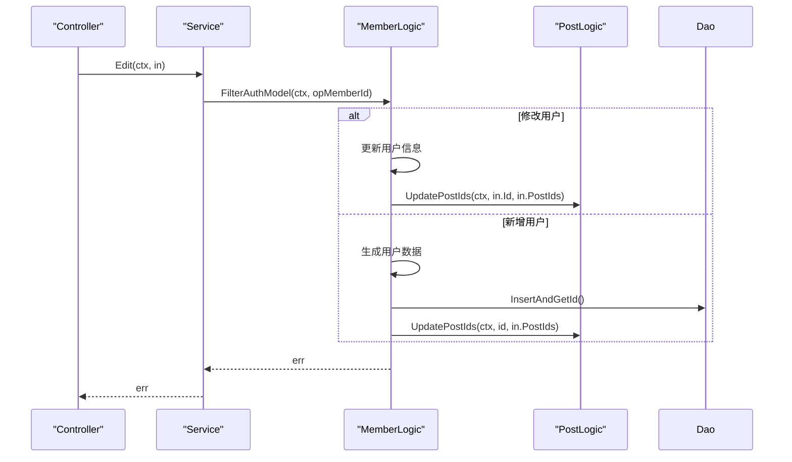
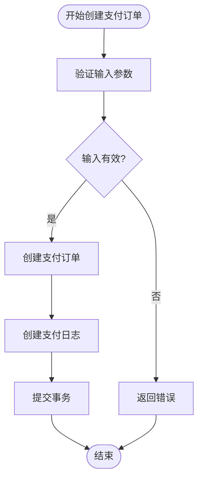

# Service层详解

<cite>
**本文档引用的文件**
- [admin.go](file://server/internal/service/admin.go)
- [pay.go](file://server/internal/service/pay.go)
- [member.go](file://server/internal/logic/admin/member.go)
- [pay.go](file://server/internal/logic/pay/pay.go)
- [member.go](file://server/internal/controller/admin/admin/member.go)
</cite>

## 目录
1. [简介](#简介)
2. [项目结构](#项目结构)
3. [核心组件](#核心组件)
4. [架构概述](#架构概述)
5. [详细组件分析](#详细组件分析)
6. [依赖分析](#依赖分析)
7. [性能考虑](#性能考虑)
8. [故障排除指南](#故障排除指南)
9. [结论](#结论)
10. [附录](#附录)（如有必要）

## 简介
本文档详细阐述了`Service`层在系统中的核心作用，作为业务协调者，负责事务管理、跨`Logic`模块的调用编排以及状态协调。通过分析`service/admin.go`中的用户创建流程和`service/pay.go`中的支付事务处理，说明了`Service`层如何组合多个`Logic`组件完成复杂业务操作。文档涵盖了服务初始化、依赖注入模式、事务边界控制策略，并解释了`Service`与`Controller`、`Logic`之间的调用关系。同时，提供了新增服务接口的标准模板，包括接口定义、实现结构体、错误传播机制，并结合实际代码展示了高并发场景下的服务稳定性设计。

## 项目结构
`Service`层位于`server/internal/service`目录下，是连接`Controller`和`Logic`层的桥梁。`Controller`层负责接收HTTP请求并进行初步处理，`Service`层则负责协调多个`Logic`组件完成复杂的业务逻辑，而`Logic`层则封装了具体的业务实现。这种分层架构使得代码职责清晰，易于维护和扩展。



**图示来源**
- [admin.go](file://server/internal/service/admin.go)
- [pay.go](file://server/internal/service/pay.go)

**本节来源**
- [admin.go](file://server/internal/service/admin.go)
- [pay.go](file://server/internal/service/pay.go)

## 核心组件
`Service`层的核心是定义了一系列接口，这些接口为`Controller`层提供了统一的业务入口。每个接口对应一个具体的业务领域，如用户管理、支付处理等。通过接口与实现分离，实现了依赖倒置原则，使得`Controller`层不直接依赖于具体的`Logic`实现，而是依赖于抽象的`Service`接口，从而提高了代码的灵活性和可测试性。

**本节来源**
- [admin.go](file://server/internal/service/admin.go)
- [pay.go](file://server/internal/service/pay.go)

## 架构概述
`Service`层的架构设计遵循了清晰的分层和职责分离原则。`Controller`接收请求后，调用`Service`接口。`Service`接口的实现（由`Logic`层提供）负责协调多个`Logic`组件，管理事务，并处理业务逻辑。`Logic`组件则调用`DAO`层与数据库进行交互。这种设计使得`Service`层成为业务逻辑的“指挥中心”。



**图示来源**
- [admin.go](file://server/internal/service/admin.go)
- [member.go](file://server/internal/logic/admin/member.go)
- [member.go](file://server/internal/controller/admin/admin/member.go)

## 详细组件分析
### 用户管理服务分析
`IAdminMember`接口定义了用户管理的所有业务操作，如创建、修改、删除用户等。其具体实现`*sAdminMember`位于`logic/admin/member.go`中。`Service`层通过`RegisterAdminMember`函数将实现注册到全局变量`localAdminMember`中，`Controller`层通过`AdminMember()`函数获取该服务的实例。

#### 用户创建流程
用户创建流程是一个典型的跨`Logic`模块调用的例子。当`Controller`调用`Edit`方法时，`Service`层会协调`AdminMember`和`AdminMemberPost`两个`Logic`组件。



**图示来源**
- [admin.go](file://server/internal/service/admin.go#L200-L220)
- [member.go](file://server/internal/logic/admin/member.go#L200-L400)
- [member.go](file://server/internal/controller/admin/admin/member.go#L100-L110)

#### 事务管理
在用户创建或修改的`Edit`方法中，使用了`g.DB().Transaction`来确保数据的一致性。整个操作被包裹在一个数据库事务中，如果在更新用户信息或更新用户岗位的任何一步失败，整个事务都会回滚，保证了数据的完整性。

**本节来源**
- [admin.go](file://server/internal/service/admin.go#L200-L220)
- [member.go](file://server/internal/logic/admin/member.go#L200-L400)

### 支付服务分析
`IPay`接口定义了支付相关的业务操作，如创建支付订单、处理支付通知等。其具体实现`*sPay`位于`logic/pay/pay.go`中。

#### 支付事务处理
支付事务处理同样依赖于事务管理。`Create`方法在创建支付订单时，会确保订单和日志的创建在同一个事务中完成。



**图示来源**
- [pay.go](file://server/internal/service/pay.go#L10-L30)
- [pay.go](file://server/internal/logic/pay/pay.go#L50-L80)

**本节来源**
- [pay.go](file://server/internal/service/pay.go)
- [pay.go](file://server/internal/logic/pay/pay.go)

## 依赖分析
`Service`层依赖于`Logic`层的实现和`DAO`层的数据访问。`Controller`层依赖于`Service`层的接口。`Logic`层的实现通过`init`函数调用`Register`方法将自身注册到`Service`层的全局变量中，实现了依赖注入。

```mermaid
graph TD
Controller --> Service
Service --> Logic
Logic --> Dao
Logic -.-> Service : 通过Register方法注入
```

**图示来源**
- [admin.go](file://server/internal/service/admin.go)
- [member.go](file://server/internal/logic/admin/member.go#L54)
- [pay.go](file://server/internal/logic/pay/pay.go#L35)

**本节来源**
- [admin.go](file://server/internal/service/admin.go)
- [member.go](file://server/internal/logic/admin/member.go)
- [pay.go](file://server/internal/logic/pay/pay.go)

## 性能考虑
在高并发场景下，`Service`层的设计考虑了性能和稳定性。例如，在`GetLowerIds`方法中，通过数据库的`LIKE`查询来获取下级用户ID，虽然可能影响性能，但通过合理的索引设计可以优化。此外，`LoadSuperAdmin`方法将超管数据加载到内存中，并通过`sync.RWMutex`进行读写锁保护，避免了频繁的数据库查询，提高了读取性能。

## 故障排除指南
当`Service`层出现问题时，首先应检查`Controller`层是否正确调用了`Service`接口。其次，检查`Logic`层的实现是否正确注册到了`Service`层，可以通过查看`init`函数和`Register`函数的调用情况来确认。最后，检查日志输出，特别是`panic`信息，通常会指出`implement not found`的问题，这表明某个`Logic`实现没有被正确注册。

**本节来源**
- [admin.go](file://server/internal/service/admin.go#L200-L220)
- [member.go](file://server/internal/logic/admin/member.go#L800-L900)

## 结论
`Service`层在系统架构中扮演着至关重要的角色，它作为业务协调者，有效地解耦了`Controller`和`Logic`层，使得代码结构更加清晰，业务逻辑更加集中。通过接口定义和依赖注入，实现了高度的灵活性和可维护性。事务管理确保了数据的一致性，而合理的性能优化策略则保证了系统在高并发下的稳定性。

## 附录
### 新增服务接口标准模板
1.  **接口定义**: 在`server/internal/service`目录下定义新的接口，如`INewService`。
2.  **实现结构体**: 在`server/internal/logic`目录下创建新的包和结构体，如`*sNewService`。
3.  **注册与获取**: 在`service`文件中定义`localNewService`变量和`RegisterNewService`、`NewService()`函数。
4.  **错误传播**: 所有方法都应返回`error`类型，由`Controller`层统一处理。
5.  **事务控制**: 在需要保证数据一致性的业务逻辑中，使用`g.DB().Transaction`。