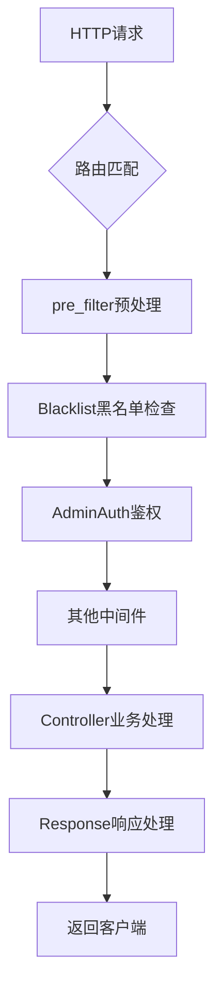
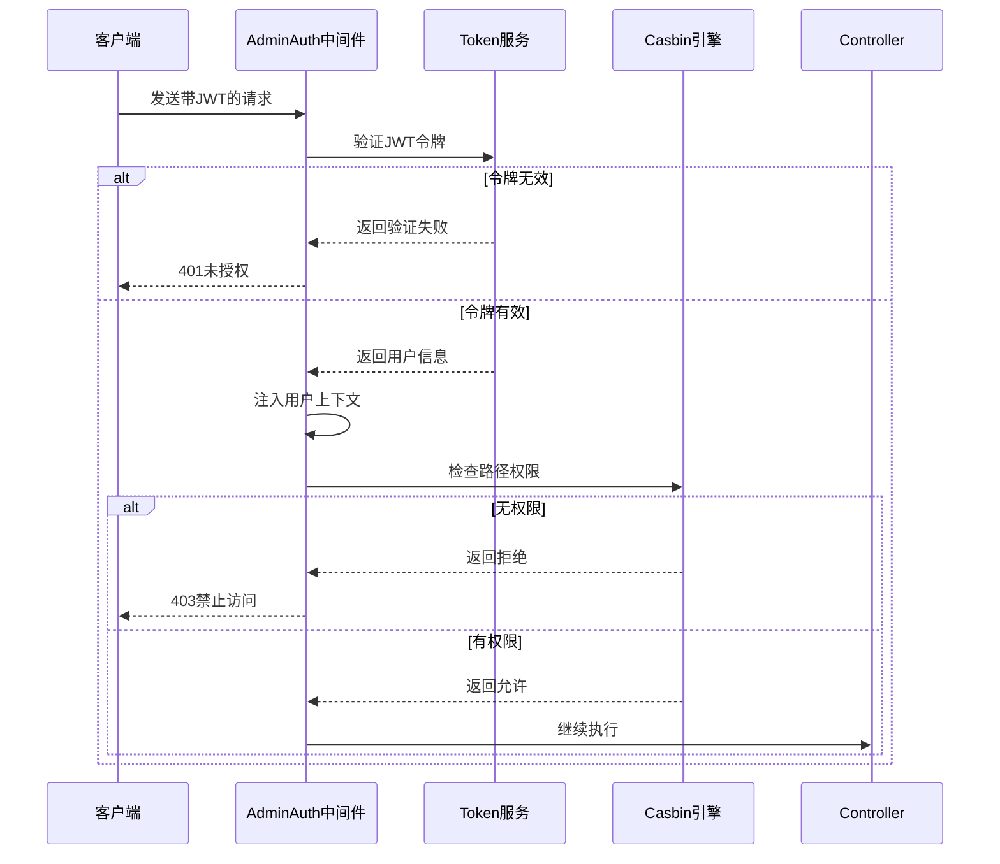
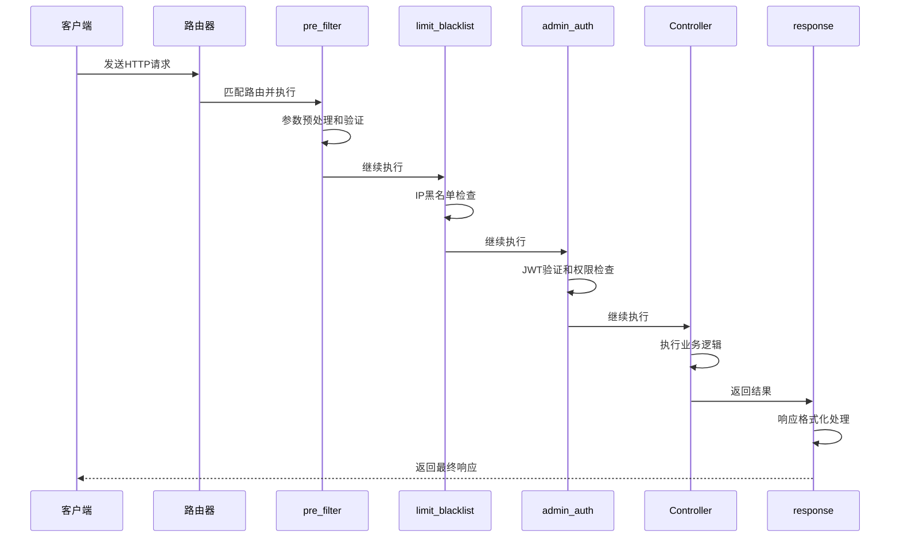

# 中间件与请求处理

<cite>
**本文档引用的文件**   
- [admin_auth.go](file://server/internal/logic/middleware/admin_auth.go)
- [limit_blacklist.go](file://server/internal/logic/middleware/limit_blacklist.go)
- [pre_filter.go](file://server/internal/logic/middleware/pre_filter.go)
- [response.go](file://server/internal/logic/middleware/response.go)
- [middleware.go](file://server/internal/service/middleware.go)
- [admin.go](file://server/internal/router/admin.go)
- [api.go](file://server/internal/router/api.go)
- [main.go](file://server/main.go)
</cite>

## 目录
1. [简介](#简介)
2. [请求处理生命周期](#请求处理生命周期)
3. [核心中间件分析](#核心中间件分析)
4. [中间件注册与执行顺序](#中间件注册与执行顺序)
5. [AdminAuth中间件实现细节](#adminauth中间件实现细节)
6. [自定义中间件开发指南](#自定义中间件开发指南)
7. [请求处理时序图](#请求处理时序图)
8. [调试与故障排除](#调试与故障排除)
9. [总结](#总结)

## 简介
本文档详细描述了HotGo框架中HTTP请求的完整处理流程，重点分析了从路由匹配到控制器执行之间的中间件链。文档涵盖了`pre_filter`、`limit_blacklist`、`admin_auth`等核心中间件的功能与实现，并以`admin_auth.go`为例深入解析JWT验证和Casbin权限检查机制。同时提供了中间件注册顺序对执行流程的影响分析，以及开发自定义中间件的最佳实践。

## 请求处理生命周期
当一个HTTP请求进入系统时，它将经历以下完整的生命周期：

1. **路由匹配**：请求首先由`router`模块进行路径匹配，确定目标处理组。
2. **预处理**：执行`pre_filter`中间件，对请求参数进行预处理和验证。
3. **限流与黑名单检查**：通过`limit_blacklist`中间件检查客户端IP是否在黑名单中。
4. **认证授权**：执行`admin_auth`或`api_auth`等鉴权中间件，验证用户身份和权限。
5. **控制器处理**：请求最终到达目标`Controller`进行业务逻辑处理。
6. **响应处理**：`response`中间件对返回结果进行格式化和错误处理。

该流程确保了请求在到达业务逻辑层之前经过了必要的安全检查和数据预处理。

**Section sources**
- [admin.go](file://server/internal/router/admin.go#L1-L74)
- [api.go](file://server/internal/router/api.go#L1-L31)

## 核心中间件分析

### pre_filter 中间件
`pre_filter`中间件负责请求输入的预处理工作。它会检查请求是否符合GoFrame规范路由，并对实现了`validate.Filter`接口的结构体进行预处理。该中间件确保了输入数据的合法性和一致性。

**Section sources**
- [pre_filter.go](file://server/internal/logic/middleware/pre_filter.go#L1-L67)

### limit_blacklist 中间件
`limit_blacklist`中间件实现了IP黑名单限制功能。它通过调用`SysBlacklist().VerifyRequest`方法检查当前请求的客户端IP是否被列入黑名单。如果验证失败，将直接返回相应的错误响应，阻止请求继续执行。

**Section sources**
- [limit_blacklist.go](file://server/internal/logic/middleware/limit_blacklist.go#L1-L22)

### response 中间件
`response`中间件负责HTTP响应的预处理，包括错误状态码的接管、内容类型的判断以及响应数据的格式化。它支持HTML、XML和JSON等多种响应格式，并能根据调试模式决定是否输出详细的错误堆栈信息。

**Section sources**
- [response.go](file://server/internal/logic/middleware/response.go#L1-L123)

## 中间件注册与执行顺序
中间件的注册顺序直接影响其执行流程。在HotGo框架中，中间件通过`group.Middleware()`方法按顺序注册，遵循"先进先出"的原则。

以后台管理路由为例，在`admin.go`文件中可以看到中间件的注册顺序：
1. 首先绑定基础控制器
2. 注册`AdminAuth`鉴权中间件
3. 绑定主要业务控制器
4. 注册`Develop`开发工具中间件
5. 绑定开发相关控制器

这种顺序设计确保了核心业务接口受到严格的权限控制，而开发工具类接口则可以在特定条件下被访问。中间件的执行顺序至关重要，错误的顺序可能导致安全漏洞或功能异常。

**Diagram sources**
- [admin.go](file://server/internal/router/admin.go#L1-L74)
- [middleware.go](file://server/internal/service/middleware.go#L1-L64)

**Section sources**
- [admin.go](file://server/internal/router/admin.go#L1-L74)
- [middleware.go](file://server/internal/service/middleware.go#L1-L64)

## AdminAuth中间件实现细节
`admin_auth.go`文件实现了后台管理系统的鉴权中间件，其核心功能包括JWT验证和Casbin权限检查。

### JWT验证流程
1. 从请求上下文中获取JWT令牌
2. 调用`DeliverUserContext`方法解析并验证令牌
3. 将用户信息注入到请求上下文中
4. 如果验证失败，返回401未授权错误

### Casbin权限检查
1. 获取当前请求的路径和HTTP方法
2. 调用`AdminRole().Verify`方法进行权限验证
3. 基于角色的访问控制(RBAC)模型检查用户是否有权访问该资源
4. 如果权限验证失败，返回403禁止访问错误

该中间件还实现了例外路由机制，通过`IsExceptLogin`和`IsExceptAuth`方法判断某些路由是否需要跳过登录或权限验证，为登录页面等公共接口提供便利。

**Diagram sources**
- [admin_auth.go](file://server/internal/logic/middleware/admin_auth.go#L1-L54)
- [middleware.go](file://server/internal/service/middleware.go#L1-L64)

**Section sources**
- [admin_auth.go](file://server/internal/logic/middleware/admin_auth.go#L1-L54)

## 自定义中间件开发指南
开发自定义中间件需要遵循以下步骤：

1. 在`service/middleware.go`的`IMiddleware`接口中定义新的方法签名
2. 在`logic/middleware`包中实现该方法
3. 确保中间件结构体`sMiddleware`注册到服务层
4. 在相应的路由组中通过`group.Middleware()`注册中间件

自定义中间件应遵循单一职责原则，每个中间件只负责一个特定的功能。同时需要注意错误处理，使用`response.JsonExit`统一返回错误信息，避免暴露系统内部细节。

**Section sources**
- [middleware.go](file://server/internal/service/middleware.go#L1-L64)
- [init.go](file://server/internal/logic/middleware/init.go#L1-L39)

## 请求处理时序图
以下是HTTP请求在系统中的完整处理流程时序图：

**Diagram sources**
- [admin.go](file://server/internal/router/admin.go#L1-L74)
- [pre_filter.go](file://server/internal/logic/middleware/pre_filter.go#L1-L67)
- [limit_blacklist.go](file://server/internal/logic/middleware/limit_blacklist.go#L1-L22)
- [admin_auth.go](file://server/internal/logic/middleware/admin_auth.go#L1-L54)
- [response.go](file://server/internal/logic/middleware/response.go#L1-L123)

## 调试与故障排除
### 中间件链调试技巧
1. 使用日志记录中间件的执行流程
2. 在开发环境中启用详细错误信息输出
3. 利用GoFrame的trace功能跟踪请求生命周期

### 常见权限问题解决方案
1. **401未授权错误**：检查JWT令牌是否有效、是否过期
2. **403禁止访问错误**：确认用户角色是否有权访问目标资源
3. **路由不匹配**：检查路由前缀和注册顺序是否正确
4. **中间件未执行**：确认中间件是否已正确注册到路由组

建议在生产环境中关闭详细的错误堆栈输出，仅在开发和测试环境中启用，以提高系统安全性。

**Section sources**
- [admin_auth.go](file://server/internal/logic/middleware/admin_auth.go#L1-L54)
- [response.go](file://server/internal/logic/middleware/response.go#L1-L123)

## 总结
本文档全面介绍了HotGo框架的中间件体系和请求处理流程。通过理解`pre_filter`、`limit_blacklist`、`admin_auth`等核心中间件的工作原理，开发者可以更好地构建安全可靠的Web应用。中间件的注册顺序对系统行为有重要影响，正确的顺序设计能够确保系统的安全性和功能性。同时，框架提供了清晰的扩展接口，便于开发者根据业务需求开发自定义中间件。