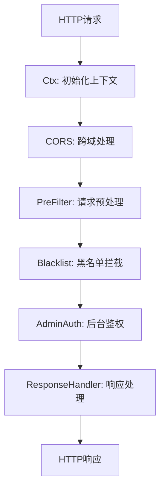
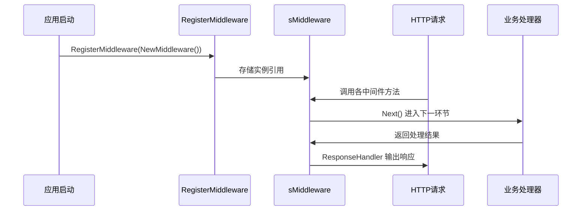
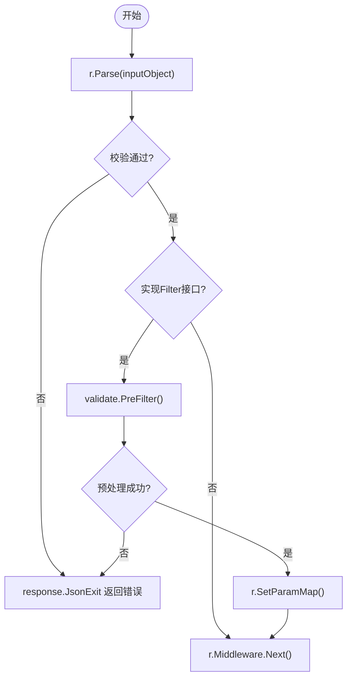
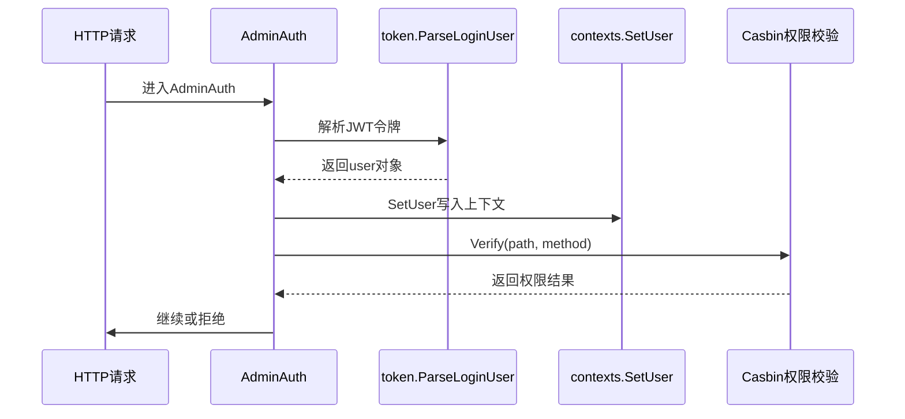

# 中间件机制详解

<cite>
**本文档引用文件**  
- [pre_filter.go](file://server/internal/logic/middleware/pre_filter.go)
- [limit_blacklist.go](file://server/internal/logic/middleware/limit_blacklist.go)
- [admin_auth.go](file://server/internal/logic/middleware/admin_auth.go)
- [response.go](file://server/internal/logic/middleware/response.go)
- [middleware.go](file://server/internal/service/middleware.go)
- [response.go](file://server/internal/library/response/response.go)
- [init.go](file://server/internal/logic/middleware/init.go)
- [token.go](file://server/internal/library/token/token.go)
- [contexts.go](file://server/internal/library/contexts/context.go)
- [casbin.go](file://server/internal/library/casbin/enforcer.go)
</cite>

## 目录
1. [项目结构](#项目结构)
2. [核心中间件职责分析](#核心中间件职责分析)
3. [中间件注册与执行流程](#中间件注册与执行流程)
4. [pre_filter 中间件实现机制](#pre_filter-中间件实现机制)
5. [limit_blacklist 中间件实现机制](#limit_blacklist-中间件实现机制)
6. [admin_auth 中间件深度解析](#admin_auth-中间件深度解析)
7. [response 中间件统一响应处理](#response-中间件统一响应处理)
8. [自定义中间件开发指南](#自定义中间件开发指南)
9. [中间件执行顺序与性能优化](#中间件执行顺序与性能优化)

## 项目结构

本项目基于 GOFrame 框架构建，中间件逻辑主要集中在 `server/internal/logic/middleware` 目录下，通过 `server/internal/service/middleware.go` 提供统一接口注册。核心中间件包括请求预处理、权限控制、响应封装等模块。



**图示来源**  
- [init.go](file://server/internal/logic/middleware/init.go)
- [middleware.go](file://server/internal/service/middleware.go)

**本节来源**  
- [server/internal/logic/middleware](file://server/internal/logic/middleware)

## 核心中间件职责分析

| 中间件名称 | 职责描述 | 执行阶段 |
|----------|--------|--------|
| `pre_filter` | 对API请求参数进行预处理和基础校验 | 请求处理前 |
| `limit_blacklist` | 拦截IP黑名单中的请求 | 路由匹配后 |
| `admin_auth` | 后台用户登录验证与Casbin权限校验 | 权限控制阶段 |
| `response` | 统一JSON/XML响应格式并处理异常 | 响应生成阶段 |

**本节来源**  
- [pre_filter.go](file://server/internal/logic/middleware/pre_filter.go)
- [limit_blacklist.go](file://server/internal/logic/middleware/limit_blacklist.go)
- [admin_auth.go](file://server/internal/logic/middleware/admin_auth.go)
- [response.go](file://server/internal/logic/middleware/response.go)

## 中间件注册与执行流程

系统通过接口注册模式实现中间件注入，`service.RegisterMiddleware()` 在 `init.go` 中完成实例化。所有中间件均实现 `IMiddleware` 接口，并由框架按配置顺序依次执行。



**图示来源**  
- [middleware.go](file://server/internal/service/middleware.go#L1-L64)
- [init.go](file://server/internal/logic/middleware/init.go#L37-L42)

**本节来源**  
- [middleware.go](file://server/internal/service/middleware.go)
- [init.go](file://server/internal/logic/middleware/init.go)

## pre_filter 中间件实现机制

该中间件负责请求参数的自动解析与预过滤。当API使用GF规范路由且请求结构体实现 `validate.Filter` 接口时，会自动执行预处理逻辑。

处理流程如下：
1. 获取当前路由信息
2. 反射创建输入对象实例
3. 执行基础参数解析与校验
4. 若实现Filter接口则调用预处理器
5. 将处理后参数写回请求上下文



**图示来源**  
- [pre_filter.go](file://server/internal/logic/middleware/pre_filter.go#L15-L66)

**本节来源**  
- [pre_filter.go](file://server/internal/logic/middleware/pre_filter.go)

## limit_blacklist 中间件实现机制

此中间件用于拦截被列入黑名单的客户端请求。其核心逻辑是调用 `SysBlacklist().VerifyRequest(r)` 进行IP或设备标识校验。

```go
func (s *sMiddleware) Blacklist(r *ghttp.Request) {
	if err := service.SysBlacklist().VerifyRequest(r); err != nil {
		response.JsonExit(r, gerror.Code(err).Code(), err.Error())
	}
	r.Middleware.Next()
}
```

若验证失败，则立即终止后续流程并返回封禁提示。该机制可有效防止恶意访问。

**本节来源**  
- [limit_blacklist.go](file://server/internal/logic/middleware/limit_blacklist.go)

## admin_auth 中间件深度解析

### JWT令牌解析与用户上下文传递

`admin_auth` 中间件通过 `token.ParseLoginUser(r)` 解析JWT令牌，获取登录用户信息。解析成功后调用 `DeliverUserContext` 将用户数据注入上下文。



**图示来源**  
- [admin_auth.go](file://server/internal/logic/middleware/admin_auth.go#L15-L53)
- [init.go](file://server/internal/logic/middleware/init.go#L161-L176)

### Casbin权限集成

权限校验通过 `service.AdminRole().Verify(ctx, path, r.Method)` 实现，底层基于Casbin引擎进行ABAC模型判断。通过 `contexts.GetRoleKey(ctx)` 获取角色标识参与策略匹配。

关键代码路径：
- `IsExceptLogin`: 判断是否为免登录路由
- `IsExceptAuth`: 判断是否为免权限校验路由
- `Verify`: 执行Casbin策略检查

**本节来源**  
- [admin_auth.go](file://server/internal/logic/middleware/admin_auth.go)
- [init.go](file://server/internal/logic/middleware/init.go)
- [casbin.go](file://server/internal/library/casbin/enforcer.go)

## response 中间件统一响应处理

该中间件负责标准化API输出格式，支持JSON、XML等多种类型。核心方法 `ResponseHandler` 在 `r.Middleware.Next()` 后捕获处理结果。

### 响应处理流程

```mermaid
flowchart TD
A[执行Next] --> B{状态码}
B --> |403| C[r.Writeln("403")]
B --> |404| D[r.Writeln("404")]
B --> |其他| E[getContentType]
E --> F{Content-Type}
F --> |HTML| G[responseHtml]
F --> |XML| H[responseXml]
F --> |Stream| I[忽略]
F --> |默认| J[responseJson]
```

### 统一响应结构

所有成功响应封装为：
```json
{
  "code": 0,
  "message": "操作成功",
  "data": {},
  "timestamp": 1234567890,
  "traceID": "uuid"
}
```

错误响应将错误信息写入 `error` 字段。

**图示来源**  
- [response.go](file://server/internal/logic/middleware/response.go#L15-L122)
- [response.go](file://server/internal/library/response/response.go#L1-L115)

**本节来源**  
- [response.go](file://server/internal/logic/middleware/response.go)
- [response.go](file://server/internal/library/response/response.go)

## 自定义中间件开发指南

### 创建自定义中间件

```go
func (s *sMiddleware) CustomMiddleware(r *ghttp.Request) {
    // 获取上下文
    ctx := r.Context()
    
    // 获取用户信息
    user := contexts.GetUser(ctx)
    if user == nil {
        response.JsonExit(r, 401, "未登录")
        return
    }

    // 注入自定义逻辑
    r.SetCtxVar("custom_key", "custom_value")

    // 继续执行
    r.Middleware.Next()
}
```

### 注册到服务接口

在 `IMiddleware` 接口中声明方法，并确保 `sMiddleware` 实现该方法。

### 异常处理建议

- 使用 `response.JsonExit(r, code, msg)` 终止请求
- 记录必要日志 `g.Log().Errorf(ctx, "...")`
- 避免暴露敏感信息

**本节来源**  
- [middleware.go](file://server/internal/service/middleware.go)
- [init.go](file://server/internal/logic/middleware/init.go)

## 中间件执行顺序与性能优化

### 执行顺序影响

中间件按注册顺序执行，顺序不当可能导致：
- 未初始化上下文就尝试获取用户
- 权限校验发生在参数解析前
- 响应已被写入但后续中间件仍试图修改

推荐顺序：
1. Ctx（上下文初始化）
2. CORS（跨域）
3. PreFilter（参数预处理）
4. Blacklist（黑名单）
5. AdminAuth（鉴权）
6. ResponseHandler（响应处理）

### 性能优化建议

1. **避免重复解析**：合理利用上下文缓存
2. **减少反射调用**：`pre_filter` 中反射成本较高，仅对必要接口启用
3. **异步日志记录**：如访问日志可放入队列异步处理
4. **白名单机制**：对高频公开接口跳过非必要中间件
5. **条件执行**：如演示系统限制仅在开启时生效

**本节来源**  
- [init.go](file://server/internal/logic/middleware/init.go)
- [middleware.go](file://server/internal/service/middleware.go)